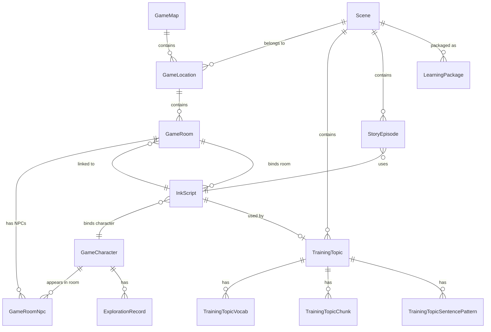

# NQTR 内容工坊架构文档

> **NQTR** 源自 [Pixi-VN](https://pixi-vn.com/nqtr) 框架的 **N**avigation + **Q**uest + **T**ime + **R**outine 四大系统。
> 漫语町在此基础上将其适配为内容创作工作流。
>
> 最后更新：2026-06-23

---

## 目录

1. [NQTR 框架概述](#nqtr-框架概述)
2. [数据模型全景图](#数据模型全景图)
3. [核心工作流](#核心工作流)
4. [第一步：角色管理](#第一步角色管理)
5. [第二步：地图管理](#第二步地图管理)
6. [第三步：故事工坊](#第三步故事工坊)
7. [第四步：场景管理](#第四步场景管理)
8. [Ink DSL 脚本规范](#ink-dsl-脚本规范)
9. [Admin 路由与 UI](#admin-路由与-ui)
10. [API 参考](#api-参考)
11. [快速上手：创建第一个 NQTR 故事](#快速上手创建第一个-nqtr-故事)

---

## NQTR 框架概述

### Pixi-VN NQTR 原生定义

NQTR 是 Pixi-VN 游戏框架的扩展包（`@drincs/nqtr`），提供 5 大特性：

| # | 特性 | 说明 |
|---|------|------|
| 1 | **Navigation & Map** | 导航系统：Room → Location → Map 三级层级，玩家/NPC 定位 |
| 2 | **Time System** | 时间系统：游戏时钟、时段（Morning/Afternoon/Evening/Night）、周循环 |
| 3 | **Activity** | 活动系统：玩家可执行的动作，绑定到导航元素（Room/Location/Map） |
| 4 | **Routine** | 日常系统：NPC 自动行为（Commitment），按时段自动触发 |
| 5 | **Quest System** | 任务系统：任务链、目标追踪、完成条件 |

### 漫语町适配映射

漫语町将 NQTR 框架适配为**英语对话内容生产管线**：

| 框架概念 | 漫语町映射 | Admin 页面 |
|----------|-----------|------------|
| Navigation → Map/Location/Room | 游戏地图 + 地点（探索模式的基础） | 地图管理 |
| Quest | Ink 对话脚本（以任务/剧本形式组织） | 故事工坊 |
| Time | 学习计划排期、每日任务、内容解锁节奏 | 场景管理（时间维度配置） |
| Routine | NPC 角色及其 TTS 语音、对话行为 | 角色管理 |
| Activity | 地点的可交互动作（对话、探索、任务） | 故事工坊 + 地点配置 |

NQTR 内容工坊将内容生产拆分为四个步骤：

```
角色管理 ──→ 地图管理 ──→ 故事工坊 ──→ 场景管理
(Routine)   (Navigation)   (Quest)    (Time + Activity)
```

最终用户在 App 中看到的是一次「场景 → 训练话题 → Ink 对话脚本」的完整练习体验。

---

## 数据模型全景图



### Navigation 三级层级（Pixi-VN 对齐）

```
GameMap（地图）
  └─ GameLocation（地点：容器，如"宿舍楼"）
       └─ GameRoom（房间：核心导航单元，如"101 宿舍"）
            ├─ NPC 绑定（GameRoomNpc）
            └─ InkScript 绑定
```

> **导航方式**：与 Pixi-VN 一致，通过 `navigator.currentRoom = targetRoom` 直接跳转，不需要显式的出口（Exit）中间表。

### 标准属性（Pixi-VN 对齐）

GameMap / GameLocation / GameRoom 三级均支持以下 Pixi-VN 标准属性：

| 属性 | 类型 | 说明 |
|------|------|------|
| `name` / `displayName` | String | 标识 / 显示名 |
| `backgroundUrl` | String? | 背景图（Pixi-VN 的 `image`） |
| `icon` | String? | 图标 URL |
| `disabled` | Boolean | 是否禁用（不显示/不可进入） |
| `hidden` | Boolean | 是否隐藏（不在列表中显示） |

### Activity（活动）概念

> 来自 Pixi-VN NQTR：**Activity** 是玩家可执行的动作，绑定到导航元素（Room/Location/Map），由开发者决定玩家如何与之交互。

在漫语町中，Activity 体现为房间上的可交互内容：

| Activity 类型 | 实现方式 | 说明 |
|--------------|---------|------|
| NPC 对话 | Ink 脚本 + `# wait:input` | 玩家与房间内的 NPC 进行英语对话 |
| 房间导航 | `navigator.currentRoom` | 在 Location 内的不同 Room 间移动 |
| 任务触发 | `Quest` → `InkScript` | 到达特定房间触发剧情任务 |
| 时间事件 | `Time` slot + Activity | 特定时段才能触发的对话/事件 |

### 核心表一览

| 表名 | Prisma Model | 用途 | 对应 NQTR |
|------|-------------|------|-----------|
| `game_character` | `GameCharacter` | NPC 角色（名称、性格、立绘、TTS） | Routine |
| `game_map` | `GameMap` | 探索地图（背景、缩略图、icon） | Navigation |
| `game_location` | `GameLocation` | 地点容器（坐标、类型、包含房间） | Navigation |
| `game_room` | `GameRoom` | 核心导航单元（NPC、脚本绑定、icon/disabled/hidden） | Navigation |
| `game_room_npc` | `GameRoomNpc` | 房间关联的 NPC（多对多） | Routine |
| `ink_script` | `InkScript` | Ink 对话脚本（DSL 源码 + JSON） | Quest |
| `scene` | `Scene` | 学习场景（分类、等级、类型） | Time |
| `training_topic` | `TrainingTopic` | 训练话题（绑定 Ink 脚本 + 教学素材） | Time |
| `story_episode` | `StoryEpisode` | 剧本集剧集（学习包中的章节） | Quest |

---

## 核心工作流

```
┌──────────────┐    ┌──────────────┐    ┌──────────────┐    ┌──────────────┐
│  ① 角色管理   │ →  │  ② 地图管理   │ →  │  ③ 故事工坊   │ →  │  ④ 场景管理   │
│  GameChar    │    │  Map→Loc→Rm │    │  InkScript   │    │  Scene       │
│              │    │              │    │              │    │  Topic       │
│  创建 NPC    │    │  地图>地点   │    │  写 Ink 脚本  │    │  绑定脚本    │
│  配置立绘    │    │  >房间>NPC   │    │  绑定房间    │    │  配置词汇    │
│  设置 TTS    │    │  设置入口    │    │  绑定角色    │    │  发布上线    │
└──────────────┘    └──────────────┘    └──────────────┘    └──────────────┘
```

**关联链**：`GameCharacter ← GameRoomNpc → GameRoom → InkScript.roomId / InkScript.characterId → TrainingTopic.inkScriptId → Scene`

---

## 第一步：角色管理

**Admin 路径**：`#/admin/nqtr?tab=characters`

> 对应 Pixi-VN NQTR 的 **Routine**：角色是 NPC 日常行为的载体，通过 TTS 语音和对话脚本实现自动化对话交互。

### 数据模型 (`GameCharacter`)

| 字段 | 类型 | 说明 |
|------|------|------|
| `name` | String | 内部标识（如 `emma`） |
| `displayName` | String | 显示名称（如 `Emma`） |
| `role` | String | 角色定位（如 `host`、`student`） |
| `personality` | String? | 性格描述（供 AI 参考） |
| `avatarUrl` | String? | 头像 URL |
| `spriteBaseUrl` | String? | 立绘基础 URL |
| `expressions` | Json? | 表情集 `{ "happy": "url", "sad": "url", ... }` |
| `ttsVoice` | String? | TTS 音色 ID |
| `ttsModel` | String? | TTS 模型（如 `speech-2.8-hd`） |
| `ttsParams` | Json? | TTS 参数（`{ speed, pitch, vol }`） |

### 立绘表情

支持预设表情：`default`、`happy`、`sad`、`angry`、`surprised`、`thinking`、`shy`、`confident`。

每个表情对应一张图片 URL，在 Ink 脚本中通过 `# expression:happy` 切换。

### TTS 语音

每个角色可配置独立的 TTS 音色（MiniMax / Cartesia），支持速度、音调、音量调节，并提供试听功能。

---

## 第二步：地图管理

**Admin 路径**：`#/admin/nqtr?tab=maps`

> 对应 Pixi-VN NQTR 的 **Navigation**：Map → Location → Room 三级层级，地图是玩家探索和对话发生的空间载体。

### 三级导航层级

```
GameMap（地图，如"大学校园"）
  ├─ GameLocation（地点容器，如"宿舍楼"）
  │    ├─ GameRoom（房间，如"101 宿舍"）← 设为入口
  │    ├─ GameRoom（房间，如"洗衣房"）
  │    └─ GameRoom（房间，如"大厅"）
  └─ GameLocation（地点容器，如"图书馆"）
       ├─ GameRoom（房间，如"阅览区"）← 设为入口
       └─ GameRoom（房间，如"借书台"）
```

### 数据模型 (`GameMap`)

| 字段 | 类型 | 说明 |
|------|------|------|
| `name` | String | 内部标识 |
| `displayName` | String | 显示名称 |
| `backgroundUrl` | String? | 地图背景图 |
| `thumbnailUrl` | String? | 缩略图 |
| `icon` | String? | 图标 URL（Pixi-VN 标准属性） |
| `disabled` | Boolean | 是否禁用 |
| `hidden` | Boolean | 是否隐藏 |
| `requiredOutputLevel` | String | 解锁等级（L1~L5） |

### 数据模型 (`GameLocation`) — 地点容器

| 字段 | 类型 | 说明 |
|------|------|------|
| `name` / `displayName` | String | 标识 / 显示名 |
| `locationType` | String | 类型：`building` / `outdoor` / `district` |
| `posX` / `posY` | Float | 地图坐标 |
| `backgroundUrl` | String? | 地点背景图 |
| `icon` | String? | 图标 URL |
| `disabled` / `hidden` | Boolean | 禁用 / 隐藏 |

### 数据模型 (`GameRoom`) — 核心导航单元

| 字段 | 类型 | 说明 |
|------|------|------|
| `name` / `displayName` | String | 标识 / 显示名 |
| `description` | String? | 房间描述 |
| `roomType` | String | 类型：`vn_scene` / `hub` / `shop` / `quest` |
| `isEntrance` | Boolean | 进入 Location 时的默认房间 |
| `disabled` | Boolean | 是否禁用（不可进入） |
| `hidden` | Boolean | 是否隐藏（不在列表中显示） |
| `icon` | String? | 图标 URL |
| `backgroundUrl` | String? | 房间背景图（Ink 脚本 `#bg` 引用） |
| `inkScriptId` | String? | 绑定的 Ink 脚本 |
| `npcs` | GameRoomNpc[] | 房间内的 NPC |

### 房间类型

| 类型 | 说明 |
|------|------|
| `vn_scene` | VN 对话场景 — 故事发生地 |
| `hub` | 交通枢纽 — 连接多个房间的中转站 |
| `shop` | 商店 — 道具/任务交互 |
| `quest` | 任务点 — 触发特定任务 |

### NPC 关联（Routine）

房间通过 `GameRoomNpc` 关联角色，形成"某个 NPC 出现在某个房间"的关系。故事工坊中可选绑定。

### 导航方式

与 Pixi-VN 一致：通过设置 `navigator.currentRoom` 直接跳转目标房间，不通过显式的出口（Exit）中间表。

---

## 第三步：故事工坊

**Admin 路径**：`#/admin/nqtr?tab=stories`

> 对应 Pixi-VN NQTR 的 **Quest**：Ink 对话脚本即任务链，用户通过与 NPC 对话完成语言练习任务。

故事工坊是 NQTR 的核心——在这里编写 Ink DSL 对话脚本，并将其绑定到地点和角色。

### 数据模型 (`InkScript`)

| 字段 | 类型 | 说明 |
|------|------|------|
| `key` | String (unique) | 脚本键（如 `practice_course-adverbs_方式副词`） |
| `title` | String | 标题 |
| `scriptType` | String | 类型：`practice` / `episode` |
| `inkSource` | String? | Ink DSL 源码 |
| `inkJson` | Json? | 编译后的 Ink JSON |
| `locationId` | String? | 绑定的地点 ID |
| `roomId` | String? | 绑定的房间 ID |
| `characterId` | String? | 绑定的主要角色 ID |
| `topicId` | String? | 绑定的训练话题 ID |
| `version` | Int | 版本号（每次保存 +1） |
| `declaredVariables` | Json? | Ink 变量声明 |

### 故事列表分组

故事按**包类型（packageType）**分组展示：

| 包类型 | 说明 |
|--------|------|
| `daily` | 日常对话 |
| `exam` | 考试备考（IELTS / TOEFL 等） |
| `story` | 剧情故事 |
| `course` | 课程体系 |
| `foundation` | 零基础入门 |

每个分组下按**场景分类（category）**二级分组。

### 关联字段

- **`locationId`** → `GameLocation`：故事发生在哪个地点
- **`characterId`** → `GameCharacter`：故事的主要对话角色
- **`topicId`** → `TrainingTopic`：故事被哪个训练话题引用

这些关联在故事工坊的编辑器中可视化选择。

---

## 第四步：场景管理

**Admin 路径**：`#/admin/learning-content`

> 对应 Pixi-VN NQTR 的 **Time + Activity**：场景的解锁等级、训练话题的排期、每日任务推荐等时间维度逻辑，以及地点的可交互动作配置。

### 数据模型 (`Scene`)

| 字段 | 类型 | 说明 |
|------|------|------|
| `title` | String | 场景名称 |
| `categoryId` | String | 所属分类 |
| `packageType` | Enum | 包类型（daily/exam/story/course/foundation） |
| `requiredOutputLevel` | String | 所需输出等级 |
| `requiredUserLevel` | Int | 所需用户等级 |
| `isFree` | Boolean | 免费用户可访问 |

### 数据模型 (`TrainingTopic`)

| 字段 | 类型 | 说明 |
|------|------|------|
| `title` | String | 话题标题 |
| `sceneId` | String | 所属场景 |
| `type` | Enum | 话题类型 |
| `teachingMarkdown` | String? | 教学文档（Markdown） |
| `promptEn` / `promptZh` | String | AI 评分提示词（英/中） |
| `difficulty` | String | 难度（L1~L5） |
| `inkScriptId` | String? | 绑定的 Ink 脚本（1:1） |
| `suggestedDurationSec` | Int | 建议练习时长（秒） |

### 绑定流程

```
Scene（场景）
  └─ TrainingTopic（训练话题）
       └─ InkScript（Ink 脚本，1:1 绑定）
            ├─ locationId → GameLocation（地点）
            └─ characterId → GameCharacter（角色）
```

用户在前端选择场景 → 进入训练话题 → 加载绑定的 Ink 脚本 → 开始对话练习。

---

## Ink DSL 脚本规范

> 详细的标签规则参见 [`docs/Ink标签规则说明.md`](./Ink标签规则说明.md)

### 基础结构

```ink
---
key: practice_daily-greeting
title: 日常问候
---

-> start

=== start ===
# bg:/assets/bg/campus.png
# bgFit:cover
# speaker:Emma
# expression:happy
# position:center
Emma: Good morning! How are you today?
# objective:用问候语回应 Emma
# hint: 可以用 "I'm fine, thank you" 或 "I'm doing great" 来回答
# chunks:I'm fine, thank you.,I'm doing great.,Not bad, and you?
# wait:input
-> response

=== response ===
# speaker:Emma
# expression:default
Emma: That's great to hear! Let's start our lesson.
# wait
-> END
```

### 标签速查

| 标签 | 位置 | 说明 |
|------|------|------|
| `# bg:url` | NPC 台词前 | 场景背景图，引用 `GameLocation.backgroundUrl` |
| `# bgFit:cover` | NPC 台词前 | 背景填充模式 |
| `# speaker:name` | NPC 台词前 | 发言角色（对应 `GameCharacter.name`） |
| `# expression:type` | NPC 台词前 | 角色表情 |
| `# position:left/center/right` | NPC 台词前 | 角色站位 |
| `# translation:encoded` | NPC 台词前 | 中文翻译（URL 编码） |
| `# objective:text` | NPC 台词后 | 本轮对话目标 |
| `# hint:text` | NPC 台词后 | 提示语 |
| `# chunks:text` | NPC 台词后 | 目标句块（逗号分隔） |
| `# wait:input` | NPC 台词后 | 等待用户输入（触发录音/打字） |
| `# wait` | 独立 | 点击继续（无输入） |

---

## Admin 路由与 UI

### 路由结构

| URL | 页面 | 说明 |
|-----|------|------|
| `#/admin/nqtr` | NQTR 内容工坊 | 默认跳转故事工坊 |
| `#/admin/nqtr?tab=characters` | 角色管理 | 创建/编辑 NPC |
| `#/admin/nqtr?tab=maps` | 地图管理 | 创建/编辑地图和地点 |
| `#/admin/nqtr?tab=stories` | 故事工坊 | 编写 Ink 脚本 |
| `#/admin/nqtr?tab=stories&storyId=xxx` | 故事工坊 | 直接打开指定故事编辑 |
| `#/admin/learning-content` | 场景管理 | 管理场景和训练话题 |
| `#/admin/characters` | 角色管理（旧独立页） | 已整合到 NQTR |
| `#/admin/maps` | 地图管理（旧独立页） | 已整合到 NQTR |

### Tab ↔ URL 联动

NQTR 页面使用 `useSearchParams` 实现 Tab 与 `?tab=` 查询参数的双向同步：

- 点击 Tab → URL 更新 `?tab=xxx`
- 浏览器前进/后退 → Tab 自动跟随
- 直接访问带 `?tab=` 的 URL → 自动定位到对应 Tab

### 数据共享

角色和地图数据在 `AdminNqtrPage` 中统一加载，通过 props 传递给故事工坊：

```
AdminNqtrPage (fetch: characters + locations)
  ├─ CharactersTab (独立加载 + 回调通知父组件)
  ├─ MapsTab (独立加载 + 回调通知父组件)
  └─ StoryWorkshopTab (接收 characters + locations 用于绑定选择)
```

---

## API 参考

所有 API 以 `/api/v1/manyu/admin/content/` 为前缀。

### 角色 API

| 方法 | 路径 | 说明 |
|------|------|------|
| `GET` | `/characters` | 获取所有角色 |
| `POST` | `/characters` | 创建角色 |
| `PATCH` | `/characters/:id` | 更新角色 |
| `DELETE` | `/characters/:id` | 删除角色 |

### 地图 API

| 方法 | 路径 | 说明 |
|------|------|------|
| `GET` | `/maps` | 获取所有地图（含地点→房间→NPC） |
| `POST` | `/maps` | 创建地图 |
| `PATCH` | `/maps/:id` | 更新地图 |
| `DELETE` | `/maps/:id` | 删除地图 |

### 地点 API

| 方法 | 路径 | 说明 |
|------|------|------|
| `GET` | `/locations` | 获取所有地点（含房间） |
| `POST` | `/locations` | 创建地点 |
| `PATCH` | `/locations/:id` | 更新地点 |
| `DELETE` | `/locations/:id` | 删除地点（级联删除房间） |

### 房间 API（NQTR Navigation 核心）

| 方法 | 路径 | 说明 |
|------|------|------|
| `GET` | `/rooms` | 获取所有房间（可按 locationId 过滤） |
| `POST` | `/rooms` | 创建房间 |
| `PATCH` | `/rooms/:id` | 更新房间 |
| `DELETE` | `/rooms/:id` | 删除房间 |

### 房间 NPC API

| 方法 | 路径 | 说明 |
|------|------|------|
| `POST` | `/room-npcs` | 绑定 NPC 到房间 |
| `DELETE` | `/room-npcs/:id` | 移除 NPC 绑定 |

### 故事 API

| 方法 | 路径 | 说明 |
|------|------|------|
| `GET` | `/stories` | 故事列表（支持分页、过滤） |
| `GET` | `/stories/:id` | 获取单个故事详情 |
| `POST` | `/stories` | 创建故事 |
| `PATCH` | `/stories/:id` | 更新故事（版本号 +1） |
| `DELETE` | `/stories/:id` | 删除故事 |
| `GET` | `/stories/filters` | 获取过滤选项 |

### 场景/话题 API

| 方法 | 路径 | 说明 |
|------|------|------|
| `GET` | `/scenes` | 场景列表 |
| `GET` | `/scenes/categories` | 场景分类 |
| `GET` | `/training-topics/:id` | 获取训练话题 |
| `PATCH` | `/training-topics/:id` | 更新训练话题（含绑定 Ink 脚本） |

---

## 快速上手：创建第一个 NQTR 故事

### 1. 创建角色

访问 `#/admin/nqtr?tab=characters`，点击「新建角色」：

- **Key**：`alice`
- **显示名**：`Alice`
- **角色定位**：`librarian`
- **性格**：`Friendly and helpful librarian who loves recommending books`
- 上传头像和立绘，配置 TTS 音色

### 2. 创建地图、地点和房间

访问 `#/admin/nqtr?tab=maps`，点击「新建地图」：

- **Key**：`library`
- **显示名**：`大学图书馆`
- **最低输出等级**：`L1`

在图书馆地图下「添加地点」：

- **Key**：`main_building`
- **显示名**：`主馆`
- **类型**：`building`
- **坐标**：`(50, 50)`

在主馆地点下「添加房间」：

- **Key**：`reading_area`
- **显示名**：`阅览区`
- **类型**：`vn_scene`
- **设为入口**：✅ 勾选
- 上传背景图

### 3. 在房间中绑定 NPC

在阅览区房间行，点击 🧑 图标，选择角色 `Alice` 添加到该房间。现在 Alice 会出现在阅览区。

### 4. 编写故事

访问 `#/admin/nqtr?tab=stories`，点击「新建故事」：

- **Key**：`library-book-recommend`
- **标题**：`图书馆借书`
- **绑定地点**：选择 `主馆`
- **绑定角色**：选择 `Alice`

在 Ink 编辑器中编写脚本（`#bg` 使用阅览区的背景）：

```ink
---
key: library-book-recommend
title: 图书馆借书
---

-> start

=== start ===
# bg:阅览区的背景图 URL
# bgFit:cover
# speaker:alice
# expression:happy
# position:center
Alice: Welcome to the library! Are you looking for a specific book?
# objective:告诉 Alice 你想找什么类型的书
# hint: 可以说 "I'm looking for a mystery novel" 或 "Do you have any science fiction books?"
# chunks:I'm looking for a mystery novel.,Do you have any science fiction books?,Can you recommend something?
# wait:input
-> recommend

=== recommend ===
# speaker:alice
# expression:thinking
Alice: Great choice! Let me show you our collection.
# wait
-> END
```

### 5. 关联到场景

访问 `#/admin/learning-content`，找到目标场景 → 训练话题 → 在「绑定 Ink 故事」中选择刚创建的故事。

完成后，用户即可在 App 中选择该场景进行对话练习。

---

## 动态地图编辑器设计

动态地图编辑器的方向是：PixiJS 负责地图舞台和高频交互，React 负责编辑器外壳、表单、面板和保存逻辑；数据库保存一份清晰的地图文档，而不是把建筑、触发器、装饰物都塞进 `GameLocation`。

### 当前边界

已经存在的能力：

- `GameMap` / `GameLocation` / `GameRoom` 已经能表达地图、地点和房间导航。
- 前端已有 NQTR 内容工坊入口和地图管理 tab。
- 运行时可以通过地点进入 VN 场景或对话内容。

需要避免的混乱点：

- `GameLocation` 只负责游戏导航语义，不应该承担所有地图对象。
- 百分比坐标适合简单地点标记，但动态地图还需要世界坐标、缩放、网格吸附、对象尺寸、旋转、锚点、层级排序和碰撞范围。
- React 不适合承担高频拖拽和渲染循环；Pixi 不适合承担复杂表单和业务状态。

### 推荐数据模型

```typescript
interface MapDocument {
  mapId: string
  version: number
  canvas: {
    width: number
    height: number
    backgroundAssetId?: string
    gridSize?: number
  }
  layers: MapLayer[]
  objects: MapObject[]
}

interface MapLayer {
  id: string
  name: string
  visible: boolean
  locked: boolean
  order: number
}

interface MapObject {
  id: string
  layerId: string
  type: 'location' | 'sprite' | 'trigger' | 'decoration'
  x: number
  y: number
  width?: number
  height?: number
  rotation?: number
  zIndex?: number
  assetId?: string
  locationId?: string
  roomId?: string
  behavior?: Record<string, unknown>
}
```

`Location` / `Room` 仍然负责“用户能去哪儿、触发什么内容”；`MapObject` 负责“地图上看起来是什么、怎么被编辑”。

### 编辑器能力分期

第一阶段：整理现有地图编辑器

- Pixi 舞台展示地图背景、地点 marker、基础拖拽。
- React 属性面板编辑地点名称、坐标、解锁条件和关联内容。
- 保存时只写已有 `GameLocation` 字段，降低迁移风险。

第二阶段：引入正式地图对象

- 新增 `MapDocument` / `MapObject` 存储结构。
- 支持图层、sprite、trigger、decoration。
- 支持对象复制、删除、锁定、隐藏、网格吸附和层级排序。

第三阶段：运行时预览接近真实游戏

- 编辑模式和预览模式使用同一份 `MapDocument`。
- 预览模式隐藏编辑控件，只保留可点击对象、导航和 VN 入口。
- 地图对象行为通过 `behavior` 或脚本配置驱动，而不是写死在组件里。

## VN 预览布局与混合模式

NQTR 故事预览分为四种模式：

1. **竖屏**：模拟移动端正式练习体验。
2. **横屏**：方便后台编辑时检查舞台和角色站位。
3. **混合模式**：上半区横屏 VN 舞台，下半区歌词式台词列表，可线性 seek。
4. **视频模式**：Remotion Player + 歌词列表，后续支持导出 MP4。

### 混合模式核心决策

混合模式不使用 InkJS 引擎。它直接将 `parseComposer()` 产出的 `ComposerScene[]` 铺平成 `MixedTimelineFrame[]`，像视频时间轴一样任意 seek。每一帧自包含渲染所需的全部场景状态，点击任意帧只改变 `activeFrameIndex`，不会调用 `saveState()` / `loadState()` / `continue()` / `choose()`。

```typescript
interface MixedTimelineFrame {
  id: string
  index: number
  sceneId: string
  nodeName?: string
  speaker?: string
  text: string
  translation?: string
  backgroundUrl?: string
  bgFit?: 'cover' | 'contain'
  expression?: string
  position?: 'left' | 'center' | 'right'
  audioUrl?: string
  isUser?: boolean
  source: 'line' | 'defaultAnswer' | 'choice' | 'system'
}
```

### Wait/Input 默认回答

混合模式需要完整播放包含 `# wait:input` 的 VN，但它本身不允许管理员手动输入。因此等待用户输入节点需要 `defaultAnswer`：

```ink
# objective:Greet the receptionist and introduce yourself
# hint:Try using "I'm here to check in."
# chunks:I'm here to..., My name is...
# defaultAnswer:Hi, I'm Alex. I'm here to check in.
# wait:input
```

规则：

- `defaultAnswer` 只用于 admin 混合模式自动推进，不代表正式用户答案。
- 混合模式不显示输入框，也不显示 `objective`、`hint`、`chunks`。
- 第一版建议跳过 AI 评估，直接使用默认回答推进，避免只读预览被异步评估卡住。
- 缺少 `defaultAnswer` 时，时间轴停止展开后续帧，并在歌词栏提示缺失默认回答。

### 组件边界

| 组件 | 职责 |
|------|------|
| `InkStoryEditor` | 管理 preview layout，提供竖屏、横屏、混合、视频入口。 |
| `VnStoryPreview` | 根据模式选择普通 VN player 或混合/视频预览。 |
| `flattenComposerToTimeline()` | 将 composer 数据展开为线性帧列表。 |
| `VnMixedPreviewPlayer` | 纯展示组件，渲染 Pixi 舞台、歌词列表和 seek 状态。 |
| `PixiVnStage` | 从 `VnPlayer` 中拆出的可复用舞台层，避免复制 Pixi 初始化逻辑。 |

### 混合模式验收标准

- 上半区是横屏 VN 舞台，下半区是可滚动台词列表。
- 点击歌词列表任意项，舞台同步渲染该帧。
- 当前句自动高亮，并在 activeIndex 变化时滚动到可见位置。
- 播放 / 暂停 / 上一句 / 下一句状态一致。
- 混合模式不写正式用户练习结果，不触发 AI 评估。

## Remotion 视频模式

视频模式与混合模式共享业务能力，但渲染层使用 React + Remotion。第一阶段先在 admin 中实现可播放的视频预览；后续再接服务端导出 MP4。

### 选型原则

- Remotion Player 负责 frame-accurate 预览和 seek。
- Remotion timeline 使用明确的 frame/duration 表达每句台词的起止。
- 视频画面用 React DOM / CSS / image / audio 重建 VN 画面，不把 Pixi canvas 直接塞进 Remotion composition。
- admin UI 的歌词 list 和跟读 drawer 不进入视频画面。

### 数据模型

```typescript
interface RemotionTimelineFrame extends MixedTimelineFrame {
  startFrame: number
  endFrame: number
  durationFrames: number
  resolvedAudioUrl?: string
  audioSource?: 'tts' | 'recording' | 'none'
}

interface RemotionVideoInput {
  fps: number
  width: number
  height: number
  frames: RemotionTimelineFrame[]
}
```

### 组件结构

| 组件 / 函数 | 职责 |
|-------------|------|
| `buildRemotionTimeline()` | 从 mixed timeline 生成带 frame 区间的 Remotion timeline。 |
| `NqtrVideoComposition` | Remotion composition 本体，渲染背景、角色、台词和音频。 |
| `NqtrVideoPlayer` | 包装 Remotion Player，负责播放、暂停、seek 和当前帧回调。 |
| `NqtrVideoPreviewPlayer` | Admin 预览 UI：上半区 Player，下半区歌词 list 和控制条。 |

### 与混合模式的关系

| 模式 | 渲染层 | 时间轴 | 适用场景 |
|------|--------|--------|----------|
| mixed | Pixi stage + React list | `MixedTimelineFrame[]` | 后台快速预览、检查 VN 状态。 |
| video | Remotion Player | `RemotionTimelineFrame[]` | 视频预览、后续导出 MP4。 |

播放互斥规则：TTS、Remotion、用户录音只能同时播放一个。点击录音回放或打开跟读 drawer 时，应暂停 Remotion Player。

### 后端导出方向

服务端导出 MP4 的流程：

1. 前端提交 `RemotionVideoInput` 或故事 ID + 版本。
2. 后端解析故事、补齐私有资源 URL 和音频资源。
3. 调用 Remotion renderer 的 `renderMedia()`。
4. 上传 MP4 到 COS，返回 `FileAsset`。
5. 用户录音替换音轨时，先确认录音格式可被 Chromium 播放；必要时后端转码为 `mp3` 或 `wav`。

第一版不要求完成服务端导出，只要求 admin 视频预览可播放、可 seek、歌词 list 高亮正确。

### 风险

- 音频自动播放限制：需要用户手势后播放。
- 私有资源 URL 过期：导出时必须重新签名或使用服务端可读资源。
- 前后端 parser 漂移：视频导出应复用同一套 composer/timeline 规则。
- Pixi 与 Remotion 不兼容：不要依赖 WebGL/canvas 进入无头导出链路。

---

## 相关文档

- [Ink 标签规则说明](./Ink标签规则说明.md) — Ink DSL 完整语法参考
- [内容架构设计](./内容架构设计.md) — 整体内容体系设计
- [输出练习链路设计方案](./输出练习链路设计方案.md) — 用户练习流程
- [学习包离线与今日任务系统](./学习包离线与今日任务系统.md) — 学习路径、离线包和今日任务
