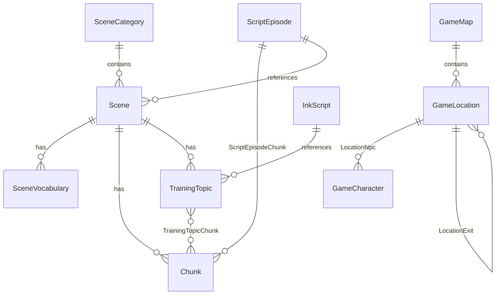

# 种子数据 CSV 文件参考文档

> 所有 CSV 文件位于 `apps/backend/prisma/data/`，由 `seed-english.ts` 在 `pnpm prisma:seed` 时读取并导入数据库。

---

## 数据关系总览



---

## 1. `scene_categories.csv` — 场景分类

| 列 | 说明 |
|---|---|
| `name` | 分类名称（如 `留学生活`、`日常社交`） |
| `icon` | Lucide 图标名 |
| `sort_order` | 排序序号 |

**对应 Prisma 模型：** `SceneCategory`

**用途：** 对场景进行顶层分类。目前共 8 个分类：

| 分类 | 图标 | 说明 |
|---|---|---|
| 留学生活 | GraduationCap | 出国留学常见场景 |
| 日常社交 | Coffee | 日常社交场景 |
| 旅行英语 | Plane | 旅行相关场景 |
| 职场交流 | Briefcase | 职场面试等 |
| 学术挑战 | BookOpen | 学术讨论场景 |
| 健康医疗 | HeartPulse | 看病买药场景 |
| 酒店出行 | Hotel | 酒店入住等 |
| 校园生活 | School | 校园活动场景 |

---

## 2. `scenes.csv` — 场景定义

| 列 | 说明 |
|---|---|
| `category_name` | 所属分类（对应 `scene_categories.name`） |
| `title` | 场景标题（如 `宿舍入住`、`机场入境`） |
| `location` | 场景地点描述 |
| `required_output_level` | 推荐英语输出等级（L1/L2/L3） |
| `required_user_level` | 推荐用户等级 |
| `description` | 场景描述 |

**对应 Prisma 模型：** `Scene`

**用途：** 定义口语练习的"场景"，每个场景包含一组词汇、表达块（Chunk）和训练话题。目前约 16 个场景，覆盖从宿舍入住到小组讨论的各种真实交际场景。

---

## 3. `scene_vocabulary.csv` — 场景词汇表

| 列 | 说明 |
|---|---|
| `scene_title` | 所属场景标题 |
| `word` | 英文单词/短语 |
| `meaning` | 中文释义 |
| `part_of_speech` | 词性（noun/verb/phrase 等） |
| `phonetic_us` | 美式音标 |
| `phonetic_uk` | 英式音标 |
| `difficulty` | 难度等级（L1/L2/L3） |
| `description` | 词汇说明 |
| `examples_json` | 例句 JSON 数组 `[{en, zh, level}]` |
| `sort_order` | 排序序号 |

**对应 Prisma 模型：** `SceneVocabulary`

**用途：** 每个场景下的核心词汇表。seed 脚本导入后还会通过 `dictionaryapi.dev` 自动补全音标和发音音频（需开启 `ENABLE_DICT_ENRICHMENT`）。

---

## 4. `chunks.csv` — 表达块（Chunk）

| 列 | 说明 |
|---|---|
| `scene_title` | 所属场景标题 |
| `category` | 表达块分类（同场景标题，用于分组） |
| `text` | 英文表达（如 `"I'm here to check in."`） |
| `meaning` | 中文释义 |
| `difficulty` | 难度等级 |
| `description` | 说明 |
| `examples_json` | 例句 JSON `[{en, zh, level}]` |
| `applicable_scenes_json` | 适用场景列表（可选，缺省则仅所属场景） |

**对应 Prisma 模型：** `Chunk`

**用途：** 核心教学内容——场景下的"表达块"。每个 Chunk 是一个完整的实用句子，包含例句。seed 同时自动建立 Chunk ↔ TrainingTopic 的多对多关联。

> 同目录的 `chunks.csv.bak` 和 `chunks.csv.bak2` 是旧版本备份，实际导入只使用 `chunks.csv`。

---

## 5. `training_topics.csv` — 训练话题

| 列 | 说明 |
|---|---|
| `scene_title` | 所属场景 |
| `title` | 话题标题（如 `办理入住`、`点咖啡`） |
| `prompt_en` | 英文提示 |
| `prompt_zh` | 中文提示 |
| `duration_sec` | 建议时长（秒） |
| `difficulty` | 难度 |
| `skeleton` | 句子骨架（填空模板） |
| `description` | 描述 |
| `knowledge_points` | 知识点说明 |
| `ink_script_key` | 关联的 Ink 对话脚本 key（可选） |

**对应 Prisma 模型：** `TrainingTopic`

**用途：** 定义用户在场景中具体要练习的话题。每个话题是一个口语练习任务，包含提示语、句子骨架，可选关联 Ink 脚本实现 NPC 对话交互。目前约 40+ 个话题。

---

## 6. `script_episodes.csv` — 剧本关卡

| 列 | 说明 |
|---|---|
| `chapter_id` | 所属章节 ID（如 `chapter_0`、`chapter_1`） |
| `chapter_title` | 章节标题 |
| `episode_order` | 关卡序号 |
| `title` | 关卡标题 |
| `scene_title` | 关联场景 |
| `required_output_level` | 要求输出等级 |
| `required_user_level` | 要求用户等级 |
| `vocab_required_count` | 需要掌握词汇数 |
| `vocab_total_count` | 词汇总数 |
| `chunk_required_count` | 需要掌握 Chunk 数 |
| `chunk_total_count` | Chunk 总数 |
| `objectives_json` | 关卡目标列表 |
| `pass_objective_count` | 通关需要完成目标数 |
| `pass_chunk_count` | 通关需使用 Chunk 数 |
| `pass_min_dialogues` | 最少对话轮次 |
| `npc_name` | NPC 名称 |
| `npc_role` | NPC 角色描述 |
| `is_preview` | 是否预览关卡（true=免费可见） |
| `ink_script_key` | Ink 对话脚本 key |
| `rewards_json` | 奖励配置 JSON |

**对应 Prisma 模型：** `ScriptEpisode`

**用途：** 定义"剧本模式"的关卡结构。按章节（Chapter）组织，每个关卡引用一个场景，包含通关条件（目标数、Chunk 使用数、对话轮次）和奖励。`is_preview=true` 的关卡（如 Chapter 0 的三个新手关卡）免费用户可见。

---

## 7. `episode_chunks.csv` — 关卡↔Chunk 关联

| 列 | 说明 |
|---|---|
| `episode_chapter` | 章节 ID |
| `episode_order` | 关卡序号 |
| `chunk_text_match` | 用于匹配 Chunk 的文本片段 |
| `sort_order` | 排序 |

**对应 Prisma 模型：** `ScriptEpisodeChunk`

**用途：** 指定每个剧本关卡关联哪些 Chunk。seed 脚本通过 `chunk_text_match` 在 `chunks.csv` 中模糊匹配找到对应 Chunk 并建立关联。

---

## 8. `game_characters.csv` — NPC 角色

| 列 | 说明 |
|---|---|
| `name` | 角色标识（如 `alex`、`sarah_front_desk`） |
| `display_name` | 显示名称（如 `Alex`、`Sarah`） |
| `role` | 角色描述 |
| `personality` | 性格描述 |
| `default_position` | 默认位置（left/right/center） |
| `avatar_url` | 头像 URL |
| `sprite_base_url` | 精灵图基础 URL |

**对应 Prisma 模型：** `GameCharacter`

**用途：** 探索模式中的 NPC 角色。目前 6 个角色，包括室友 Alex、前台 Sarah、咖啡师 Tom、校医 Dr. Emily 等。

---

## 9. `game_maps.csv` — 探索地图

| 列 | 说明 |
|---|---|
| `name` | 地图标识 |
| `display_name` | 显示名称 |
| `required_output_level` | 解锁需要输出等级 |
| `is_preview` | 是否预览 |
| `sort_order` | 排序 |

**对应 Prisma 模型：** `GameMap`

**用途：** 探索模式的地图定义。目前仅有 `campus`（大学校园）一张地图。

---

## 10. `game_locations.csv` — 地图地点

| 列 | 说明 |
|---|---|
| `map_name` | 所属地图 |
| `name` | 地点标识 |
| `display_name` | 显示名称（含 emoji） |
| `description` | 地点描述 |
| `pos_x` / `pos_y` | 地图上的坐标（百分比） |
| `location_type` | 类型（目前全部为 `vn_scene`） |
| `is_preview` | 是否预览 |
| `required_output_level` | 解锁要求 |
| `background_url` | 背景图 URL |

**对应 Prisma 模型：** `GameLocation`

**用途：** 地图上的具体地点。目前 5 个地点：宿舍大厅、校园咖啡店、图书馆、校医室、银行。

---

## 11. `location_npcs.csv` — 地点 NPC 关联

| 列 | 说明 |
|---|---|
| `location_name` | 地点名称 |
| `character_name` | NPC 标识 |
| `default_greeting` | 默认问候语 |
| `sort_order` | 排序 |

**对应 Prisma 模型：** `GameLocationNpc`

**用途：** 指定每个地点有哪些 NPC 驻留及他们的默认问候语。

---

## 12. `location_exits.csv` — 地点出口（路径）

| 列 | 说明 |
|---|---|
| `from_location` | 起点地点 |
| `to_location` | 终点地点 |
| `label` | 路径标签（如 `去校园咖啡店 →`） |

**对应 Prisma 模型：** `GameLocationExit`

**用途：** 定义地点之间的连通关系，用于探索模式中的移动导航。

---

## 13. `achievement_defs.csv` — 成就定义

| 列 | 说明 |
|---|---|
| `key` | 成就唯一标识 |
| `title` | 成就名称（如 `初次开口`） |
| `description` | 成就描述 |
| `category` | 分类（first_time/milestone/streak/mastery/challenge/hidden） |
| `rarity` | 稀有度（common/rare/epic） |
| `sort_order` | 排序 |
| `is_hidden` | 是否隐藏 |
| `hint_text` | 隐藏成就的提示 |
| `condition_json` | 解锁条件 JSON |
| `reward_xp` | 奖励经验值 |

**对应 Prisma 模型：** `AchievementDef`

**用途：** 成就系统的静态定义。目前约 12 个成就，覆盖首次操作、累计里程碑、连续打卡、等级达成、章节通关、连续通关等类型。

---

## 14. `ink-scripts/` — Ink 对话脚本（JSON）

存放 Ink 格式的对话树 JSON 文件。通过 `ink_script_key` 与 `training_topics.csv` 和 `script_episodes.csv` 关联。目前只有一个文件：

| 文件 | 用途 |
|---|---|
| `practice_check_in.json` | Chapter 0 第一个关卡（宿舍入住办理）的 NPC 对话脚本 |

**对应 Prisma 模型：** `InkScript`

---

## 整体数据流

```
scene_categories.csv  ──→ SceneCategory
       │
       ├── scenes.csv  ──→ Scene
       │         ├── scene_vocabulary.csv  ──→ SceneVocabulary
       │         ├── chunks.csv  ──→ Chunk (─→ TrainingTopicChunk)
       │         └── training_topics.csv  ──→ TrainingTopic (↔ InkScript)
       │
       ├── script_episodes.csv  ──→ ScriptEpisode
       │         └── episode_chunks.csv  ──→ ScriptEpisodeChunk
       │
       ├── game_maps.csv  ──→ GameMap
       │         └── game_locations.csv  ──→ GameLocation
       │                   ├── location_npcs.csv  ──→ GameLocationNpc (↔ GameCharacter)
       │                   └── location_exits.csv  ──→ GameLocationExit
       │
       ├── game_characters.csv  ──→ GameCharacter
       │
       └── achievement_defs.csv  ──→ AchievementDef

ink-scripts/*.json  ──→ InkScript (被 TrainingTopic / ScriptEpisode 引用)
```
