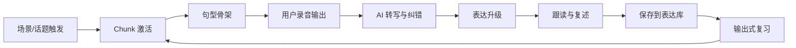
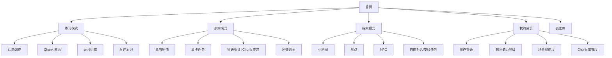
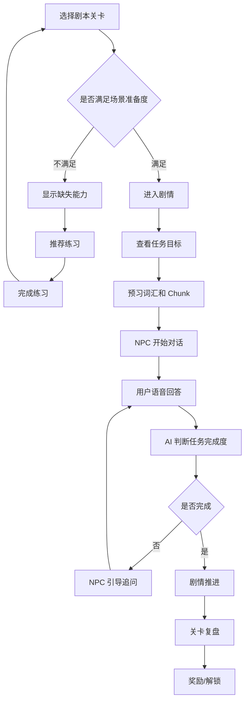
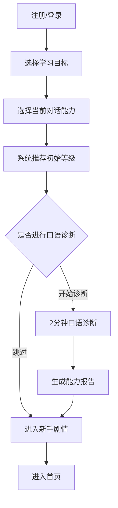
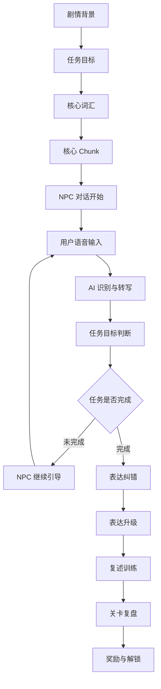
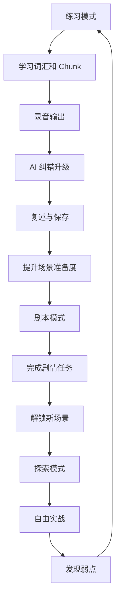

# 沉浸式英语输出训练 App 需求文档 V2

> 版本：V2.0  
> 类型：产品需求文档 / PRD  
> 核心方向：练习模式 + 剧本模式 + 探索模式  
> 产品关键词：场景化、chunk 激活、英语思维、AI 口语纠错、剧本任务、场景准备度、等级解锁、沉浸式输出训练

---

## 1. 文档说明

本版本在原「英语输出训练 App MVP 需求文档」基础上继续扩展，重点补充以下内容：

1. 将产品从单一练习工具升级为「沉浸式英语输出训练系统」。
2. 新增三种核心模式：练习模式、剧本模式、探索模式。
3. 新增等级制度：用户等级、输出能力等级、场景熟练度、chunk 掌握度。
4. 新增剧本关卡解锁机制：等级要求、词汇要求、chunk 要求、前置任务、场景准备度。
5. 新增留学生活主线场景，用游戏化方式承载真实英语输出任务。
6. 明确游戏化目的：不是为了做游戏，而是为了提升沉浸感、训练动机、复习效率和长期留存。

---

## 2. 产品定位

### 2.1 一句话定位

> 一个通过场景、chunk、AI 对话和剧情任务，帮助用户把英文真正说出口的沉浸式英语输出训练 App。

### 2.2 产品本质

本产品不是传统背单词 App，不是纯雅思 App，也不是普通 AI 聊天工具。

它的本质是：

> 用场景和剧情制造真实表达需求，用 chunk 和句型降低开口难度，用 AI 纠错和复述训练帮助用户形成英语思维。

### 2.3 产品底层逻辑

产品所有模式都围绕同一个训练闭环：



### 2.4 对外包装

对用户不强调「雅思专用」，而强调：

- 把中文想法变成自然英文
- 在真实生活场景里练英语
- 从机场、宿舍、课堂到社交，模拟出国生活
- 不是背英语，而是练到能说出口
- 用剧情任务逼自己真正开口

### 2.5 底层能力来源

虽然产品不包装成雅思 App，但底层训练方式可以吸收雅思口语结构：

| 雅思口语结构 | 产品包装方式 |
|---|---|
| Part 1 日常问答 | 日常场景快速问答 |
| Part 2 长回答 | 一分钟表达任务 |
| Part 3 深度讨论 | 高级观点挑战 |
| 评分标准 | 输出能力诊断 |
| 高频话题 | 生活场景话题库 |
| 范文升级 | 表达升级 |
| 追问 | NPC 继续对话 |

---

## 3. 目标用户

### 3.1 核心用户

- 有一定英语基础，但开口困难的人
- 能看懂英文，但说不自然的人
- 想出国留学、旅行、工作或参加英语考试的人
- 想通过场景化方式练口语的人
- 不想机械背单词，希望在真实语境中学表达的人

### 3.2 用户典型状态

| 用户状态 | 表现 | 产品解决方式 |
|---|---|---|
| 不知道说什么 | 打开 App 后不知道练什么 | 用场景和剧情给出任务 |
| 不知道怎么说 | 有中文想法但不会英文表达 | chunk 激活 + 句型骨架 |
| 说完没人改 | 不知道自己错在哪里 | AI 转写 + 分类纠错 |
| 看懂但说不出 | 参考答案看懂，但不会复述 | 跟读 + 遮挡复述 + 再输出 |
| 学完容易忘 | 收藏很多表达但不会用 | 表达库 + 输出式复习 |
| 自由对话会卡住 | AI 问一句就不知道回答 | 先练习，再剧本，再探索 |

---

## 4. 产品整体结构

产品分为三个核心模式：



---

## 5. 三大模式设计

## 5.1 练习模式

### 5.1.1 模式定位

练习模式是产品基础，默认开放。

作用：

> 帮用户先学会这个场景怎么说，再进入剧本和探索中真实使用。

### 5.1.2 核心流程


### 5.1.3 主要功能

| 功能 | 说明 | 目的 |
|---|---|---|
| 话题训练 | 用户选择工作、学习、城市、旅行等话题 | 解决不知道练什么 |
| 词汇预热 | 展示当前场景必要词汇 | 降低理解成本 |
| Chunk 激活 | 提供 5～8 个高频表达块 | 解决不知道怎么说 |
| 句型骨架 | 提供可填充回答结构 | 帮用户组织英文思路 |
| 录音回答 | 用户必须开口说 | 保证真实输出 |
| AI 纠错 | 语法、中式表达、自然度、逻辑 | 提供付费价值 |
| 表达升级 | 给出更自然版本 | 让用户看到提升 |
| 跟读复述 | 让用户把表达说出来 | 防止看懂但不会用 |
| 表达库 | 保存错句、chunk、升级句 | 形成用户资产 |

### 5.1.4 MVP 中练习模式必须优先完成

练习模式是后续剧本模式和探索模式的基础。若练习模式不成立，剧本和探索只会变成普通 AI 聊天或轻度游戏包装。

---

## 5.2 剧本模式

### 5.2.1 模式定位

剧本模式是产品核心付费内容。

作用：

> 让用户在固定剧情中完成英语任务，用英语推动故事发展。

### 5.2.2 剧本模式特点

- 有章节
- 有场景
- 有 NPC
- 有任务目标
- 有必用词汇和 chunk
- 有通关条件
- 有剧情推进
- 有复盘反馈
- 有解锁机制

### 5.2.3 剧本模式基础流程



### 5.2.4 剧本模式不等于自由聊天

剧本模式不是让用户和 AI 随便聊，而是：

> 在明确剧情和任务目标下，用户必须使用英语完成沟通。

例如：

- 在机场说明来英国读书
- 在宿舍前台办理入住
- 向室友自我介绍
- 去银行开户
- 向医生描述症状
- 和老师确认作业 deadline

---

## 5.3 探索模式

### 5.3.1 模式定位

探索模式是后期增强沉浸感和留存的开放模式。

作用：

> 让用户像在国外生活一样，在小地图中选择地点和 NPC，自由进行英语互动。

### 5.3.2 探索模式特点

- 小地图
- 多地点
- 多 NPC
- 可自由选择对话对象
- 有支线任务
- 有场景熟练度
- 有自由对话复盘
- 对用户能力要求更高

### 5.3.3 探索模式初期控制策略

探索模式不建议一开始完全开放，应采用半开放方式：

| 阶段 | 开放方式 |
|---|---|
| MVP | 不做完整探索，仅做预览入口 |
| V1.1 | 开放一个地点：宿舍大厅 |
| V1.2 | 开放校园地图基础区域 |
| V2.0 | 开放多地点、多 NPC、支线任务 |

### 5.3.4 探索模式与剧本模式区别

| 模式 | 特点 | 用户自由度 | 教学控制 |
|---|---|---:|---:|
| 练习模式 | 结构化训练 | 低 | 高 |
| 剧本模式 | 固定任务剧情 | 中 | 高 |
| 探索模式 | 地图自由对话 | 高 | 中 |

---

## 6. 游戏化设计目的

游戏化不是为了把产品做成重度游戏，而是为了服务学习。

### 6.1 提升沉浸感

普通练习：

> 今天练 shopping 话题。

剧情练习：

> 你刚到国外，需要去超市买生活用品，并向店员询问是否有转换插头。

后者更真实，更容易让用户进入场景。

### 6.2 给输出一个明确目的

用户不是为了回答问题而回答，而是为了完成任务：

- 通过入境
- 找到宿舍
- 办理入住
- 认识室友
- 预约医生
- 参加小组讨论

### 6.3 让 chunk 有真实用途

chunk 不再是孤立短语，而是剧情中的行动工具。

例如：

- Could you tell me where...? → 问路
- I’m here to check in. → 入住
- I’m still getting used to everything. → 认识室友
- I was wondering if... → 礼貌询问

### 6.4 提升复习动力

传统复习：

> 复习昨天学过的 10 个 chunk。

剧情复习：

> 昨天你学会了问路，今天你在校园里迷路了，需要再次向路人求助。

### 6.5 提升留存

剧情章节、地图解锁、NPC 解锁、场景熟练度能够给用户持续目标。

---

## 7. 等级系统设计

产品不建议只做一个总等级，而应设计四类等级/熟练度。

## 7.1 用户总等级

偏游戏化，用于成长感和解锁展示。

### 经验来源

| 行为 | XP |
|---|---:|
| 完成一次练习 | +10 |
| 完成一次录音回答 | +5 |
| 成功复述一个 chunk | +5 |
| 完成一个剧本关卡 | +30 |
| 连续打卡 | +20 |
| 在真实回答中主动使用新 chunk | +10 |

### 等级作用

- 解锁部分剧情章节
- 显示成长感
- 配合任务系统使用
- 不能单独作为能力判断依据

---

## 7.2 输出能力等级

这是学习层面的核心等级。

| 等级 | 名称 | 用户能力 | 大致对应 |
|---|---|---|---|
| L1 | 能说一句 | 能说简单单句，但容易卡住 | 口语 4.5～5 |
| L2 | 能说清楚 | 能回答日常问题，有简单原因 | 口语 5～5.5 |
| L3 | 能说完整 | 能说 30～60 秒，有原因和例子 | 口语 5.5～6.5 |
| L4 | 能自然交流 | 能处理真实生活场景对话 | 口语 6.5～7 |
| L5 | 能深入表达 | 能讨论观点和抽象话题 | 口语 7+ |

> 前端可以不显示雅思分数，只显示「能说一句、能说清楚、能说完整」等自然描述。

### 输出能力评估维度

| 维度 | 说明 |
|---|---|
| 回答长度 | 能否持续表达 20/30/60 秒 |
| 语法准确性 | 基础错误数量 |
| chunk 使用 | 是否能主动使用已学表达 |
| 逻辑完整度 | 是否有观点、原因、例子 |
| 自然度 | 是否存在明显中式表达 |
| 流利度 | 停顿、重复、卡顿情况 |
| 复述能力 | 是否能复述升级后的表达 |

---

## 7.3 场景熟练度

每个场景单独记录熟练度。

例如：

| 场景 | 熟练度 |
|---|---:|
| 机场入境 | 80% |
| 宿舍入住 | 60% |
| 咖啡店点餐 | 75% |
| 课堂讨论 | 35% |
| 医院看病 | 20% |

原因：

> 用户可能点咖啡很熟，但看病不会说，所以不能只看总等级。

### 场景熟练度来源

- 学习该场景词汇
- 掌握该场景 chunk
- 完成该场景练习
- 在剧本中成功完成任务
- 在探索模式中自由使用相关表达

---

## 7.4 Chunk 掌握度

每个 chunk 都需要记录状态。

| 状态 | 含义 |
|---|---|
| 未学习 | 用户没见过 |
| 已激活 | 用户看过，但还不会用 |
| 能跟读 | 用户能读出来 |
| 能输出 | 用户能在回答中主动使用 |
| 已掌握 | 用户能在多个场景中复用 |

### 示例

chunk：

> be under a lot of pressure

掌握路径：


判断逻辑：

| 状态 | 判断方式 |
|---|---|
| 已激活 | 用户看过该 chunk |
| 能跟读 | 用户完成跟读 |
| 能输出 | 用户在回答中主动使用一次 |
| 已掌握 | 用户在 2～3 个不同场景中正确使用 |

---

## 8. 新用户登录与能力选择

## 8.1 初始流程



## 8.2 学习目标选择

用户可选择一个或多个目标：

- 日常交流
- 留学生活
- 旅行英语
- 雅思口语
- 职场交流
- 面试表达
- 提升英语思维

## 8.3 当前能力自选

不要一上来强制考试，先让用户自己选择。

```text
你现在更接近哪种状态？

A. 我能看懂一些英语，但开口很困难
B. 我能说简单句，但经常卡住
C. 我能回答日常问题，但说得不自然
D. 我能聊日常话题，但复杂话题说不好
E. 我可以自由交流，但想说得更自然、更高级
```

对应初始等级：

| 选项 | 初始输出等级 |
|---|---|
| A | L1 |
| B | L2 |
| C | L3 |
| D | L4 |
| E | L5 |

## 8.4 可选口语诊断

用户可以选择做一个 2 分钟口语诊断。

诊断问题示例：

1. Tell me about your daily routine.
2. Describe a place you like.
3. Do you think technology has changed the way people communicate?

输出结果：

```text
当前输出水平：L2-L3
主要问题：
- 回答偏短
- 连接词较少
- 有一些中式表达
- chunk 使用不够自然

推荐路径：
先练「日常生活」和「校园基础」场景。
```

---

## 9. 模式解锁策略

## 9.1 总体原则

练习模式默认开放，剧本模式半锁定，探索模式中后期开放。

| 模式 | 开放方式 | 说明 |
|---|---|---|
| 练习模式 | 默认开放 | 不能锁基础训练 |
| 剧本模式 | 部分开放 | Chapter 0 免费体验，后续按等级/准备度/付费解锁 |
| 探索模式 | 预览 + 后期开放 | 先开放一个小区域，避免用户自由对话卡住 |

## 9.2 不要锁太死

新用户一开始应该可以体验到未来玩法：

- 练习模式：开放基础内容
- 剧本模式：开放 Chapter 0 体验关
- 探索模式：开放一个预览地点，如宿舍大厅

## 9.3 解锁不只看等级

不建议只用用户等级解锁，应使用：

> 输出能力等级 + 场景准备度 + 前置任务 + 付费状态

---

## 10. 场景准备度系统

### 10.1 定义

场景准备度用于告诉用户：

> 你现在是否具备挑战某个剧本/场景的语言能力。

它比单纯「等级不足」更友好。

### 10.2 场景准备度组成

| 指标 | 示例 |
|---|---|
| 输出等级 | 至少 L2 |
| 用户等级 | Lv.3 以上 |
| 核心词汇 | 掌握 12 / 20 |
| 核心 chunk | 掌握 6 / 10 |
| 前置剧情 | 完成打车去宿舍 |
| 录音练习 | 完成 3 次相关回答 |
| 复述能力 | 完成至少 1 次复述 |

### 10.3 UI 展示方式

示例：

```text
场景准备度：65%

已完成：
- 输出等级：L2，已满足
- 前置剧情：已完成
- 词汇：12 / 20
- Chunk：6 / 10

还差：
- 3 个核心 chunk
- 1 次 30 秒录音回答

推荐练习：
- 宿舍入住表达训练
- 问路表达训练
- 自我介绍 30 秒挑战
```

### 10.4 场景准备度计算建议

可暂时使用简单权重：

| 项目 | 权重 |
|---|---:|
| 输出等级满足 | 25% |
| 核心 chunk 掌握度 | 30% |
| 场景词汇掌握度 | 20% |
| 前置任务完成 | 15% |
| 相关录音练习 | 10% |

准备度达到 70% 可以进入挑战；未达到 70% 时推荐先练习。

---

## 11. 剧本关卡卡片设计

## 11.1 关卡卡片应包含字段

每个剧本关卡需要展示：

1. 场景简介
2. 任务目标
3. 等级要求
4. 词汇要求
5. Chunk 要求
6. 前置任务
7. 场景准备度
8. 推荐练习
9. 通关条件
10. 通关奖励

## 11.2 示例：宿舍 Check-in

```text
Chapter 1-3：宿舍 Check-in

场景：
你刚到学生宿舍，需要和前台工作人员完成入住登记。

任务目标：
- 说明自己来办理入住
- 提供姓名和预订信息
- 询问房间位置
- 询问 Wi-Fi 和公共设施

解锁要求：
- 输出等级：L2 能说清楚
- 用户等级：Lv.3
- 前置剧情：完成「打车去宿舍」
- 核心 chunk：掌握 6 / 10
- 场景词汇：掌握 12 / 20

核心词汇：
- dormitory
- reception
- check in
- booking
- room key
- student ID
- Wi-Fi
- laundry room
- shared kitchen
- elevator

核心 chunk：
- I’m here to check in.
- My booking is under the name...
- Here is my student ID.
- Could you tell me where my room is?
- Is there Wi-Fi in the building?
- Is there anything I need to sign?
- Could you show me how to get there?
- Where is the laundry room?
- Do I need to book the kitchen in advance?
- Thank you for your help.

通关条件：
- 成功完成 4 个任务目标
- 至少主动使用 3 个核心 chunk
- 录音回答无严重语法错误
- 完成一次复述

通关奖励：
- 解锁「宿舍房间」地图
- 解锁 NPC：室友 Alex
- 宿舍场景熟练度 +15%
- 获得 30 XP
```

## 11.3 未解锁状态展示

不要只显示「未解锁」。

应显示：

```text
你还不能挑战「认识室友」

还需要：
- 输出等级达到 L2
- 掌握 5 个自我介绍 chunk
- 完成「宿舍 Check-in」
- 完成 1 次 30 秒自我介绍练习

推荐先练：
- 自我介绍话题
- 家乡表达
- 专业/学习方向表达
```

---

## 12. 剧本主线设计：模拟出国留学生活

主线建议以「第一次出国留学」为故事背景。

## 12.1 Chapter 0：新手体验

目的：让用户快速理解产品玩法。

关卡：

| 关卡 | 场景 | 任务 |
|---|---|---|
| 0-1 | 宿舍大厅 | 和前台打招呼 |
| 0-2 | 咖啡店 | 点一杯咖啡 |
| 0-3 | 室友见面 | 简单自我介绍 |

## 12.2 Chapter 1：初到国外

| 关卡 | 场景 | 任务 |
|---|---|---|
| 1-1 | 机场入境 | 说明来访目的 |
| 1-2 | 打车去宿舍 | 告诉司机地址 |
| 1-3 | 宿舍 Check-in | 办理入住 |
| 1-4 | 认识室友 | 自我介绍和寒暄 |
| 1-5 | 买 SIM 卡 | 询问套餐和价格 |

## 12.3 Chapter 2：校园生活

| 关卡 | 场景 | 任务 |
|---|---|---|
| 2-1 | 新生说明会 | 确认流程和地点 |
| 2-2 | 找教室 | 问路 |
| 2-3 | 课堂认识同学 | 介绍专业和兴趣 |
| 2-4 | 问老师作业 | 确认 deadline 和要求 |
| 2-5 | 图书馆借书 | 询问借阅规则 |

## 12.4 Chapter 3：日常生活

| 关卡 | 场景 | 任务 |
|---|---|---|
| 3-1 | 超市购物 | 找商品和结账 |
| 3-2 | 银行开户 | 说明开户需求 |
| 3-3 | 邮局寄东西 | 询问邮寄方式 |
| 3-4 | 宿舍报修 | 描述设施问题 |
| 3-5 | 预约看病 | 描述症状和预约时间 |

## 12.5 Chapter 4：社交生活

| 关卡 | 场景 | 任务 |
|---|---|---|
| 4-1 | 室友邀请吃饭 | 接受/拒绝邀请 |
| 4-2 | 社团活动 | 介绍兴趣 |
| 4-3 | 小组聚会 | 参与闲聊 |
| 4-4 | 处理室友矛盾 | 礼貌表达不满 |
| 4-5 | 约朋友出门 | 商量时间和地点 |

## 12.6 Chapter 5：学术挑战

| 关卡 | 场景 | 任务 |
|---|---|---|
| 5-1 | 小组讨论 | 提出观点 |
| 5-2 | Presentation | 介绍主题 |
| 5-3 | 讨论 deadline | 和同学协调任务 |
| 5-4 | 向老师解释问题 | 说明困难并寻求建议 |
| 5-5 | 课堂辩论 | 表达支持或反对 |

---

## 13. 剧本关卡内部结构

每个剧本关卡由以下模块组成：



---

## 14. 任务目标与通关判断

## 14.1 任务目标类型

| 类型 | 示例 |
|---|---|
| 信息传达 | 说明自己来办理入住 |
| 信息询问 | 询问 Wi-Fi 密码 |
| 礼貌请求 | 请求帮助找路 |
| 观点表达 | 表达是否喜欢宿舍生活 |
| 问题描述 | 描述水龙头坏了 |
| 协商沟通 | 和室友商量打扫安排 |
| 情绪表达 | 表达紧张、兴奋、不适应 |

## 14.2 AI 判断维度

每轮用户回答后，AI 需要判断：

| 维度 | 判断内容 |
|---|---|
| 是否切题 | 是否回答 NPC 问题 |
| 是否完成任务目标 | 是否表达了必要信息 |
| 是否使用核心 chunk | 是否主动使用本关表达 |
| 语法是否可理解 | 是否存在严重影响理解的问题 |
| 自然度 | 是否有明显中式表达 |
| 是否需要追问 | 是否缺少关键信息 |

## 14.3 通关条件示例

以「宿舍 Check-in」为例：

| 条件 | 要求 |
|---|---|
| 任务目标 | 完成 4 个目标中的至少 3 个 |
| 核心 chunk | 主动使用至少 3 个 |
| 可理解度 | AI 判断不影响沟通 |
| 复述 | 完成 1 次升级表达复述 |
| 对话轮次 | 至少完成 3 轮对话 |

---

## 15. 练习模式与剧本模式打通

## 15.1 基本逻辑


## 15.2 推荐练习逻辑

当用户无法解锁某个剧本时，系统推荐对应练习。

例如用户想挑战「认识室友」，但准备度不足：

缺失项：

- 自我介绍 chunk 不足
- 家乡话题练习不足
- 录音回答次数不足

系统推荐：

1. 自我介绍表达训练
2. 家乡与专业话题训练
3. 30 秒自我介绍挑战

---

## 16. 表达库设计

表达库是用户资产中心。

## 16.1 表达库内容

| 类型 | 内容 |
|---|---|
| 我的 chunk | 用户学过、用过、掌握的表达 |
| 我的错句 | 用户说错的原句 |
| 升级表达 | AI 修改后的自然表达 |
| 场景表达 | 按机场、宿舍、课堂等分类 |
| 待复习内容 | 还未掌握的词汇和 chunk |
| 已掌握内容 | 可跨场景使用的表达 |

## 16.2 表达库与复习

表达库不是收藏夹，而是输出复习系统。

例如系统不应只是展示：

> under a lot of pressure

而应让用户输出：

> 请用英文说：现在很多学生压力很大。

用户回答后系统判断是否用对：

> Many students are under a lot of pressure.

---

## 17. 复习系统设计

## 17.1 复习对象

- 未掌握 chunk
- 常错句
- 场景词汇
- 剧本中失败的任务表达
- 用户不会说的中文想法

## 17.2 复习形式

| 形式 | 示例 |
|---|---|
| 中文提示输出 | 请用英文说：我来办理入住 |
| 英文关键词复述 | check in / booking / student ID |
| 场景复现 | 你又来到前台，需要问 Wi-Fi |
| 遮挡复述 | I’m here to _____. |
| 换场景迁移 | 用 under pressure 描述工作、学习、买房 |

## 17.3 复习触发

- 每日训练
- 剧本失败后
- 探索对话后
- chunk 即将遗忘时
- 用户进入相关场景前

---

## 18. 页面结构

## 18.1 首页

首页展示：

- 今日训练
- 当前输出等级
- 今日推荐 chunk
- 剧本进度
- 探索模式入口
- 表达库入口
- 继续上次任务

## 18.2 练习模式页面

包含：

- 场景/话题选择
- 词汇预热
- chunk 激活
- 问题卡片
- 录音按钮
- AI 纠错结果
- 表达升级
- 跟读复述
- 保存到表达库

## 18.3 剧本模式页面

包含：

- Chapter 列表
- 关卡卡片
- 场景准备度
- 等级/词汇/chunk 要求
- 推荐练习
- 开始挑战按钮
- 通关奖励

## 18.4 探索模式页面

包含：

- 小地图
- 地点入口
- NPC 列表
- 当前地点可练场景
- 对话目标
- 自由对话入口
- 对话复盘

## 18.5 我的成长页面

包含：

- 用户等级
- 输出能力等级
- 场景熟练度
- chunk 掌握度
- 本周练习统计
- 常错表达
- 推荐提升路径

---

## 19. 数据结构草案

## 19.1 用户表 User

```json
{
  "userId": "u_001",
  "nickname": "Lourd",
  "goal": ["留学生活", "英语思维"],
  "userLevel": 5,
  "xp": 420,
  "outputLevel": "L2",
  "createdAt": "2026-05-25"
}
```

## 19.2 场景表 Scene

```json
{
  "sceneId": "dorm_checkin",
  "title": "宿舍 Check-in",
  "category": "留学生活",
  "location": "宿舍前台",
  "requiredOutputLevel": "L2",
  "requiredUserLevel": 3,
  "coreVocabularyIds": ["v_dormitory", "v_reception", "v_booking"],
  "coreChunkIds": ["c_checkin_001", "c_checkin_002"],
  "prerequisiteSceneIds": ["taxi_to_dorm"]
}
```

## 19.3 Chunk 表 Chunk

```json
{
  "chunkId": "c_checkin_001",
  "text": "I’m here to check in.",
  "meaning": "我是来办理入住的。",
  "category": "宿舍入住",
  "difficulty": "L2",
  "example": "Hi, I’m here to check in. My booking is under the name Li.",
  "applicableScenes": ["dorm_checkin", "hotel_checkin"]
}
```

## 19.4 用户 Chunk 掌握表 UserChunkProgress

```json
{
  "userId": "u_001",
  "chunkId": "c_checkin_001",
  "status": "can_output",
  "seenCount": 3,
  "spokenCount": 2,
  "correctUseCount": 1,
  "lastPracticedAt": "2026-05-25"
}
```

## 19.5 剧本关卡表 ScriptEpisode

```json
{
  "chapterId": "chapter_1",
  "episodeId": "ch1_ep3_dorm_checkin",
  "title": "宿舍 Check-in",
  "sceneId": "dorm_checkin",
  "levelRequirement": "L2",
  "userLevelRequirement": 3,
  "prerequisiteEpisodes": ["ch1_ep2_taxi_to_dorm"],
  "vocabularyRequirement": {
    "requiredCount": 12,
    "totalCount": 20
  },
  "chunkRequirement": {
    "requiredCount": 6,
    "totalCount": 10
  },
  "objectives": [
    "说明自己来办理入住",
    "提供姓名和学生证",
    "询问房间位置",
    "询问 Wi-Fi 和公共设施"
  ],
  "passConditions": [
    "完成至少 3 个任务目标",
    "主动使用至少 3 个核心 chunk",
    "完成一次复述"
  ],
  "rewards": [
    "解锁宿舍房间地图",
    "解锁室友 NPC",
    "获得 30 XP"
  ]
}
```

## 19.6 用户场景熟练度 UserSceneProgress

```json
{
  "userId": "u_001",
  "sceneId": "dorm_checkin",
  "readiness": 65,
  "mastery": 45,
  "vocabularyProgress": {
    "learned": 12,
    "total": 20
  },
  "chunkProgress": {
    "mastered": 6,
    "total": 10
  },
  "completedPracticeCount": 3,
  "completedScriptCount": 0
}
```

---

## 20. AI 能力需求

## 20.1 语音转写

- 将用户录音转成英文文本
- 支持中途停顿和重复
- 尽量保留用户真实表达问题

## 20.2 纠错能力

纠错分类：

| 类型 | 示例 |
|---|---|
| 语法错误 | I very like → I really like |
| 搭配错误 | listen music → listen to music |
| 中式表达 | play phone → scroll on my phone |
| 不自然表达 | make me relax → help me relax |
| 逻辑不足 | 回答太短、没有原因 |

## 20.3 表达升级

输出多个版本：

- 清楚版
- 自然版
- 进阶版

要求：

- 不堆难词
- 保留用户原意
- 适合当前用户等级
- 提取可复用 chunk

## 20.4 剧本任务判断

AI 需要判断：

- 用户是否完成任务目标
- 是否提供关键信息
- 是否应该继续追问
- 是否可以推进剧情
- 是否需要提示用户使用某个 chunk

## 20.5 NPC 对话生成

NPC 对话应符合：

- 当前角色身份
- 当前场景
- 用户等级
- 本关任务目标
- 已完成/未完成目标

例如宿舍前台 NPC 不应随便聊电影，应围绕入住登记、房间、设施、Wi-Fi 等内容展开。

---

## 21. MVP 范围

## 21.1 MVP 必须做

| 模块 | 功能 |
|---|---|
| 新手流程 | 目标选择、能力自选 |
| 练习模式 | 话题、chunk、录音、纠错、升级、复述 |
| 表达库 | 保存错句、chunk、升级表达 |
| 简单等级 | 输出等级 + 用户等级 |
| 剧本体验 | Chapter 0 或 Chapter 1 的 2～3 个关卡 |
| 场景准备度 | 至少在剧本卡片上展示词汇/chunk 要求 |

## 21.2 MVP 暂不做

- 完整小地图探索
- 多 NPC 自由漫游
- 复杂剧情分支
- 社区系统
- 真人老师批改
- 高精度发音评分
- 大规模课程体系
- 完整雅思写作系统

## 21.3 MVP 推荐内容规模

| 内容 | 数量 |
|---|---:|
| 场景分类 | 6～8 个 |
| 训练话题 | 30～50 个 |
| 核心 chunk | 300～600 个 |
| 场景词汇 | 300～500 个 |
| 剧本关卡 | 5～10 个 |
| NPC | 3～5 个 |
| 新手剧情 | 2～3 关 |

---

## 22. 后续版本规划

## 22.1 V1.0

目标：验证练习闭环和轻剧本模式。

- 完整练习模式
- 表达库
- 输出等级
- 剧本 Chapter 0 + Chapter 1 部分关卡
- 场景准备度基础版

## 22.2 V1.1

目标：增强剧本模式。

- 完整 Chapter 1
- Chapter 2 校园生活
- 更多 NPC
- 更完善的任务判断
- 更细的 chunk 掌握状态

## 22.3 V1.2

目标：加入轻探索。

- 小地图基础版
- 开放宿舍、咖啡店、校园 3 个地点
- NPC 互动
- 支线任务
- 场景熟练度

## 22.4 V2.0

目标：沉浸式留学生活模拟。

- 完整小地图
- 多章节剧情
- 自由探索
- 长期角色关系
- 学术挑战
- 高级观点表达
- 更个性化学习路径

---

## 23. 付费设计

## 23.1 免费内容

- 基础练习模式
- 每日有限次数 AI 纠错
- Chapter 0 体验剧情
- 少量表达库容量
- 探索模式预览地点

## 23.2 会员内容

- 无限或更多 AI 纠错
- 完整表达升级
- 完整表达库
- 输出式复习
- 完整剧本章节
- 场景准备度分析
- 个性化推荐练习
- 探索模式

## 23.3 剧本包售卖

可单独售卖：

| 剧本包 | 内容 | 价格建议 |
|---|---|---:|
| 留学第一周 | 机场、宿舍、校园、购物 | 19～29 元 |
| 校园课堂生存包 | 课堂、小组、作业、presentation | 29～39 元 |
| 海外生活实战包 | 银行、医院、租房、邮局 | 39～49 元 |
| 雅思口语场景包 | 高频话题与模拟口语 | 39～69 元 |
| 职场英语剧情包 | 面试、会议、汇报、客户沟通 | 49～99 元 |

---

## 24. 核心指标

## 24.1 学习指标

- 每日录音次数
- 平均回答时长
- 复述完成率
- chunk 主动使用次数
- chunk 掌握数量
- 场景熟练度提升
- 常错表达减少数量

## 24.2 产品指标

- 次日留存
- 7 日留存
- 每日训练完成率
- 剧本关卡完成率
- 从练习跳转剧本转化率
- 从未解锁页面进入推荐练习的比例
- 付费转化率

## 24.3 剧本指标

- 每关进入率
- 每关失败率
- 每关平均对话轮数
- 每关平均复述次数
- 解锁后挑战率
- 通关后继续下一关比例

---

## 25. 风险与注意事项

## 25.1 不要过度游戏化

游戏元素必须服务学习，不应让用户忘记核心目标是英语输出。

优先级：

> 学习闭环 > 任务设计 > 剧情 > 地图 > 角色养成

## 25.2 不要让自由对话过早开放

用户能力不足时，自由对话容易导致卡住和挫败。

应先通过练习和剧本建立表达基础。

## 25.3 不要只用等级卡用户

锁关卡时一定要展示：

- 为什么不能挑战
- 还差什么
- 应该练什么
- 练完能解锁什么

## 25.4 不要把 chunk 做成死背

chunk 必须放在场景、任务和复述中使用。

错误方式：

> 今天背 50 个短语。

正确方式：

> 你要完成宿舍入住，所以先学会这 6 个表达。

## 25.5 不要追求第一版内容大而全

MVP 只需要验证：

> 用户是否愿意通过场景化 chunk 训练 + AI 纠错 + 剧本任务持续练口语。

---

## 26. 最终产品形态总结

产品最终应形成一个完整的英语输出成长系统：



一句话概括：

> 练习模式负责教用户怎么说，剧本模式负责让用户在任务中使用，探索模式负责让用户在沉浸场景中自由复用。

核心差异化：

1. 不是普通 AI 聊天，而是结构化输出训练。
2. 不是机械背 chunk，而是在剧情任务中使用 chunk。
3. 不是单纯游戏化，而是用游戏机制驱动英语输出。
4. 不是只显示等级，而是显示用户进入每个场景前需要掌握什么。
5. 不是一次性纠错，而是把错句、chunk、场景熟练度沉淀成长期成长系统。

---

## 27. 下一步建议

后续可以继续拆分为以下文档：

1. 《MVP 页面原型说明》
2. 《剧本关卡配置规范》
3. 《Chunk 数据结构与标注规范》
4. 《AI 纠错与任务判断 Prompt 规范》
5. 《等级与场景准备度计算规则》
6. 《后端数据库表设计》
7. 《小程序 / Web 技术方案》

