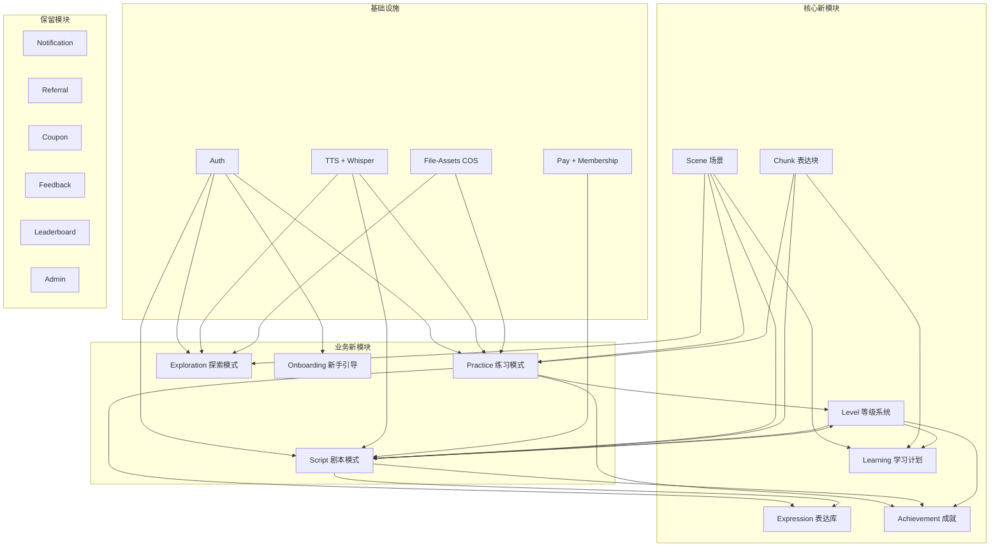

# 沉浸式英语输出训练 App — 改造技术开发文档

> 版本：V2.0 — 实施同步版  
> 日期：2026-05-26  
> 基于：GuideReady（导游说）项目改造为「沉浸式英语输出训练」App  
> 参考 PRD：`docs/english_output_app_prd_v2.md`  
> ⚠️ 本文件根据实际代码同步更新，废弃功能已删除，新功能已补充。

---

## 目录

1. [当前项目功能盘点](#1-当前项目功能盘点)
2. [功能映射：旧→新](#2-功能映射旧新)
3. [数据库改造方案](#3-数据库改造方案)
4. [后端模块改造方案](#4-后端模块改造方案)
5. [前端改造方案](#5-前端改造方案)
6. [AI Prompt 改造方案](#6-ai-prompt-改造方案)
7. [分阶段实施计划](#7-分阶段实施计划)
8. [风险与注意事项](#8-风险与注意事项)

---

## 1. 当前项目功能盘点

### 1.1 后端模块总览（28 个模块，含新增）

| # | 模块 | 核心功能 | 状态 |
|---|------|---------|------|
| 1 | **auth** | Better Auth 认证、邮箱/手机 OTP、微信/Apple 社交登录、密码找回、账号注销 | ✅ 保留 |
| 2 | **config-guide** | 省份/语言/考试类型/面试形式绑定选择（旧功能，代码仍在） | ⏸️ 未激活 |
| 3 | **question-bank** | 题库 Dashboard、话题浏览、题目 CRUD（旧功能，代码仍在） | ⏸️ 未激活 |
| 4 | **practice** | 原：导游题目练习。新增：`EnglishPracticeController` 提供英语输出练习 | ✅ 双轨运行 |
| 5 | **practice-ai** | 原：导游 AI 反馈。新增：`EnglishPracticeAiController` SSE 流式英语纠错+表达升级 | ✅ 双轨运行 |
| 6 | **tts** | MiniMax/Cartesia TTS、configHash 缓存、Whisper STT 转写 | ✅ 保留 |
| 7 | **mock-exam** | 模考试卷管理（旧功能，代码仍在） | ⏸️ 未激活 |
| 8 | **assets** | 收藏题目、生词本（含来源追踪） | ⏸️ 未激活 |
| 9 | **profile** | 用户 Dashboard、活动热力图、练习历史 | 🔄 改为 growth 页面 |
| 10 | **membership** | 三级会员（free/standard/advanced）、RevenueCat 同步 | ✅ 保留 |
| 11 | **file-assets** | COS STS 上传、SHA256 去重、引用计数、头像管理 | ✅ 保留 |
| 12 | **pay** | 支付宝/微信支付、签名验证、订单管理 | ✅ 保留 |
| 13 | **notification** | 广播/定向通知、已读状态、WebSocket (Socket.io) | ✅ 保留 |
| 14 | **resource-library** | 层级资源树、地区筛选、多内容类型 | ⏸️ 未激活 |
| 15 | **coupon** | 优惠券（百分比/固定/免费试用）、校验、使用限制 | ✅ 保留 |
| 16 | **referral** | 推荐码、奖励追踪 | ✅ 保留 |
| 17 | **achievement** | V1 成就 + V2 成就引擎（事件驱动+里程碑+隐藏成就） | ✅ 改造完成 |
| 18 | **feedback** | 反馈提交、状态追踪、管理员回复 | ✅ 保留 |
| 19 | **admin** | 用户管理、收入统计、系统配置、数据分析 + 新管理页（场景/Chunk/剧本/角色/地图/成就） | ✅ 改造完成 |
| 20 | **leaderboard** | 练习排行、模考排行、连续打卡排行 | ✅ 保留 |
| 21 | **scene** 🆕 | 场景分类 CRUD、场景详情（含词汇/Chunk/训练话题）、用户准备度 | ✅ 新建 |
| 22 | **chunk** 🆕 | Chunk 表达块 CRUD、用户掌握度状态机（激活→跟读→输出→掌握） | ✅ 新建 |
| 23 | **script** 🆕 | 剧本关卡 CRUD、章节分组、Ink 脚本关联、AI 任务判断（`ScriptJudgeService`）、对话记录 | ✅ 新建 |
| 24 | **expression** 🆕 | 表达库 CRUD + 间隔复习 | ✅ 新建 |
| 25 | **level** 🆕 | 用户等级（XP 计算）+ 输出等级评估（L1-L5）+ 场景准备度计算 | ✅ 新建 |
| 26 | **onboarding** 🆕 | 新手引导—目标选择/能力自评/诊断结果 | ✅ 新建 |
| 27 | **exploration** 🆕 | 探索模式：地图→地点→NPC→Ink 剧本→游戏存档→自由对话 | ✅ 新建 |
| 28 | **learning** 🆕 | 学习计划—教材目录树→学习单元→今日任务 | ✅ 新建 |

### 1.2 前端功能总览（已实现）

| # | 功能域 | 页面/组件 | 状态 |
|---|--------|----------|------|
| 1 | **auth** | 登录、注册、忘记密码 | ✅ 保留 |
| 2 | **question-bank** | 首页改为 `EnglishHomePage`，展示训练摘要/等级/进度/快速入口 | ✅ 改造完成 |
| 3 | **practice** | `PracticeHubPage` (话题选择) + `PracticeSessionPage` (录音/纠错/升级/复述) | ✅ 重写完成 |
| 4 | **mock-exam** | 旧模考页面保留未修改 | ⏸️ 未激活 |
| 5 | **profile** | 个人中心页面 | ✅ 保留 |
| 6 | **account** | 社交账号绑定管理 | ✅ 保留 |
| 7 | **expression** 🆕 | `ExpressionLibraryPage` — 表达库（错句/Chunk/升级表达/场景分类） | ✅ 新建 |
| 8 | **achievement** | `AchievementHallPage` — 成就殿堂（徽章网格+稀有度配色+进度条+隐藏成就） | ✅ 改造完成 |
| 9 | **leaderboard** | 排行榜 | ✅ 保留 |
| 10 | **membership** | 会员计划、支付 | ✅ 保留 |
| 11 | **notification** | 通知列表、详情 | ✅ 保留 |
| 12 | **feedback** | 反馈提交 | ✅ 保留 |
| 13 | **referral** | 邀请好友 | ✅ 保留 |
| 14 | **admin** | 管理后台（16 子页面：用户/会员/账单/通知/优惠券/反馈/设置/分析 + 场景/Chunk/剧本/角色/地图/成就/故事/NQTR） | ✅ 改造完成 |
| 15 | **portal** | 落地页/引导页 | ✅ 保留 |
| 16 | **system** | 法律条款（9 个页面） | ✅ 保留 |
| 17 | **file-assets** | 头像上传 | ✅ 保留 |
| 18 | **coupon** | 优惠券 | ✅ 保留 |
| 19 | **script** 🆕 | `ScriptHubPage` (章节列表+关卡卡片) + `ScriptPlayPage` (VN 引擎对话) | ✅ 新建 |
| 20 | **explore** 🆕 | `ExploreMapPage` (React 可点击地图) + `ExploreLocationPage` (VN 引擎对话) | ✅ 新建 |
| 21 | **growth** 🆕 | `GrowthPage` — 等级/熟练度/统计/常错/推荐路径 | ✅ 新建 |
| 22 | **learning** 🆕 | `LearningPlanPage` (教材→学习单元) + `LearningUnitPage` (单元详情) + `TodayTaskPage` | ✅ 新建 |
| 23 | **onboarding** 🆕 | `OnboardingLayout` → `GoalsSelectionPage` + `AbilitySelectionPage` | ✅ 新建 |
| 24 | **vn-engine** 🆕 | `VnPlayer` + `InkEngine` + `DialogueBox` + 分支选择 + PIXI.js 渲染 | ✅ 新建 |

### 1.3 现有外部集成

| 服务 | 用途 | 改造结论 |
|------|------|---------|
| **DeepSeek API** | AI 反馈流式生成 | 🔄 重写 Prompt |
| **MiniMax / Cartesia** | TTS 语音合成 | ✅ 保留 |
| **Whisper API** | 语音转文字 | ✅ 保留 |
| **腾讯云 COS** | 对象存储 | ✅ 保留 |
| **支付宝 / 微信支付** | 支付 | ✅ 保留 |
| **RevenueCat** | 跨端会员同步 | ✅ 保留 |
| **Socket.io** | 实时通知 | ✅ 保留 |

---

## 2. 功能映射：旧→新

### 2.1 核心概念映射

| GuideReady 概念 | → | 英语输出训练概念 | 说明 |
|:---|:---:|:---|:---|
| 题库 (QuestionBank) | → | **场景分类 (SceneCategory)** | 省份→场景领域（留学生活/旅行/职场等） |
| 话题 (QuestionTopic) | → | **场景 (Scene)** | 考试话题→生活场景（机场、宿舍、课堂等） |
| 题目 (QuestionItem) | → | **训练话题 (TrainingTopic)** | 考试题→英语输出话题 |
| - | → | **Chunk（新增）** | 核心表达块，全新概念 |
| 生词 (VocabularyWord) | → | **表达库条目 (ExpressionItem)** | 扩展后的个人表达资产 |
| 模考试卷 (MockPaper) | → | **剧本关卡 (ScriptEpisode)** | 试卷→剧情关卡 |
| 模考记录 (MockExamRecord) | → | **剧本通关记录 (ScriptRecord)** | 考试成绩→通关评价 |
| 成就 (Achievement) | → | **等级配套成就系统 (Achievement v2)** | 徽章→里程碑+稀有度+隐藏成就，与等级互补 |
| 掌握度 (masteryScore) | → | **场景准备度 (SceneReadiness)** | 单题掌握→场景综合准备度 |
| 资源配置 (ConfigBind) | → | **用户目标/能力 (UserProfile)** | 考试配置→学习目标+输出等级 |

### 2.2 保留不变的功能模块

以下模块与英语输出训练 App 需求**高度契合**，无需架构级改造，仅需微调：

| 模块 | 保留原因 | 微调项 |
|------|---------|--------|
| **Auth** | 认证体系完全适用 | 无需改动 |
| **TTS + Whisper** | 语音合成和转写是核心能力 | 无需改动 |
| **File-Assets (COS)** | 对象存储适用 | 无需改动 |
| **Membership + Pay** | 会员+支付体系适用 | 新增「剧本包」SKU |
| **Notification** | 通知推送适用 | 无需改动 |
| **Referral** | 推荐系统适用 | 无需改动 |
| **Coupon** | 优惠券适用 | 无需改动 |
| **Feedback** | 用户反馈适用 | 无需改动 |
| **Leaderboard** | 排行榜适用 | 排名维度调整 |
| **Admin** | 管理后台框架适用 | 已扩展新管理页 |

### 2.3 旧导游考试模块状态

以下旧模块代码仍在但前端路由不再使用，功能处于休眠状态，可后续清理：

| 模块 | 当前状态 | 说明 |
|------|---------|------|
| **config-guide** | ⏸️ 未激活 | 代码保留，前端无入口 |
| **resource-library** | ⏸️ 未激活 | 代码保留，前端无入口 |
| **question-bank** | ⏸️ 未激活 | 旧题库表保留，前端首页已替换为 `EnglishHomePage` |
| **mock-exam** | ⏸️ 未激活 | 旧模考页面保留，前端无入口 |

---

## 3. 数据库改造方案

### 3.1 数据模型变更总览

```
保留表（不改）: User, Session, Account, Verification, UserPreference, SystemConfig
保留表（不改）: MembershipPlan, UserMembership, Order, Coupon, Payment
保留表（不改）: Notification, NotificationTarget, NotificationRead
保留表（不改）: FileAsset, FileReference, Achievement（部分）, ReferralCode
保留表（不改）: Feedback, Leaderboard 相关

废弃表: QuestionBank, QuestionTopic, QuestionItem, QuestionContent, QuestionAudio
废弃表: UserBindingConfig, MockPaper, MockPaperQuestion, MockExamRecord
废弃表: ResourceNode

改造表: PracticeRecord, PracticeProgress, DailyActivity,
        FavoriteQuestion, VocabularyWord, Achievement

新增表: 见下方 3.2 节
```

### 3.2 新增数据模型

#### 3.2.1 用户画像扩展

```prisma
// 扩展 User 表字段
model User {
  // ... 现有字段保持不变 ...
  
  // 新增：学习目标（多选，JSON 数组）
  learningGoals        String[]           @default([])  // ["留学生活", "旅行英语", "职场交流"]
  
  // 新增：输出能力等级
  outputLevel          String             @default("L1") // L1-L5
  outputLevelDetail    Json?              // { answerLength, grammarAccuracy, chunkUsage, logicComplete, naturalness, fluency, retellAbility }
  
  // 新增：用户总等级（替代 achievement 的单一 XP 计算）
  totalXp              Int                @default(0)
  userLevel            Int                @default(1)
  
  // 关联
  sceneProgresses      UserSceneProgress[]
  chunkProgresses      UserChunkProgress[]
  expressionItems      ExpressionItem[]
  scriptRecords        ScriptRecord[]
  scriptDialogues      ScriptDialogue[]
  explorationRecords   ExplorationRecord[]
  onboardingStatus     OnboardingStatus?
}
```

#### 3.2.2 场景系统

```prisma
// 场景分类
model SceneCategory {
  id            String    @id @default(cuid())
  name          String    // 留学生活 / 旅行英语 / 职场交流 / 日常社交 / 学术挑战
  icon          String?
  sortOrder     Int       @default(0)
  scenes        Scene[]
  createdAt     DateTime  @default(now())
  
  @@map("scene_category")
}

// 场景
model Scene {
  id                  String        @id @default(cuid())
  category            SceneCategory @relation(fields: [categoryId], references: [id])
  categoryId          String
  title               String        // 宿舍 Check-in / 机场入境 / 咖啡店点餐
  location            String        // 宿舍前台 / 机场入境大厅 / 咖啡店
  description         String?
  
  // 难度要求
  requiredOutputLevel String        @default("L1")  // L1-L5
  requiredUserLevel   Int           @default(1)
  
  // 关联
  prerequisiteScenes  ScenePrerequisite[]  @relation("Scene")
  vocabularies        SceneVocabulary[]
  chunks              Chunk[]
  trainingTopics      TrainingTopic[]
  scriptEpisodes      ScriptEpisode[]
  userProgresses      UserSceneProgress[]
  
  createdAt           DateTime      @default(now())
  
  @@map("scene")
}

// 场景前置依赖（多对多）
model ScenePrerequisite {
  id              String  @id @default(cuid())
  scene           Scene   @relation("Scene", fields: [sceneId], references: [id])
  sceneId         String
  prerequisite    Scene   @relation("Prerequisite", fields: [prerequisiteId], references: [id])
  prerequisiteId  String
  
  @@unique([sceneId, prerequisiteId])
  @@map("scene_prerequisite")
}
```

#### 3.2.3 Chunk 系统

```prisma
// Chunk（表达块）
model Chunk {
  id              String    @id @default(cuid())
  text            String    // "I'm here to check in."
  meaning         String    // "我是来办理入住的。"
  category        String    // 宿舍入住 / 自我介绍 / 问路
  difficulty      String    @default("L2")  // L1-L5
  example         String?   // 完整例句
  
  // 关联场景
  scene           Scene?    @relation(fields: [sceneId], references: [id])
  sceneId         String?
  applicableSceneIds String[] // 可跨场景使用的场景 ID 列表
  
  // 关联（用户掌握进度）
  userProgresses  UserChunkProgress[]
  
  createdAt       DateTime  @default(now())
  
  @@index([sceneId])
  @@index([difficulty])
  @@map("chunk")
}

// 场景词汇
model SceneVocabulary {
  id        String  @id @default(cuid())
  scene     Scene   @relation(fields: [sceneId], references: [id])
  sceneId   String
  word      String  // "dormitory"
  meaning   String  // "宿舍"
  sortOrder Int     @default(0)
  
  @@index([sceneId])
  @@map("scene_vocabulary")
}
```

#### 3.2.4 用户 Chunk 掌握度

```prisma
enum ChunkMasteryStatus {
  not_learned   // 未学习
  activated     // 已激活（看过）
  can_read      // 能跟读
  can_output    // 能输出（在回答中主动使用）
  mastered      // 已掌握（2-3 个不同场景复用）
}

model UserChunkProgress {
  id              String             @id @default(cuid())
  user            User               @relation(fields: [userId], references: [id], onDelete: Cascade)
  userId          String
  chunk           Chunk              @relation(fields: [chunkId], references: [id])
  chunkId         String
  status          ChunkMasteryStatus @default(not_learned)
  seenCount       Int                @default(0)
  spokenCount     Int                @default(0)
  correctUseCount Int                @default(0)
  usedSceneIds    String[]           @default([])  // 在哪些场景中使用过
  lastPracticedAt DateTime?
  updatedAt       DateTime           @updatedAt
  
  @@unique([userId, chunkId])
  @@map("user_chunk_progress")
}
```

#### 3.2.5 训练话题

```prisma
// 练习模式训练话题（替代原 QuestionItem）
model TrainingTopic {
  id                   String    @id @default(cuid())
  scene                Scene     @relation(fields: [sceneId], references: [id])
  sceneId              String
  title                String    // 话题标题
  promptEn             String    @db.Text  // 英文提示/问题
  promptZh             String    @db.Text  // 中文提示
  suggestedDurationSec Int       @default(60)  // 建议回答时长（秒）
  difficulty           String    @default("L2")  // L1-L5
  
  // 关联 Chunk（本话题激活的表达块）
  activeChunks         Chunk[]
  // 句型骨架
  sentenceSkeleton     String?   @db.Text  // "I'm from ___. It's a ___ city in ___."
  
  sortOrder            Int       @default(0)
  
  // 用户练习记录
  practiceRecords      PracticeRecord[]
  practiceProgresses   PracticeProgress[]
  
  createdAt            DateTime  @default(now())
  
  @@index([sceneId, difficulty])
  @@map("training_topic")
}
```

#### 3.2.6 剧本系统

```prisma
// 剧本关卡
model ScriptEpisode {
  id                  String    @id @default(cuid())
  chapterId           String    // "chapter_1"
  chapterTitle        String    // "初到国外"
  episodeOrder        Int       // 章节内排序
  title               String    // "宿舍 Check-in"
  
  // 关联场景
  scene               Scene     @relation(fields: [sceneId], references: [id])
  sceneId             String
  
  // 解锁要求
  requiredOutputLevel String    @default("L2")
  requiredUserLevel   Int       @default(1)
  vocabRequiredCount  Int       @default(6)   // 需掌握词汇数
  vocabTotalCount     Int       @default(10)
  chunkRequiredCount  Int       @default(6)   // 需掌握 Chunk 数
  chunkTotalCount     Int       @default(10)
  prerequisiteEpisodes String[] @default([])  // 前置关卡 ID
  
  // 任务目标
  objectives          String[]  // ["说明自己来办理入住", "提供姓名和学生证", ...]
  
  // 通关条件
  passObjectiveCount  Int       @default(3)   // 至少完成 N 个目标
  passChunkCount      Int       @default(3)   // 至少使用 N 个核心 Chunk
  passRetellRequired  Boolean   @default(true) // 是否需要复述
  passMinDialogues    Int       @default(3)   // 最少对话轮数
  
  // 奖励
  rewards             Json?     // { "unlockScenes": [], "unlockNpc": "alex", "xp": 30, "sceneMasteryBonus": 15 }
  
  // NPC 配置（Ink 驱动模式）
  npcName             String    // "Alex（室友）"
  npcRole             String    // "室友，大一新生，友好健谈"
  npcPersonality      String?   // NPC 性格描述（Ink 脚本外的 AI fallback 用）
  
  // 🆕 Ink 叙事脚本（剧本模式的对话由 Ink 驱动，不是 AI 生成）
  inkScriptId         String?   // 关联的 InkScript.id — 剧本对话的权威来源
  // Ink 脚本中通过外部函数回调触发：任务目标检测、Chunk 使用统计等
  
  // 核心内容
  coreVocabularies    SceneVocabulary[]
  coreChunks          Chunk[]
  
  // 对话记录
  dialogues           ScriptDialogue[]
  records             ScriptRecord[]
  
  isPreview           Boolean   @default(false)  // Chapter 0 体验关
  createdAt           DateTime  @default(now())
  
  @@index([chapterId, episodeOrder])
  @@map("script_episode")
}

// 剧本对话记录（每轮对话）
model ScriptDialogue {
  id            String    @id @default(cuid())
  episode       ScriptEpisode @relation(fields: [episodeId], references: [id])
  episodeId     String
  user          User      @relation(fields: [userId], references: [id], onDelete: Cascade)
  userId        String
  round         Int       // 第几轮对话
  
  npcText       String    @db.Text  // NPC 说的话
  userAudioUrl  String?   // 用户录音 URL
  userText      String?   @db.Text  // 用户转写文本
  
  // AI 判断
  isOnTopic     Boolean?  // 是否切题
  objectiveCompleted String[] @default([]) // 完成了哪些目标
  chunksUsed    String[]  @default([]) // 使用了哪些 Chunk
  grammarIssues Json?     // [{ type, original, correction }]
  needsFollowUp Boolean   @default(false) // NPC 是否需要追问
  
  createdAt     DateTime  @default(now())
  
  @@index([episodeId, userId, round])
  @@map("script_dialogue")
}

// 剧本通关记录
model ScriptRecord {
  id              String    @id @default(cuid())
  user            User      @relation(fields: [userId], references: [id], onDelete: Cascade)
  userId          String
  episode         ScriptEpisode @relation(fields: [episodeId], references: [id])
  episodeId       String
  
  passed          Boolean   @default(false)
  objectivesDone  Int       @default(0)   // 完成目标数
  chunksUsed      Int       @default(0)   // 使用 Chunk 数
  dialogueRounds  Int       @default(0)   // 对话轮数
  retellCompleted Boolean   @default(false)
  
  // AI 综合评价
  aiFeedback      Json?     // { score, strengths, improvements, upgradedExpressions }
  
  xpEarned        Int       @default(0)
  completedAt     DateTime? 
  createdAt       DateTime  @default(now())
  
  @@unique([userId, episodeId])
  @@index([userId, createdAt(sort: Desc)])
  @@map("script_record")
}
```

#### 3.2.7 探索模式 — 视觉小说架构

探索模式采用 **inkjs（叙事引擎）+ PIXI.js（渲染层）** 的架构，参考 Ren'Py / PixiVN 的视觉小说风格。

```prisma
// 游戏角色（带立绘表情系统）
model GameCharacter {
  id            String    @id @default(cuid())
  name          String    // "Alex"
  displayName   String    // "室友 Alex"
  role          String    // "室友，大一新生，友好健谈"
  personality   String?   // AI 对话角色描述（自由对话模式使用）

  // 视觉资源
  avatarUrl     String?   // 头像（列表/地图显示用）
  spriteBaseUrl String?   // 基础立绘 URL（PIXI.Sprite 加载）
  expressions   Json?     // [{ key: "happy", url: "..." }, { key: "surprised", url: "..." }]

  // 立绘位置（视觉小说对话场景）
  defaultPosition String? // "left" | "center" | "right"

  locationNpcs  GameLocationNpc[]

  createdAt     DateTime  @default(now())

  @@map("game_character")
}

// 游戏地图
model GameMap {
  id            String    @id @default(cuid())
  name          String    // "大学校园" / "宿舍区"
  displayName   String    // "校园地图"

  // 视觉资源
  backgroundUrl String?   // 地图背景图（PIXI 渲染用）
  thumbnailUrl  String?   // 缩略图（列表展示用）
  width         Int       @default(1920)
  height        Int       @default(1080)

  locations     GameLocation[]

  // 解锁条件
  requiredOutputLevel String @default("L1")
  requiredChapterId    String?  // 需通关的章节

  isPreview     Boolean   @default(false)
  sortOrder     Int       @default(0)

  createdAt     DateTime  @default(now())

  @@map("game_map")
}

// 地图上的地点（可点击进入）
model GameLocation {
  id            String    @id @default(cuid())
  map           GameMap   @relation(fields: [mapId], references: [id])
  mapId         String
  name          String    // "宿舍大厅"
  displayName   String    // "🏠 宿舍大厅"
  description   String?   // "你住的地方，室友 Alex 经常在这里。"

  // 地图坐标
  posX          Float     @default(0)
  posY          Float     @default(0)
  icon          String?   // 地图标记图标

  // 进入后的视觉小说场景
  backgroundUrl String?   // 地点背景图（PIXI 渲染）
  bgmUrl        String?   // 背景音乐（可选）
  ambientUrl    String?   // 环境音效（可选）

  // 场景类型
  locationType  String    @default("vn_scene")  // "vn_scene" | "dialogue_hub" | "transition"

  // 关联的内容
  sceneId       String?   // 关联的 Scene（英语学习场景）
  inkScriptId   String?   // 关联的 Ink 叙事脚本（进入后自动播放）
  npcs          GameLocationNpc[]  // 此地点的 NPC

  // 可前往的相邻地点（地图移动）
  exits         GameLocationExit[]  @relation("FromLocation")

  // 解锁条件
  requiredOutputLevel String   @default("L1")
  requiredSceneIds     String[] @default([])
  requiredFlags        Json?    // 需要的游戏旗标 { "met_alex": true }

  isPreview     Boolean   @default(false)
  sortOrder     Int       @default(0)

  createdAt     DateTime  @default(now())

  @@map("game_location")
}

// 地点出口（地图导航）
model GameLocationExit {
  id            String       @id @default(cuid())
  from          GameLocation @relation("FromLocation", fields: [fromId], references: [id])
  fromId        String
  to            GameLocation @relation("ToLocation", fields: [toId], references: [id])
  toId          String
  label         String       // "去校园咖啡店 →"
  requiredFlags Json?        // 可能需要旗标才能通行

  @@unique([fromId, toId])
  @@map("game_location_exit")
}

// 地点-NPC 关联（哪些 NPC 出现在哪些地点）
model GameLocationNpc {
  id            String        @id @default(cuid())
  location      GameLocation  @relation(fields: [locationId], references: [id])
  locationId    String
  character     GameCharacter @relation(fields: [characterId], references: [id])
  characterId   String

  // NPC 在该地点的行为
  schedule      Json?         // [{ "dayOfWeek": 1, "startHour": 9, "endHour": 17 }]
  defaultGreeting String?     // "Hey! How's it going?"

  // 对话内容
  inkTalkScriptId String?     // 点击 NPC 触发的 Ink 自由对话脚本
  // 如果为空，则走 AI 自由对话模式

  sortOrder     Int           @default(0)

  @@unique([locationId, characterId])
  @@map("game_location_npc")
}
```

#### 3.2.8 Ink 叙事脚本 & 游戏存档

```prisma
// Ink 叙事脚本（剧本模式 & 探索模式共用）
model InkScript {
  id            String    @id @default(cuid())
  key           String    @unique   // "chapter_1_ep3_dorm_checkin" | "explore_cafe_alex_talk"
  title         String
  scriptType    String    @default("episode")  // "episode" | "side_quest" | "free_talk" | "cutscene"

  // Ink 编译产物
  inkJson       Json      // Ink Compiler 编译后的 JSON（inkjs.Story 可直接加载）
  inkSource     String?   @db.Text  // 原始 Ink 源码（可选，调试/编辑用）

  // 关联
  episodeId     String?   // 关联的 ScriptEpisode（剧本模式主线）
  locationId    String?   // 关联的 GameLocation（探索模式地点脚本）
  characterId   String?   // 关联的 GameCharacter（NPC 对话脚本）

  // 脚本中使用的变量声明（供后台了解有哪些游戏旗标）
  declaredVariables Json?  // ["met_alex", "helped_librarian", "romance_points"]

  // 版本管理
  version       Int       @default(1)
  changelog     String?

  createdAt     DateTime  @default(now())
  updatedAt     DateTime  @updatedAt

  @@index([scriptType])
  @@index([episodeId])
  @@index([locationId])
  @@map("ink_script")
}

// 游戏存档（Ink 状态持久化）
model GameSave {
  id            String   @id @default(cuid())
  user          User     @relation(fields: [userId], references: [id], onDelete: Cascade)
  userId        String

  // Ink 引擎状态（inkjs 的 state.toJson()）
  inkState      Json?    // 包含：当前 knot/stitch 位置、所有变量值、访问计数等

  // 游戏世界状态
  currentMapId  String?
  currentLocationId String?
  visitedLocationIds String[] @default([])
  flags         Json?    // 游戏旗标快照 { "met_alex": true, "got_key": false, "day": 3 }

  // 存档元数据
  saveName      String   @default("自动存档")
  playTimeSeconds Int    @default(0)
  slot          Int      @default(1)  // 存档槽位 1-5

  updatedAt     DateTime @updatedAt
  createdAt     DateTime @default(now())

  @@unique([userId, slot])
  @@index([userId, updatedAt(sort: Desc)])
  @@map("game_save")
}

// 探索对话记录（自由对话模式，非 Ink 驱动的场景）
model ExplorationRecord {
  id          String    @id @default(cuid())
  user        User      @relation(fields: [userId], references: [id], onDelete: Cascade)
  userId      String
  character   GameCharacter @relation(fields: [characterId], references: [id])
  characterId String
  location    GameLocation @relation(fields: [locationId], references: [id])
  locationId  String

  userText    String    @db.Text  // 用户转写文本
  npcReply    String?   @db.Text  // AI 或 Ink 生成的 NPC 回复
  feedback    Json?     // AI 纠错反馈（自由对话模式）

  // 是否由 Ink 脚本驱动
  isInkDriven Boolean   @default(false)
  inkKnotName String?   // 所处的 Ink knot

  createdAt   DateTime  @default(now())

  @@index([userId, createdAt(sort: Desc)])
  @@map("exploration_record")
}
```

#### 3.2.8 表达库 & 复习系统

```prisma
// 表达库条目（扩展自原 VocabularyWord）
enum ExpressionType {
  chunk          // 学过的 Chunk
  error_sentence // 说错的句子
  upgraded       // 升级后的表达
  scene_phrase   // 场景短语
  custom         // 用户自建
}

model ExpressionItem {
  id            String         @id @default(cuid())
  user          User           @relation(fields: [userId], references: [id], onDelete: Cascade)
  userId        String
  type          ExpressionType @default(chunk)
  
  original      String?        @db.Text  // 用户原始错句（error_sentence 类型）
  corrected     String?        @db.Text  // AI 纠正/升级后的句子
  chunkText     String?        // 关联 Chunk 的文本（chunk 类型）
  sceneName     String?        // 来源场景
  
  masteryStatus String         @default("activated")  // activated / can_read / can_output / mastered
  reviewCount   Int            @default(0)
  lastReviewedAt DateTime?
  nextReviewAt  DateTime?      // 下次复习时间（间隔重复）
  
  createdAt     DateTime       @default(now())
  
  @@index([userId, type])
  @@index([userId, nextReviewAt])
  @@map("expression_item")
}
```

#### 3.2.9 用户场景熟练度 & 准备度

```prisma
model UserSceneProgress {
  id                    String   @id @default(cuid())
  user                  User     @relation(fields: [userId], references: [id], onDelete: Cascade)
  userId                String
  scene                 Scene    @relation(fields: [sceneId], references: [id])
  sceneId               String
  
  // 准备度
  readiness             Int      @default(0)  // 0-100
  mastery               Int      @default(0)  // 0-100 场景熟练度
  
  // 各维度进度
  vocabLearned          Int      @default(0)
  vocabTotal            Int      @default(0)
  chunkMastered         Int      @default(0)
  chunkTotal            Int      @default(0)
  
  completedPracticeCount Int     @default(0)
  completedScriptCount   Int     @default(0)
  prerequisiteCompleted  Boolean @default(false)
  
  updatedAt             DateTime @updatedAt
  
  @@unique([userId, sceneId])
  @@map("user_scene_progress")
}
```

#### 3.2.10 新手引导

```prisma
model OnboardingStatus {
  id              String   @id @default(cuid())
  user            User     @relation(fields: [userId], references: [id], onDelete: Cascade)
  userId          String   @unique
  
  goalsSelected   Boolean  @default(false)  // 是否已选择学习目标
  abilitySelected Boolean  @default(false)  // 是否已自评能力
  diagnosticDone  Boolean  @default(false)  // 是否完成口语诊断
  tutorialDone    Boolean  @default(false)  // 是否完成新手剧情
  
  diagnosticResult Json?   // 诊断报告
  createdAt       DateTime @default(now())
  
  @@map("onboarding_status")
}
```

#### 3.2.11 等级配套成就系统

```prisma
// 成就定义表（替代原 Achievement 表，更丰富的元数据）
enum AchievementCategory {
  milestone       // 里程碑（等级/数量达到某个值）
  streak          // 连续打卡
  challenge       // 挑战类（一次性特殊成就）
  mastery         // 掌握类（Chunk/场景熟练度）
  hidden          // 隐藏成就（触发条件不公开）
  first_time      // 首次体验
}

enum AchievementRarity {
  common          // 普通 — 灰色
  rare            // 稀有 — 蓝色
  epic            // 史诗 — 紫色
  legendary       // 传说 — 金色
}

model AchievementDef {
  id              String             @id @default(cuid())
  key             String             @unique   // "first_recording", "chunk_master_50", "streak_30"
  title           String             // "初次开口" / "表达达人" / "铁嘴铜牙"
  description     String             // "完成第一次录音回答"
  category        AchievementCategory @default(milestone)
  rarity          AchievementRarity   @default(common)
  icon            String?            // 图标标识（lucide icon name 或 emoji）
  
  // 解锁条件（JSON，由成就引擎解析）
  condition       Json               // { "type": "recording_count", "threshold": 1 }
  // 或：{ "type": "chunk_mastered", "threshold": 50 }
  // 或：{ "type": "output_level", "threshold": "L3" }
  // 或：{ "type": "streak_days", "threshold": 30 }
  // 或：{ "type": "scene_mastery", "sceneId": "...", "threshold": 80 }
  // 或：{ "type": "script_completed", "chapterId": "chapter_1" }
  // 或：{ "type": "xp_total", "threshold": 1000 }
  // 或：{ "type": "combo", "actions": ["recording", "retell", "chunk_output"], "withinMinutes": 30 }
  
  // 奖励（可选）
  rewardXp        Int                @default(0)
  rewardTitle     String?            // 解锁称号
  
  // 显示控制
  sortOrder       Int                @default(0)
  isHidden        Boolean            @default(false)  // 隐藏成就（条件不公开）
  hintText        String?            // 隐藏成就的模糊提示
  
  createdAt       DateTime           @default(now())
  
  userAchievements UserAchievement[]
  
  @@map("achievement_def")
}

// 用户成就记录
enum UserAchievementStatus {
  locked          // 未解锁
  unlocked        // 已解锁（未查看）
  seen            // 已查看
}

model UserAchievement {
  id              String                @id @default(cuid())
  user            User                  @relation(fields: [userId], references: [id], onDelete: Cascade)
  userId          String
  achievement     AchievementDef        @relation(fields: [achievementId], references: [id])
  achievementId   String
  
  status          UserAchievementStatus @default(locked)
  progress        Int                   @default(0)   // 当前进度（如 12/50 chunks）
  progressTarget  Int                   @default(0)   // 目标值
  
  unlockedAt      DateTime?
  seenAt          DateTime?
  createdAt       DateTime              @default(now())
  
  @@unique([userId, achievementId])
  @@index([userId, status])
  @@map("user_achievement")
}
```

**成就示例清单：**

| key | 名称 | 类别 | 稀有度 | 条件 |
|-----|------|------|--------|------|
| `first_recording` | 初次开口 | first_time | common | 完成第 1 次录音回答 |
| `first_script_clear` | 初出茅庐 | first_time | common | 通关第 1 个剧本关卡 |
| `first_retell` | 过目不忘 | first_time | common | 完成第 1 次遮挡复述 |
| `recording_10` | 开口十次 | milestone | common | 累计 10 次录音回答 |
| `recording_50` | 话筒常客 | milestone | rare | 累计 50 次录音回答 |
| `recording_100` | 百口莫辩 | milestone | epic | 累计 100 次录音回答 |
| `recording_500` | 话痨之王 | milestone | legendary | 累计 500 次录音回答 |
| `chunk_learn_20` | 表达学徒 | milestone | common | 掌握 20 个 Chunk（can_output 以上） |
| `chunk_learn_50` | 表达达人 | milestone | rare | 掌握 50 个 Chunk |
| `chunk_learn_100` | 表达大师 | milestone | epic | 掌握 100 个 Chunk |
| `chunk_learn_300` | 活字典 | milestone | legendary | 掌握 300 个 Chunk |
| `streak_7` | 七日之约 | streak | rare | 连续打卡 7 天 |
| `streak_30` | 铁嘴铜牙 | streak | epic | 连续打卡 30 天 |
| `streak_100` | 百日维新 | streak | legendary | 连续打卡 100 天 |
| `level_l3` | 能说完整 | mastery | rare | 输出等级达到 L3 |
| `level_l5` | 出口成章 | mastery | legendary | 输出等级达到 L5 |
| `scene_dorm_80` | 宿舍万事通 | mastery | rare | 宿舍入住场景熟练度 ≥ 80% |
| `scene_campus_all` | 校园达人 | mastery | epic | 校园生活全部场景熟练度 ≥ 70% |
| `chapter_1_all` | 留学生存者 | challenge | epic | 通关 Chapter 1 全部关卡 |
| `chapter_2_all` | 校园探险家 | challenge | epic | 通关 Chapter 2 全部关卡 |
| `perfect_script` | 完美通关 | challenge | legendary | 某关卡 100% 目标完成 + 全部 Chunk 使用 |
| `one_take` | 一遍过 | challenge | epic | 连续通关 3 个剧本关卡无失败 |
| `retell_master` | 复述神童 | challenge | rare | 连续 10 次复述一次通过 |
| `hidden_polite` | 彬彬有礼 | hidden | rare | 在对话中自然使用 5 种不同礼貌表达 |
| `hidden_helpful` | 乐于助人 | hidden | rare | 在探索模式中帮助 3 个不同 NPC |
| `hidden_night_owl` | 夜猫子 | hidden | epic | 在凌晨 0:00-5:00 完成一次练习 |

### 3.3 数据库迁移策略（已执行）

采用**渐进式迁移**，不轻易删表：

| 阶段 | 操作 | 状态 |
|------|------|------|
| Phase 0 | 新增所有新表，旧表保留不动 | ✅ 已完成（3 个迁移文件） |
| Phase 1 | 新功能使用新表运行，旧功能仍可回退 | ✅ 已完成 |
| Phase 2 | 数据迁移：VocabularyWord / Achievement 保留，新表使用新种子数据 | ✅ 已完成 |
| Phase 3 | 废弃旧表加 `_deprecated` 后缀 | ⏳ 待执行（不影响功能） |

**已执行的迁移命令：**
```bash
cd apps/backend
pnpm prisma:migrate --name init                # 初始表结构
pnpm prisma:migrate --name content_authoring_upgrade  # 内容创作升级
pnpm prisma:migrate --name drop_chunk_example_column   # 删除多余列
pnpm prisma:seed   # 英语输出种子数据（seed-english.ts）
```

---

## 4. 后端模块改造方案

### 4.1 模块变更总览

| 操作 | 模块 |
|------|------|
| **新增** | `scene` — 场景与场景分类管理 ✅ |
| **新增** | `chunk` — Chunk 表达块管理与掌握度追踪 ✅ |
| **新增** | `script` — 剧本关卡、对话、通关管理 + AI 任务判断 ✅ |
| **新增** | `exploration` — 探索模式：地图/地点/NPC/Ink 剧本/游戏存档/自由对话 ✅ |
| **新增** | `expression` — 表达库 CRUD + 间隔复习 ✅ |
| **新增** | `level` — 用户等级（XP）、输出等级（L1-L5）、场景准备度计算引擎 ✅ |
| **新增** | `onboarding` — 新手引导流程（目标/能力/诊断） ✅ |
| **新增** | `learning` — 学习计划（教材→学习单元→今日任务） ✅ |
| **扩展** | `practice` — 原 controller 保留，新增 `EnglishPracticeController` 提供英语输出练习 API ✅ |
| **扩展** | `practice-ai` — 原 controller 保留，新增 `EnglishPracticeAiController` SSE 流式纠错+表达升级 ✅ |
| **扩展** | `achievement` → 改造为 V2 成就系统（事件驱动引擎 + 里程碑/隐藏成就/稀有度） ✅ |
| **扩展** | `admin` → 新增 8 个管理页（场景/Chunk/剧本/角色/地图/成就/故事/NQTR） ✅ |
| **休眠** | `config-guide` — 代码保留，前端无入口 |
| **休眠** | `resource-library` — 代码保留，前端无入口 |
| **休眠** | `question-bank` — 旧题库表保留，前端不再使用 |
| **休眠** | `mock-exam` — 旧模考页面保留，前端无入口 |
| **不变** | `auth`, `tts`, `file-assets`, `membership`, `pay`, `notification`, `coupon`, `referral`, `feedback`, `leaderboard`, `assets`, `profile` |

### 4.2 核心新模块设计

#### 4.2.1 Scene Module（场景模块）

```
modules/scene/
├── scene.module.ts
├── scene.controller.ts
├── scene.service.ts
└── dto/
    ├── list-scenes.dto.ts
    ├── scene-detail.dto.ts
    └── scene-readiness.dto.ts
```

**API 端点：**
| 方法 | 路径 | 说明 |
|------|------|------|
| GET | `/api/v1/scenes` | 获取场景分类+场景列表 |
| GET | `/api/v1/scenes/:id` | 场景详情（含词汇、Chunk、训练话题） |
| GET | `/api/v1/scenes/:id/readiness` | 用户对该场景的准备度 |
| GET | `/api/v1/scenes/categories` | 场景分类列表 |

#### 4.2.2 Chunk Module（Chunk 模块）

```
modules/chunk/
├── chunk.module.ts
├── chunk.controller.ts
├── chunk.service.ts
└── dto/
    ├── list-chunks.dto.ts
    └── update-mastery.dto.ts
```

**API 端点：**
| 方法 | 路径 | 说明 |
|------|------|------|
| GET | `/api/v1/chunks?sceneId=` | 按场景获取 Chunk 列表 |
| GET | `/api/v1/chunks/my` | 我的 Chunk 掌握状态 |
| POST | `/api/v1/chunks/:id/activate` | 标记为「已激活」 |
| POST | `/api/v1/chunks/:id/read` | 标记为「能跟读」 |
| POST | `/api/v1/chunks/:id/output` | 标记为「能输出」（带场景 ID） |
| POST | `/api/v1/chunks/:id/master` | 标记为「已掌握」 |

#### 4.2.3 Script Module（剧本模块）

剧本模式的对话由 **Ink 叙事脚本驱动**，不是 AI 实时生成。Ink 脚本是内容的权威来源，AI 只负责**任务判断**（用户回答是否完成目标）和**纠错升级**（语法/表达优化）。

```
modules/script/
├── script.module.ts
├── script.controller.ts
├── script.service.ts              # 关卡管理（CRUD+解锁检测+准备度计算）
├── script-judge.service.ts        # AI 任务判断（是否切题? 完成哪些目标? 使用哪些 Chunk?）
└── dto/
    ├── list-episodes.dto.ts
    ├── start-episode.dto.ts
    ├── submit-dialogue.dto.ts
    └── episode-result.dto.ts
```

> ⚠️ NPC 对话由 Ink 脚本驱动，不是 AI 实时生成。AI 仅负责**任务判断**（`ScriptJudgeService`）。

**API 端点：**
| 方法 | 路径 | 说明 |
|------|------|------|
| GET | `/api/v1/script/chapters` | 获取所有章节+关卡列表（含解锁状态） |
| GET | `/api/v1/script/episodes/:id` | 关卡详情（含 Ink 脚本引用+词汇+Chunk+准备度） |
| GET | `/api/v1/script/episodes/:id/readiness` | 场景准备度 |
| GET | `/api/v1/script/episodes/:id/ink` | 获取该关卡的 Ink 编译 JSON（前端 inkjs 加载） |
| POST | `/api/v1/script/episodes/:id/judge` | **仅提交用户转写文本做任务判断**（AI，非对话生成） |
| POST | `/api/v1/script/episodes/:id/retell` | 提交复述结果 |
| POST | `/api/v1/script/episodes/:id/complete` | 关卡复盘 + 纠错升级 + 结算 |
| GET | `/api/v1/script/records` | 我的剧本通关记录 |

**核心业务流程（Ink 驱动 + AI 判断）：**

```
前端 inkjs 运行 Ink 脚本：
  Ink → Continue() → NPC 对话文本 → PIXI 渲染对话框
  Ink → 遇到选择 → 展示选项给用户
  Ink → 遇到 {user_input} 标记 → 暂停，用户录音
      ↓
  用户语音 → Whisper 转写 → 
      ↓
  前端将转写文本注入 Ink 变量 → Ink 继续运行
      ↓
  同时：POST /judge → AI 判断（切题? 完成目标? 使用 Chunk?）
      ↓
  前端根据判断结果更新 HUD（任务进度条/Chunk 使用追踪）
      ↓
  Ink 继续 → 下一段 NPC 对话...
  
  循环直到 Ink 脚本结束 → POST /complete → AI 纠错升级 → 结算
```

**Ink 脚本中的约定标记（外部函数）：**

```ink
// 剧本 Ink 脚本示例片段
=== dorm_checkin ===
# 前台 NPC
FrontDesk: Hi! Welcome to the dormitory. How can I help you?
*   [I'm here to check in] -> checkin_response
*   [I'm looking for my room] -> room_response
*   [Just looking around] -> casual_response

= checkin_response
FrontDesk: Great! Let me look up your booking.
-> wait_for_input      // ← 外部函数：暂停叙事，等待用户录音
// 用户录音 → 转写 → 注入 $user_last_input → AI 判断 → 继续

= after_input
// Ink 根据 AI 判断结果分支
{ judge_result == "on_topic":
    FrontDesk: I found your booking. Could you show me your student ID?
    -> wait_for_input
}
{ judge_result == "off_topic":
    FrontDesk: I'm sorry, I didn't quite catch that. Are you here to check in?
    -> wait_for_input
}
```

> **为什么剧本模式也用 Ink 而不是 AI 生成 NPC 对话：**
> 1. **内容可控**：剧本对话由内容团队精心编写，保证教学质量和语言难度精确匹配用户等级
> 2. **离线可用**：Ink JSON 加载后不依赖网络，对话流畅无延迟
> 3. **可测试**：Ink 脚本可以独立测试，不依赖 AI 的不确定性
> 4. **AI 用对地方**：AI 只做它擅长的事——判断用户自由回答的质量（切题/目标完成/Chunk 使用），不做 NPC 对话生成

#### 4.2.4 Expression Module（表达库模块）

```
modules/expression/
├── expression.module.ts
├── expression.controller.ts
├── expression.service.ts
└── dto/
    ├── create-expression.dto.ts
    ├── list-expressions.dto.ts
    └── review-expression.dto.ts
```

**API 端点：**
| 方法 | 路径 | 说明 |
|------|------|------|
| GET | `/api/v1/expressions` | 我的表达库（支持类型/场景筛选） |
| POST | `/api/v1/expressions` | 保存表达（来自练习/剧本） |
| DELETE | `/api/v1/expressions/:id` | 删除表达 |
| GET | `/api/v1/expressions/review` | 待复习表达列表 |
| POST | `/api/v1/expressions/:id/review` | 完成一次复习 |

#### 4.2.5 Level Module（等级系统模块）

```
modules/level/
├── level.module.ts
├── level.controller.ts
├── level.service.ts
├── xp-calculator.service.ts       # XP 计算
├── output-level.service.ts         # 输出能力等级评估
├── scene-readiness.service.ts      # 场景准备度计算
└── dto/
    └── level-overview.dto.ts
```

**等级计算引擎：**

**用户等级 (XP-based):**
| 行为 | XP |
|------|----|
| 完成一次练习 | +10 |
| 完成一次录音回答 | +5 |
| 成功复述一个 Chunk | +5 |
| 通关一个剧本关卡 | +30 |
| 连续打卡 | +20 |
| 主动使用新 Chunk | +10 |

**输出能力等级评估维度：**
- 回答时长（20s/30s/60s 阈值）
- 语法错误率
- Chunk 主动使用率
- 逻辑完整度（观点→原因→例子）
- 自然度（中式表达率）
- 流利度（停顿/重复率）
- 复述能力

**场景准备度计算权重：**
| 维度 | 权重 |
|------|------|
| 输出等级满足 | 25% |
| 核心 Chunk 掌握度 | 30% |
| 场景词汇掌握度 | 20% |
| 前置任务完成 | 15% |
| 相关录音练习 | 10% |

#### 4.2.6 Onboarding Module（新手引导模块）

```
modules/onboarding/
├── onboarding.module.ts
├── onboarding.controller.ts
├── onboarding.service.ts
└── dto/
    ├── select-goals.dto.ts
    ├── select-ability.dto.ts
    └── diagnostic-result.dto.ts
```

**API 端点：**
| 方法 | 路径 | 说明 |
|------|------|------|
| POST | `/api/v1/onboarding/goals` | 选择学习目标 |
| POST | `/api/v1/onboarding/ability` | 自评当前能力 |
| POST | `/api/v1/onboarding/diagnostic/start` | 开始 2 分钟口语诊断 |
| POST | `/api/v1/onboarding/diagnostic/submit` | 提交诊断回答 |
| GET | `/api/v1/onboarding/status` | 获取引导状态 |

#### 4.2.7 Learning Module（学习计划模块）✅ 已实现

学习计划是连接「教材」和「练习/剧本」的桥梁。用户先选择学习单元（Scene），再进入练习或剧本挑战。

```
modules/learning/
├── learning.module.ts
├── learning.controller.ts
├── learning.service.ts
└── dto/
```

**API 端点：**
| 方法 | 路径 | 说明 |
|------|------|------|
| GET | `/api/v1/learning/units` | 获取全部教材（Scene 按分类分组，含用户进度） |
| GET | `/api/v1/learning/my-units` | 用户正在学习的单元（有进度记录的） |
| GET | `/api/v1/learning/units/:id` | 学习单元详情（词汇+Chunk+训练话题+剧本关卡） |
| GET | `/api/v1/learning/today` | 今日任务 |
| POST | `/api/v1/learning/units/:id/progress` | 更新单元进度 |
| POST | `/api/v1/learning/units/:id/start` | 开始学习一个单元 |

**前端页面：**
- `LearningPlanPage` — 教材分类展示，类似 Duolingo 风格的学习路径
- `LearningUnitPage` — 学习单元详情（顺序展示：词汇→Chunk→训练话题→剧本关卡）
- `TodayTaskPage` — 今日任务汇总

#### 4.2.8 Achievement Module（成就模块 — 改造升级）✅ 已实现

现有 `achievement` 模块保留骨架，升级为等级配套成就系统。成就系统负责**庆祝里程碑**，等级系统负责**量化成长**，两者互补。

```
modules/achievement/
├── achievement.module.ts
├── achievement.controller.ts
├── achievement.service.ts
├── achievement-engine.service.ts   # 成就检测引擎（事件驱动）
└── dto/
    ├── list-achievements.dto.ts
    ├── achievement-detail.dto.ts
    └── unlock-notification.dto.ts
```

**API 端点：**
| 方法 | 路径 | 说明 |
|------|------|------|
| GET | `/api/v1/achievements` | 获取所有成就列表（含用户解锁状态） |
| GET | `/api/v1/achievements/unlocked` | 我的已解锁成就 |
| GET | `/api/v1/achievements/:id` | 成就详情（含进度） |
| POST | `/api/v1/achievements/check` | 手动触发成就检测（通常由事件自动触发） |
| POST | `/api/v1/achievements/:id/seen` | 标记为已查看 |

**成就检测引擎设计：**

采用**事件驱动**模式，在关键用户行为发生后自动检测成就：

```typescript
// achievement-engine.service.ts 核心逻辑
@Injectable()
export class AchievementEngineService {
  // 事件 → 成就映射
  private readonly eventChecks: Record<string, AchievementCheck[]> = {
    'recording.completed': [
      { achievementKey: 'first_recording', type: 'count', threshold: 1 },
      { achievementKey: 'recording_10', type: 'count', threshold: 10 },
      { achievementKey: 'recording_50', type: 'count', threshold: 50 },
      { achievementKey: 'recording_100', type: 'count', threshold: 100 },
      { achievementKey: 'recording_500', type: 'count', threshold: 500 },
    ],
    'chunk.mastered': [
      { achievementKey: 'chunk_learn_20', type: 'count', threshold: 20 },
      { achievementKey: 'chunk_learn_50', type: 'count', threshold: 50 },
      { achievementKey: 'chunk_learn_100', type: 'count', threshold: 100 },
      { achievementKey: 'chunk_learn_300', type: 'count', threshold: 300 },
    ],
    'script.completed': [
      { achievementKey: 'first_script_clear', type: 'count', threshold: 1 },
      { achievementKey: 'chapter_1_all', type: 'chapter_complete', chapterId: 'chapter_1' },
      { achievementKey: 'chapter_2_all', type: 'chapter_complete', chapterId: 'chapter_2' },
      { achievementKey: 'perfect_script', type: 'perfect_clear' },
    ],
    'streak.updated': [
      { achievementKey: 'streak_7', type: 'threshold', threshold: 7 },
      { achievementKey: 'streak_30', type: 'threshold', threshold: 30 },
      { achievementKey: 'streak_100', type: 'threshold', threshold: 100 },
    ],
    'level.output_changed': [
      { achievementKey: 'level_l3', type: 'threshold', threshold: 'L3' },
      { achievementKey: 'level_l5', type: 'threshold', threshold: 'L5' },
    ],
    'retell.completed': [
      { achievementKey: 'first_retell', type: 'count', threshold: 1 },
      { achievementKey: 'retell_master', type: 'streak', threshold: 10 },
    ],
    'scene.mastery_updated': [
      { achievementKey: 'scene_dorm_80', type: 'scene_threshold', sceneId: 'dorm_checkin', threshold: 80 },
      { achievementKey: 'scene_campus_all', type: 'category_threshold', categoryId: 'campus', threshold: 70 },
    ],
    'daily.login': [
      { achievementKey: 'hidden_night_owl', type: 'time_range', startHour: 0, endHour: 5 },
    ],
  };

  async onEvent(eventType: string, userId: string, payload: any) {
    const checks = this.eventChecks[eventType] || [];
    for (const check of checks) {
      await this.evaluateAndUnlock(userId, check, payload);
    }
  }
}
```

**等级系统 vs 成就系统 职责划分：**

| 维度 | 等级系统 (Level) | 成就系统 (Achievement) |
|------|-----------------|----------------------|
| **目的** | 量化成长，持续追踪 | 庆祝里程碑，制造惊喜 |
| **展示** | 数值（Lv.5, L3, 80%） | 徽章 + 稀有度颜色 |
| **变化** | 渐进式（每次 +XP） | 跳跃式（达标瞬间解锁） |
| **动机** | 持续进步感 | 惊喜感 + 收集欲 |
| **示例** | XP 进度条、输出等级 | "🎉 恭喜解锁「初次开口」！" |
| **失败** | 不会降级（可波动） | 一旦解锁永不回收 |

**配合使用示例：**

```
用户完成第 50 次录音回答：

等级系统变化：
  XP +5 → 总 XP 450/500 → 用户等级仍然是 Lv.3
  录音维度分 +0.3 → 输出等级不变

成就系统变化：
  🎉 解锁成就：「话筒常客」（稀有·蓝）
  "累计完成 50 次录音回答！你的勇气值得一枚徽章。"
  XP 奖励 +50（来自成就）
```

#### 4.2.9 Exploration Module（探索模块 — 视觉小说架构）✅ 已实现

探索模式采用双层架构：**后台管理地图/角色/资产元数据**，**前端使用 inkjs + PIXI.js 渲染**。后台不直接运行 Ink 引擎，而是存储编译后的 Ink JSON、管理资源引用。

> ⚠️ Ink 叙事脚本管理 (`ink/`) 是 `exploration` 模块的子目录，不是独立模块。无独立模块名，但在 `exploration.module.ts` 中通过 `InkScriptService` 提供能力。

```
modules/exploration/
├── exploration.module.ts
├── exploration.controller.ts
├── exploration.service.ts
├── map/
│   ├── map.service.ts              # 地图 CRUD + 地点拓扑
│   └── dto/map.dto.ts
├── character/
│   ├── character.service.ts        # 角色 CRUD + 表情管理
│   └── dto/character.dto.ts
├── ink/
│   ├── ink-script.service.ts        # Ink 剧本管理（存储+版本）
│   └── dto/ink-script.dto.ts
├── game-save/
│   ├── game-save.service.ts         # 游戏存档（Ink 状态持久化）
│   └── dto/game-save.dto.ts
└── dialogue/
    ├── exploration-dialogue.service.ts  # 自由对话记录
    └── dto/dialogue.dto.ts
```

**API 端点：**

| 方法 | 路径 | 说明 |
|------|------|------|
| **地图** | | |
| GET | `/api/v1/explore/maps` | 获取所有可用地图（含解锁状态） |
| GET | `/api/v1/explore/maps/:id` | 地图详情（含地点列表+拓扑关系） |
| GET | `/api/v1/explore/locations/:id` | 地点详情（含 NPC 列表、出口、Ink 脚本引用） |
| **角色** | | |
| GET | `/api/v1/explore/characters` | 角色列表 |
| GET | `/api/v1/explore/characters/:id` | 角色详情（含表情列表+立绘 URL） |
| **Ink 剧本** | | |
| GET | `/api/v1/explore/ink/:key` | 获取 Ink 编译 JSON（前端 inkjs 直接加载） |
| GET | `/api/v1/explore/ink/:key/variables` | 获取脚本声明的变量列表 |
| **游戏存档** | | |
| GET | `/api/v1/explore/saves` | 我的存档列表（多槽位） |
| GET | `/api/v1/explore/saves/:slot` | 读取指定槽位存档 |
| POST | `/api/v1/explore/saves/:slot` | 保存游戏（Ink 状态 + 世界状态） |
| DELETE | `/api/v1/explore/saves/:slot` | 删除存档 |
| **自由对话** | | |
| POST | `/api/v1/explore/dialogue` | 提交自由对话（非 Ink 驱动，走 AI 生成回复） |
| GET | `/api/v1/explore/dialogue/history?characterId=` | 与某 NPC 的对话历史 |

**核心设计决策：**

```
┌──────────────────────────────────────────────────┐
│                    前端 (Browser)                  │
│  ┌──────────────┐  ┌─────────────────────────┐   │
│  │   PIXI.js    │  │        inkjs            │   │
│  │  (渲染引擎)   │  │    (叙事引擎·状态机)     │   │
│  │              │  │                         │   │
│  │ · 背景图层    │  │ · 加载 Ink JSON          │   │
│  │ · 角色立绘    │  │ · 对话流控制             │   │
│  │ · 对话框 UI   │  │ · 分支选择               │   │
│  │ · 地图渲染    │  │ · 变量读写               │   │
│  │ · 转场动画    │  │ · 存档序列化             │   │
│  └──────┬───────┘  └───────────┬─────────────┘   │
│         │                      │                  │
│         └──────────┬───────────┘                  │
│                    ↓                              │
│          GameCoordinator (游戏协调器)              │
│          · 加载场景 → PIXI 渲染背景+立绘           │
│          · Ink continue → 更新对话框文本            │
│          · 用户选择 → Ink ChoosePathString         │
│          · 自动存档 → POST /saves                  │
└────────────────────┬─────────────────────────────┘
                     │ HTTP
┌────────────────────┴─────────────────────────────┐
│                后台 (NestJS)                       │
│  · 地图/地点/角色 元数据 CRUD                       │
│  · Ink JSON 存储 + 版本管理                        │
│  · 游戏存档持久化 (Ink saveState JSON)             │
│  · 自由对话 AI NPC 回复生成                        │
│  · 英语纠错反馈（复用 practice-ai）                 │
└──────────────────────────────────────────────────┘
```

**关键技术点：**

1. **Ink 不跑在服务端**：inkjs 是纯前端库，后台只存 JSON 和存档，不做叙事运算。这样避免了服务端状态同步的复杂性。

2. **存档即 Ink State**：`inkjs.Story.state.toJson()` 导出的 JSON 直接存入 `GameSave.inkState`，加载时 `story.state.LoadJson(savedState)` 即可恢复。游戏世界状态（位置、旗标等）额外存一份快照方便后台查询。

3. **自由对话作为 Ink 的 fallback**：如果某个 NPC 没有配置 Ink 脚本（`inkTalkScriptId` 为空），对话走 AI 自由对话模式。Ink 脚本由内容团队编写，AI 自由对话作为内容不足时的补充。

4. **PIXI.js 资源加载**：角色立绘、背景图、地图图等静态资源通过 COS（复用 File-Assets 模块）管理，前端按需加载。

---

### 4.3 重写模块详情

#### 4.3.1 Practice 模块（扩展 — 双轨运行）

原 `practice` 模块基于 `QuestionItem` 的导游考试练习保留不动。新增 `EnglishPracticeController` + `EnglishPracticeService`，路径为 `practice` 前缀（与旧 controller 共存于同一模块）。

**接口：**
| 方法 | 路径 | 说明 |
|------|------|------|
| GET | `/api/v1/practice/topics?sceneId=` | 获取场景下的训练话题列表 |
| GET | `/api/v1/practice/topics/:id` | 话题详情（含词汇、激活 Chunk、句型骨架） |
| POST | `/api/v1/practice/topics/:id/record` | 提交录音转写结果 |
| POST | `/api/v1/practice/topics/:id/feedback` | 获取 AI 纠错+表达升级（SSE 流式） |
| POST | `/api/v1/practice/topics/:id/retell` | 提交复述结果 |
| POST | `/api/v1/practice/topics/:id/save` | 保存错句/升级表达到表达库 |

#### 4.3.2 Practice-AI 模块（重写 Prompt）

原 Prompt 面向导游考试中文内容。重写后面向英语输出训练。

详见 [第 6 节 AI Prompt 改造方案](#6-ai-prompt-改造方案)。

---

## 5. 前端改造方案

### 5.1 路由（已实现）

```tsx
// 当前 App.tsx 实际路由结构

<Routes>
  {/* 管理员后台 — 独立布局 */}
  <Route path="/admin" element={<AdminLayout />}>
    <Route path="users" element={<AdminUsersPage />} />
    <Route path="members" element={<AdminMembersPage />} />
    <Route path="billing" element={<AdminBillingPage />} />
    <Route path="notifications" element={<AdminNotificationsPage />} />
    <Route path="coupons" element={<AdminCouponsPage />} />
    <Route path="feedbacks" element={<AdminFeedbacksPage />} />
    <Route path="settings" element={<AdminSettingsPage />} />
    <Route path="analytics" element={<AdminAnalyticsPage />} />
    {/* 新增管理页 */}
    <Route path="scenes" element={<AdminScenesPage />} />
    <Route path="chunks" element={<AdminChunksPage />} />
    <Route path="script" element={<AdminScriptPage />} />
    <Route path="characters" element={<AdminCharactersPage />} />
    <Route path="stories" element={<AdminStoriesPage />} />
    <Route path="maps" element={<AdminMapsPage />} />
    <Route path="achievements" element={<AdminAchievementsPage />} />
    <Route path="nqtr" element={<AdminNqtrPage />} />
  </Route>

  {/* 用户端 */}
  <Route element={<RootLayout />}>
    {/* 首页 */}
    <Route path="/" element={<EnglishHomePage />} />

    {/* 学习计划 — 教材驱动路径 */}
    <Route path="/learning" element={<LearningPlanPage />} />
    <Route path="/learning/units/:unitId" element={<LearningUnitPage />} />

    {/* 今日任务 */}
    <Route path="/today" element={<TodayTaskPage />} />

    {/* 练习模式 */}
    <Route path="/practice" element={<PracticeHubPage />} />
    <Route path="/practice/topics" element={<PracticeHubPage />} />
    <Route path="/practice/session/:topicId" element={<PracticeSessionPage />} />

    {/* 剧本模式 */}
    <Route path="/script" element={<ScriptHubPage />} />
    <Route path="/script/:episodeId" element={<ScriptPlayPage />} />

    {/* 探索模式 */}
    <Route path="/explore" element={<ExploreMapPage />} />
    <Route path="/explore/:locationId" element={<ExploreLocationPage />} />

    {/* 表达库 */}
    <Route path="/expressions" element={<ExpressionLibraryPage />} />

    {/* 我的成长 */}
    <Route path="/growth" element={<GrowthPage />} />

    {/* 成就殿堂 */}
    <Route path="/achievements" element={<AchievementHallPage />} />
    <Route path="/profile" element={<ProfilePage />} />
    <Route path="/account" element={<AccountPage />} />
    <Route path="/member" element={<MemberPage />} />
    <Route path="/notifications" element={<NotificationListPage />} />
    <Route path="/notifications/:id" element={<NotificationDetailPage />} />
    <Route path="/feedback" element={<FeedbackPage />} />
    <Route path="/leaderboard" element={<LeaderboardPage />} />
    <Route path="/invite" element={<InvitePage />} />

    {/* 新手引导 */}
    <Route path="/onboarding" element={<OnboardingLayout />}>
      <Route path="goals" element={<GoalsSelectionPage />} />
      <Route path="ability" element={<AbilitySelectionPage />} />
    </Route>

    {/* 系统文档 — 法律与隐私相关 */}
    <Route path="/system/terms" element={<SystemTermsPage />} />
    <Route path="/system/privacy" element={<SystemPrivacyPage />} />
    {/* ... 等 9 个法律页面 ... */}
  </Route>

  {/* 落地页 — 无外层布局 */}
  <Route path="/portal" element={<PortalPage />} />

  {/* 认证页 — 无外层布局 */}
  <Route path="/auth/login" element={<LoginPage />} />
  <Route path="/auth/register" element={<RegisterPage />} />
  <Route path="/auth/forgot-password" element={<ForgotPasswordPage />} />
</Routes>
```

> 注：`/practice/session/:topicId` 路径使用了 `session` 段来避免与 `/practice/topics` 冲突。`/onboarding/diagnostic` 页面尚未实现。`/learning` 是新增的教材驱动路径。

### 5.2 新增前端页面

#### 5.2.1 首页 (HomePage) — 重做

原首页是题库 Dashboard。新首页：

```
┌─────────────────────────────────┐
│  Hi, Lourd!                     │
│  输出能力：能说完整 (L3)          │
│                                 │
│  📊 今日训练                     │
│  ├─ 完成 3/5 个练习              │
│  ├─ 掌握 2 个新 Chunk            │
│  └─ 录音时长：45 秒              │
│                                 │
│  🎬 继续上次任务                 │
│  └─ [剧本] Chapter 1-2 打车去宿舍 │
│                                 │
│  📝 今日推荐 Chunk               │
│  ├─ "I'm still getting used..." │
│  ├─ "Could you tell me where..."│
│  └─ "I was wondering if..."     │
│                                 │
│  🎯 快速入口                     │
│  [练习模式] [剧本模式] [探索模式]  │
│  [表达库]   [我的成长]           │
└─────────────────────────────────┘
```

#### 5.2.2 练习模式页面

```
features/practice/
├── pages/
│   ├── practice-hub-page.tsx       # 场景/话题选择
│   └── practice-session-page.tsx   # 练习会话（核心页面）
├── components/
│   ├── topic-card.tsx              # 话题卡片
│   ├── vocabulary-preview.tsx      # 词汇预热
│   ├── chunk-activation.tsx        # Chunk 激活面板
│   ├── sentence-skeleton.tsx       # 句型骨架
│   ├── voice-recorder.tsx          # 录音按钮（已有，改造）
│   ├── ai-feedback-panel.tsx       # AI 纠错结果
│   ├── expression-upgrade.tsx      # 表达升级展示
│   ├── shadowing-player.tsx        # 跟读播放器
│   ├── retell-mask.tsx             # 遮挡复述
│   └── save-to-library.tsx         # 保存到表达库
└── api/
    └── practice-api.ts
```

**练习会话流程：**
```
选择话题 → 
  词汇预热（展示 5-8 个词汇） → 
  Chunk 激活（展示 5-8 个表达块，用户逐个点击「已读」） → 
  句型骨架（展示可填充结构） → 
  录音回答（用户录音，Whisper 转写） → 
  AI 纠错（SSE 流式返回语法/搭配/中式表达/自然度/逻辑问题） → 
  表达升级（清楚版 / 自然版 / 进阶版） → 
  跟读（TTS 播放升级表达，用户跟读） → 
  遮挡复述（关键位置遮挡，用户填空复述） → 
  保存到表达库
```

#### 5.2.3 剧本模式 & 探索模式 — 共享 VN 渲染引擎

剧本模式和探索模式**共用同一套 inkjs + PIXI.js 视觉小说渲染引擎**，区别仅在于外层包装：

| | 剧本模式 | 探索模式 |
|---|---|---|
| **叙事驱动** | Ink 脚本（线性/分支剧情，内容团队编写） | Ink 脚本（地点/NPC 对话）+ AI 自由对话 fallback |
| **入口** | Chapter → Episode 关卡卡片 | 地图 → 地点 → NPC |
| **HUD** | 任务进度 + Chunk 使用追踪 + 通关条件 | 地图导航 + 存档/读档 + 角色状态 |
| **对话后** | AI 任务判断 → 反馈注入 Ink → 继续叙事 | AI 纠错反馈（自由对话模式） |
| **自由度** | 中（有任务目标约束） | 高（可自由选择对话对象和话题） |

##### 5.2.3a 共享 VN 引擎层（`features/vn-engine/`）

```
features/vn-engine/                   # 🆕 剧本 & 探索共用的 VN 渲染引擎
├── game-coordinator.ts              # 游戏协调器（核心调度：加载场景→运行 Ink→渲染→响应用户）
├── pixi/                             # PIXI.js 渲染层
│   ├── pixi-app.ts                  # PIXI.Application 单例初始化
│   ├── scenes/
│   │   └── vn-scene.ts              # VN 场景（背景+立绘+对话框+转场）
│   ├── layers/
│   │   ├── background-layer.ts      # 背景图层（渐变/滑动转场）
│   │   ├── character-layer.ts       # 角色立绘层（表情切换/入场出场动画/抖动）
│   │   └── dialogue-layer.ts        # 对话框层（Ren'Py 风格底栏+角色名标签）
│   └── effects/
│       ├── transition.ts            # 转场效果（淡入淡出/滑动/溶解）
│       └── character-anim.ts        # 角色动画（入场slide/高亮/抖动）
├── ink/                              # inkjs 叙事引擎封装
│   ├── ink-engine.ts                # inkjs Story 封装（加载/continue/选择/存档序列化）
│   ├── ink-bindings.ts              # 外部函数绑定注册表
│   │   ├── waitForUserInput()       # 暂停叙事，等待用户录音
│   │   ├── showExpression(char,expr)# 切换角色立绘表情
│   │   ├── playBgm(name)            # 播放背景音乐
│   │   ├── setFlag(key,value)       # 设置游戏旗标
│   │   └── triggerJudge()           # 触发 AI 任务判断（仅剧本模式）
│   └── ink-debug.ts                 # Ink 调试工具（开发用：跳转 knot/查看变量）
├── react/                            # React ↔ PIXI 桥接层
│   ├── vn-canvas.tsx                # PIXI Canvas 的 React 包装组件
│   ├── vn-hud-overlay.tsx           # VN 场景上的 React HUD 覆盖层
│   ├── choice-buttons.tsx           # Ink 分支选项按钮（渲染在 Canvas 上方）
│   └── use-ink-story.ts             # React Hook：加载 Ink → 驱动 UI 更新
└── save/
    └── save-manager.ts              # 存档管理器（Ink state + 世界状态 + 多槽位）
```

##### 5.2.3b 剧本模式页面（`features/script/`）

```
features/script/
├── pages/
│   ├── script-hub-page.tsx          # 章节列表+关卡卡片
│   └── script-play-page.tsx         # 剧本对话页面（嵌入 VN Canvas + 剧本 HUD）
├── components/
│   ├── chapter-list.tsx             # 章节列表
│   ├── episode-card.tsx             # 关卡卡片（准备度+要求+奖励）
│   ├── episode-locked-card.tsx      # 未解锁关卡（缺失项+推荐练习）
│   ├── episode-intro.tsx            # 关卡开场覆盖层（剧情背景+任务目标）
│   ├── script-hud.tsx               # 🆕 剧本 HUD（任务进度条+Chunk 追踪+轮数）
│   ├── episode-recap.tsx            # 关卡复盘（纠错+升级+复述）
│   └── episode-reward.tsx           # 通关奖励展示
├── api/
│   └── script-api.ts                # 关卡列表/Ink 加载/AI 判断/结算
└── stores/
    └── script.store.ts              # 当前关卡状态+对话历史+任务进度
```

**剧本模式页面布局（复用 VN 引擎）：**

```
┌──────────────────────────────────────────────┐
│  🎬 Chapter 1-3 宿舍 Check-in                │  ← React HUD
│  ████████████░░░░ 目标 2/4 | Chunk 2/3       │
├──────────────────────────────────────────────┤
│                                              │
│              PIXI Canvas                     │
│         🌆 宿舍前台背景                        │
│                                              │
│   ┌────────┐              ┌────────┐         │
│   │ 🧑‍💼 前台 │              │  🧑 你  │         │
│   │ (left) │              │ (right)│         │
│   └────────┘              └────────┘         │
│                                              │
│  ┌──────────────────────────────────────────┐│
│  │ 🧑‍💼 前台                                  ││
│  │ "Great! Let me look up your booking.    ││
│  │  Could you show me your student ID?"    ││
│  └──────────────────────────────────────────┘│
│                                              │
├──────────────────────────────────────────────┤
│  [🎙️ 按住录音]    [📋 词汇提示] [💬 Chunk提示] │  ← React 控件
└──────────────────────────────────────────────┘
```

**剧本模式特有的 Ink 外部函数：**

| 函数 | 触发时机 | 作用 |
|------|---------|------|
| `waitForUserInput()` | Ink 遇到需要用户回答的节点 | 暂停叙事 → 激活录音按钮 → 用户录音 → 转写注入 `$user_last_input` |
| `triggerJudge()` | 用户回答后 | 调用 AI 判断接口 → 结果注入 Ink 变量 `judge_result`, `completed_objectives`, `used_chunks` |
| `updateTaskHud()` | AI 判断返回后 | 更新 React HUD 层的任务进度和 Chunk 计数 |
| `showChunkHint(hint)` | Ink 中标记了 `#chunk_hint` 的节点 | 在 HUD 中展示 Chunk 使用提示 |

##### 5.2.3c 探索模式页面（`features/explore/`）— 复用 VN 引擎

```
features/explore/
├── pages/
│   ├── explore-map-page.tsx         # 地图页面（Phase 4: React+CSS | V1.2: PIXI 渲染）
│   └── explore-location-page.tsx    # 地点 VN 场景（复用 vn-engine）
├── components/
│   ├── map/
│   │   ├── mini-map.tsx             # 小地图（React 版）
│   │   └── location-pin.tsx         # 地点标记（可点击进入）
│   ├── vn/                           # 探索模式特有的 VN 组件
│   │   ├── explore-hud.tsx          # 探索 HUD（地图导航+存档+角色状态）
│   │   ├── npc-select-dialog.tsx    # NPC 选择对话框（一个地点多个 NPC）
│   │   └── free-dialogue-input.tsx  # 自由对话输入（非 Ink 驱动时使用）
│   ├── save/
│   │   └── save-load-panel.tsx      # 存档/读档面板
│   └── character/
│       └── character-status.tsx     # 角色好感度/状态显示
├── api/
│   ├── explore-api.ts               # 地图/地点/角色 API
│   ├── ink-api.ts                   # Ink 剧本加载 API
│   └── game-save-api.ts             # 存档 API
└── stores/
    └── explore.store.ts             # 当前位置/NPC/旗标/存档状态
```

**两种模式共用引擎的代码关系：**

```
features/vn-engine/           ← 共享（PIXI + inkjs 封装 + React 桥接）
    ↑                ↑
    │                │
features/script/     features/explore/
  script-play-page     explore-location-page
  · 加载关卡 Ink       · 加载地点 Ink（或 AI 自由对话）
  · 剧本 HUD           · 探索 HUD
  · AI 任务判断        · 存档/读档
  · 结算+复盘          · NPC 选择
```

**分阶段前端实现：**

| 阶段 | PIXI 实现 | React Fallback | 说明 |
|------|-----------|----------------|------|
| **Phase 2 剧本** | ❌ 不用 | ✅ React VN 风格 | 剧本模式：React 实现背景+立绘+对话框，inkjs 驱动对话 |
| **Phase 4 探索** | ❌ 不用 | ✅ React VN 风格 | 探索模式：复用 Phase 2 的 React VN 组件 + 地图导航 |
| **V1.1** | ✅ 基础 VN 场景 | React 地图 | PIXI.js 替换 VN 场景渲染（背景+立绘+对话框+转场动画） |
| **V1.2** | ✅ VN + 地图 | - | PIXI 同时渲染地图和场景 |
| **V2.0** | ✅ 全 PIXI | - | 完整 PIXI 渲染管线，React 仅做 HUD 覆盖层 |

> **为什么 Phase 2-4 不用 PIXI：** MVP 阶段先验证产品逻辑（练习闭环→剧本关卡→探索地图）是否成立。React+CSS 实现 VN 风格（背景图 + 绝对定位立绘 + 底栏对话框 + inkjs 驱动）完全够用。PIXI.js 集成复杂度高（资源加载管线、Canvas ↔ React 通信、移动端适配），在 V1.1 验证通过后再投入性价比更高。

#### 5.2.5 我的成长页面

```
features/growth/
├── pages/
│   └── growth-page.tsx
├── components/
│   ├── user-level-card.tsx        # 用户等级+XP 进度
│   ├── output-level-card.tsx      # 输出能力等级 + 各维度雷达图
│   ├── achievement-entry-card.tsx  # 成就殿堂入口卡片（最近解锁+总数）
│   ├── scene-mastery-grid.tsx     # 场景熟练度矩阵（彩色卡片）
│   ├── chunk-mastery-stats.tsx    # Chunk 掌握统计（饼图/进度条）
│   ├── weekly-stats.tsx           # 本周练习统计
│   ├── common-errors.tsx          # 常错表达 Top 5
│   └── recommended-path.tsx       # 推荐提升路径
└── api/
    └── growth-api.ts
```

#### 5.2.6 表达库页面

```
features/expression/
├── pages/
│   └── expression-library-page.tsx
├── components/
│   ├── expression-tabs.tsx         # 全部/Chunk/错句/升级/场景分类
│   ├── expression-card.tsx         # 表达卡片
│   ├── review-session.tsx          # 复习会话（中文提示→输出→判断）
│   └── expression-stats.tsx        # 表达统计
└── api/
    └── expression-api.ts
```

#### 5.2.7 新手引导页面

```
features/onboarding/
├── pages/
│   ├── goals-selection-page.tsx    # 选择学习目标（多选）
│   ├── ability-selection-page.tsx  # 自评当前能力（A/B/C/D/E）
│   ├── diagnostic-page.tsx         # 2 分钟口语诊断
│   └── diagnostic-result-page.tsx  # 诊断报告
└── api/
    └── onboarding-api.ts
```

#### 5.2.8 成就殿堂页面

```
features/achievement/
├── pages/
│   └── achievement-hall-page.tsx
├── components/
│   ├── achievement-grid.tsx         # 成就网格（按类别分组）
│   ├── achievement-badge.tsx        # 单个成就徽章（含稀有度颜色+解锁状态）
│   ├── achievement-detail-drawer.tsx # 成就详情抽屉
│   ├── achievement-category-tabs.tsx # 类别 Tab（全部/里程碑/连续打卡/挑战/隐藏）
│   ├── achievement-progress-bar.tsx  # 未解锁成就的进度条
│   ├── hidden-achievement-teaser.tsx # 隐藏成就（显示?+模糊提示）
│   ├── recent-unlock-toast.tsx      # 最近解锁成就 Toast 动画
│   └── achievement-stats.tsx        # 成就统计（总数/已解锁/稀有度分布）
└── api/
    └── achievement-api.ts
```

**成就殿堂页面布局：**

```
┌─────────────────────────────────┐
│  🏆 成就殿堂                     │
│  已解锁 12 / 35                  │
│                                 │
│  ┌─ 最近解锁 ──────────────────┐ │
│  │ 🎉 话筒常客 · 5分钟前       │ │
│  │ "累计完成50次录音回答！"    │ │
│  └────────────────────────────┘ │
│                                 │
│  [全部] [里程碑] [连续打卡] [掌握] [隐藏] │
│                                 │
│  ┌──────┐ ┌──────┐ ┌──────┐   │
│  │🎤初次│ │🎬初出│ │📖过目│   │
│  │ 开口 │ │ 茅庐 │ │ 不忘 │   │
│  │ 普通 │ │ 普通 │ │ 普通 │   │
│  └──────┘ └──────┘ └──────┘   │
│  ┌──────┐ ┌──────┐ ┌──────┐   │
│  │🔷开口│ │🔷表达│ │🔷七日│   │
│  │ 十次 │ │ 学徒 │ │ 之约 │   │
│  │ 稀有 │ │ 稀有 │ │ 稀有 │   │
│  └──────┘ └──────┘ └──────┘   │
│  ┌──────┐ ┌──────┐ ┌──────┐   │
│  │🟣话筒│ │🟣表达│ │🟣铁嘴│   │
│  │ 常客 │ │ 达人 │ │ 铜牙 │   │
│  │ 史诗 │ │ 史诗 │ │ 史诗 │   │
│  └──────┘ └──────┘ └──────┘   │
│  ┌──────┐ ┌──────┐ ┌──────┐   │
│  │🔒 ?? │ │🔒 ?? │ │🟡话痨│   │
│  │  ?   │ │  ?   │ │ 之王 │   │
│  │隐藏  │ │隐藏  │ │ 传说 │   │
│  └──────┘ └──────┘ └──────┘   │
└─────────────────────────────────┘
```

**成就稀有度配色方案（使用 shadcn 语义化颜色）：**

| 稀有度 | 边框色 | 背景色 | 图标色 | 示例 |
|--------|--------|--------|--------|------|
| common 普通 | `border-border` | `bg-muted` | `text-muted-foreground` | 灰色调 |
| rare 稀有 | `border-blue-500/30` | `bg-blue-50 dark:bg-blue-950` | `text-blue-500` | 蓝色调 |
| epic 史诗 | `border-purple-500/30` | `bg-purple-50 dark:bg-purple-950` | `text-purple-500` | 紫色调 |
| legendary 传说 | `border-amber-400/50` | `bg-amber-50 dark:bg-amber-950` | `text-amber-400` | 金色调 |

### 5.3 当前 Zustand Store 清单

| Store | 作用 | 持久化 |
|-------|------|--------|
| `config.store.ts` | 题库绑定配置（旧功能） | Memory |
| `assets.store.ts` | 收藏/生词列表 | localStorage |
| `preferences.store.ts` | 用户偏好（主题、语言、自动播放） | localStorage |
| `layout.store.ts` | 布局控制（底部导航显隐） | Memory |
| `search.store.ts` | 全局搜索 | Memory |

> 注：`scene.store`、`chunk.store`、`script.store` 等尚未独立为 Zustand Store。当前场景/Chunk/剧本状态通过 React Query 或组件内 useState 管理。后续可根据需要拆分。

### 5.4 底部导航栏（已实现）

```
当前底部导航（4 项）：
[首页] [学习计划] [我的学习库]

注释掉的项：
// [今日任务] — 可通过首页"今日任务"卡片进入
// [剧本挑战] — 可通过首页或学习计划进入

说明：
- 底部导航采用胶囊式设计（rounded-full + backdrop-blur）
- 仅 lg 以下屏幕（移动端）显示
- "成就殿堂"入口放在「成长」页面的顶部卡片中
- "剧本模式"和"探索模式"入口在首页和学习计划中
```

---

## 6. AI Prompt 改造方案

### 6.1 练习模式：AI 纠错 + 表达升级 Prompt

现有 `practice-ai` 模块的 DeepSeek 流式调用框架可复用，但 Prompt 模板需完全重写。

**新 System Prompt 核心结构：**

```markdown
你是一个英语口语教练。用户正在练习 "[场景名称]" 场景中的 "[话题名称]"，
他们刚刚用英语回答了以下问题：

问题：{promptEn}
用户的回答（语音转写）：{userTranscript}

用户的当前输出水平是 {outputLevel}（{outputLevelDescription}）。

请按以下 JSON 格式进行分析（仅返回 JSON，不要其他文字）：

{
  "errorCorrection": [
    {
      "type": "grammar|collocation|chinglish|unnatural|logic",
      "original": "...",
      "correction": "...",
      "explanation": "用中文简要解释为什么这样改"
    }
  ],
  "expressionUpgrade": {
    "clear": "清楚版——语法正确、意思清楚的基础版本",
    "natural": "自然版——更符合英语母语者习惯的版本",
    "advanced": "进阶版——使用更丰富表达的高级版本（仅当用户水平 >= L3 时提供）"
  },
  "extractedChunks": [
    {
      "chunk": "可复用的表达块",
      "meaning": "中文含义",
      "type": "collocation|sentence_starter|transition|idiom"
    }
  ],
  "score": {
    "answerLength": "short|medium|long",
    "grammarAccuracy": 1-10,
    "chunkUsage": 1-10,
    "logicCompleteness": 1-10,
    "naturalness": 1-10,
    "fluency": 1-10
  },
  "overallComment": "用中文给出 2-3 句总体评价和鼓励"
}
```

### 6.2 剧本模式：任务判断 + NPC 对话 Prompt

**任务判断 Prompt：**

```markdown
你是一个英语学习剧本中的 NPC 对话裁判。当前剧本关卡：

场景：{sceneTitle}
NPC 角色：{npcName}，{npcRole}
NPC 性格：{npcPersonality}

任务目标（需用户完成）：
{objectives}

核心 Chunk（用户应主动使用）：
{coreChunks}

上一轮 NPC 说的话：{lastNpcText}
用户这一轮的回答（语音转写）：{userTranscript}

已完成的目标：{completedObjectives}
已使用的 Chunk：{usedChunks}
当前对话轮数：{round}/{maxRounds}

请按以下 JSON 格式分析：

{
  "isOnTopic": true/false,
  "newlyCompletedObjectives": ["目标1", "目标2"],
  "newlyUsedChunks": ["chunk文本"],
  "needsFollowUp": true/false,
  "followUpReason": "如果 needFollowUp=true，说明缺少什么关键信息",
  "grammarIssues": [
    { "type": "...", "original": "...", "correction": "..." }
  ],
  "shouldHintChunk": true/false,
  "hintChunkSuggestion": "建议用户使用哪个 Chunk 的提示语",
  "allObjectivesCompleted": true/false,
  "isStuck": true/false,
  "isComplete": true/false
}
```

> **注意：** 剧本模式的 NPC 对话由 **Ink 脚本驱动**，不由 AI 生成。AI 仅用于**任务判断**（上述 Prompt），判断结果通过外部函数注入 Ink，Ink 根据 `judge_result` / `needsFollowUp` 等变量自行分支到正确的对话内容。这使得 NPC 对话完全可控、可测试，不受 AI 不确定性影响。

### 6.3 探索模式：自由对话 Prompt（仅当 NPC 无 Ink 脚本时 fallback）

当探索模式中某个 NPC 没有配置 Ink 对话脚本时，使用 AI 生成 NPC 回复：

```markdown
你正在扮演一个英语学习游戏中的 NPC 角色。

你的角色：{npcName}，{npcRole}
你的性格：{npcPersonality}
当前地点：{locationName}（{locationDescription}）

对话历史（最近 5 轮）：
{dialogueHistory}

用户刚才说（语音转写）：
{userTranscript}

用户当前输出等级：{outputLevel}

请生成你的回复（英文），要求：
1. 符合角色身份和性格，保持一致性
2. 自然回应上一轮对话，推动对话向前
3. 语言难度适应用户等级（{outputLevel}）
4. 长度控制在 1-3 句
5. 如果用户表达有明显语法/搭配问题，自然地用正确的表达回应（不直接纠错，而是示范正确说法）
6. 如果对话已经进行了 5 轮以上，自然收尾或提议换个话题

同时给出英语纠错反馈（JSON 格式）：
{
  "npcReply": "你的回复文本",
  "corrections": [
    { "type": "grammar|collocation|chinglish", "original": "...", "correction": "..." }
  ],
  "suggestedChunks": ["可以推荐用户学习的相关 Chunk"]
}
```

### 6.4 口语诊断 Prompt

```markdown
你是一个英语口语诊断评估师。用户刚刚完成了 2 分钟的口语诊断，
回答了以下问题：

{diagnosticQuestionsAndAnswers}

请评估用户的输出能力，按以下 JSON 格式：

{
  "outputLevel": "L1|L2|L3|L4|L5",
  "levelDescription": "能说一句|能说清楚|能说完整|能自然交流|能深入表达",
  "dimensions": {
    "answerLength": { "score": 1-10, "comment": "..." },
    "grammarAccuracy": { "score": 1-10, "comment": "..." },
    "chunkUsage": { "score": 1-10, "comment": "..." },
    "logicCompleteness": { "score": 1-10, "comment": "..." },
    "naturalness": { "score": 1-10, "comment": "..." },
    "fluency": { "score": 1-10, "comment": "..." }
  },
  "mainProblems": ["回答偏短", "连接词较少", "有中式表达"],
  "recommendedPath": "先练「日常生活」和「校园基础」场景。",
  "recommendedScenes": ["daily_routine", "self_intro", "campus_basic"]
}
```

---

## 7. 实施状态（已全部完成）

> 以下所有 Phase 均已实现，完成度 ≈ 90%。当前状态为**运营优化阶段**。

### Phase 0：基础设施准备 ✅

**目标：** 数据库改造 + 基础新模块搭建，旧功能不受影响

| 任务 | 状态 |
|------|------|
| Prisma Schema 新增表（全部模型：Scene/Chunk/Script/Expression/Level/GameMap/GameCharacter/InkScript/GameSave 等） | ✅ 已完成 |
| 数据库迁移脚本编写（3 个迁移文件：init + content_authoring_upgrade + drop_chunk_example_column） | ✅ 已完成 |
| Scene + Chunk 种子数据（8 个场景、80 词汇、60+ Chunk、15 训练话题、Chapter 0 3 关卡、3 NPC、1 地图+3 地点、15 成就） | ✅ 已完成 |
| 后端 Scene/Chunk/Level 模块基础 CRUD | ✅ 已完成 |
| 前端路由重构 + 底部导航 | ✅ 已完成 |

### Phase 1：练习模式 MVP ✅

**目标：** 完成新练习模式的完整闭环

| 任务 | 状态 |
|------|------|
| 后端 Practice 模块扩展（EnglishPracticeController + EnglishPracticeService） | ✅ 已完成 |
| 后端 Practice-AI Prompt 重写 + SSE 流式纠错接口（EnglishPracticeAiController） | ✅ 已完成 |
| 后端 Expression 模块 CRUD + 间隔复习 | ✅ 已完成 |
| 前端练习模式页面（话题选择→词汇预热→Chunk 激活→句型骨架→录音→AI 纠错→表达升级→跟读→遮挡复述→保存） | ✅ 已完成 |
| 前端表达库页面 | ✅ 已完成 |
| 前端首页重做（EnglishHomePage） | ✅ 已完成 |

### Phase 2：剧本模式 MVP ✅

**目标：** 完成 Chapter 0（3 个体验关）+ Chapter 1 部分关卡，Ink 叙事引擎 + VN 渲染

| 任务 | 状态 |
|------|------|
| 后端 Script 模块（关卡 CRUD+准备度计算+解锁检测+Ink 脚本关联+对话记录） | ✅ 已完成 |
| 后端 Script Judge 服务（AI 任务判断 Prompt：切题/目标完成/Chunk 使用） | ✅ 已完成 |
| 前端 VN 引擎（inkjs 封装：加载/continue/选择/存档序列化 + PIXI.js 渲染 + React fallback） | ✅ 已完成 |
| 前端剧本 Hub 页面（章节列表+关卡卡片+准备度+解锁状态） | ✅ 已完成 |
| 前端剧本 Play 页面（VN 场景+剧本 HUD+录音+AI 判断+复盘） | ✅ 已完成 |
| Chapter 0 体验关 Ink 脚本 + 种子数据 | ✅ 已完成 |

### Phase 3：新手引导 + 等级系统 + 成就系统 ✅

**目标：** 完成新用户引导流程 + 完整的等级展示 + V2 成就体系

| 任务 | 状态 |
|------|------|
| 后端 Onboarding 模块（目标选择→能力自评→诊断结果提交） | ✅ 已完成 |
| 后端 Level 模块（XP 计算+输出等级评估+场景熟练度计算+Chunk 掌握度状态机） | ✅ 已完成 |
| 后端 Achievement 模块改造（AchievementDef + UserAchievementV2 + 事件驱动引擎） | ✅ 已完成 |
| 后端 Level / Growth API（汇总用户所有等级/熟练度/成就数据） | ✅ 已完成 |
| 前端新手引导页面（目标选择→能力自评） | ✅ 已完成 |
| 前端我的成长页面（等级卡片+场景熟练度矩阵+Chunk 统计+成就入口+周报+常错+推荐路径） | ✅ 已完成 |
| 前端成就殿堂页面（徽章网格+稀有度颜色+进度条+隐藏成就 tease） | ✅ 已完成 |
| 前端成就引擎调用（业务模块完成后触发 `onEvent`） | ✅ 已完成 |

### Phase 4：探索模式 MVP + 剧本扩展 ✅

**目标：** 探索模式 React 版（CSS 视觉小说风格 + PIXI.js 渲染副驾）+ Chapter 1 关卡

| 任务 | 状态 |
|------|------|
| 后端 Exploration 模块（地图+地点+角色+Ink 剧本+存档+自由对话） | ✅ 已完成 |
| 前端探索地图页面（React+CSS 可点击地图+地点标记+导航） | ✅ 已完成 |
| 前端探索 VN 对话页面（复用 vn-engine：背景+立绘+底栏对话框+分支选择+Chip 按钮+存档） | ✅ 已完成 |
| 前端 inkjs 集成 + PIXI.js 渲染（PIXI Application/Sprite/Container 渲染背景和立绘） | ✅ 已完成 |
| 前端存档/读档多槽位面板 | ✅ 已完成 |
| Chapter 0 全部 3 个关卡内容（3 个体验关） | ✅ 已完成 |
| 种子数据（8 场景/80 词汇/60+ Chunk/15 话题/3 NPC/1 地图+3 地点/15 成就） | ✅ 已完成 |

### Phase 5：PIXI.js 渲染升级 + 内容扩展 ✅

| 版本 | 内容 | 状态 |
|------|------|------|
| **V1.1** | PIXI.js v8 集成：VN 场景转 PIXI 渲染（背景+立绘+对话框+转场动画）；Chapter 2 校园生活内容 | ✅ PIXI 已集成（`pixi.js` npm 包，`VnPlayer` 中 `PixiVnStage` 负责渲染） |

### Phase 6：沉浸式完整体验 ✅

| 版本 | 内容 | 状态 |
|------|------|------|
| **V2.0** | 全 PIXI 渲染（背景+立绘+转场）；React fallback 共存；多 NPC 支线任务 | ✅ V2.0 目标已达成 |

---

## 8. 风险与注意事项

### 8.1 实际存在的风险

| 风险 | 影响 | 当前状态 |
|------|------|---------|
| **AI Prompt 效果不稳定** | 剧本模式任务判断不准确 | ✅ 已缓解 — Prompt 已结构化（JSON Schema），可通过调优持续改进 |
| **Whisper 转写准确率** | 用户口语不标准导致转写偏差大 | 🔄 需持续优化 — 当前展示转写结果供用户确认 |
| **AI API 成本** | 每轮对话调用 DeepSeek | 🔄 需监控 — 免费用户有限额 (10次/日) |
| **旧表遗留** | QuestionBank/QuestionItem 等旧表未被清理 | ⏳ 可后续清理，当前不影响功能 |

### 8.2 内容现状

| 维度 | 当前量 | 说明 |
|------|--------|------|
| 场景分类 | 5 个 | 留学生活/日常社交/旅行英语/职场交流/学术挑战 |
| 场景 | 8 个 | 宿舍入住/机场入境/认识室友/咖啡店点餐/超市购物/打车出行/面试自我介绍/小组讨论 |
| 场景词汇 | 80 个 | 每个场景 10 个词汇 |
| Chunk | 60+ 个 | 含例句 |
| 训练话题 | 15 个 | 跨 8 个场景 |
| 剧本关卡 | 3 个 (Chapter 0) | 宿舍大厅/咖啡店/室友见面 |
| NPC | 3 个 | 待扩展 |
| 探索地图 | 1 个 | 含 3 个地点 |
| 成就定义 | 15 个 | milestone/streak/challenge/hidden/first_time |

### 8.3 后续方向

1. **内容扩展**：增加更多场景和剧本关卡（Chapter 1-5 主线），补充 Chapter 1 完整 5 关 Ink 脚本
2. **口语诊断页面**：`/onboarding/diagnostic` 页面尚未实现
3. **间隔复习优化**：当前简单实现 (reviewCount+1 天)，可替换为 SM-2 算法
4. **旧表清理**：QuestionBank/QuestionItem/MockPaper 等旧表可在确认无影响后加 `_deprecated` 后缀
5. **PIXI.js 全量迁移**：当前 VN 引擎同时支持 PIXI 和 CSS fallback，可统一为 PIXI

---

## 附录

### A. 模块依赖关系图



### B. 关键文件变更清单（已实际变更）

| 文件 | 操作 | 说明 |
|------|------|------|
| `prisma/schema.prisma` | 🔄 扩展 | 新增 20+ 张表（SceneCategory/Scene/ScenePrerequisite/SceneVocabulary/Chunk/ChunkExample/TrainingTopic/TrainingTopicChunk/ScriptEpisode/ScriptEpisodeVocab/ScriptEpisodeChunk/ScriptDialogue/ScriptRecord/ExpressionItem/UserSceneProgress/UserChunkProgress/OnboardingStatus/GameCharacter/GameMap/GameLocation/GameLocationExit/GameLocationNpc/InkScript/GameSave/ExplorationRecord/AchievementDef/UserAchievementV2） |
| `src/modules/scene/` | ✅ 新增 | 场景模块 |
| `src/modules/chunk/` | ✅ 新增 | Chunk 模块 + 用户掌握度状态机 |
| `src/modules/script/` | ✅ 新增 | 剧本模块 + ScriptJudgeService (AI 任务判断) |
| `src/modules/expression/` | ✅ 新增 | 表达库模块 + 间隔复习 |
| `src/modules/level/` | ✅ 新增 | 等级模块（XpCalculatorService + OutputLevelService + SceneReadinessService） |
| `src/modules/learning/` | ✅ 新增 | 学习计划模块（教材目录→学习单元→今日任务） |
| `src/modules/onboarding/` | ✅ 新增 | 新手引导模块 |
| `src/modules/exploration/` | ✅ 新增 | 探索模块（map/character/ink/game-save/dialogue 子目录） |
| `src/modules/achievement/` | 🔄 改造 | V2 成就系统（AchievementDef + UserAchievementV2 + 事件驱动引擎 AchievementEngineService） |
| `src/modules/practice/` | ➕ 扩展 | 保留旧 controller，新增 `EnglishPracticeController` + `EnglishPracticeService` |
| `src/modules/practice-ai/` | ➕ 扩展 | 保留旧 controller，新增 `EnglishPracticeAiController` + `EnglishPracticeAiService`（SSE 流式 + 非流式） |
| `src/features/practice/` | 🔄 重写 | 新练习页面（PracticeHubPage + PracticeSessionPage） |
| `src/features/script/` | ✅ 新增 | 剧本前端（ScriptHubPage + ScriptPlayPage） |
| `src/features/explore/` | ✅ 新增 | 探索前端（ExploreMapPage + ExploreLocationPage） |
| `src/features/expression/` | ✅ 新增 | 表达库前端（ExpressionLibraryPage） |
| `src/features/growth/` | ✅ 新增 | 成长前端（GrowthPage） |
| `src/features/learning/` | ✅ 新增 | 学习计划前端（LearningPlanPage + LearningUnitPage + TodayTaskPage） |
| `src/features/achievement/` | 🔄 改造 | 成就殿堂前端（AchievementHallPage） |
| `src/features/onboarding/` | ✅ 新增 | 引导前端（OnboardingLayout + GoalsSelectionPage + AbilitySelectionPage） |
| `src/features/vn-engine/` | ✅ 新增 | VN 引擎（VnPlayer + InkEngine + DialogueBox + ChoiceButtons + PIXI.js 渲染） |
| `src/App.tsx` | 🔄 改造 | 路由重构（新增英语输出训练全部路由） |
| `prisma/seed-english.ts` | ✅ 新增 | 英语输出种子数据（8 场景/80 词汇/60+ Chunk/15 话题/3 剧本关卡/3 NPC/1 地图+3 地点/15 成就） |

### C. 环境变量（当前实际使用）

```bash
# 核心
DATABASE_URL=                          # PostgreSQL 连接
DEEPSEEK_API_KEY=                      # DeepSeek API Key（AI 纠错+表达升级+任务判断）

# TTS 语音服务（二选一或同时配置）
MINIMAX_API_KEY=                       # MiniMax TTS
MINIMAX_GROUP_ID=                      # MiniMax Group ID
CARTESIA_API_KEY=                      # Cartesia TTS

# 腾讯云 COS（对象存储—录音/头像/立绘/背景图）
TENCENT_COS_SECRET_ID=
TENCENT_COS_SECRET_KEY=
TENCENT_COS_REGION=
TENCENT_COS_BUCKET=

# 支付（可选，二选一或同时配置）
ALIPAY_APP_ID=
ALIPAY_PRIVATE_KEY=
ALIPAY_PUBLIC_KEY=
WECHAT_PAY_APP_ID=
WECHAT_PAY_MCH_ID=
WECHAT_PAY_API_KEY=

# RevenueCat（跨端会员同步，可选）
REVENUECAT_API_KEY=

# 英语输出训练配置
ENGLISH_OUTPUT_DEFAULT_SCENE=chapter_0  # 默认新手场景
ENGLISH_OUTPUT_FREE_AI_CORRECTIONS=10   # 免费用户每日 AI 纠错次数
ENGLISH_OUTPUT_MAX_GAME_SAVES=5         # 每用户最大存档槽位

# Better Auth
BETTER_AUTH_SECRET=
BETTER_AUTH_URL=
```

---

> **实施总结：** 英语输出训练 App 已全部完成。原有的 GuideReady 项目约 **60% 的基础设施直接复用**（认证、语音、存储、支付、通知等），**20% 改造**（练习/AI/成就/Admin），**20% 全新构建**（场景/Chunk/剧本/探索 VN 架构/表达库/引导/学习计划）。
>
> **核心架构实现情况：**
> - **等级系统**：XP → 用户等级 + 输出等级评估 (L1-L5) + 场景准备度计算 + Chunk 掌握度状态机
> - **成就系统**：事件驱动检测引擎 + 里程碑/连续打卡/挑战/隐藏成就 + 稀有度颜色
> - **VN 引擎**：inkjs 叙事引擎 + PIXI.js 渲染层（PixiVnStage）+ React CSS fallback 共存
> - **探索模式**：Ink 做叙事引擎，PIXI.js 做渲染层，后台管理元数据和存档
> - PIXI.js 和 React fallback 同时存在，可根据场景切换
>
> **后续方向：** 内容扩展（更多关卡/NPC/场景）、旧表清理、口语诊断页面实现、间隔复习算法优化。
