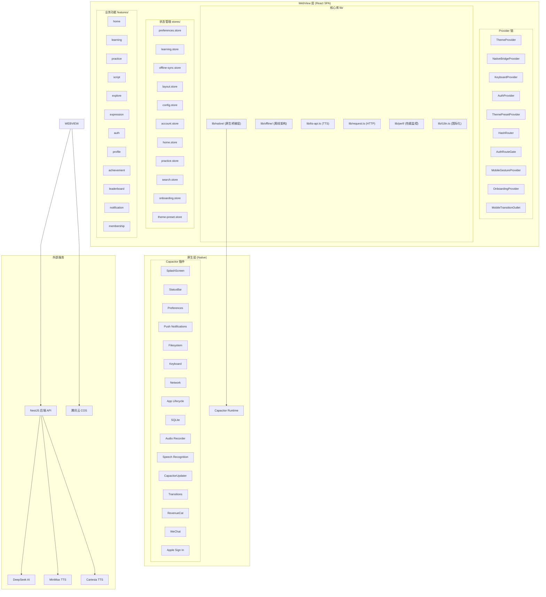
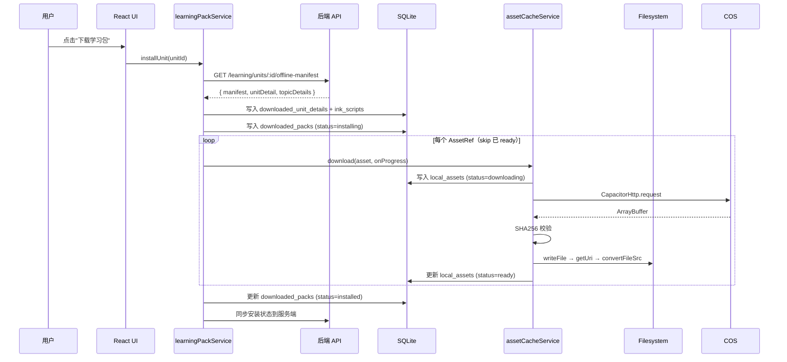

# 漫语町（ManYu）前端移动端架构设计文档

> 适用平台：iOS / Android (Capacitor) + Web (PWA 降级)
> 最后更新：2026-06-12

---

## 一、技术栈总览

| 层级 | 技术选型 | 用途 |
|------|----------|------|
| **跨平台框架** | Capacitor 8 | iOS / Android 原生壳，WebView 容器 |
| **UI 框架** | React 18 + TypeScript strict | 声明式 UI |
| **样式方案** | Tailwind CSS + shadcn/ui | 语义化设计系统 |
| **状态管理** | Zustand (11 stores, 含 persist) | 全局状态 + localStorage 持久化 |
| **路由** | React Router v6 (Hash 路由) | 兼容静态部署 + Capacitor |
| **HTTP 客户端** | Axios (统一拦截器, 请求去重, 故障冷却) | API 通信 |
| **离线存储** | `@capacitor-community/sqlite` + `@capacitor/filesystem` | 结构化数据 + 二进制资源 |
| **包管理** | pnpm monorepo (`@manyu/frontend`) | 依赖隔离 |
| **构建工具** | Vite 5 | 开发/生产构建 |

### Capacitor 已安装插件

| 插件 | 包名 | 用途 |
|------|------|------|
| Splash Screen | `@capacitor/splash-screen` | 启动画面控制 |
| Status Bar | `@capacitor/status-bar` | 状态栏样式 |
| Preferences | `@capacitor/preferences` | 原生键值存储（Web→localStorage 降级） |
| Push Notifications | `@capacitor/push-notifications` | APNs/FCM 推送 |
| Filesystem | `@capacitor/filesystem` | 本地文件读写 |
| Keyboard | `@capacitor/keyboard` | 键盘弹出/收起事件 |
| Network | `@capacitor/network` | 网络状态检测 |
| App | `@capacitor/app` | 应用生命周期（resume/back） |
| SQLite | `@capacitor-community/sqlite` | 离线数据库 |
| Audio Recorder | `@capgo/capacitor-audio-recorder` | 录音 |
| Speech Recognition | `@capgo/capacitor-speech-recognition` | 原生语音识别 |
| Capacitor Updater | `@capgo/capacitor-updater` | OTA 热更新（self-hosted） |
| Capacitor Transitions | `@capgo/capacitor-transitions` | 原生页面转场动画 |
| RevenueCat | `@revenuecat/purchases-capacitor` | IAP 订阅管理 |
| RevenueCat UI | `@revenuecat/purchases-capacitor-ui` | 原生内购 Paywall |
| WeChat | `capacitor-wechat` | 微信登录/分享 |
| Social Login | `@capgo/social-login` | Apple Sign In |

---

## 二、整体架构图



---

## 三、Provider 链与启动流程

### 3.1 Provider 层级顺序（不可颠倒）

```
<ThemeProvider>           → 主题系统（next-themes）
  <NativeBridgeProvider>  → 原生能力初始化
    <KeyboardProvider>    → 键盘事件监听
    <AuthProvider>        → 认证状态 + 离线同步
      <ThemePresetProvider> → 主题预设
      <HashRouter>        → 路由系统
        <AuthRouteGate>   → 鉴权守卫
          <MobileGestureProvider>  → 手势导航
          <OnboardingProvider>     → 引导流程
          <MobileTransitionOutlet> → 原生转场
            <Routes>...</Routes>
          </MobileTransitionOutlet>
        </AuthRouteGate>
      </HashRouter>
    </AuthProvider>
  </KeyboardProvider>
</ThemeProvider>
```

### 3.2 启动时序（严格的延迟策略，防止首帧卡顿）

```
Frame 0 (首帧)
  ├─ requestAnimationFrame → NativeBridgeProvider 标记 ready
  ├─ SplashScreen.hide()           ← 立即
  ├─ StatusBar.setStyle(Dark)      ← 立即
  ├─ Updater.notifyAppReady()      ← 立即（10s 超时硬性要求）
  └─ RevenueCat.configure()        ← 立即

Frame 0 + 8s
  └─ offlineSyncService.sync()     ← requestIdleCallback 延迟执行

Frame 0 + 10s
  └─ learningStore.checkPackUpdates()  ← 学习包更新检查

Frame 0 + 15s
  └─ Updater.checkUpdate()         ← OTA 更新检查

App resume (后台恢复)
  ├─ 5 分钟节流检查
  ├─ OTA 检查延迟 5s
  └─ 学习包检查延迟 8s
```

### 3.3 Web ↔ Native 路由区分

- **Capacitor 端不注册**：`/admin/*`（后台管理）、`/portal`（官网）、`/company`（企业页）
- 通过 `isNative()` 在 `App.tsx` 的 `<Route>` 条件渲染中区分

---

## 四、原生桥接层（Native Bridge）架构

### 4.1 设计模式

```
lib/native/
├── index.ts                    # Barrel export（统一入口）
├── platform.ts                 # isNative(), isIOS(), isAndroid(), getPlatform()
├── types.ts                    # 所有服务接口类型定义
├── native-bridge.provider.tsx  # React Context Provider + useNativeBridge() hook
├── splash-screen.ts            # @capacitor/splash-screen 封装
├── status-bar.ts               # @capacitor/status-bar 封装
├── updater.ts                  # @capgo/capacitor-updater OTA 热更新
├── preferences.ts              # @capacitor/preferences（fallback → localStorage）
├── push-notifications.ts       # @capacitor/push-notifications
├── filesystem.ts               # @capacitor/filesystem
├── revenuecat.ts               # RevenueCat IAP 订阅
├── vn-voice-input.ts           # 原生语音输入（SpeechRecognition + AudioRecorder）
├── wechat.ts                   # 微信 SDK 桥接
├── apple.ts                    # Apple Sign In 桥接
├── save-password.ts            # iOS Keychain 密码保存
└── in-app-review.ts            # 应用内评分
```

### 4.2 核心设计决策

| 决策 | 说明 |
|------|------|
| **Provider Pattern** | 每个原生服务独立封装，`import()` 懒加载原生模块 |
| **Web Fallback** | `preferences` 自动降级到 `localStorage`；其他服务 Web 环境返回 no-op |
| **React Context + Static Access** | `useNativeBridge()` 用于 React 组件，`getNativeBridge()` 用于非 React 场景（如 request.ts 拦截器） |
| **编译时静态导入** | 服务实例在模块顶层创建，`NativeBridgeContext` 直接持有静态对象，零异步开销 |

### 4.3 使用方式

```typescript
// React 组件内
import { useNativeBridge } from '@/lib/native';
const { preferences, filesystem, revenueCat } = useNativeBridge();

// 非 React 场景（如 request.ts 拦截器）
import { getNativeBridge } from '@/lib/native';
const { preferences } = getNativeBridge();

// 平台检测
import { isNative, isIOS, isAndroid, getPlatform } from '@/lib/native';
if (isNative()) { /* 原生逻辑 */ }
```

---

## 五、离线架构（核心子系统）

离线能力由**三个独立但协作的子系统**组成：

| 子系统 | 用途 | 存储介质 | 关键模块 |
|--------|------|----------|----------|
| **LearningPack**（学习包） | 场景、词汇、句块、话题等结构化学习内容 | Capacitor SQLite | `learning-pack.service.ts` |
| **AssetCache**（资源缓存） | 音频、图片、精灵图等二进制资源 | Capacitor Filesystem (`Directory.Data`) | `asset-cache.service.ts` |
| **MobileBundle**（OTA 热更新） | 整个 Web App 的 zip 增量更新包 | COS → Capacitor 原生更新插件 | `updater.ts` / `mobile-updates` |

三者关系：

```
MobileBundle (OTA)
  └─ 更新 Web 代码（React/TS → dist.zip）

LearningPack (离线数据)
  └─ 引用 AssetRef → 触发 AssetCache 下载

AssetCache (资源文件)
  └─ 从 COS 拉取，存入本地文件系统
```

### 5.1 核心设计原则：数据与资源分离

```
结构化数据（JSON）  →  SQLite     ← 支持复杂查询、索引、关系
二进制资源（mp3/png）→  Filesystem ← 避免 SQLite 大 blob 性能问题
```

这是 Capacitor 离线架构的**黄金法则**。SQLite 存 blob 会导致：
- 读写放大（base64 编码/解码）
- 无法利用 OS 文件缓存
- WKWebView 无法直接加载 SQLite 中的 blob

### 5.2 统一存储层（UnifiedStorage）

```
┌──────────────────────────────────────────────────────┐
│ Platform        │ Backend                            │
├──────────────────┼────────────────────────────────────┤
│ iOS / Android   │ @capacitor-community/sqlite (native)│
│ Web (browser)   │ @capacitor-community/sqlite + jeep  │
└──────────────────┴────────────────────────────────────┘
```

所有后端暴露统一的 `localDb` API（`get`, `put`, `putMany`, `delete`, `list`, `findByIndex`, `count`, `clear`, `deleteWhere`, `close`）。业务层使用 Repository 模式，不直接操作 `localDb`。

### 5.3 SQLite 表结构

| 表名 | 用途 | 关键字段 |
|------|------|----------|
| `kv` | 通用键值存储（游标、配置等） | id, data(JSON), updated_at |
| `my_learning_units` | 用户已报名的学习单元 | id, data(JSON) |
| `downloaded_packs` | 已安装的学习包 | pack_id, status, version, title, manifest(JSON) |
| `downloaded_unit_details` | 场景/话题详细数据 | unit_id, topic_id, data(JSON) |
| `ink_scripts` | Ink 叙事脚本缓存 | unit_id, topic_id, data(JSON) |
| `dictionary_entries` | 词典离线缓存 | id, data(JSON) |
| `expression_entries` | 表达库离线缓存 | id, data(JSON) |
| `offline_vocabularies` | 离线词汇 | id, data(JSON) |
| `offline_chunks` | 离线句块 | id, data(JSON) |
| `offline_patterns` | 离线句型模式 | id, data(JSON) |
| `offline_content_refs` | 内容引用关系 | id, data(JSON) |
| `user_progress` | 用户学习进度 | id, data(JSON) |
| `practice_records` | 练习记录缓存 | session_id, topic_id, status, record(JSON) |
| `local_assets` | 资源文件缓存状态 | remoteUrl, localUri, status, sha256 |
| `asset_refs` | 资源引用计数 | asset_id, refCount |
| `outbox` | 离线操作出队（待同步） | entityType, operation, payload, status |

### 5.4 学习包安装流程



### 5.5 资源去重与引用计数

```typescript
// 同一资源跨包共享，只存一份（SHA256 + URL 去重）
const key = assetId || sha256 || await digest(normalizeUrl(url))

// 卸载时检查引用计数，防止误删共享资源
const stillUsed = new Set(
  otherPacks.flatMap(p => p.manifest.assets.map(getKey))
)
if (!stillUsed.has(key)) await assetCacheService.removeRef(asset)
```

### 5.6 iOS WKWebView 兼容

```typescript
// ❌ WKWebView 禁止加载 file://
// ✅ 必须转换为 capacitor://localhost scheme
function toLoadableUrl(fileUri: string): string {
  return Capacitor.convertFileSrc(fileUri)
}
```

### 5.7 离线同步（Offline-First Outbox Pattern）

```
离线操作 → 写入 outbox 表 → 联网时批量 push 到服务端
```

同步实体类型：`my_unit`, `word_entry`, `chunk_entry`, `pattern_entry`, `practice_session`, `practice_turn`, `learning_pack`

同步方向：
- **Pull**（拉取）：增量游标方式，最大 5 页，获取 expressionItems / sceneProgresses / practiceSessions 等
- **Push**（推送）：批量推送 outbox 中的离线变更
- **Content Manifest**：公共内容增量同步（词汇、句块、句型、场景、话题）

---

## 六、OTA 热更新架构

### 6.1 设计原则

- **Self-hosted 模式**：`autoUpdate: 'off'`，插件不做任何自动操作
- **纯手动控制**：所有检查、下载、安装由 `updater.checkUpdate()` 一手控制
- **强制更新 vs 普通更新**：
  - `isMandatory=true` → 下载完成后立即 `set()` 重启
  - `isMandatory=false` → 下载完成后 `next()`，切后台后下次启动生效
- **自动回滚**：启动失败自动回滚到上一个可用版本
- **10 秒超时**：`notifyAppReady()` 必须在 `appReadyTimeout` 内调用

### 6.2 更新流程

```
App 启动 → notifyAppReady() (10s 内)
         → 15s 后 checkUpdate()
         → POST /mobile-updates/check
         → 获取 { version, url, isMandatory }
         → CapacitorUpdater.download({ url, version })
         → downloadComplete → set() 或 next()
```

### 6.3 安全措施

- `autoDeleteFailed: true` — 自动清理下载失败的包
- `autoDeletePrevious: true` — 安装成功后自动清理旧包
- `appReadyTimeout: 10000` — 10 秒未确认即回滚

---

## 七、移动端导航与交互

### 7.1 底部导航栏（BottomNav）

```
┌──────────┬──────────────┬──────────────┐
│  🏠 首页  │  📖 学习计划  │  📚 我的词库  │
└──────────┴──────────────┴──────────────┘
```

- 使用 `@capgo/capacitor-transitions` 的 `setNavigation()` 控制原生转场方向
- 仅移动端 + 已登录 + 非沉浸模式 + 非学习子页面时显示
- 底部安全区适配：`bottom: calc(0.75rem + env(safe-area-inset-bottom, 0px))`

### 7.2 手势导航（MobileGestureProvider）

| 手势 | 效果 |
|------|------|
| 左滑 (swipe left) | 主 Tab 间向右切换 |
| 右滑 (swipe right) | 主 Tab 间向左切换 / 返回上一页 |
| 交互元素内滑动 | 不触发导航（button/a/input/textarea/[role="dialog"] 等自动屏蔽） |
| 弹窗打开时 | 全局禁用手势 |
| 横向滚动容器内 | 禁用手势（`.overflow-x-auto`, `[data-horizontal-scroll]`） |

### 7.3 原生页面转场（MobileTransitionOutlet）

使用 `@capgo/capacitor-transitions` 实现原生级的 push/pop 动画：

```tsx
<cap-router-outlet>
  <cap-page key={location.key}>
    <cap-content slot="content" fullscreen>
      {children}
    </cap-content>
  </cap-page>
</cap-router-outlet>
```

- `keepInDom: true` — 保留前页面 DOM，返回时无需重新渲染
- `maxCached: 8` — 最多缓存 8 个页面
- `swipeGesture: 'auto'` — iOS 边缘滑动返回

### 7.4 沉浸模式

- 练习页面 (`/practice/session/`)、剧本播放 (`/script/`) 等自动进入沉浸模式
- 沉浸模式下隐藏 BottomNav、Header、Footer
- 通过 `layoutStore.immersiveMode` 控制

---

## 八、语音输入架构（VN Voice Input）

用于练习场景中的口语输入，支持**双轨策略**：

### 8.1 原生语音识别（优先）

```
startNativeSpeechInput()
  ├─ SpeechRecognition.available()      → 检查可用性
  ├─ SpeechRecognition.requestPermissions()
  ├─ SpeechRecognition.isOnDeviceRecognitionAvailable() → 优先端侧识别
  ├─ SpeechRecognition.start({ language, partialResults: true, popup: false })
  ├─ 监听 partialResults → 实时更新文本
  └─ stop() → forceStop() → getLastPartialResult() → 返回最终文本
```

### 8.2 原生录音（降级方案）

```
startNativeAudioInput()
  ├─ CapacitorAudioRecorder.checkPermissions()
  ├─ CapacitorAudioRecorder.startRecording()
  └─ stop() → 返回 Blob + filename → 上传 Whisper 转文字
```

### 8.3 Web 端降级

Web 端使用浏览器 `MediaRecorder` API，录音后上传 Whisper 做语音识别。

### 8.4 核心参数

| 参数 | 默认值 | 说明 |
|------|--------|------|
| language | `en-US` | 识别语言 |
| maxResults | 3 | 最大候选结果数 |
| partialResults | true | 启用实时部分结果 |
| addPunctuation | true | 自动添加标点 |
| popup | false | 不显示系统语音弹窗 |
| useOnDeviceRecognition | true（如果可用） | 优先端侧离线识别 |
| continuousPTT | true | 持续按住说话模式 |
| allowForSilence | 1500ms | 静音检测超时 |

---

## 九、TTS 语音合成架构

### 9.1 双 Provider 架构

| Provider | 用途 | 特点 |
|----------|------|------|
| **MiniMax** (speech-2.8-hd) | 默认 TTS 引擎 | 中文+英文、词级时间戳 |
| **Cartesia** | 备用 TTS 引擎 | 极低延迟、流式合成 |

### 9.2 合成模式

| API | 用途 | 缓存策略 |
|-----|------|----------|
| `synthesizeQuestion` | 按题目 ID 合成音频 | **持久化**：`configHash = SHA1(provider+model+voiceId+params)`，命中直接返回 |
| `synthesizeText` | 短文本即时合成（设置页试听） | 不缓存，返回 base64 |
| `synthesizeAsset` | 任意文本合成并保存到 COS | 持久化到 COS，返回可预览 URL |

### 9.3 配置数据结构

```typescript
interface TtsBackendSettings {
  provider: 'minimax' | 'cartesia'
  model: string               // 'speech-2.8-hd' 等
  voiceId?: string            // 音色 ID
  params?: {                  // Provider 特定参数
    speed: number             // 0.5-2.0
    vol: number               // 0.0-1.0
    pitch: number             // -12 ~ 12
  }
}

interface TtsSettings {       // Web Speech API（浏览器原生降级）
  voiceURI: string
  rate: number                // 0.5-2.0
  pitch: number               // 0.0-2.0
  volume: number              // 0.0-1.0
}
```

---

## 十、状态管理 (Zustand Stores)

### 10.1 Store 清单

| Store | 持久化 | 用途 |
|-------|--------|------|
| `preferences.store` | ✅ localStorage | TTS 设置、主题、语言、BGM、WiFi-only 媒体 |
| `learning.store` | ❌ 内存 | 学习单元、商店、签到、下载队列、学习包管理 |
| `offline-sync.store` | ✅ localStorage | 同步状态、日志（最多 20 条） |
| `layout.store` | ❌ 内存 | BottomNav 显隐、沉浸模式 |
| `config.store` | ❌ 内存 | 练习配置绑定 |
| `account.store` | ❌ 内存 | 用户资料、会员状态 |
| `home.store` | ❌ 内存 | 首页数据缓存 |
| `practice.store` | ❌ 内存 | 练习会话状态 |
| `search.store` | ✅ localStorage | 搜索历史（最多 10 条） |
| `onboarding.store` | ✅ localStorage | 引导流程完成状态 |
| `theme-preset.store` | ❌ 内存 | 主题预设配置 |

### 10.2 learning.store（最复杂）

```typescript
interface LearningStore {
  // 我的学习
  myUnits: MyUnit[]
  // 学习商店（分页）
  shopUnits: LearningUnitSummary[]; shopTotal: number; shopPage: number
  // 签到日历
  checkInData: CheckInCalendar | null
  // 分类标签
  tags: TagInfo[]
  // 学习包管理
  downloadedPacks: InstalledLearningPack[]
  availablePackUpdates: PackUpdateInfo[]
  // 下载队列（最大并发 2）
  downloadTasks: DownloadTask[]
  // 网络感知：WiFi only 模式下蜂窝网络弹确认
}
```

---

## 十一、HTTP 请求层（request.ts）

### 11.1 核心特性

| 特性 | 实现 |
|------|------|
| **Axios 实例** | `baseURL` 可配置，timeout 15s |
| **Bearer Token 自动注入** | 请求拦截器从 `localStorage('manyu-bearer-token')` 读取 |
| **响应自动解包** | 自动提取 `data.data` |
| **401 自动跳转** | 清除 token → 重定向到 `#/auth/login` |
| **请求去重 (dedupe)** | 相同 method+url+params+data 的并发请求共享同一个 Promise |
| **故障冷却 (cooldown)** | GET 请求失败后 30s 内相同请求直接返回缓存错误 |
| **离线检测** | `navigator.onLine === false` → 抛出 `ApiRequestError('offline')` |
| **Token 刷新** | 401 时自动调用 refresh，队列化并发请求 |

### 11.2 错误分类

```typescript
type ApiErrorKind = 'offline' | 'cooldown' | 'unauthorized' | 'timeout' | 'network' | 'server'
```

---

## 十二、性能优化措施

### 12.1 启动性能（已实施的 5 项修复）

| 措施 | 效果 |
|------|------|
| OTA 检查延迟 15s | 减少首帧竞争 |
| 离线同步延迟 8s + requestIdleCallback | 首帧不阻塞同步 |
| Pixi.js 移动端降级（resolution=1, no antialias） | 减少 GPU 负载 |
| Keyboard 监听（data-keyboard-open） | Pixi 键盘弹出时暂停 |
| 低内存设备自动降级（≤4GB RAM / 旧 iPhone） | 避免 OOM |

### 12.2 运行时性能

| 措施 | 说明 |
|------|------|
| **Long Task Monitor** | 开发环境 PerformanceObserver 监听 >200ms 长任务 |
| **measure() / measureSync()** | 关键操作耗时打点，>300ms 输出 warning |
| **OfflineSync pull 分页上限** | 最大 5 页，防止一次性拉取过多数据 |
| **Resume 节流** | OTA / 学习包检查至少间隔 5 分钟 |
| **ResizeObserver rAF debounce** | Pixi VN Stage 键盘弹出时减少重排 |
| **scrollHeight rAF 节流** | 输入面板避免每次按键触发布局 |

### 12.3 性能监控工具

```
lib/perf/
├── index.ts               # 统一导出
├── long-task-monitor.ts   # 长任务监控（开发环境）
└── measure.ts             # 关键路径耗时打点
```

---

## 十三、内购与订阅（RevenueCat）

### 13.1 商品配置

```typescript
REVENUECAT_PRODUCT_IDS = {
  lifetime: 'lifetime',   // 终身会员
  yearly: 'yearly',       // 年度订阅
  monthly: 'monthly',     // 月度订阅
}
REVENUECAT_UNLIMITED_ENTITLEMENT_ID = '漫语町 Unlimited'
```

### 13.2 RevenueCat State

```typescript
interface RevenueCatState {
  configured: boolean
  customerInfo: CustomerInfo | null
  hasUnlimited: boolean
  activeEntitlementId: string | null
  managementURL: string | null   // App Store 订阅管理页
}
```

### 13.3 核心 API

- `configure(appUserID?)` — 初始化，传递用户 ID 用于跨设备恢复
- `purchasePackage(product)` — 发起购买
- `restorePurchases()` — 恢复购买
- `presentPaywall()` / `presentPaywallIfNeeded()` — 原生 Paywall UI
- `presentCustomerCenter()` — 订阅管理页
- `subscribe(callback)` — 订阅状态变更

---

## 十四、国际化 (i18n) 与多语言

- 使用 `react-i18next`
- 当前支持：`zh-CN`（默认）、`en`
- 语言偏好持久化到 `localStorage('manyu-language')`
- 所有 UI 文案通过 `t('key')` 获取

---

## 十五、关键数据结构速查

### 15.1 学习包 Manifest

```typescript
interface LearningPackManifest {
  packId: string
  version: number
  title: string
  updatedAt: string
  units: string[]           // 包含的单元 ID
  topics: string[]          // 包含的话题 ID
  vocabularies: string[]    // 词汇 ID
  chunks: string[]          // 句块 ID
  sentencePatterns: string[]// 句型 ID
  scriptEpisodes: string[]  // 剧本剧集 ID
  inkScripts: string[]      // Ink 脚本 ID
  assets: AssetRef[]        // 引用的资源文件
  files?: Record<string, string>  // 文件名映射
  formatVersion?: number
}
```

### 15.2 资源引用

```typescript
interface AssetRef {
  assetId?: string
  url: string
  path?: string
  sha256?: string | null
  mimeType?: string | null
  size?: number | null
  role?: 'background' | 'sprite' | 'voice' | 'bgm' | 'sfx' | 'thumbnail'
}
```

### 15.3 本地资源状态

```typescript
interface LocalAsset {
  id: string
  assetId: string
  remoteUrl: string
  sha256?: string | null
  mimeType?: string | null
  localPath: string | null     // relative: offline-assets/{hash}.mp3
  localUri: string | null      // absolute: capacitor://localhost/...
  status: 'missing' | 'downloading' | 'ready' | 'failed'
  downloadedAt: string | null
  lastAccessedAt: string | null
  lastError?: string
}
```

### 15.4 离线出队项

```typescript
interface SyncOutboxItem<TPayload = unknown> {
  id: string
  entityType: 'my_unit' | 'word_entry' | 'chunk_entry' | 'pattern_entry'
            | 'practice_session' | 'practice_turn' | 'learning_pack'
  entityId: string
  operation: 'create' | 'update' | 'delete'
  payload: TPayload
  clientMutationId: string
  createdAt: string
  retryCount: number
  status: 'pending' | 'syncing' | 'synced' | 'failed'
  lastError?: string
}
```

### 15.5 下载任务

```typescript
interface DownloadTask {
  packId: string
  title: string
  progress: number          // 0-100
  status: 'queued' | 'downloading' | 'extracting' | 'done' | 'error'
  error?: string
}
// 最大并发：MAX_CONCURRENT_DOWNLOADS = 2
```

### 15.6 练习记录缓存

```typescript
// practice_records 表
{
  id: `session:${sessionId}`
  type: 'history'
  remoteId: string
  sessionId: string
  topicId: string
  sceneId: string
  status: 'analyzed' | ...
  record: {
    recordId: string
    topicName: string
    practiceCount: number
    score: number | null       // overallScore
    summary: string | null     // AI 摘要
    completedAt: string | null
  }
  session: {                   // 完整会话数据
    turns: ...
    analysisResult: ...
    topicSnapshot: ...
  }
}
```

---

## 十六、目录结构总览

```
apps/frontend/src/
├── App.tsx                          # 根组件（Provider 链 + 路由）
├── main.tsx                         # 入口（挂载 + 开发环境 perf monitor）
├── index.css                        # 全局样式 + Tailwind
│
├── lib/                             # 核心库
│   ├── native/                      # 原生桥接层
│   │   ├── index.ts                 # Barrel export
│   │   ├── platform.ts              # isNative / isIOS / isAndroid
│   │   ├── types.ts                 # 所有服务接口
│   │   ├── native-bridge.provider.tsx
│   │   ├── splash-screen.ts / status-bar.ts / updater.ts
│   │   ├── preferences.ts / push-notifications.ts / filesystem.ts
│   │   ├── revenuecat.ts / vn-voice-input.ts
│   │   ├── wechat.ts / apple.ts
│   │   ├── in-app-review.ts / save-password.ts
│   ├── offline/                     # 离线架构
│   │   ├── index.ts
│   │   ├── learning-pack.service.ts  # 学习包安装/卸载
│   │   ├── asset-cache.service.ts    # 资源下载/缓存（SHA256 去重）
│   │   ├── learning-content.repository.ts
│   │   ├── learning.repository.ts
│   │   ├── practice.repository.ts
│   │   ├── offline-storage.service.ts
│   │   ├── offline-sync.service.ts   # 离线→在线同步协调
│   │   ├── sync-api.ts / sync-outbox.ts
│   │   ├── unified-storage.ts       # SQLite 统一访问层
│   │   └── sqlite/
│   │       ├── schema.ts            # DDL 定义 + 表名
│   │       ├── sqlite-storage.ts    # Native SQLite 后端
│   │       ├── web-sqlite-storage.ts # Web SQLite (jeep) 后端
│   │       └── sqlite-json-store.ts # JSON 列存取封装
│   ├── perf/                        # 性能监控
│   │   ├── index.ts
│   │   ├── long-task-monitor.ts     # >200ms 长任务告警
│   │   └── measure.ts               # 关键路径耗时
│   ├── request.ts                   # Axios 封装（去重/冷却/离线检测）
│   ├── tts-api.ts                   # TTS API 类型 + 调用
│   ├── cn.ts                        # shadcn/ui className 合并
│   └── i18n.ts                      # 国际化配置
│
├── stores/                          # Zustand 状态管理
│   ├── preferences.store.ts         # TTS/主题/语言（persist）
│   ├── learning.store.ts            # 学习包/商店/下载队列
│   ├── offline-sync.store.ts        # 同步状态/日志（persist）
│   ├── layout.store.ts              # BottomNav/沉浸模式
│   ├── config.store.ts / account.store.ts / home.store.ts
│   ├── practice.store.ts / search.store.ts
│   ├── onboarding.store.ts / theme-preset.store.ts
│
├── providers/                       # React Context Provider
│   ├── theme-provider.tsx
│   ├── auth-provider.tsx
│   ├── auth-route-guard.tsx
│   ├── keyboard-provider.tsx
│   ├── theme-preset-provider.tsx
│   ├── mobile-gesture-provider.tsx   # 滑动手势导航
│   ├── mobile-transition-outlet.tsx  # 原生转场动画
│   └── onboarding-provider.tsx
│
├── layout/                          # 布局组件
│   ├── root-layout.tsx              # 主布局（SafeArea + BottomNav）
│   ├── bottom-nav.tsx               # 底部 3 Tab 导航
│   ├── header.tsx / footer.tsx      # PC 端 Header/Footer
│   └── admin-layout.tsx             # 后台管理布局
│
├── features/                        # 业务功能（按域组织）
│   ├── home/          # 首页
│   ├── learning/      # 学习计划 / 单元详情
│   ├── practice/      # 练习会话（AI 对话）
│   ├── script/        # 互动剧本
│   ├── explore/       # 场景探索
│   ├── expression/    # 表达库
│   ├── auth/          # 登录/注册/忘记密码
│   ├── profile/       # 个人中心
│   ├── achievement/   # 成就殿堂
│   ├── leaderboard/   # 排行榜
│   ├── notification/  # 消息通知
│   ├── membership/    # 会员中心
│   ├── account/       # 账号设置
│   ├── feedback/      # 意见反馈
│   ├── referral/      # 邀请好友
│   ├── system/        # 系统文档（隐私/条款等）
│   ├── company/       # Web 专属企业页
│   └── admin/         # Web 专属后台管理
│
├── components/
│   ├── ui/            # shadcn/ui 组件
│   └── common/        # 业务通用组件
│
├── hooks/             # 自定义 hooks
└── routes/            # 路由配置
```

---

## 十七、技术决策总结

| 决策 | 选择 | 原因 |
|------|------|------|
| 跨平台方案 | Capacitor（非 React Native） | 复用 Web 技术栈，渐进增强原生能力 |
| 路由模式 | Hash 路由 | 兼容静态部署 + Capacitor iOS |
| 离线存储 | SQLite + Filesystem 分离 | 结构化数据与二进制资源独立管理 |
| OTA 方案 | Capgo CapacitorUpdater（self-hosted） | 纯手动控制，不依赖第三方服务 |
| 语音识别 | 原生 SpeechRecognition 优先 | 端侧离线识别，低延迟 |
| 内购 | RevenueCat | 跨平台订阅管理，原生 Paywall UI |
| 状态管理 | Zustand | 轻量、按需订阅、persist 中间件 |
| 原生桥接 | Provider Pattern + 静态导出 | React 内外均可访问原生能力 |
| 转场动画 | @capgo/capacitor-transitions | 原生级 push/pop 动画 + 缓存 |
| 性能监控 | PerformanceObserver | 定位 Capacitor WebView 卡顿根因 |

---

> **相关文档**：
> - `docs/offline-architecture.md` — 离线架构详细设计
> - `docs/capacitor-frontend-performance-plan.md` — 前端性能优化方案
> - `docs/learning-pack-architecture-v2.md` — 学习包架构 v2
> - `docs/ai-quota-and-invite-plan.md` — AI 配额与邀请方案
> - `docs/universal-links-setup.md` — Universal Links / AASA 配置
