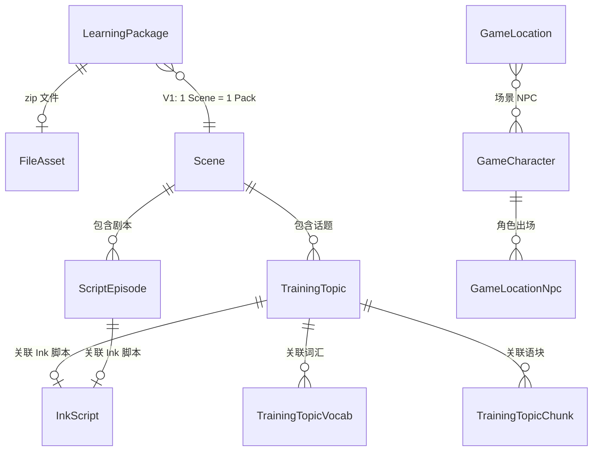
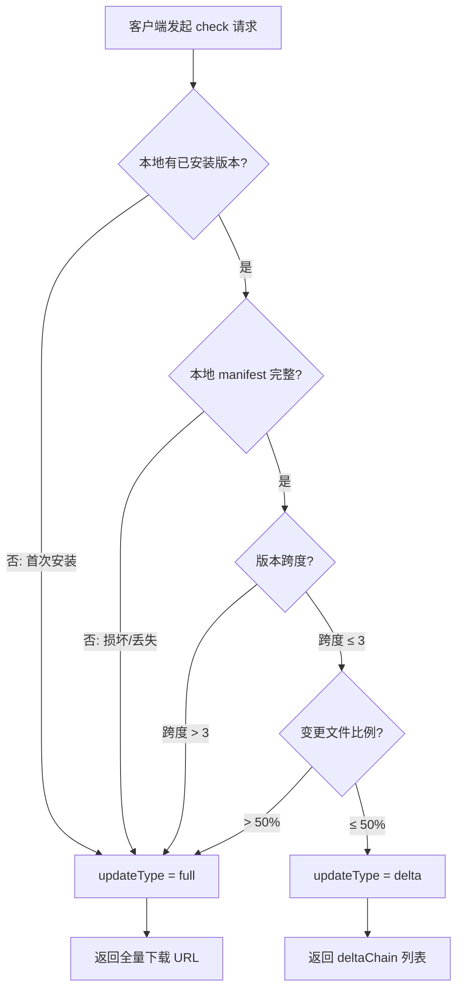

# 学习包架构升级方案 v2

> 状态：设计阶段 | 日期：2026-06-11

---

## 1. 当前架构回顾

### 1.1 现有学习包流程

```
前端用户点击"安装学习包"
  → learningPackService.installUnit(unitId)
    → 逐一请求 API 获取 unit detail + topic details（N+1 请求）
    → 构建 LearningPackManifest（内存中临时生成，version = Date.now()）
    → 遍历 manifest.assets，逐一调用 assetCacheService.download() 下载每个资源
    → 将内容 JSON 写入本地 SQLite（downloaded_unit_details / ink_scripts）
    → 写入 downloaded_packs 记录
```

### 1.2 现有架构的问题

| 问题 | 说明 |
|------|------|
| **无版本管理** | `version` 用 `Date.now()` 临时生成，无法追踪内容变更 |
| **N+1 下载** | 每个资源文件单独 HTTP 请求，移动端易中断、效率低 |
| **无增量更新** | 任何内容变更都需要重新下载全部资源和数据 |
| **无后台管理** | 学习包只能通过前端动态拼装，运营无法预构建和管理 |
| **无校验机制** | 下载的资源没有完整性校验，损坏无法检测 |
| **无压缩** | 所有数据以 JSON + 散文件形式存储，占用空间大 |
| **与 MobileBundle 割裂** | 已有 `MobileBundle` 模型用于 OTA 更新（zip + COS + 版本），但学习包完全走了另一套逻辑 |

---

## 2. 升级目标

1. **学习包 = 压缩文件 (zip)**：将场景内容 + VN 资源打包为一个 zip，一次性下载
2. **后台管理页面**：运营可创建、编辑、发布学习包，关联场景和资源
3. **COS 存储 + 版本管理**：zip 上传至腾讯云 COS，通过 `FileAsset` 统一管理，支持语义化版本
4. **移动端智能同步**：启动/恢复时检查版本；WiFi 下可后台静默更新，蜂窝网络只更新 UI 状态，由用户在学习计划/学习商店手动下载；V1 只做全量包，V2 再支持增量包
5. **复用现有基础设施**：`FileAsset`（sha256 去重）、`MobileBundle` 模式、Capacitor Filesystem、SQLite 本地存储

---

## 2.1 V1 范围与防过度设计

以下标注 **V1 做** / **V2 做** / **可简化**：

| 特性 | 决定 | 理由 |
|------|------|------|
| 全量 zip 下载 | ✅ V1 | 核心功能 |
| 版本检查 + 自动同步 | ✅ V1 | 核心功能 |
| 后台管理 CRUD | ✅ V1 | 运营刚需 |
| 后台自动打包 + 上传 COS | ✅ V1 | 核心功能 |
| manifest + SHA256 校验 | ✅ V1 | 保证完整性 |
| 资产文件跨包去重（SHA256 池 + 引用计数） | ✅ V1 | 用户装多个包必然重复 |
| 本地内容索引表（词汇/语块/句型） | ✅ V1 | 解决跨包搜索、复习和去重。V1 保持 `topic`/`episode` 内完整数据，同时写入派生索引表 |
| **增量更新（delta zip）** | ⚠️ V2 | V1 只做全量。delta 的 manifest 对比逻辑已设计好，但 delta zip 生成+链式合并延后。**V1 的 check 接口直接返回 `updateType: "full"`** |
| **DeltaPackage 表** | ⚠️ V2 | 随增量更新一起延后 |
| **asset_mappings 表** | ❌ 删除 | 过度设计。SHA256 → 本地路径是确定性的（`offline-assets/{sha256}.{ext}`），不需要单独一张映射表。`asset_refs` 已记录 packId→sha256 关系 |
| **pack_vocabs / pack_chunks 关联表** | ❌ 删除 | 不按服务端关系表方式建模；客户端改用统一 `offline_content_refs` 记录内容被哪些包/话题引用 |
| 链式 delta 下载（v1→v2→v3 逐个下） | ⚠️ V2 | V1 无 delta，V2 也建议直接对比 from/to manifest 生成单个 delta，不做链式 |
| 安装上报 API | ⚠️ V2 | 非核心，统计信息可以先跳过 |
| UserLearningPackage 表（服务端） | ⚠️ V2 | 安装统计可以先不做 |
| 打包进度 WebSocket 推送 | ❌ V2 | 后台轮询状态就够了 |

**V1 核心交付物**：
1. 后端：`LearningPackage` 表 + 管理 CRUD + 打包上传 COS + `check` 接口（全量）
2. 前端客户端：下载 zip → SHA256 校验 → 解压 → 资产去重 → 写入 SQLite → 可用
3. 跨包去重：V1 必做资产 SHA256 池；内容扁平索引可选，不能改变现有 topic-centric 业务结构

**V2 再做**：增量更新（delta zip）、安装统计、WebSocket 打包进度。

---

## 3. 数据模型设计

### 3.1 新增模型：`LearningPackage`

```prisma
model LearningPackage {
  id            String        @id @default(cuid())
  scene         Scene         @relation(fields: [sceneId], references: [id])
  sceneId       String                          // V1 固定：1 Scene = 1 Pack
  version       String                          // 语义化版本号 "1.0.0"
  title         String                          // 包名称（如「机场出发 - 基础包」）
  description   String?       @db.Text          // 描述
  coverUrl      String?                         // 封面图（可选）

  // 内容关联说明：
  // V1 不保存 topicIds / episodeIds 冗余数组，生成包时从 sceneId 实时收集。
  // 如果未来需要一个包包含多个 Scene，再扩展为 LearningPackageScene 关联表。

  // 打包产物
  fileAssetId   String?                         // 关联 FileAsset（COS 上的全量 zip）
  fileAsset     FileAsset?     @relation(fields: [fileAssetId], references: [id])
  checksum      String?                         // 全量 zip SHA256
  fileSize      Int?                            // 全量 zip 大小（字节）
  fileSizeHuman String?                         // 可读大小 "45.2 MB"

  // manifest 快照（JSON，存 DB 用于增量 diff，不需要再去 COS 拉 zip 解析）
  manifestSnapshot Json?                        // manifest.json 的完整内容

  // 发布控制
  status        PackageStatus  @default(draft)  // draft | published | archived
  isMandatory   Boolean        @default(false)  // 是否强制更新
  releaseNotes  String?        @db.Text         // 更新日志（Markdown）
  minAppVersion String?                         // 最低 App 版本要求

  // 统计
  downloadCount Int            @default(0)
  installCount  Int            @default(0)

  // 时间戳
  publishedAt   DateTime?
  createdAt     DateTime       @default(now())
  updatedAt     DateTime       @updatedAt

  @@unique([sceneId, version])
  @@index([status, createdAt(sort: Desc)])
  @@index([sceneId, status])
  @@index([fileAssetId])
  @@map("learning_package")
}

enum PackageStatus {
  draft      // 草稿：仅后台可见
  published  // 已发布：API 可查，客户端可下载
  archived   // 已归档：不再推荐下载
}
```

### 3.2 V2 预留模型：`UserLearningPackage`

V1 不做服务端安装统计，客户端仍使用本地 `downloaded_packs` 判断已安装状态。安装统计、跨设备安装记录、用户级包状态同步放到 V2，再新增 `UserLearningPackage`。

### 3.3 复用现有模型

- **`FileAsset`** — zip 文件存储在 COS，sha256 去重，refCount 引用计数
- **`FileAssetGroup`** — V1 新增枚举值 `learning_pack`（全量 zip）；V2 再新增 `learning_pack_delta`
- **`MobileBundle`** — 已有的 OTA 热更新模型，学习包复用其设计模式但独立管理

### 3.4 ER 关系图



---

## 4. 学习包 zip 结构规范

### 4.1 目录结构

> **设计说明**：zip 是自包含的**传输格式**（可独立分发、断点续传），但客户端解压后不会按此目录存放——资产文件按 SHA256 存入全局池，内容 JSON 写入 SQLite。详见 6.7 节跨包去重设计。
>
> **业务边界**：现有业务逻辑仍然以 `Scene → TrainingTopic / ScriptEpisode → Vocab / Chunk / Pattern / InkScript` 为主。`topics/{topicId}.json` 和 `episodes/{episodeId}.json` 必须包含运行时需要的完整话题/剧集数据。扁平化清单只用于安装阶段校验、去重、统计和索引，不能反过来改变页面或练习流程的数据读取方式。

```
learning-pack-{packId}-v{version}.zip
├── manifest.json          # 包元数据
├── checksums.json         # 每个文件的 SHA256 清单（客户端去重 + 校验用）
├── content/
│   ├── scene.json         # 场景基本信息
│   ├── topics/
│   │   ├── {topicId}.json # 每个话题的完整数据
│   │   └── ...
│   ├── episodes/
│   │   ├── {episodeId}.json
│   │   └── ...
│   ├── inks/
│   │   ├── {inkScriptKey}.json  # Ink 脚本 JSON
│   │   └── ...
│   └── indexes/            # 可选：派生索引，不是业务主数据源
│       ├── vocab.json      # 从 topics/episodes 收集的去重词汇清单
│       ├── chunks.json     # 从 topics/episodes 收集的去重语块清单
│       ├── patterns.json   # 从 topics/episodes 收集的去重句型清单
│       └── characters.json # 从 scene/game location 收集的角色索引
└── assets/
    ├── backgrounds/
    │   └── bg_{hash}.{ext}
    ├── characters/
    │   ├── {charId}/
    │   │   ├── avatar.{ext}
    │   │   ├── sprite.{ext}
    │   │   └── expressions/
    │   │       ├── happy.{ext}
    │   │       └── ...
    │   └── ...
    └── audio/
        └── vocab/
            └── {vocabId}_us.mp3
```

#### 4.1.1 关于 `indexes/*.json`

`indexes/vocab.json`、`indexes/chunks.json`、`indexes/patterns.json` 是**派生索引**，不是新的业务数据模型：

- 生成来源：服务端打包时从 `topics/*.json` 和 `episodes/*.json` 中收集并按 ID 去重。
- 使用场景：安装时做 SHA/ID 校验、统计数量、未来做本地内容去重或快速搜索索引。
- 禁止用途：运行时不应只依赖这些扁平表重新组装话题，也不应把话题中的词汇、语块、句型关系删掉。
- V1 实现：可以先不生成 `indexes/*.json`，只要 `topics/episodes/inks` 自包含即可；如果生成，也只作为辅助文件。

### 4.2 `manifest.json` 结构

```jsonc
{
  "packId": "clx001abc",
  "version": "1.2.0",
  "title": "机场出发 - 完整包",
  "description": "包含机场场景的全部话题、剧本和资源",
  "generatedAt": "2026-06-11T08:00:00Z",
  "minAppVersion": "1.0.0",
  "content": {
    "scenes": [{ "id": "sc_001", "title": "机场出发" }],
    "topics": [
      { "id": "tp_001", "title": "办理登机", "difficulty": "L2" }
    ],
    "episodes": [
      { "id": "ep_001", "title": "错过航班", "chapterTitle": "机场" }
    ],
    "inkScripts": [
      { "key": "airport_checkin", "title": "办理登机对话" }
    ],
    "vocabCount": 45,
    "chunkCount": 30,
    "patternCount": 12
  },
  "assets": {
    "totalCount": 87,
    "totalSizeBytes": 52428800,
    "totalSizeHuman": "50.0 MB",
    "byRole": {
      "background": 3,
      "sprite": 15,
      "voice": 45,
      "bgm": 2,
      "thumbnail": 5,
      "sfx": 17
    }
  },
  "checksum": "sha256:abc123..."
}
```

### 4.3 `checksums.json` 结构

```jsonc
{
  "algorithm": "SHA-256",
  "files": {
    "content/scene.json": "e3b0c44298fc1c14...",
    "assets/backgrounds/bg_001.webp": "6a09e667bb67ae85...",
    "...": "..."
  }
}
```

---

## 5. 后台管理设计

### 5.1 管理页面路径

集成到现有 Admin 模块中，新增子模块：

```
apps/backend/src/modules/admin/learning-pack/
├── learning-pack.module.ts
├── learning-pack.service.ts
├── learning-pack-admin.controller.ts     # 管理端 API
├── learning-pack-public.controller.ts    # 客户端 API
└── dto/
    ├── create-learning-pack.dto.ts
    ├── update-learning-pack.dto.ts
    ├── generate-pack.dto.ts
    └── publish-pack.dto.ts
```

### 5.2 管理端 API

| 方法 | 路径 | 说明 |
|------|------|------|
| `GET` | `/api/v1/manyu/admin/learning-packs` | 列表（分页、搜索、状态筛选） |
| `GET` | `/api/v1/manyu/admin/learning-packs/:id` | 详情（包信息 + 内容清单 + FileAsset 信息） |
| `POST` | `/api/v1/manyu/admin/learning-packs` | 创建（V1 关联单个 Scene，话题/剧集从 Scene 派生） |
| `PATCH` | `/api/v1/manyu/admin/learning-packs/:id` | 编辑元数据 |
| `POST` | `/api/v1/manyu/admin/learning-packs/:id/generate` | **触发打包**（后端异步生成 zip + manifest） |
| `POST` | `/api/v1/manyu/admin/learning-packs/:id/publish` | 发布（draft → published，V1 只发布全量包） |
| `POST` | `/api/v1/manyu/admin/learning-packs/:id/archive` | 归档 |
| `DELETE` | `/api/v1/manyu/admin/learning-packs/:id` | 删除（删除包记录并移除 FileAsset 系统引用） |
| `GET` | `/api/v1/manyu/admin/learning-packs/:id/preview` | 预览包内容清单 |
| `POST` | `/api/v1/manyu/admin/learning-packs/:id/upload` | 手动上传 zip（替代自动生成） |

### 5.3 打包生成流程（后端）

```
管理员点击「生成学习包」
  → POST /admin/learning-packs/:id/generate
    → 服务端异步任务：

    1. 收集数据：
       - 查询 Scene + 关联的 TrainingTopics + ScriptEpisodes
       - 查询每个 Topic 的 Vocabs / Chunks / Patterns / InkScript
       - 查询每个 Episode 的 Vocabs / Chunks / Patterns / InkScript
       - 查询 Scene 关联的 GameCharacter（角色图片、表情）
       - 查询 Scene 关联的 GameLocation（场景背景、BGM）

    2. 收集资源 URL：
       - 角色 avatarUrl、spriteBaseUrl、expressions
       - 场景 backgroundUrl、bgmUrl、ambientUrl
       - 词汇 audioUsUrl、audioUkUrl
       - Ink/VN 源码里的 `# audio:` 标签（NPC 对白预生成 TTS 音频）

    3. 生成 JSON 内容文件：
       - 将 Prisma 查询结果序列化为 content/ 下的 JSON 文件

    4. 下载资源文件：
       - 从 COS 下载每个资源到临时目录
       - 按 assets/ 子目录分类存放

    5. 生成 manifest.json + checksums.json
       - manifest 存入 DB（LearningPackage.manifestSnapshot 字段，JSON 格式）
       - 这是后续增量 diff 的基准

    6. 打包为 zip：
       - 使用 Node.js archiver 或内置 zlib
       - 计算 zip 文件总 SHA256

    7. 上传到 COS：
       - 通过 FileAssetsService.createAssetFromBuffer() 上传
       - 关联 FileAsset（group = 'learning_pack'）
       - 创建系统引用 createSystemReference(assetId, 'learning_pack', packId)，避免 FileAsset 清理任务误删
       - 更新 LearningPackage.fileAssetId + checksum + fileSize

    8. 状态仍为 draft（等待管理员 review 后发布）
```

### 5.4 发布流程（V1 全量）

```
管理员点击「发布 v1.3.0」
  → POST /admin/learning-packs/:id/publish
    → 服务端同步任务：

    1. 校验当前包已生成 fileAssetId / checksum / manifestSnapshot
    2. 校验同一 sceneId + version 尚未发布重复版本
    3. 将同一 sceneId 下旧版本保留为 published 或按策略 archived（V1 可手动归档）
    4. 更新 LearningPackage.status = 'published' + publishedAt
    5. 客户端下次 check 时拿到该 Scene 最新 published 版本，updateType 固定为 "full"
```

### 5.4 前端管理页面（后台 UI）

在现有 Admin 前端页面新增 "学习包管理" Tab：

- **列表页**：表格展示（标题、版本、状态、大小、下载量、发布时间）
- **创建/编辑页**：
  - 基本信息：标题、描述、版本号
  - 内容选择：选择单个 Scene → 自动预览 Topics / Episodes
  - 预览清单：展示将打包的内容和资源数量
  - 操作按钮：生成、发布、归档、删除
- **详情页**：
  - 包信息 + 内容清单
  - 下载/安装统计
  - 版本历史（基于 createdAt/updatedAt 手动记录）

---

## 6. 移动端同步与下载设计

### 6.1 客户端 API

> **移动端入口保持不变**：用户仍然从「学习商店」选择学习单元。商店列表继续使用现有 `/learning/units`，页面概念仍是 `LearningUnit(Scene)`，不要在移动端新增一个独立的“学习包商店”。`LearningPackage` 是某个 Scene 的离线发布物，用于下载、版本检查和本地安装。

现有交互映射：

```
学习计划页
  → 打开学习商店 Drawer
  → ShopView 调用 /learning/units 展示 Scene 列表
  → 用户点击 ShopCard 的「开始」
  → learning.store.enrollUnit(unitId)
    → POST /learning/units/:id/start
    → 下载/安装该 unit 对应的 LearningPackage
```

| 方法 | 路径 | 说明 |
|------|------|------|
| `GET` | `/api/v1/manyu/learning/units` | **学习商店列表**：现有入口保持不变；可扩展返回 `latestPackVersion`、`packSizeHuman`、`hasOfflinePackage` 等展示字段 |
| `GET` | `/api/v1/manyu/learning/units/:id` | 学习单元详情：现有入口保持不变；可附带该 Scene 最新 published 包摘要 |
| `POST` | `/api/v1/manyu/learning/units/:id/start` | 开始学习：现有入口保持不变；成功后客户端触发该 unit 对应学习包下载 |
| `POST` | `/api/v1/manyu/learning/packs/check` | **版本检查**：上报已安装包列表 + manifest 校验值；V1 只返回 `updateType: "full"` |
| `GET` | `/api/v1/manyu/learning/units/:id/pack-manifest` | 获取该学习单元最新 published 包 manifest（无需下载 zip 即可预览内容） |
| `GET` | `/api/v1/manyu/learning/units/:id/download-pack` | 下载该学习单元最新全量包：302 → COS 签名 URL（完整 zip） |

V2 再新增：

| 方法 | 路径 | 说明 |
|------|------|------|
| `GET` | `/api/v1/manyu/learning/units/:id/download-pack-delta?from=1.2.0&to=1.3.0` | 增量下载：302 → COS 签名 URL（delta zip） |
| `POST` | `/api/v1/manyu/learning/units/:id/install-report` | 上报安装结果（成功/失败） |

### 6.2 版本检查逻辑

```
客户端请求：
  POST /learning/packs/check
  Body: {
    installed: [
      {
        packId: "clx001abc",
        version: "1.2.0",
        manifestChecksum: "sha256:abc123..."  // 本地 manifest.json 的 SHA256，证明本地文件完整
      }
    ]
  }

服务端响应（V1：仅全量）：
  {
    updates: [
      {
        packId: "clx001abc",
        fromVersion: "1.2.0",
        toVersion: "1.3.0",
        updateType: "full",           // V1 固定 full
        downloadUrl: "https://cos.../learning-pack-clx001abc-v1.3.0.zip",
        checksum: "sha256:zip123...",
        fullSizeHuman: "52.3 MB",
        isMandatory: false,
        releaseNotes: "- 新增「行李托运」话题\n- 修正角色语音"
      }
    ],
    newPacks: [
      {
        packId: "clx002xyz",
        version: "1.0.0",
        title: "酒店入住 - 基础包",
        updateType: "full",
        downloadUrl: "https://cos.../learning-pack-clx002xyz-v1.0.0.zip",
        checksum: "sha256:zip456...",
        fullSizeHuman: "38.1 MB"
      }
    ]
  }

服务端响应（无更新）：
  {
    updates: [],
    newPacks: []
  }
```

> V2 引入增量后，`updateType` 才可能返回 `"delta"`，并附带 delta 下载信息。V1 客户端不需要实现 delta 分支。

### 6.3 下载与安装流程（V1 全量）

```
┌─────────────────────────────────────────────────────────────┐
│                     移动端同步流程（V1 全量）                   │
├─────────────────────────────────────────────────────────────┤
│                                                             │
│  ① 触发检查                                                  │
│     - 复用 NativeBridgeProvider 的启动/恢复检查入口             │
│     - App 启动：notifyAppReady → OTA checkUpdate → 学习包 check │
│     - App resume：复用同一检查链路                              │
│     - 学习页不额外触发定时检查，只读取检查结果和本地安装状态      │
│                                                             │
│  ② 版本对比                                                  │
│     - POST /learning/packs/check                             │
│     - 上报本地已安装包列表 [{packId, version, manifestChecksum}]│
│     - 服务端返回需更新的包（updateType 固定为 full）            │
│                                                             │
│  ③ 网络环境判断                                              │
│     ┌─ WiFi ──────────────────────────────────────────┐     │
│     │  → 可后台静默下载更新包                             │     │
│     │  → 下载完成后只更新本地 installed/version 状态       │     │
│     │  → 不额外 toast 打扰用户                            │     │
│     └────────────────────────────────────────────────┘     │
│     ┌─ 蜂窝网络 ──────────────────────────────────────┐     │
│     │  → 不自动下载、不弹窗、不 toast                     │     │
│     │  → 只记录 availablePackUpdates / updateAvailable   │     │
│     │  → 未下载单元保持原提示                             │     │
│     │  → 已安装单元有新版本时显示"有版本更新"              │     │
│     │  → 继续使用现有下载按钮，由用户主动触发下载          │     │
│     └────────────────────────────────────────────────┘     │
│                                                             │
│  ④ 下载全量包                                                │
│     - 仅在 WiFi 静默更新，或用户点击下载按钮后执行             │
│     - GET /learning/units/:id/download-pack 或使用 check 返回 │
│       的 COS 签名 URL                                         │
│     - 写入临时目录（Data/tmp/{packId}.zip）                   │
│     - 进度回调 → UI 进度条                                   │
│                                                             │
│  ⑤ 校验完整性                                                │
│     - 计算下载文件的 SHA256                                   │
│     - 与 check / manifest 返回的 zip checksum 对比            │
│     - 不一致 → 删除临时文件，提示重试                          │
│                                                             │
│  ⑥ 解压 & 去重                                               │
│     - 解压到临时目录                                          │
│     - 逐文件校验 SHA256（与 checksums.json 对比）              │
│     - 资产文件 → SHA256 校验 → 全局池（复用/移入）             │
│     - 记录 asset_refs（不需要 asset_mappings）                 │
│                                                             │
│  ⑦ 索引到 SQLite                                             │
│     - 读取 content/ 下的 JSON 文件                              │
│     - scene / topics / episodes / inks 按现有业务结构写入        │
│     - indexes/*.json 可由包提供，也可由客户端从 topics 派生       │
│     - 写入 offline_vocabularies / offline_chunks             │
│     - 写入 offline_patterns                                  │
│     - 写入 offline_content_refs 记录 pack/topic 引用关系          │
│                                                             │
│  ⑧ 更新本地记录                                              │
│     - 更新 downloaded_packs 表（version、manifestChecksum）   │
│     - 保存当前版本的 manifest.json 到本地（供下次 diff 用）    │
│     - 清理临时 zip 文件                                      │
│                                                             │
│  ⑨ 通知用户                                                  │
│     - 后台 WiFi 更新完成：只刷新本地状态和页面数据              │
│     - 蜂窝网络发现更新：只在学习计划 / 学习商店展示版本更新状态  │
│     - 如果内容正在使用中：等下次进入该单元时读取新版本           │
│                                                             │
└─────────────────────────────────────────────────────────────┘
```

### 6.4 网络判断复用

V1 不新增「强制学习包」和「允许蜂窝网络下载学习包」概念。

后台版本检查只负责发现更新和刷新 UI 状态：

- WiFi：允许静默下载并安装更新包，完成后不 toast。
- 蜂窝网络：不自动下载；未下载单元保持原提示，已安装且有新版本的单元标记为有版本更新；学习计划 / 学习商店继续展示现有下载按钮。

用户主动点击下载按钮时，仍可复用现有 `learning.store.ts` 里的手动下载网络保护逻辑：

```typescript
// 现有手动下载逻辑（无需改动，只在用户点击下载时调用）
async function checkNetworkBeforeDownload(): Promise<boolean> {
  // WiFi → 直接放行
  // 蜂窝网络 → 按现有偏好/确认流程处理
}
```

### 6.5 V2 增量更新设计

#### 6.5.1 核心思路：基于 Manifest 的文件级增量

增量更新的本质是：**服务端对比两个版本的 manifest 文件清单，找出哪些文件变了、哪些是新的、哪些该删了，只把变更的文件打包成一个 delta zip 下发给客户端**。

不依赖二进制 diff 算法（如 bsdiff），而是利用学习包本身「文件独立、SHA256 可寻址」的特性，做文件级的增删改对比。

```
┌──────────────────────────────────────────────────────────────┐
│                    增量更新数据流                              │
├──────────────────────────────────────────────────────────────┤
│                                                              │
│  客户端                             服务端                    │
│  ──────                             ──────                    │
│                                                              │
│  本地存储：                        数据库：                    │
│  ├─ manifest-v1.2.0.json           ├─ LearningPackage        │
│  │  files: {                       │  ├─ version: "1.3.0"    │
│  │    "assets/bg.webp": "aaa",     │  └─ manifestSnapshot    │
│  │    "assets/char.png": "bbb",    │     (存入 DB 或 COS)     │
│  │    "content/scene.json":"ccc",  │                         │
│  │    ...                          │  DeltaPackage (按需生成) │
│  │  }                              │  ├─ fromVersion:"1.2.0" │
│  │                                 │  ├─ toVersion:  "1.3.0" │
│  │  check 请求 ─────────────────→  │  ├─ fileAssetId (COS)   │
│  │  { installed: [{               │  └─ deltaChecksum        │
│  │      packId, version:"1.2.0"   │                         │
│  │  }]}                            │  预生成或实时计算：       │
│  │                                 │  ① 取 v1.2.0 manifest   │
│  │  ←─────────────── check 响应    │  ② 取 v1.3.0 manifest   │
│  │  { updates: [{                  │  ③ 逐文件对比 SHA256：   │
│  │    packId,                      │     added:   新文件      │
│  │    fromVersion: "1.2.0",        │     modified: SHA256 变  │
│  │    toVersion:   "1.3.0",        │     removed:  旧版独有   │
│  │    updateType:  "delta",        │     unchanged: SHA256 同 │
│  │    deltaSizeHuman: "8.2 MB",    │  ④ 只把 added+modified   │
│  │    releaseNotes: "..."          │     打包成 delta zip      │
│  │  }]}                            │  ⑤ 上传到 COS            │
│  │                                 │                         │
│  │  下载 delta zip ──────────────→ │  302 → COS delta zip    │
│  │  ←────────────── delta zip     │                         │
│  │                                 │                         │
│  │  解压 delta zip：               │                         │
│  │  ├─ delta-manifest.json        │                         │
│  │  │  added:    [文件列表]        │                         │
│  │  │  modified: [文件列表]        │                         │
│  │  │  removed:  [文件列表]        │                         │
│  │  │  targetManifestChecksum      │                         │
│  │  ├─ assets/new_bg.webp  (新增)  │                         │
│  │  ├─ content/topics/t3.json(改)  │                         │
│  │  └─ ...                        │                         │
│  │                                 │                         │
│  │  合并到本地文件系统：             │                         │
│  │  ① added    → 复制到 pack 目录   │                         │
│  │  ② modified → 覆盖已有文件       │                         │
│  │  ③ removed  → 删除本地对应文件   │                         │
│  │  ④ 合并后逐文件 SHA256 校验      │                         │
│  │     (与 targetManifest 对比)    │                         │
│  │  ⑤ 写入 SQLite + 更新本地记录    │                         │
│  │                                 │                         │
└──────────────────────────────────────────────────────────────┘
```

#### 6.5.2 delta-manifest.json 结构

```jsonc
{
  "packId": "clx001abc",
  "fromVersion": "1.2.0",
  "toVersion": "1.3.0",
  "generatedAt": "2026-06-11T10:00:00Z",
  "deltaChecksum": "sha256:xyz789...",

  // 变更清单
  "added": [
    "content/topics/tp_003.json",
    "assets/audio/vocab/v_030_us.mp3",
    "assets/characters/ch01/expressions/surprised.webp"
  ],
  "modified": [
    "content/scene.json",
    "content/inks/airport_checkin.json",
    "assets/backgrounds/bg_airport.webp"
  ],
  "removed": [
    "assets/audio/vocab/v_005_uk.mp3"
  ],

  // 不变的文件（不需要下载，仅用于客户端合并后校验）
  "unchanged": [
    "assets/characters/ch01/avatar.webp",
    "content/vocab.json"
    // ... 大部分文件都在这里
  ],

  // 合并后的目标 manifest 校验值（客户端合并完成后用此值验证完整性）
  "targetManifestChecksum": "sha256:abc456...",

  // 统计信息
  "stats": {
    "totalFiles": 87,
    "addedCount": 3,
    "modifiedCount": 3,
    "removedCount": 1,
    "unchangedCount": 80,
    "deltaSizeBytes": 8388608,
    "deltaSizeHuman": "8.0 MB",
    "fullSizeHuman": "52.3 MB",
    "savingPercent": 84.7
  }
}
```

#### 6.5.3 Delta 的生成时机

| 方式 | 说明 | 优缺点 |
|------|------|--------|
| **预生成（推荐）** | 管理员发布新版本时，后端自动生成 `上一版本 → 新版本` 的 delta zip，存入 COS | ✅ 客户端请求时即时返回，无需等待<br>✅ 只存相邻版本的 delta（链式）<br>❌ 多占一点 COS 存储（delta 通常很小） |
| **实时生成** | 客户端请求时，服务端当场对比两个 manifest 生成 delta zip | ✅ 不占额外存储<br>❌ 首次请求慢（需要生成），并发压力大 |
| **混合模式** | 预生成相邻版本 delta；如果客户端跨多个版本，服务端实时合并多个 delta 为一个 | ✅ 兼顾存储和灵活性<br>❌ 实现稍复杂 |

**建议采用「预生成 + 链式应用」**：

```
发布流程：
  管理员发布 v1.3.0
    → 后端自动生成 delta: v1.2.0 → v1.3.0
    → 上传 delta zip 到 COS
    → 存入 DeltaPackage 表

客户端更新（链式）：
  本地 v1.0.0，最新 v1.3.0
    → check 返回: 需依次下载 delta v1.0→v1.1, v1.1→v1.2, v1.2→v1.3
    → 客户端依次下载 3 个 delta 并逐个合并
    → OR 如果链太长（>3 跳），直接走全量下载
```

#### 6.5.4 Delta 合并算法（客户端伪代码）

```typescript
async function applyDelta(
  packId: string,
  deltaZipPath: string,
  targetDir: string,     // learning-packs/{packId}/
  currentManifestPath: string  // 本地保存的 manifest.json
): Promise<void> {

  // 1. 解压 delta zip
  const deltaDir = await unzipToTemp(deltaZipPath);

  // 2. 读取 delta-manifest.json
  const deltaManifest = JSON.parse(
    await readFile(join(deltaDir, 'delta-manifest.json'))
  );

  // 3. 应用 added 文件
  for (const file of deltaManifest.added) {
    const src = join(deltaDir, file);
    const dst = join(targetDir, file);
    await ensureDir(dirname(dst));
    await copyFile(src, dst);
  }

  // 4. 应用 modified 文件（覆盖）
  for (const file of deltaManifest.modified) {
    const src = join(deltaDir, file);
    const dst = join(targetDir, file);
    await copyFile(src, dst);  // 覆盖已有
  }

  // 5. 应用 removed 文件（删除本地）
  for (const file of deltaManifest.removed) {
    const dst = join(targetDir, file);
    await deleteFileIfExists(dst);
  }

  // 6. 合并后校验：逐文件计算 SHA256，与 targetManifest 对比
  const targetManifest = await fetchManifest(
    deltaManifest.targetManifestChecksum
  );
  for (const [path, expectedHash] of Object.entries(targetManifest.files)) {
    const actualHash = await sha256File(join(targetDir, path));
    if (actualHash !== expectedHash) {
      throw new Error(`校验失败: ${path} 损坏，请重试或走全量下载`);
    }
  }

  // 7. 更新本地 manifest.json
  await writeFile(currentManifestPath, JSON.stringify(targetManifest));

  // 8. 清理 delta 临时目录
  await removeDir(deltaDir);
}
```

#### 6.5.5 降级策略：何时回退到全量

增量更新不是万能的，以下情况自动降级为全量下载：

| 触发条件 | 原因 |
|----------|------|
| 版本跨度过大（> 3 个中间版本） | 链式 delta 下载次数多，不如全量一次下完 |
| 变更文件数 > 总文件的 50% | delta 已经接近全量大小，没省多少 |
| 客户端本地 manifest 丢失或损坏 | 没有基准可比对 |
| delta 合并后 SHA256 校验失败 | 文件损坏，重试 delta 无意义 |
| 首次安装（本地无旧版本） | 必然是全量 |
| 资源文件大量替换（如图片全部换格式） | delta 体积接近全量 |

服务端 check 接口会直接返回 `updateType: "full"`，客户端无需自己判断。

#### 6.5.6 服务端 check 接口扩展

```typescript
// POST /api/v1/manyu/learning-packs/check
// Request
{
  installed: [
    {
      packId: "clx001abc",
      version: "1.0.0",
      manifestChecksum: "sha256:abc..." // 本地保存的 manifest SHA256，用于服务端确认本地完整性
    }
  ]
}

// Response
{
  updates: [
    {
      packId: "clx001abc",
      fromVersion: "1.0.0",
      toVersion: "1.3.0",
      
      // 服务端决定更新类型
      updateType: "delta",  // "full" | "delta"
      
      // 全量更新时的信息
      fullSizeHuman: "52.3 MB",
      
      // 增量更新时的信息（仅 updateType=delta 时有效）
      deltaChain: [         // 链式 delta 列表
        {
          fromVersion: "1.0.0",
          toVersion: "1.1.0",
          deltaSizeHuman: "2.1 MB",
          deltaChecksum: "sha256:...",
          downloadUrl: "https://cos.../delta_v1.0.0_v1.1.0.zip"
        },
        {
          fromVersion: "1.1.0",
          toVersion: "1.2.0",
          deltaSizeHuman: "3.5 MB",
          deltaChecksum: "sha256:...",
          downloadUrl: "https://cos.../delta_v1.2.0_v1.3.0.zip"
        },
        {
          fromVersion: "1.2.0",
          toVersion: "1.3.0",
          deltaSizeHuman: "1.8 MB",
          deltaChecksum: "sha256:...",
          downloadUrl: "https://cos.../delta_v1.2.0_v1.3.0.zip"
        }
      ],
      totalDeltaSizeHuman: "7.4 MB",  // 所有 delta 加起来的大小
      
      isMandatory: false,
      releaseNotes: "- 新增「行李托运」话题\n- 修正角色语音缺失\n- 更新场景背景图"
    }
  ]
}
```

#### 6.5.7 数据库扩展：DeltaPackage 表

```prisma
model DeltaPackage {
  id              String          @id @default(cuid())
  pack            LearningPackage @relation(fields: [packId], references: [id])
  packId          String
  fromVersion     String                          // "1.0.0"
  toVersion       String                          // "1.1.0"
  fileAssetId     String                          // 关联 FileAsset（COS 上的 delta zip）
  fileAsset       FileAsset       @relation(fields: [fileAssetId], references: [id])
  deltaChecksum   String                          // delta zip 自身 SHA256
  deltaSize       Int                             // delta zip 大小（字节）
  
  // delta 内容统计（方便管理后台展示）
  addedCount      Int             @default(0)
  modifiedCount   Int             @default(0)
  removedCount    Int             @default(0)
  
  createdAt       DateTime        @default(now())

  @@unique([packId, fromVersion, toVersion])
  @@map("delta_package")
}
```

#### 6.5.8 增量更新对后台管理的改动

发布新版本时，后台自动执行：

```
管理员点击「发布 v1.3.0」
  →
  ① 查找该 pack 的上一已发布版本 v1.2.0
  ② 从 COS 拉取 v1.2.0 的 manifest.json
  ③ 对比 v1.2.0 manifest vs v1.3.0 manifest（刚生成时已保存在 DB）
  ④ 计算 added / modified / removed 文件列表
  ⑤ 从 v1.3.0 全量 zip 中提取 added + modified 文件，打包为 delta zip
  ⑥ 上传 delta zip 到 COS，关联 FileAsset
  ⑦ 写入 DeltaPackage 记录
  ⑧ 更新 LearningPackage.status = 'published'
```

#### 6.5.9 全量 vs 增量决策流程图



---

### 6.6 冲突处理

如果用户正在使用旧版本学习包中的内容（如正在进行练习），更新时：
1. **非破坏性安装**：新包解压到临时目录，标记为 `pending`
2. 用户完成当前练习后，下次进入时自动切换到新版本
3. 旧版本保留 24 小时，之后由清理任务删除

---

### 6.7 跨包去重设计（关键）

#### 6.7.1 问题场景

两个学习包「机场出发」和「机场转机」共享：
- 同一个机场背景图 `bg_airport.webp`（~8MB）
- 同一个地勤角色 `character_staff` 的立绘 + 表情（~15MB）
- 40 个相同的旅行词汇 + 音频（~30MB）
- 25 个相同的语块（数据量小，但逻辑上重复）

如果每个包独立存储，用户装 3 个包可能浪费 **100MB+ 的重复资源**。

#### 6.7.2 设计原则

```
zip 是传输格式，不是存储格式

  zip（自包含，方便传输）
    │
    ▼ 解压 + 去重索引
  ┌─────────────────────────────────┐
  │  客户端本地存储（去重后的形态）    │
  │                                 │
  │  ┌───────────────────────────┐  │
  │  │  全局资产池（按 SHA256）    │  │
  │  │  offline-assets/          │  │
  │  │  ├── a1b2c3...webp ←──┐  │  │
  │  │  ├── d4e5f6...png  ←──┤  │  │
  │  │  └── g7h8i9...mp3  ←──┤  │  │
  │  └───────────────────────┼──┘  │
  │                          │     │
  │  ┌───────────────────────┼──┐  │
  │  │  包 A（机场出发）       │  │  │
  │  │  pack-manifest 记录:   │  │  │
  │  │  bg_airport → a1b2c3  │──┘  │
  │  │  staff.png → d4e5f6   │     │
  │  └────────────────────────┘     │
  │                          │     │
  │  ┌───────────────────────┼──┐  │
  │  │  包 B（机场转机）       │  │  │
  │  │  pack-manifest 记录:   │  │  │
  │  │  bg_airport → a1b2c3  │──┘  │  (同一个文件!)
  │  │  staff.png → d4e5f6   │     │  (同一个文件!)
  │  └────────────────────────┘     │
  │                                 │
  │  两个包指向磁盘上同一个文件       │
  └─────────────────────────────────┘
```

#### 6.7.3 资产文件去重

**核心机制：SHA256 寻址 + 引用计数**

```
本地文件系统布局：
  offline-assets/              ← 全局资产池（扁平，按 SHA256 命名）
  ├── a1b2c3d4e5f6.webp       ← 机场背景（被 packA 和 packB 引用，refCount=2）
  ├── b2c3d4e5f6a1.png        ← 地勤角色立绘（refCount=2）
  ├── c3d4e5f6a1b2.png        ← 地勤角色"微笑"表情（refCount=2）
  ├── d4e5f6a1b2c3.mp3        ← 词汇 "boarding pass" 美式发音（refCount=2）
  ├── e5f6a1b2c3d4.mp3        ← 词汇 "passport" 英式发音（refCount=1，仅 packA 用）
  └── ...

SQLite 引用计数表 (asset_refs)：结构为 { id: `${packId}:${sha256}`, sha256, packId, logicalPath, ext }：
  ┌──────────┬──────────┬────────────────────────────┬──────┐
  │ sha256   │ packId   │ logicalPath                │ ext  │
  ├──────────┼──────────┼────────────────────────────┼──────┤
  │ a1b2c3.. │ pack_A   │ assets/bg/airport.webp     │ webp │
  │ a1b2c3.. │ pack_B   │ assets/bg/airport.webp     │ webp │  ← 同 sha256, 不同 pack
  │ b2c3d4.. │ pack_A   │ assets/char/staff.png      │ png  │
  │ b2c3d4.. │ pack_B   │ assets/char/staff.png      │ png  │
  │ e5f6a1.. │ pack_A   │ assets/audio/passport.mp3  │ mp3  │  ← 仅 packA
  └──────────┴──────────┴────────────────────────────┴──────┘

引用计数计算（实时查询，不存冗余字段）：
  sha256='a1b2c3..' → COUNT(*) = 2（两个包都在用）
  sha256='e5f6a1..' → COUNT(*) = 1（仅 packA 在用）
```

**安装包时的资产处理流程**：

```typescript
async function installPackAssets(
  packId: string,
  extractedDir: string,   // zip 解压后的临时目录
  manifest: PackManifest
): Promise<void> {

  for (const [logicalPath, expectedSha256] of Object.entries(manifest.files)) {

    // 仅处理 assets/ 下的二进制文件，content/ 下的 JSON 走内容去重
    if (!logicalPath.startsWith('assets/')) continue;

    const srcPath = join(extractedDir, logicalPath);
    const sha256 = await sha256File(srcPath);

    // 1. 校验 SHA256 与 manifest 一致
    if (sha256 !== expectedSha256) {
      throw new Error(`资产校验失败: ${logicalPath}`);
    }

    // 2. 检查全局资产池是否已有此文件
    const existingRef = await localDb.get<AssetRef>('asset_refs', sha256);
    if (!existingRef) {
      // 首次出现 → 移动到全局资产池
      const ext = extractExt(logicalPath);
      const poolPath = `offline-assets/${sha256}.${ext}`;
      await moveFile(srcPath, poolPath);  // 物理移动，不是复制
    }
    // 如果已存在 → 跳过移动，直接复用

    // 3. 记录引用（packId + sha256 + logicalPath 三元组）
    await localDb.put('asset_refs', {
      id: `${packId}:${sha256}`,
      sha256,
      packId,
      logicalPath,
      ext: extractExt(logicalPath),  // 记录扩展名，用于构造本地路径
      createdAt: new Date().toISOString(),
    });
    // 注意：不需要 asset_mappings 表。
    // 本地路径是确定性的：offline-assets/{sha256}.{ext}
    // 通过 asset_refs 即可查到 sha256 + ext → 构造路径
  }
}
```

**卸载包时的资产清理**：

```typescript
async function uninstallPackAssets(packId: string): Promise<void> {
  // 1. 查出该包引用的所有资产
  const refs = await localDb.listWhere<AssetRef>(
    'asset_refs',
    (ref) => ref.packId === packId
  );

  for (const ref of refs) {
    // 2. 删除该包的引用记录
    await localDb.delete('asset_refs', ref.id);

    // 3. 检查是否还有其他包引用此 SHA256
    const remainingRefs = await localDb.listWhere<AssetRef>(
      'asset_refs',
      (r) => r.sha256 === ref.sha256
    );

    // 4. 无人引用 → 删除物理文件
    if (remainingRefs.length === 0) {
      const ext = extractExt(ref.logicalPath);
      await deleteFile(`offline-assets/${ref.sha256}.${ext}`);
    }
  }

  // 5. 清理 asset_refs
  await localDb.deleteWhere<AssetRef>(
    'asset_refs',
    (r) => r.packId === packId
  );
}
```

**资源加载时的寻址（确定性路径，无需映射表）**：

```typescript
// 渲染场景背景时
function resolveAssetUri(packId: string, logicalPath: string): string {
  // 1. 查 asset_refs：{packId}:{sha256} → sha256 + ext
  //    由于 id 格式是 {packId}:{sha256}，需要 scan
  const refs = await localDb.listWhere<AssetRef>(
    'asset_refs',
    (r) => r.packId === packId && r.logicalPath === logicalPath
  );
  const ref = refs[0];

  if (!ref) {
    // 未本地缓存 → 回退远程 URL
    return buildRemoteUrl(packId, logicalPath);
  }

  // 2. 构造确定性本地路径
  const localPath = `offline-assets/${ref.sha256}.${ref.ext}`;
  const fileUri = Capacitor.convertFileSrc(
    join(DataDirectory, localPath)
  );
  return fileUri;
}
```

> **简化说明**：删除了 `asset_mappings` 表。路径由 `sha256 + ext` 确定性计算，不存在查不到的问题。

#### 6.7.4 内容数据去重（词汇、语块、句型等）

资产文件必须做 SHA256 去重；**内容数据也需要本地派生索引表**，但不能拆坏现有 topic-centric 业务结构：

```
Scene
  ├─ TrainingTopic
  │   ├─ vocabularies
  │   ├─ activeChunks
  │   ├─ sentencePatterns
  │   └─ inkScript
  └─ ScriptEpisode
      ├─ coreVocabularies
      ├─ coreChunks
      └─ corePatterns
```

因此 V1 安装时要同时做两件事。

**1. 保持现有业务结构**

- `content/scene.json` → 写入 `downloaded_unit_details` 的 unit 记录。
- `content/topics/{topicId}.json` → 写入 `downloaded_unit_details` 的 `topic:{topicId}` 记录，结构与当前 `topicDetail` 兼容。
- `content/episodes/{episodeId}.json` → 写入剧本离线缓存（如果当前还没有独立表，可先随 unit/detail 存储）。
- `content/inks/{inkScriptKey}.json` → 写入 `ink_scripts`。
- `content/indexes/*.json` → 可选辅助索引；如果包内没有，客户端从 topics/episodes 派生。

> **重要约束**：不要为了去重把 topic 里的词汇、语块、句型关系拆掉，也不要让运行时从 `indexes/vocab.json`、`indexes/chunks.json`、`indexes/patterns.json` 重新组装话题。否则会破坏当前学习页、练习页、复盘页依赖的完整 `topicDetail` 结构。

**2. 新增本地派生索引表**

当前 `learning-content.repository.ts` 的实现会从 `downloaded_unit_details` 里扫描 unit/topic JSON：

- `_getAllVocabularies()` 扫描 `downloaded_unit_details` 中带 `vocabularies` 的记录。
- `searchChunks()` 扫描 `downloaded_unit_details` 中带 `chunks` 的记录。
- `searchSentencePatterns()` 扫描 `downloaded_unit_details` 中带 `sentencePatterns` 的记录。

跨包后这会带来两个问题：搜索要扫大 JSON；同一个词汇/语块/句型被多个包引用时，无法稳定表达“它属于哪些包、哪些话题”。所以 V1 建议新增本地派生表：

```typescript
offline_vocabularies: {
  id: string,              // vocab.id
  word: string,
  normalizedText: string,  // lower-case，用于搜索和去重
  data: string,            // JSON snapshot
  updatedAt: string,
}

offline_chunks: {
  id: string,              // chunk.id
  text: string,
  normalizedText: string,
  data: string,
  updatedAt: string,
}

offline_patterns: {
  id: string,              // pattern.id 或 pattern 文本 hash
  pattern: string,
  normalizedText: string,
  data: string,
  updatedAt: string,
}

offline_content_refs: {
  id: string,              // `${kind}:${contentId}:${packId}:${topicId ?? 'unit'}`
  kind: 'vocab' | 'chunk' | 'pattern',
  contentId: string,
  packId: string,
  unitId: string,
  topicId?: string | null,
  createdAt: string,
}
```

安装学习包时：

1. 仍然写入完整 `downloaded_unit_details` / `ink_scripts`。
2. 从 `topics` 或 `indexes/*.json` 收集词汇、语块、句型。
3. 按内容 ID upsert 到 `offline_vocabularies` / `offline_chunks` / `offline_patterns`。
4. 写入 `offline_content_refs`，记录内容被哪个 pack/unit/topic 引用。

卸载学习包时：

1. 删除该包的 `offline_content_refs`。
2. 对受影响的内容 ID 检查是否还有其他引用。
3. 没有引用时删除对应 `offline_*` 内容记录。

这套表只服务于**搜索、复习、跨包去重、存储统计**；学习单元详情页仍然读取 `downloaded_unit_details` 中完整的 topic/unit 结构。

#### 6.7.5 去重对 V2 增量更新的影响

去重和增量更新是正交的，互不干扰：

```
增量 delta zip 只包含变更的文件
  → 客户端解压 delta
    → 对每个文件：
      ① SHA256 校验
      ② 查全局资产池：已有？跳过移动 : 移入池
      ③ 更新 asset_refs 引用计数

对于 "modified" 类型的文件：
  - 旧 SHA256 的 refCount--（可能触发清理）
  - 新 SHA256 的 refCount++（可能首次移入池）
  - 包 A 和包 B 共享的文件被修改时：
    包 A 更新 → 旧文件 refCount 从 2 降为 1（包 B 还在用，不删）
    包 B 也更新后 → 旧文件 refCount 降为 0 → 清理
```

#### 6.7.6 存储空间对比

假设用户安装 3 个学习包，场景如下：

| 场景 | 无去重 | 有去重 | 节省 |
|------|--------|--------|------|
| 3 个机场场景（大量共享资源） | ~150MB | ~70MB | **53%** |
| 3 个完全不相关的场景 | ~120MB | ~120MB | 0%（符合预期） |
| 典型混合场景（部分共享） | ~135MB | ~95MB | **30%** |

**现实预估**：一个用户的 3-5 个学习包中，共享资源（角色、背景、高频词汇音频）占比 30%-50%，去重可节省可观的存储空间。

#### 6.7.7 实现要点总结

| 层级 | 去重方式 | 关键机制 |
|------|---------|---------|
| **资产文件**（图片/音频） | SHA256 全局池 + 引用计数 | `asset_refs` 表，路径由 `sha256 + ext` 确定 |
| **内容数据**（词汇/语块/句型） | 全局派生索引 + 引用表 | `offline_vocabularies` / `offline_chunks` / `offline_patterns` + `offline_content_refs` |
| **业务结构** | topic/episode 自包含 | `downloaded_unit_details` 保持完整结构，避免破坏现有学习页读取链路 |
| **卸载安全** | 引用计数归零才删文件 | 最后一个包卸载时才真正删除物理文件 |

---

### 6.8 缓存清除与数据恢复

#### 6.8.1 当前 iOS 端的清除场景

| 场景 | 触发方式 | 影响范围 | 发生概率 |
|------|---------|---------|---------|
| **A. iOS 删除 App 后重装** | 用户删除 App 后重新安装 | **全部删除**：SQLite 数据库 + `Directory.Data` 下的资产文件 + Preferences。等同全新安装 | 极少 |
| **B. App 内「清除离线数据」** | 设置页 → 存储管理 → 清除 | **可控删除**：按引用计数正确清理资产文件 + 清空相关 SQLite 表 | 偶尔 |
| **C. 文件缺失 / 写入异常** | 下载中断、文件写入失败、磁盘异常、调试环境手动删除文件 | SQLite 记录仍在，但部分 `offline-assets/` 文件不存在 | 低 |

> 其他平台的系统级清理行为暂不作为当前移动端 V1 设计入口。后续支持新平台时，再补充对应的平台差异。

#### 6.8.2 场景 A（iOS 删除 App 后重装）→ 自然回到初始状态

iOS 删除 App 后重新安装，此时一切归零：

```
App 启动
  → 初始化 SQLite
    → 如果数据库文件不存在（首次安装/删除后重装）
      → 自动创建空库
      → downloaded_packs 为空
      → 用户看到的状态 = 没有任何学习包已安装
      → check 接口返回 newPacks（而非 updates）
      → 引导用户重新下载
```

**不需要额外的恢复逻辑**——App 被删除后，本地离线数据自然不存在，用户重新下载即可。唯一需要注意的是 UI 不要报错，而是给出清晰的引导。

#### 6.8.3 场景 B（App 内清除）→ 正确清理，可恢复

这是唯一需要我们实现清理逻辑的场景。分为两种粒度：

**粒度 1：「清除所有离线数据」**

```typescript
async function clearAllOfflineData(): Promise<void> {
  // 1. 获取所有已安装的包
  const packs = await localDb.list<InstalledLearningPack>('downloaded_packs');

  // 2. 逐个卸载（走正常的引用计数清理逻辑）
  for (const pack of packs) {
    await uninstallPack(pack.packId);
    // 内部会：
    //   - 删除该包的 downloaded_unit_details / ink_scripts
    //   - 清理 asset_refs 引用
    //   - 无其他包引用的文件才物理删除
  }

  // 3. 清空 SQLite 中所有离线相关表
  await localDb.clear('downloaded_packs');
  await localDb.clear('downloaded_unit_details');
  await localDb.clear('ink_scripts');
  await localDb.clear('offline_vocabularies'); // V1 新增派生索引表
  await localDb.clear('offline_chunks');
  await localDb.clear('offline_patterns');
  await localDb.clear('offline_content_refs');
  await localDb.clear('local_assets');
  await localDb.clear('asset_refs');      // V1 新增表

  // 4. 删除 offline-assets/ 目录（兜底，防止孤儿文件）
  try {
    await Filesystem.rmdir({
      path: 'offline-assets',
      directory: Directory.Data,
      recursive: true,
    });
  } catch { /* 目录可能不存在 */ }

  // 5. 重置同步状态
  await Preferences.remove({ key: 'lastPackCheckAt' });
}
```

**粒度 2：「清除指定包的缓存」（用户只想清某个场景）**

```typescript
async function clearPackCache(packId: string): Promise<void> {
  // 直接走卸载逻辑（带引用计数保护）
  await uninstallPack(packId);
  // 共享资产不会被误删，因为 refCount 仍 > 0
}
```

#### 6.8.4 文件缺失检测与自愈

即使我们正确管理了引用计数，也可能出现意外（下载中断、文件写入失败、磁盘异常、调试环境手动删除文件等）。这时需要**被动检测 + 自动修复**：

```typescript
/**
 * 加载资源时，自动检测本地文件是否存在。
 * 不存在 → 回退远程 URL + 后台异步修复。
 */
async function resolveAssetWithFallback(
  packId: string,
  logicalPath: string,
  remoteUrl: string
): Promise<string> {
  // 1. 尝试本地路径
  const refs = await localDb.listWhere<AssetRef>(
    'asset_refs',
    (r) => r.packId === packId && r.logicalPath === logicalPath
  );
  const ref = refs[0];

  if (ref) {
    const localPath = `offline-assets/${ref.sha256}.${ref.ext}`;
    const exists = await fileExists(localPath, Directory.Data);
    if (exists) {
      return Capacitor.convertFileSrc(join(DataDirectory, localPath));
    }
    // 文件丢失！标记并后台修复
    markAssetMissing(ref.sha256);
    scheduleBackgroundRepair(packId, ref);
  }

  // 2. 回退远程 URL（用户无感知）
  return remoteUrl;
}

// 后台修复：重新下载缺失的单个资产文件
async function repairMissingAsset(sha256: string, remoteUrl: string): Promise<void> {
  const refs = await localDb.listWhere<AssetRef>('asset_refs', (r) => r.sha256 === sha256);
  const ref = refs[0];
  if (!ref) return;

  const response = await fetch(remoteUrl);
  const blob = await response.blob();
  const localPath = `offline-assets/${sha256}.${ref.ext}`;
  await writeFile(localPath, blob, Directory.Data);

  // 校验
  const actualSha256 = await sha256Blob(blob);
  if (actualSha256 !== sha256) {
    throw new Error('修复失败：SHA256 不匹配');
  }
}
```

#### 6.8.5 启动时完整性检查（可选，轻量）

App 启动时可以做一个快速自检（不阻塞 UI）：

```typescript
async function startupIntegrityCheck(): Promise<void> {
  const packs = await localDb.list<InstalledLearningPack>('downloaded_packs');
  if (packs.length === 0) return;  // 无已安装包，跳过

  // 检查 SQLite 中是否有关键离线记录
  const tableNames = ['downloaded_packs', 'downloaded_unit_details'];
  for (const table of tableNames) {
    const count = await localDb.count(table);
    // 如果表有记录但 offline-assets/ 目录为空 → 可能是文件写入异常或调试时被手动清理
  }

  // 抽查 3 个资产文件是否存在
  const assetRefs = await localDb.list<AssetRef>('asset_refs');
  const sample = assetRefs.slice(0, 3);
  let missingCount = 0;
  for (const ref of sample) {
    const localPath = `offline-assets/${ref.sha256}.${ref.ext}`;
    const exists = await fileExists(localPath, Directory.Data);
    if (!exists) missingCount++;
  }

  if (missingCount === sample.length) {
    // 所有抽查文件都不存在 → 资产目录可能异常缺失
    // 提示用户重新下载
    toast.error('离线资源丢失，请重新下载学习包');
  }
}
```

#### 6.8.6 存储管理 UI 入口

在 App 设置页的「存储管理」中展示：

```
┌─────────────────────────────────────┐
│  存储管理                            │
│                                     │
│  已下载学习包    3 个               │
│  离线资源大小    72.3 MB            │
│  内容数据大小    1.2 MB             │
│  总占用          73.5 MB            │
│                                     │
│  ┌────────────────────────────────┐ │
│  │ 机场出发 v1.2.0        45 MB  │ │
│  │ [删除离线包]                  │ │
│  ├────────────────────────────────┤ │
│  │ 酒店入住 v1.0.0        20 MB  │ │
│  │ [删除离线包]                  │ │
│  ├────────────────────────────────┤ │
│  │ 餐厅点餐 v1.1.0        8 MB   │ │
│  │ [删除离线包]                  │ │
│  └────────────────────────────────┘ │
│                                     │
│  [ 清除所有离线数据 ]               │
│                                     │
└─────────────────────────────────────┘
```

> **总结**：当前 iOS V1 中，唯一需要主动处理的是 **App 内「清除离线数据」**（按引用计数正确清理）和 **单文件缺失自动修复**（加载时回退远程 URL + 后台静默修复）。用户删除 App 后重装时，本地数据自然归零，按首次安装流程重新下载即可。

---

## 7. Capacitor 集成方案

### 7.1 使用的 Capacitor API

| API | 用途 |
|-----|------|
| `@capacitor/filesystem` | 文件读写、目录管理；不提供 zip 解压 |
| `@capacitor/network` | 网络状态检测（WiFi vs 蜂窝） |
| `@capacitor/preferences` | 存储版本检查时间戳等小数据 |
| `@zip.js/zip.js` | V1 建议使用的 zip 解压库（当前项目尚未安装） |

### 7.2 下载实现

```typescript
// 伪代码：下载学习包 zip
import { Filesystem, Directory } from '@capacitor/filesystem';
import { Network } from '@capacitor/network';

async function downloadLearningPack(packId: string, downloadUrl: string) {
  // 1. 检查网络
  const canDownload = await checkNetworkBeforeDownload();
  if (!canDownload) return;

  // 2. 下载到临时目录
  const tmpPath = `tmp/${packId}.zip`;
  const response = await fetch(downloadUrl);
  const blob = await response.blob();

  // 3. 写入文件系统
  const base64 = await blobToBase64(blob);
  await Filesystem.writeFile({
    path: tmpPath,
    data: base64,
    directory: Directory.Data,
  });

  // 4. 校验 SHA256
  const checksum = await computeSha256(base64);
  // ... 与 manifest 中的 checksum 对比

  // 5. 解压（Capacitor Filesystem 不提供 unzip；V1 使用 @zip.js/zip.js）
  await extractZip(tmpPath, `learning-packs/${packId}/`);

  // 6. 索引内容到 SQLite
  await indexPackContent(packId);

  // 7. 清理临时文件
  await Filesystem.deleteFile({ path: tmpPath, directory: Directory.Data });
}
```

### 7.3 解压方案选型

Capacitor 官方 `@capacitor/filesystem` 只提供文件读写、目录创建、删除、stat、readdir 等能力，**没有内置 unzip API**。当前项目里也没有安装 `JSZip`、`fflate`、`@zip.js/zip.js` 等解压库，所以 V1 必须明确新增一个解压方案。

| 方案 | 优点 | 缺点 | 推荐 |
|------|------|------|------|
| **@zip.js/zip.js** (JS 库) | 纯 JS，跨平台一致，可流式读取 entry | 仍需注意大文件内存与桥调用次数 | ✅ V1 |
| **fflate / JSZip** | 接入简单 | JSZip 更偏内存型；fflate API 需要自己封装目录写入 | 备选 |
| **Capacitor 原生插件** | 性能好，内存低 | 需自行封装或引入社区插件，并处理 iOS 原生依赖 | 后续优化 |
| **后端解压 API** | 客户端无需处理 | 浪费带宽（传解压后的文件） | ❌ 不推荐 |

**建议**：V1 安装 `@zip.js/zip.js`，将 zip entry 逐个写入 `Directory.Data/tmp/{packId}/`，不要一次性把整个 zip 解到内存里。如果学习包超过 100MB 或真机解压性能不稳，再考虑封装 iOS 原生解压插件。

---

## 8. 前端架构调整

### 8.1 新增/修改文件

```
apps/frontend/src/
├── lib/offline/
│   ├── learning-pack.service.ts    # [修改] 重构为 zip 模式
│   ├── pack-downloader.service.ts  # [新增] 下载、校验、解压
│   ├── pack-sync.service.ts        # [新增] 版本检查、自动同步
│   └── pack-indexer.service.ts     # [新增] 解压后索引到 SQLite
├── features/learning/
│   ├── api/learning-api.ts         # [修改] 新增 pack 相关 API
│   └── pages/
│       └── pack-detail-page.tsx    # [新增] 学习包详情页
├── stores/
│   └── learning.store.ts           # [修改] 新增 pack 同步状态
└── hooks/
    └── usePackSync.ts              # [新增] 同步 hook
```

### 8.2 Zustand Store 扩展

```typescript
// learning.store.ts 新增字段
interface LearningStore {
  // ...existing fields...

  // 学习包同步
  packSyncStatus: 'idle' | 'checking' | 'downloading' | 'installing' | 'done' | 'error'
  packDownloadProgress: number  // 0-100
  availableUpdates: PackUpdateInfo[]
  lastPackCheckAt: string | null

  // Actions
  checkPackUpdates: (silent?: boolean) => Promise<void>
  downloadAndInstallPack: (packId: string) => Promise<void>
  updateAllPacks: () => Promise<void>
}
```

### 8.3 启动检查策略

```
NativeBridgeProvider 初始化完成
  → updater.notifyAppReady()
  → updater.checkUpdate()        // 现有 OTA 检查
  → packSyncService.checkUpdates(silent=true)

Capacitor App resume
  → updater.checkUpdate()
  → packSyncService.checkUpdates(silent=true)

学习页 / 学习商店
  → 不主动做版本检查
  → 只读取 downloaded_packs、availablePackUpdates 和安装状态
```

说明：

- 学习包检查跟 App OTA 检查放在同一个启动/恢复协调入口里，避免散落在学习页、商店页、定时器里。
- V1 不需要 `setInterval` 定时检查；用户重新打开 App 或从后台回到前台时检查即可。
- 如果 OTA 是强制更新并立即重启，学习包检查可以跳过，等新 bundle 启动后再执行。

---

## 9. 与现有系统的兼容

### 9.1 旧版学习包迁移

现有已安装的学习包（`downloaded_packs` 表中 `version` 为时间戳的记录）：

- **识别**：`version` 为纯数字时间戳（如 `1718123456789`）的为旧版
- **处理**：下次检查更新时，如果服务端发布了对应 scene 的新版学习包，提示用户升级
- **过渡期**：旧版仍可正常使用，但不再支持增量更新——只能全量替换

### 9.2 与 MobileBundle (OTA) 的区别

| 维度 | MobileBundle (OTA) | LearningPackage |
|------|-------------------|-----------------|
| 内容 | 前端代码（JS/CSS/HTML） | 学习内容 + 资源 |
| 更新频率 | 按 App 版本发布 | 按学习内容更新 |
| 大小 | 通常 < 10MB | 50-200MB |
| 时机 | App 启动/恢复时 | App 启动/恢复时检查，进入学习模块时消费结果 |
| 用户感知 | 静默 / 重启提示 | 下载进度条 + 安装提示 |

两者**并行管理**，互不干扰。

---

## 10. 实施路线图

### Phase 1：后端数据模型 + 管理 CRUD（2-3 天）

- [ ] Prisma Schema 新增 `LearningPackage` 模型（不含 DeltaPackage，V2 再加）
- [ ] `FileAssetGroup` 新增 `learning_pack` 枚举值
- [ ] 后台 CRUD API + 管理页面（列表、创建/编辑、详情）
- [ ] 关联单个 Scene，话题/剧集由 Scene 派生预览
- [ ] 数据库迁移

### Phase 2：打包生成 + 上传 COS（3-4 天）

- [ ] 服务端 zip 生成引擎（内容收集 → JSON 序列化 → 资源下载 → manifest + checksums → 打包）
- [ ] manifestSnapshot 存入 DB
- [ ] 上传到 COS + FileAsset 关联（复用现有 `createAssetFromBuffer`）
- [ ] 异步任务状态追踪
- [ ] 发布流程（draft → published）

### Phase 3：客户端下载 + 资产去重（3-4 天）

- [ ] 版本检查 API（`/check`，V1 仅返回全量）
- [ ] zip 下载（fetch + Filesystem + 进度条）
- [ ] 安装 `@zip.js/zip.js`，实现 SHA256 校验 + 流式解压
- [ ] **资产文件去重**：SHA256 全局池 + `asset_refs` 引用计数
- [ ] **内容写入双轨**：`scene/topics/episodes/inks` 写入现有离线表；词汇/语块/句型写入 `offline_*` 派生索引表
- [ ] 扩展 `sqlite/schema.ts`：新增 `offline_vocabularies` / `offline_chunks` / `offline_patterns` / `offline_content_refs`，提升 `DB_VERSION`
- [ ] 卸载（引用计数保护）
- [ ] 启动自检 + 文件缺失自动修复

### Phase 4：移动端集成（2-3 天）

- [ ] 网络判断 + WiFi 静默更新 / 蜂窝仅更新 UI 状态
- [ ] 学习包详情页 UI
- [ ] 存储管理页 UI（含清除离线数据）
- [ ] 同步状态 Store
- [ ] 接入 NativeBridgeProvider 启动/恢复检查链路（与 OTA 检查同入口）

### Phase 5：测试与打磨（1-2 天）

- [ ] 全量下载 + 去重端到端测试
- [ ] 跨包共享资源去重验证
- [ ] iOS 删除 App 后重装 → 重新下载流程
- [ ] App 内清除离线数据 → 引用计数正确性
- [ ] 文件缺失检测 + 自动修复
- [ ] 大文件下载稳定性

**V1 预估总工时：11-16 天**

---

### V2 规划（增量更新）

- [ ] DeltaPackage 表 + 发布时自动生成 delta zip
- [ ] 增量下载 + 合并 + 降级逻辑
- [ ] UserLearningPackage 表 + 安装统计
- [ ] 打包进度 WebSocket 推送

**V2 预估增量工时：4-6 天**

---

## 11. 待讨论的开放问题

1. **包粒度**：V1 已定为 **1 Scene = 1 Pack**。如果未来一个包需要覆盖多个 Scene，再引入关联表扩展，不在 V1 做。

2. **增量更新**：V1 只做全量。V2 引入 delta zip（设计见 6.5 节），届时 check 接口从 `updateType: "full"` 切换为按需返回 `"delta"`。

3. **包大小上限**：建议单个包 ≤ 200MB。超过拆分为「核心包 + 资源扩展包」。

4. **Ink 脚本独立更新**：Ink 脚本 JSON 通常几 KB，建议纳入学习包统一管理，预留独立轻量检查接口。

5. **离线可用性**：已安装的包完全离线可用（SQLite + 本地资产池）。

---

## 12. 环境变量新增

```bash
# 学习包生成临时目录（服务端打包用）
LEARNING_PACK_TMP_DIR=/tmp/learning-packs

# COS 签名 URL 有效期（秒）
LEARNING_PACK_DOWNLOAD_URL_EXPIRES=3600

# 后台打包任务超时时间（毫秒）
LEARNING_PACK_BUILD_TIMEOUT_MS=300000
```

---

> **下一步**：请 review 以上设计，确认后我们从 Phase 1 开始实施。
