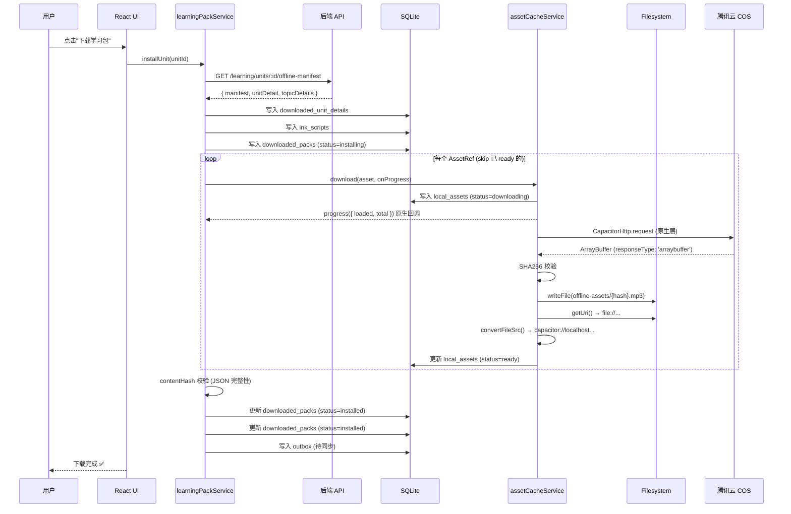
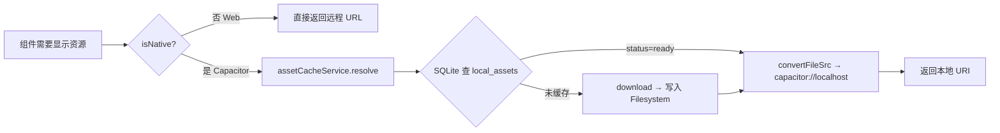
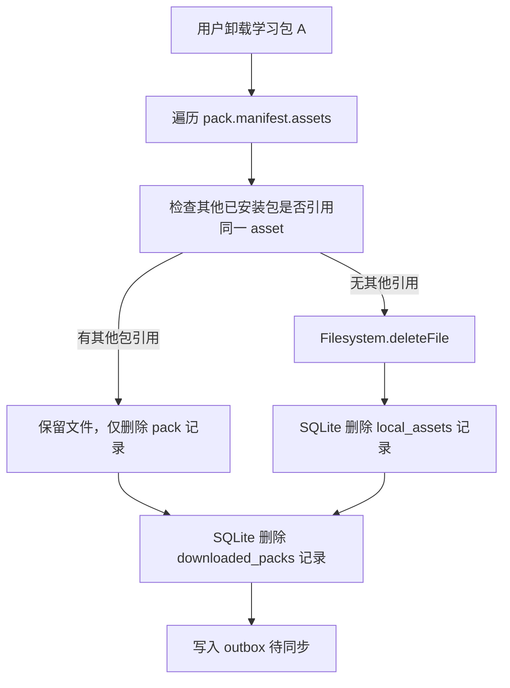

# 离线架构设计：学习包与资源文件

> 适用平台：iOS / Android (Capacitor) + Web (PWA 降级)
> 最后更新：2026-06-11

---

## 一、架构概览

本项目的离线能力由三个独立但协作的子系统组成：

| 子系统 | 用途 | 存储介质 | 关键模块 |
|--------|------|----------|----------|
| **LearningPack**（学习包） | 场景、词汇、句块、话题等结构化学习内容 | Capacitor SQLite | `learning-pack.service.ts` |
| **AssetCache**（资源缓存） | 音频、图片、精灵图等二进制资源 | Capacitor Filesystem (`Directory.Data`) | `asset-cache.service.ts` |
| **MobileBundle**（OTA 热更新） | 整个 Web App 的 zip 增量更新包 | COS → Capacitor 原生更新插件 | `mobile-updates.service.ts` |

三者关系：

```
MobileBundle (OTA)
  └─ 更新 Web 代码（React/TS → dist.zip）

LearningPack (离线数据)
  └─ 引用 AssetRef → 触发 AssetCache 下载

AssetCache (资源文件)
  └─ 从 COS 拉取，存入本地文件系统
```

> **重要区分**：MobileBundle 是 **App 更新**（代码级），LearningPack 是 **内容下载**（数据级）。两者互不依赖，可独立运作。

---

## 二、设计评估

### 2.1 整体评分：⭐⭐⭐⭐ (4/5)

当前设计在架构思路、平台兼容性、离线可用性方面表现扎实，遵循了 Capacitor 生态的最佳实践。以下是逐项分析。

### 2.2 优点 ✅

#### 数据与资源分离（核心设计决策）

```
结构化数据（JSON）  →  SQLite     ← 支持复杂查询、索引、关系
二进制资源（mp3/png）→  Filesystem ← 避免 SQLite 大 blob 性能问题
```

这是 Capacitor 离线架构的**黄金法则**。SQLite 存 blob 会导致：
- 读写放大（base64 编码/解码）
- 无法利用 OS 文件缓存
- WKWebView 无法直接加载 SQLite 中的 blob

当前设计完全避免了这些问题。

#### SHA256 去重 + 完整性校验

```typescript
// 同一资源跨包共享，只存一份
const key = assetId || sha256 || url

// 下载后校验，防止传输损坏
if (ref.sha256) {
  const actual = await digest(buffer)
  if (actual !== ref.sha256) throw new Error('hash mismatch')
}
```

#### iOS WKWebView 兼容

```typescript
// ❌ WKWebView 禁止加载 file://
// ✅ 必须转换为 capacitor://localhost scheme
function toLoadableUrl(fileUri: string): string {
  return Capacitor.convertFileSrc(fileUri)
}
```

这是 iOS 上加载本地文件的**唯一正确方式**，当前实现没有问题。

#### 引用计数卸载

```typescript
// 卸载包 A 时，检查包 B、C 是否还引用同一资源
const stillUsed = new Set(
  otherPacks.flatMap(item => item.manifest.assets.map(...))
)
if (!stillUsed.has(key)) await assetCacheService.removeRef(asset)
```

防止卸载一个场景时误删其他场景共享的音频/图片。

#### 离线优先 + 同步出队

```
安装学习包 → 写入 outbox → 联网时同步到服务端
```

即使用户完全离线安装学习包，联网后也能将状态同步回服务器。

#### 状态机管理

```
missing → downloading → ready
                     → failed → (可重试)
```

每个资源有明确的状态追踪，支持断点续传和错误恢复。

### 2.3 可改进之处 ⚠️ → 已规划 P0/P1 修复

> 详见 [第九节：P0/P1 改进实施方案](#九p0p1-改进实施方案)，以下是问题定位。

#### ① 无下载进度反馈

当前 `assetCacheService.download()` 使用 Web `fetch()`，无法原生报告进度。

**根因**：`fetch()` 的 `response.arrayBuffer()` 是异步一次性读取，中间无回调。

**方案**：切换到 `CapacitorHttp`（`@capacitor/core` 内置），其 `progress` 回调由原生层触发，零开销获取 `{loaded, total}`。

#### ② 无断点续传

`install()` 中顺序下载所有资源，中途失败整个包标记 `failed`。

**根因**：未利用 `local_assets` 表的状态追踪，重试时不做 skip 判断。

**方案**：`install()` 开头检查 `local_assets`，跳过 `status='ready'` 的资产；新增 `retryFailedPack()` 只重试 `failed` 的。

#### ③ 无网络感知

不区分 WiFi / 蜂窝网络。

**方案**：集成 `@capacitor/network` 插件，在 Store 层 `downloadUnitPack()` 入口检查连接类型，蜂窝网络下弹 Snackbar 确认。

#### ④ 学习包版本管理粗糙

```typescript
// 当前：用时间戳作版本号
manifest: { version: Date.now(), ... }
```

无法支持增量更新（只下载变化的词汇/句块）。

**建议**：使用语义化版本 + 服务端返回 diff（增删改的 ID 列表），减少重复下载。

#### ⑤ 缺少缓存驱逐策略

当前只有在显式卸载时才删除资源。如果用户下载了 20 个场景的音频但设备存储不足，没有自动清理机制。

**建议**：实现 LRU（最近最少使用）驱逐，基于 `lastAccessedAt` 字段。当存储超过阈值时自动清理最久未用的资源。

#### ⑥ JSON 数据无完整性校验

二进制资产有 SHA256 校验，但从 API 拉取的学习内容 JSON 直接写入 SQLite，无校验。如果 SQLite 文件损坏，无法检测。

**建议**：Manifest 级别增加 `contentHash`，安装后校验本地数据完整性。

---

## 三、数据流详解

### 3.1 学习包安装全流程



### 3.2 运行时资源加载



### 3.3 资源回收流程



---

## 四、关键数据结构

### 4.1 Manifest（清单）

```typescript
interface LearningPackManifest {
  packId: string           // 场景 ID
  version: number          // 版本号（当前用 Date.now()，P2 迁移语义化版本）
  title: string            // 显示名称
  updatedAt: string        // 更新时间
  contentHash?: string     // [P1] 学习内容 JSON 的 SHA256（完整性校验）
  units: string[]          // 关联的场景单元
  topics: string[]         // 训练话题 ID
  vocabularies: string[]   // 词汇 ID
  chunks: string[]         // 句块 ID
  sentencePatterns: string[]
  scriptEpisodes: string[]
  inkScripts: string[]     // Ink 叙事脚本
  assets: AssetRef[]       // 资源文件引用
}
```

### 4.2 AssetRef（资源引用）

```typescript
interface AssetRef {
  assetId?: string
  url: string              // COS 远程地址
  sha256?: string          // SHA256 校验值（去重+校验）
  mimeType?: string        // MIME 类型
  size?: number            // 文件大小（字节）
  role?: 'background' | 'sprite' | 'voice' | 'bgm' | 'sfx' | 'thumbnail'
}
```

### 4.3 LocalAsset（本地缓存状态）

```typescript
interface LocalAsset {
  id: string               // = assetId || sha256 || url
  assetId: string
  remoteUrl: string        // 远程源地址
  sha256?: string
  mimeType?: string
  size?: number
  localPath: string | null // 相对路径 (offline-assets/{hash}.mp3)
  localUri: string | null  // 绝对 file:// URI
  status: 'missing' | 'downloading' | 'ready' | 'failed'
  downloadedAt: string | null
  lastAccessedAt: string | null
  lastError?: string
}
```

### 4.4 SQLite 表结构（本地）

| 表名 | 用途 | 关键字段 |
|------|------|----------|
| `downloaded_packs` | 已安装的学习包 | packId, manifest, status, installedAt |
| `downloaded_unit_details` | 场景/话题详细数据 | id, unitId, topicId, detail (JSON) |
| `ink_scripts` | Ink 叙事脚本缓存 | id, topicId, unitId, inkJson |
| `local_assets` | 资源文件缓存状态 | id, remoteUrl, localUri, status |
| `outbox` | 离线操作出队（待同步） | entityType, operation, payload, status |
| `dictionary_entries` | 词典离线缓存 | word, pronunciations, senses |
| `expression_entries` | 表达库离线缓存 | type, original, corrected, masteryStatus |

---

## 五、目录约定

### 5.1 服务端（后端）

```
apps/backend/
├── prisma/
│   ├── schema.prisma              # MobileBundle 模型定义
│   ├── seed-learning-packages.ts  # 学习包 CSV 种子数据导入
│   └── data/packages/             # 按场景分类的 CSV 数据
│       └── study-abroad/
│           ├── scenes.csv
│           ├── scene_vocabulary.csv
│           ├── chunks.csv
│           ├── training_topics.csv
│           ├── sentence_patterns.csv
│           ├── script_episodes.csv
│           └── ink-scripts/       # Ink 叙事脚本 JSON
└── src/modules/
    ├── learning/                  # 学习内容 API
    ├── file-assets/               # COS 文件资产管理
    └── mobile-updates/            # OTA 热更新管理
```

### 5.2 客户端（前端）

```
apps/frontend/src/lib/offline/
├── index.ts                       # 统一导出
├── learning-pack.service.ts       # 学习包安装/卸载
├── asset-cache.service.ts         # 资源下载/缓存/解析
├── learning-content.repository.ts # 离线内容读写（SQLite）
├── learning.repository.ts         # 在线学习内容获取
├── practice.repository.ts         # 练习记录缓存
├── offline-storage.service.ts     # 存储统计/清理
├── offline-sync.service.ts        # 离线→在线同步协调
├── sync-api.ts                    # 同步 API 调用
├── sync-outbox.ts                 # 出队管理
├── unified-storage.ts             # SQLite 统一访问层
└── sqlite/                        # SQLite schema 定义
```

本地文件系统路径（Capacitor）：

```
Directory.Data/
└── offline-assets/
    ├── {sha256}.mp3    # 音频文件
    ├── {sha256}.png    # 图片文件
    └── {sha256}.webp   # 精灵图等
```

---

## 六、与 MobileBundle（OTA 热更新）的关系

| 维度 | MobileBundle | LearningPack |
|------|-------------|--------------|
| **更新内容** | Web 代码（React/TS/CSS） | 学习内容数据 |
| **格式** | zip 包 | JSON + 二进制资源文件 |
| **触发方式** | App 启动时检查 | 用户主动下载 |
| **存储** | Capacitor 原生插件管理 | SQLite + Filesystem |
| **版本管理** | 语义化版本 + 灰度发布 | `Date.now()`（P2 迁移语义化版本） |
| **强制性** | 支持强制更新 | 用户可选 |
| **管理后台** | `/admin/mobile-bundles` | 无独立后台，走 seed 数据 |

两者**不应混淆**：MobileBundle 更新 App 本身，LearningPack 更新 App 内的学习内容。

---

## 七、改进路线图（建议优先级）

| 优先级 | 改进项 | 方案 | 预计工作量 | 状态 |
|--------|--------|------|-----------|------|
| P0 | 下载进度反馈 | `fetch()` → `CapacitorHttp` + `progress` 回调 | 2h | 📋 待实施 |
| P0 | 断点续传 / 失败重试 | `install()` 前查 `local_assets` skip ready 项 | 1h | 📋 待实施 |
| P1 | 网络感知（WiFi/蜂窝） | `@capacitor/network` + Store guard | 2h | 📋 待实施 |
| P1 | Manifest contentHash | 安装后校验 JSON 数据完整性 | 1h | 📋 待实施 |
| P2 | 学习包语义化版本 | 服务端 diff API + 增量更新 | 3h | 🔜 计划中 |
| P2 | LRU 缓存驱逐 | `lastAccessedAt` + 存储阈值触发清理 | 4h | 🔜 计划中 |
| P3 | 资产预取（WiFi 下） | 后台预下载下一场景资源 | 3h | 💡 待评估 |

---

## 九、P0/P1 改进实施方案

> 状态：📋 待实施 | 预计总工作量：~6h | 影响文件：5-6 个 | 零后端改动

### 9.1 核心变更：`fetch()` → `CapacitorHttp`

#### 为什么换？

| 维度 | `fetch()` (当前) | `CapacitorHttp` (@capacitor/core 内置) |
|------|:--:|:--:|
| 下载进度 | ❌ 需要手动 `ReadableStream` 分块 | ✅ `progress({loaded, total})` 原生回调 |
| 后台下载 | ❌ WebView 挂起即中断 | ✅ 原生 URLSession 执行，切后台不中断 |
| CORS | ⚠️ 受 WebView CORS 约束 | ✅ 原生层请求，无 CORS 问题 |
| 二进制数据 | `response.arrayBuffer()` 异步转换 | `responseType: 'arraybuffer'` 直接获取 |
| Web 兼容 | ✅ 标准 API | ❌ 仅原生平台，需 `fetch()` fallback |

#### 改动点

**文件：`apps/frontend/src/lib/offline/asset-cache.service.ts`**

`download()` 方法核心重写：

```typescript
import { CapacitorHttp, type HttpOptions } from '@capacitor/core'

// 修改前
const response = await fetch(url)
const buffer = await response.arrayBuffer()

// 修改后
const options: HttpOptions = {
  url,
  method: 'GET',
  responseType: 'arraybuffer',
  // ⭐ 原生进度回调，零开销
  ...(onProgress ? {
    progress: (e: { loaded: number; total: number }) => {
      onProgress(e.loaded, e.total)
    }
  } : {}),
}

if (isNative()) {
  const response = await CapacitorHttp.request(options)
  buffer = response.data as ArrayBuffer  // 直接就是 ArrayBuffer
} else {
  const response = await fetch(url)
  buffer = await response.arrayBuffer()  // Web fallback
}
```

**关键点**：
- `isNative()` 分支：CapacitorHttp（原生进度 + 后台下载）
- `!isNative()` 分支：`fetch()`（Web 端 fallback，无进度）
- `progress` 回调由原生层触发，不需要 ReadableStream 手动分块

### 9.2 断点续传

**文件：`apps/frontend/src/lib/offline/learning-pack.service.ts`**

`install()` 方法增加 skip 逻辑：

```typescript
async install(manifest: LearningPackManifest, onProgress?: PackProgressCallback) {
  // ... 写入 downloaded_packs (status=installing) ...

  // ⭐ 先查哪些 asset 已经 ready，跳过
  const statuses = new Map<string, string>()
  for (const asset of manifest.assets) {
    const key = await assetKey(asset)
    const cached = await localDb.get<LocalAsset>('local_assets', key)
    statuses.set(key, cached?.status ?? 'missing')
  }

  const pending = manifest.assets.filter((asset, i) => {
    const key = assetKeySync(manifest.assets[i]) // 同步版本
    return statuses.get(key) !== 'ready'
  })

  let completedCount = manifest.assets.length - pending.length
  const totalCount = manifest.assets.length

  for (const asset of pending) {
    await assetCacheService.download(asset, (loaded, total) => {
      // 聚合成包级别进度
      onProgress?.({
        assetIndex: completedCount,
        assetTotal: totalCount,
        assetLoaded: loaded,
        assetTotalBytes: total,
      })
    })
    completedCount++
  }

  // ... 标记 installed ...
}
```

**新增方法**：

```typescript
// learning-pack.service.ts 新增
async retryFailedPack(packId: string): Promise<InstalledLearningPack> {
  const pack = await localDb.get<InstalledLearningPack>('downloaded_packs', packId)
  if (!pack || pack.status !== 'failed') throw new Error('Pack not in failed state')
  return this.install(pack.manifest)  // install 内部已 skip ready
}
```

### 9.3 网络感知（WiFi / 蜂窝）

**新增依赖**：`@capacitor/network`

```bash
pnpm --filter @manyu/frontend add @capacitor/network
npx cap sync
```

**文件：`apps/frontend/src/stores/learning.store.ts`**

`downloadUnitPack()` 入口加守卫：

```typescript
import { Network } from '@capacitor/network'
import { isNative } from '@/lib/native'
import { toast } from 'sonner'

async downloadUnitPack(unitId: string) {
  // ⭐ 网络类型检查
  if (isNative()) {
    const status = await Network.getStatus()
    if (status.connectionType === 'cellular') {
      // 蜂窝网络 → 弹确认
      const confirmed = await new Promise<boolean>((resolve) => {
        toast('当前使用蜂窝网络，下载可能消耗流量', {
          action: { label: '继续下载', onClick: () => resolve(true) },
          cancel: { label: '取消', onClick: () => resolve(false) },
          duration: 8000,
        })
      })
      if (!confirmed) return
    }
  }

  // ... 原有下载逻辑 ...
}
```

**可选增强**：在 Store 中维护 `preferWifiOnly: boolean` 状态（存 `Preferences`），用户可在设置中开启"仅 WiFi 下载"。

### 9.4 Manifest contentHash 校验

**文件：`apps/frontend/src/lib/offline/learning-pack.service.ts`**

```typescript
// Manifest 增加字段
interface LearningPackManifest {
  // ... 现有字段 ...
  contentHash?: string  // ⭐ 新增：学习内容 JSON 的 SHA256
}

// install() 末尾增加校验
async install(manifest: LearningPackManifest) {
  // ... 下载完成 ...

  // ⭐ JSON 数据完整性校验
  if (manifest.contentHash) {
    const stored = await localDb.get('downloaded_unit_details', manifest.packId)
    const actual = await digest(JSON.stringify(stored))
    if (actual !== manifest.contentHash) {
      throw new Error('Content integrity check failed — data may be corrupted')
    }
  }

  // ... 标记 installed ...
}
```

**后端配合**（可选，P2 再做）：API 返回 manifest 时附带 `contentHash`。

### 9.5 改动文件清单

```
apps/frontend/src/lib/offline/asset-cache.service.ts    ← 核心：fetch→CapacitorHttp + onProgress (~60行改)
apps/frontend/src/lib/offline/learning-pack.service.ts  ← 核心：skip ready + progress聚合 + retry (~50行增)
apps/frontend/src/stores/learning.store.ts              ← 桥接：网络守卫 + progress透传 (~40行增)
apps/frontend/src/features/learning/pages/              ← UI：进度条 + 下载状态 (~50行增)
apps/frontend/src/lib/offline/offline-storage.service.ts← 统计：断点恢复计数 (~10行改)
apps/frontend/package.json                              ← 新增 @capacitor/network
────────────────────────────────────────────────────────────────────────────────
总计: ~210 行新增/修改，0 行删除，0 后端改动
```

### 9.6 实施顺序

```
Step 1: asset-cache.service.ts — CapacitorHttp + progress (独立模块，先改)
Step 2: learning-pack.service.ts — skip ready + progress聚合 + retryFailedPack
Step 3: learning.store.ts — 网络守卫 + progress回调透传
Step 4: UI 层 — 进度条组件 + 下载状态展示
Step 5: package.json — 添加 @capacitor/network, npx cap sync
```

---

## 八、相关文件索引

| 文件 | 说明 |
|------|------|
| `apps/frontend/src/lib/offline/learning-pack.service.ts` | 学习包安装/卸载核心逻辑 |
| `apps/frontend/src/lib/offline/asset-cache.service.ts` | 资源下载缓存 + iOS convertFileSrc |
| `apps/frontend/src/lib/offline/offline-storage.service.ts` | 存储统计 + 清理 |
| `apps/frontend/src/lib/native/filesystem.ts` | Capacitor Filesystem 封装 |
| `apps/backend/src/modules/learning/learning.service.ts` | 服务端学习内容 API |
| `apps/backend/src/modules/file-assets/file-assets.service.ts` | COS 文件资产管理 |
| `apps/backend/src/modules/mobile-updates/mobile-updates.service.ts` | OTA 热更新服务 |
| `apps/backend/prisma/schema.prisma` | MobileBundle / FileAsset 模型定义 |
| `apps/backend/prisma/seed-learning-packages.ts` | 学习包 CSV 种子导入 |
