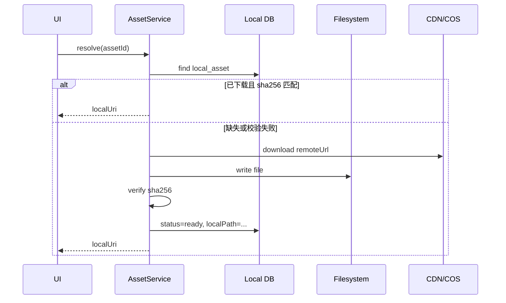

# 本地持久化、资源缓存与数据同步架构

> 本文用于梳理 SpeakGuild 在 Web 与 Capacitor App 中如何处理字典、单词查询、句块查询、句型查询、学习包、VN 练习资源，以及用户加入学习库后的本地持久化与远端同步。

---

## 目标

当前产品中有三类数据需要同时兼顾查询速度、离线能力和跨端一致性：

1. 内容数据：字典、单词、句块、句型、学习单元、话题、VN 练习、脚本、场景、角色等。
2. 资源文件：立绘、背景、音频、BGM、环境音、用户录音等。
3. 用户数据：我的学习库、生词本、收藏、学习进度、练习记录、复习状态、游戏存档等。

推荐整体方向是：

```txt
后端 PostgreSQL 作为权威数据源
  -> 同步接口 / 内容包 manifest
  -> Web IndexedDB / Cache API
  -> Capacitor SQLite / Filesystem
```

数据库负责结构化数据和资源元信息，文件系统或对象存储负责真实资源文件。客户端保留本地副本，并通过同步接口与服务端保持一致。

本项目当前采用的产品边界：

1. App 支持“已下载学习包可离线练习”，不要求所有内容全量离线。
2. 字典只离线用户查过的词、加入学习库的内容，以及已下载学习包包含的词汇。
3. 用户录音目前已实现上传到后台；本地缓存只作为上传前暂存、失败重试和回放辅助。
4. 学习包卸载后，优先删除该学习包相关资源；以后如果需要提升二次安装速度，再增加可配置缓存保留策略。
5. Web 管理端不需要离线能力，保持在线管理后台即可。

---

## 总体原则

### 数据进数据库

适合进入数据库的数据包括：

| 类型 | 示例 | 原因 |
|---|---|---|
| 字典内容 | `DictionaryEntry`、释义、词形、发音信息 | 需要查询、版本管理、同步 |
| 教学内容 | `Vocabulary`、`Chunk`、`SentencePattern`、例句 | 需要按场景、难度、话题检索 |
| 学习结构 | `Scene`、`TrainingTopic`、`ScriptEpisode`、学习包、单元 | 需要组合、排序、权限控制 |
| 资源元数据 | `FileAsset`、`FileReference`、`MobileBundle` | 需要知道资源归属、hash、大小、状态 |
| 用户状态 | 学习库、进度、练习记录、收藏、生词本 | 需要跨端同步和恢复 |

### 文件进文件系统

适合进入文件系统或对象存储的数据包括：

| 类型 | 示例 | 存储位置 |
|---|---|---|
| 图片 | 背景、立绘、头像、缩略图 | COS / CDN / Capacitor Filesystem |
| 音频 | 单词发音、台词音频、BGM、环境音 | COS / CDN / Capacitor Filesystem |
| 视频 | 教学短视频、演示素材 | COS / CDN / Capacitor Filesystem |
| 大型内容包 | 离线学习包 zip、预编译脚本包 | COS / CDN / 本地缓存目录 |
| 用户录音 | 练习录音、口语样本 | 本地文件，上传后关联 `FileAsset` |

不要把图片、音频、视频二进制直接写入业务数据库。数据库只记录 `assetId`、`sha256`、`mimeType`、`size`、`remoteUrl/cosKey`、`localPath`、`version` 等字段。

---

## 数据分层

### 公共内容库

公共内容库由服务端维护，是所有用户共享的学习内容。

```txt
DictionaryEntry
Vocabulary
Chunk
ChunkExample
SentencePattern
Scene
TrainingTopic
ScriptEpisode
GameLocation
GameCharacter
InkScript
LearningPack / Unit / Topic
FileAsset / FileReference
MobileBundle
```

这类数据适合按版本同步。客户端不应随意修改公共内容，只保存本地副本。

### 用户私有数据

用户私有数据由用户行为产生。

```txt
MyLearningUnit
UserSceneProgress
UserChunkProgress
ExpressionItem
PracticeSession
PracticeTurn
ExplorationRecord
GameSave
UserPreference
WordsStore / 生词本
收藏记录
```

这类数据适合用增量同步。客户端可以先写本地，再由同步队列上传到服务端。

### 资源索引

资源索引用于连接业务数据和真实文件。

```txt
FileAsset:
  id
  sha256
  bucket
  cosKey
  group
  size
  mimeType
  filename
  status

LocalAsset:
  assetId
  sha256
  localPath
  downloadStatus
  downloadedAt
  lastAccessedAt
```

服务端已有 `FileAsset` 与 `FileReference` 的雏形，客户端可以补一个本地 `local_asset` 表或等价 IndexedDB store。

---

## 客户端存储建议

### Web

Web 端更适合轻量缓存和在线优先。管理后台不需要离线能力，管理员操作以服务端实时数据为准。

| 数据 | 推荐存储 |
|---|---|
| 页面临时状态 | Zustand |
| 用户偏好、小型状态 | localStorage / Zustand persist |
| 查询缓存、内容副本 | IndexedDB |
| 图片和音频响应缓存 | Cache API |
| 登录 token 等敏感信息 | httpOnly cookie 优先 |

Web 用户端可以继续保留现有页面 API 调用模式，并按需把用户查过的字典词条、学习包详情、资源 manifest 放入 IndexedDB 缓存。Web 管理端不做离线缓存，只保留普通查询状态和表单状态。

### Capacitor App

Capacitor 端更适合离线优先：

| 数据 | 推荐存储 |
|---|---|
| 内容表 | SQLite |
| 用户学习状态 | SQLite |
| 同步队列 | SQLite |
| 图片、音频、包文件 | Capacitor Filesystem |
| 敏感 token | Secure Storage 类插件 |
| UI 临时状态 | Zustand |

移动端页面不建议直接依赖远端 API 返回结果渲染。更推荐：

```txt
页面 -> Repository -> 本地 SQLite
                 -> SyncService 后台刷新
                 -> AssetService 返回本地资源路径
```

这样弱网或离线时仍然可以查看已下载学习包、继续练习、记录进度，并查询用户已经查过或已下载学习包包含的词条。

---

## 推荐模块拆分

```txt
shared/
  types/
  api/
  repositories/
  sync/
  assets/

web/
  pages/
  stores/
  platform/web-storage.ts
  platform/web-assets.ts

mobile/
  pages/
  stores/
  platform/sqlite-storage.ts
  platform/capacitor-assets.ts
```

### UI Store

Zustand 仍然保留，但职责收窄：

```txt
负责：
  loading
  当前筛选条件
  当前选中项
  弹窗开关
  页面级缓存

不负责：
  长期内容持久化
  同步协议
  资源文件下载
  冲突处理
```

### Repository

Repository 负责给 UI 提供稳定读写接口：

```ts
interface LearningRepository {
  getMyUnits(): Promise<MyUnit[]>
  getUnitDetail(unitId: string): Promise<UnitDetail | null>
  enrollUnit(unitId: string): Promise<void>
  quitUnit(unitId: string): Promise<void>
}
```

Web 实现可以优先读 API，再写 IndexedDB；移动端实现可以优先读 SQLite，再触发后台同步。

### SyncService

SyncService 负责：

```txt
拉取公共内容增量
拉取用户数据增量
上传本地 outbox
处理版本 cursor
处理冲突
标记同步状态
```

### AssetService

AssetService 负责：

```txt
根据 assetId 查找本地路径
下载缺失资源
校验 sha256
清理长期未访问资源
返回可渲染/可播放的 URI
```

---

## 同步设计

### 内容同步

公共内容建议使用版本号或内容包 manifest。

```txt
GET /sync/content/manifest?sinceVersion=123
GET /sync/content/bundles/:bundleId
GET /sync/content/assets?packId=xxx
```

返回结构示例：

```ts
type ContentManifest = {
  version: number
  generatedAt: string
  changed: {
    dictionaries: string[]
    vocabularies: string[]
    chunks: string[]
    sentencePatterns: string[]
    scenes: string[]
    topics: string[]
    scriptEpisodes: string[]
    assets: string[]
  }
  deleted: {
    dictionaries: string[]
    vocabularies: string[]
    chunks: string[]
    sentencePatterns: string[]
    scenes: string[]
    topics: string[]
    scriptEpisodes: string[]
    assets: string[]
  }
}
```

客户端保存 `contentVersion`。启动、进入学习库、用户手动刷新时检查新版本。

内容同步不做全量离线，默认只同步以下范围：

| 范围 | 说明 |
|---|---|
| 用户已下载学习包 | 单元、话题、VN 练习、词汇、句块、句型、脚本和资源 manifest |
| 用户加入学习库但未下载的学习包 | 保留必要摘要、进度和远端引用 |
| 用户查过的字典词 | 保存词条详情，便于下次离线查询 |
| 用户收藏/加入生词本的词 | 保存词条详情和用户标记 |

未被用户访问、未加入学习库、未下载学习包引用的公共内容，不主动同步到客户端。

### 用户数据同步

用户数据建议使用 cursor + outbox。

```txt
POST /sync/user/push
GET /sync/user/pull?cursor=xxx
POST /sync/user/ack
```

本地每次用户操作先写业务表，再写 outbox：

```ts
type SyncOutboxItem = {
  id: string
  entityType: 'my_unit' | 'word_entry' | 'chunk_progress' | 'practice_session'
  entityId: string
  operation: 'create' | 'update' | 'delete'
  payload: unknown
  clientMutationId: string
  createdAt: string
  retryCount: number
  status: 'pending' | 'syncing' | 'synced' | 'failed'
}
```

服务端使用 `clientMutationId` 幂等处理，避免重复提交。

用户录音属于用户私有资源，目前已经实现上传到后台。离线同步侧只需要围绕本地暂存、失败重试和回放缓存补齐状态管理。

```txt
录音完成
  -> 写入本地文件
  -> 创建 practice_turn / recording outbox
  -> 后台上传文件
  -> 服务端创建 FileAsset / FileReference
  -> 回写远端 assetId 和 audioUrl
  -> 标记本地录音 synced
```

如果上传失败，练习记录仍然保留在本地，录音文件继续留在本地等待重试。

---

## 冲突策略

不同数据使用不同策略，不建议全局只用一种。

| 数据 | 推荐策略 |
|---|---|
| 公共内容 | 服务端版本为准 |
| 用户偏好 | last-write-wins |
| 我的学习库 | union 合并，删除需要 tombstone |
| 生词本/收藏 | union 合并，删除需要 tombstone |
| 学习进度 | 取更高进度、更晚练习时间 |
| 练习记录 | append-only，不覆盖 |
| 游戏存档 | 按 slot 做 last-write-wins，必要时保留冲突副本 |
| 用户录音 | append-only，上传成功后关联远端 asset |

删除操作建议保留 `deletedAt` 或 tombstone，否则多端同步时容易出现“删了又被拉回来”。

这里的 tombstone 可以理解为“删除记录”。例如用户在手机上把某个学习包移出学习库，同时网页端还保留旧数据。如果服务端只看到手机端少了一条记录，却不知道这是用户主动删除，下一次同步时网页端的旧记录可能又把它同步回来。保留一条 `deletedAt` 记录，就能明确告诉各端：这条关系已经被用户删除，不要再恢复。

---

## 资源缓存设计

### 服务端资源元数据

服务端已有 `FileAsset`，可以继续作为统一资源表。业务对象不要直接保存裸 URL，建议保存 `assetId` 或在 JSON 中保存资源引用。

```ts
type AssetRef = {
  assetId: string
  role: 'background' | 'sprite' | 'voice' | 'bgm' | 'sfx' | 'thumbnail'
  url: string
  sha256: string
  mimeType: string
  size: number
}
```

### 客户端本地资源表

```ts
type LocalAsset = {
  assetId: string
  sha256: string
  remoteUrl: string
  localPath: string | null
  mimeType: string
  size: number
  status: 'missing' | 'downloading' | 'ready' | 'failed'
  downloadedAt: string | null
  lastAccessedAt: string | null
}
```

### 下载流程



---

## 学习包设计

学习包建议拆成 manifest + 内容数据 + 资源列表。

```ts
type LearningPackManifest = {
  packId: string
  version: number
  title: string
  updatedAt: string
  units: string[]
  topics: string[]
  vocabularies: string[]
  chunks: string[]
  sentencePatterns: string[]
  scriptEpisodes: string[]
  inkScripts: string[]
  assets: AssetRef[]
}
```

客户端安装学习包时：

1. 拉取 manifest。
2. 写入或更新本地内容表。
3. 检查资源是否已存在。
4. 下载缺失资源。
5. 校验 hash。
6. 标记学习包 `installed`。

学习包卸载时：

1. 删除本地包安装记录。
2. 保留用户进度和练习记录。
3. 删除该学习包独占的本地资源。
4. 如果某个资源仍被其他已安装学习包引用，则保留。
5. 后续如果需要提升二次安装速度，再增加“卸载后保留缓存”的可配置策略。

---

## 对现有代码的渐进式改造

### 当前状态

前端目前有两种状态管理雏形：

| 文件 | 当前职责 |
|---|---|
| `apps/frontend/src/stores/learning.store.ts` | 远端 API 状态缓存 |
| `apps/frontend/src/stores/assets.store.ts` | 生词本的轻量本地持久化 |

后端 schema 已有多数组件：

| 模型 | 可承担职责 |
|---|---|
| `FileAsset` | 统一资源元数据 |
| `FileReference` | 资源和业务对象关系 |
| `MobileBundle` | 移动端内容包或资源包版本 |
| `DictionaryEntry` | 字典内容 |
| `Vocabulary` | 学习词汇 |
| `Chunk` / `ChunkExample` | 表达块 |
| `SentencePattern` | 句型 |
| `Scene` / `TrainingTopic` / `ScriptEpisode` | 学习场景、话题、VN 关卡 |
| `UserChunkProgress` / `UserSceneProgress` | 用户进度 |
| `ExpressionItem` | 用户表达库 |
| `PracticeSession` / `PracticeTurn` | 练习记录 |
| `GameSave` | VN / 探索存档 |

### 第一阶段：资源缓存

目标：不大改 API，先让图片、音频、立绘、背景能本地缓存。

改造内容：

```txt
新增 AssetService
新增本地 local_asset 表或 IndexedDB store
业务响应中尽量返回 assetId + url + sha256
VN 播放器、音频播放、背景图展示优先使用本地 URI
用户录音支持本地暂存、后台上传、失败重试
```

收益：

```txt
降低重复下载
弱网下 VN 体验更稳定
为学习包离线化做准备
```

### 第二阶段：用户数据本地化

目标：我的学习库、生词本、进度、收藏可以离线写入。

改造内容：

```txt
新增本地 user_* 表
新增 sync_outbox
enrollUnit / quitUnit / addWord / removeWord 先写本地
后台同步到服务端
```

收益：

```txt
移动端离线也能继续学习
用户操作不被网络阻塞
跨端可以恢复学习状态
```

### 第三阶段：公共内容离线化

目标：已下载学习包内容可本地查询和练习，用户查过或收藏的词可离线查询。

改造内容：

```txt
新增 content manifest 接口
新增本地 dictionary/vocabulary/chunk/topic/unit 表
Repository 从本地读取内容
SyncService 增量刷新内容版本
```

收益：

```txt
已下载学习包查询更快
App 可以离线练习已下载内容
后续支持按学习包预下载
```

---

## 建议优先级

推荐从低风险、高收益的部分开始：

1. 资源缓存：立绘、背景、音频、BGM。
2. 生词本和我的学习库本地持久化。
3. 用户进度和练习记录 outbox 同步。
4. 学习包 manifest 和资源预下载。
5. 字典、句块、句型的完整离线内容库。

不建议一开始就把所有前端 API 调用全部重写成本地 Repository。先从 VN 资源和用户学习库切入，能最快验证架构价值。

---

## 待确认问题

后续进入实现前，以下问题已经有当前结论：

| 问题 | 当前结论 |
|---|---|
| App 离线范围 | 只要求已下载学习包可离线练习 |
| 字典离线范围 | 只离线用户查过的词、加入学习库和下载到本地的学习包相关词 |
| 用户录音 | 已实现上传后台，本地保留上传队列和回放缓存 |
| 学习包卸载 | 优先删除相关资源，以后再考虑缓存策略 |
| Web 管理端 | 不需要离线能力 |

仍需后续细化的问题：

1. 多端同时修改学习库、生词本、收藏时，删除操作是否需要回收站或撤销入口。
2. 用户录音上传成功后，本地文件是长期保留用于回放，还是按空间策略清理。
3. 已下载学习包更新版本时，是自动更新，还是提示用户确认后更新。

---

## 结论

这套架构不需要一次性推倒重来。后端已有资源表、内容表和用户进度表的基础，适合渐进式增强。

最稳的路线是：

```txt
先资源缓存
再用户数据本地化
再已下载学习包内容离线化
最后做完整内容包同步
```

这样可以在不打断当前 Web 端功能的情况下，逐步把 Capacitor App 做成真正适合学习场景的离线优先客户端。
