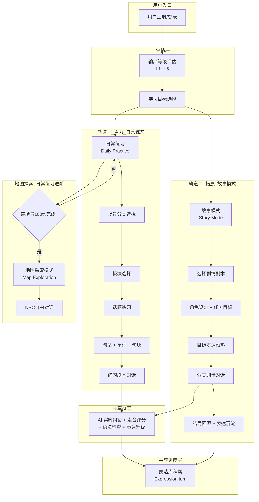
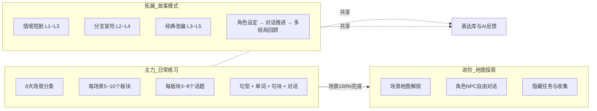
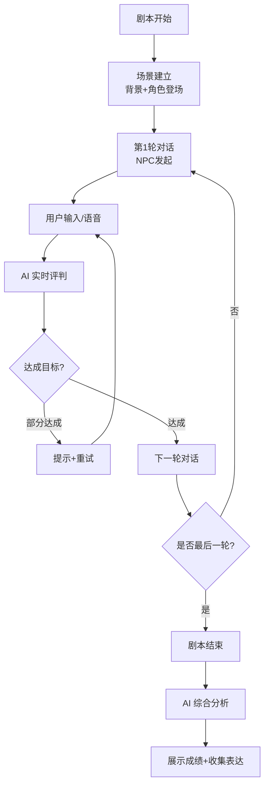
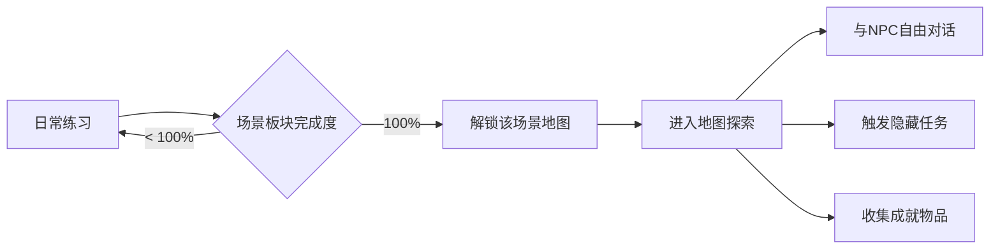
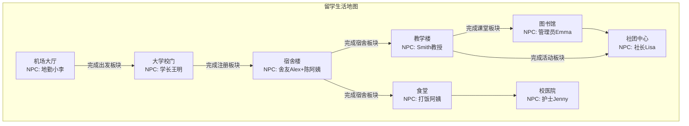
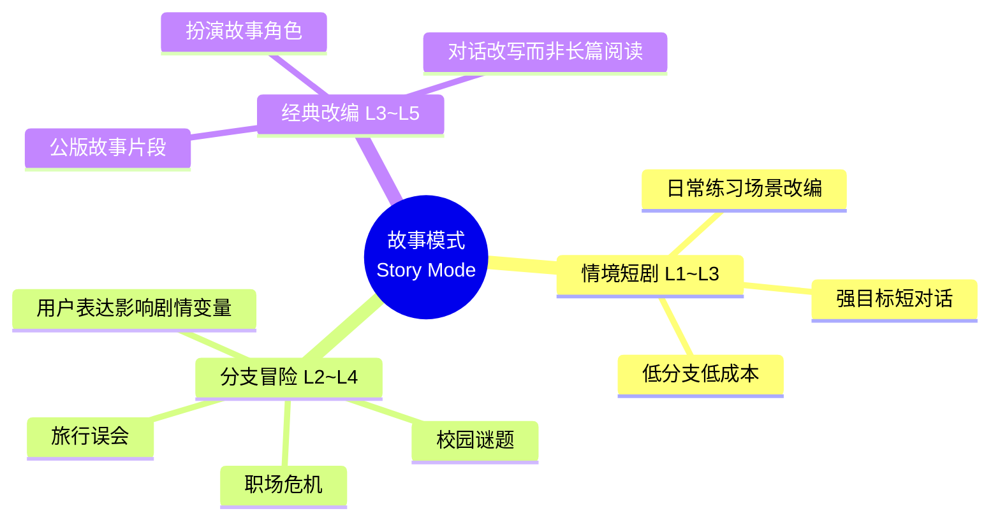
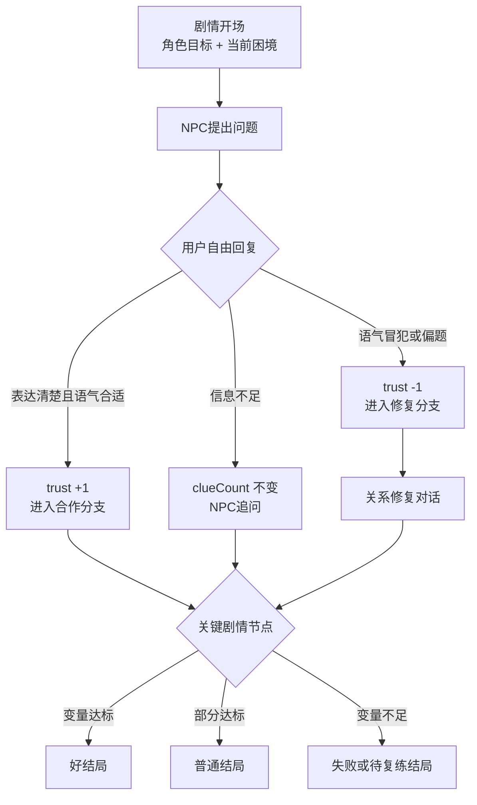
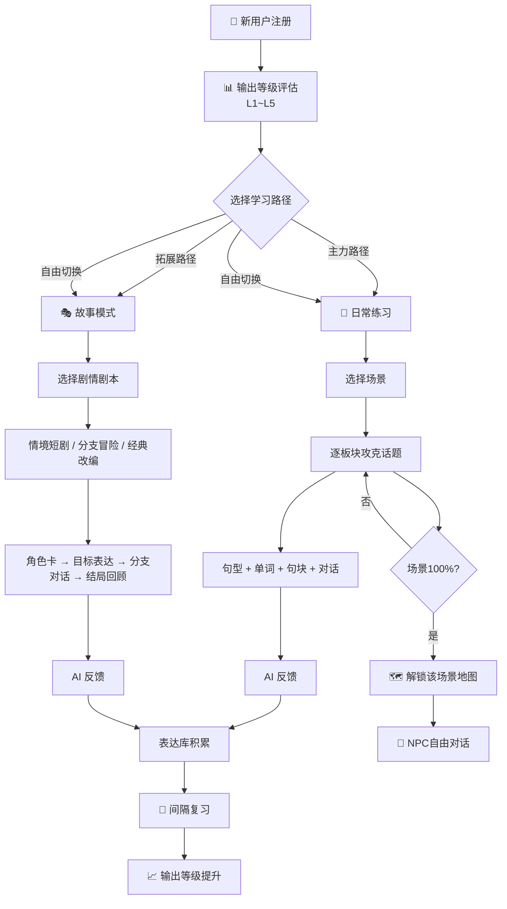
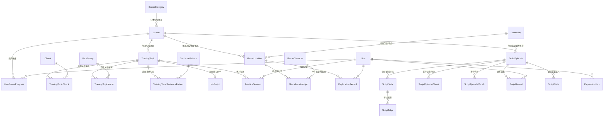

# 漫语町（ManYu）内容架构设计文档

> 版本：v1.3 | 日期：2026-06-12 | 状态：设计稿（故事模式重构：互动剧情对话）

---

## 目录

1. [整体数据流架构](#1-整体数据流架构)
2. [内容层级树结构](#2-内容层级树结构)
3. [场景分类体系](#3-场景分类体系)
4. [各场景板块与话题设计](#4-各场景板块与话题设计)
5. [话题内容要素设计](#5-话题内容要素设计)
6. [练习剧本设计规范](#6-练习剧本设计规范)
7. [地图探索模式](#7-地图探索模式)
8. [故事模式（互动剧情对话）](#8-故事模式互动剧情对话)
9. [用户成长路径](#9-用户成长路径)
10. [数据库模型映射](#10-数据库模型映射)

---

## 1. 整体数据流架构

### 1.1 核心数据流（双轨道并行）



### 1.2 三大模块关系：主力 + 拓展 + 进阶



> **关键设计原则**：
> - **日常练习** 是主力轨道，系统化训练交际英语，适合所有用户
> - **故事模式** 是拓展轨道，本质是更剧情化、更自由的角色扮演剧本练习；它让用户在故事身份、任务目标和分支选择中继续练英语输出
> - 两条轨道**平行独立**，用户可自由选择入口，随时切换
> - 唯有 **地图探索** 需要在对应场景的日常练习 100% 完成后解锁
> - 两条轨道**共享**同一套 AI 反馈引擎和表达库（ExpressionItem），学习成果互通

---

## 2. 内容层级树结构

```
漫语町内容体系（主力 + 拓展双轨道）
│
├── 🌱 主力轨道：日常练习（Daily Practice）────── 系统化交际英语训练
│   ├── 场景分类（SceneCategory）× 8
│   │   ├── 🎓 留学生活（10个板块 / 37个话题）
│   │   ├── 💬 日常社交（7个板块 / 24个话题）
│   │   ├── ✈️ 旅行英语（7个板块 / 24个话题）
│   │   ├── 💼 职场交流（7个板块 / 23个话题）
│   │   ├── 🎯 学术挑战（5个板块 / 17个话题）
│   │   ├── 🏥 健康医疗（6个板块 / 18个话题）
│   │   ├── 🏠 独自生活（7个板块 / 21个话题）
│   │   └── 🎭 休闲娱乐（5个板块 / 13个话题）
│   │
│   └── 每个话题四要素 ──────────────────────
│       ├── 📝 句型（SentencePattern）── 3~5个
│       ├── 📖 单词（Vocabulary）──────── 5~10个
│       ├── 🧱 句块（Chunk）──────────── 3~6个
│       └── 🎬 练习剧本（InkScript）──── NPC互动对话
│
├── 🎭 拓展轨道：故事模式（Story Mode）────────── 互动剧情·角色扮演·分支对话
│   │
│   ├── 🎬 情境短剧（Scene Drama）──────── L1~L3，日常场景的剧情化延伸
│   │   ├── 初到宿舍、错过航班、社团试镜
│   │   ├── 强目标、短流程、低分支
│   │   └── 首期 8~12 个短剧，复用日常练习场景资源
│   │
│   ├── 🧭 分支冒险（Branching Quest）────── L2~L4，根据用户表达推进不同剧情
│   │   ├── 校园谜题、旅行误会、职场危机
│   │   ├── 选择 + 自由回复共同影响剧情状态
│   │   └── 首期 4~6 个中短篇，验证分支体验
│   │
│   ├── 📚 经典改编（Classic Roleplay）───── L3~L5，公版故事的角色代入
│   │   ├── 《绿野仙踪》片段：扮演 Dorothy 或旅伴
│   │   ├── 《秘密花园》片段：扮演 Mary 与园丁沟通
│   │   └── 首期 1 部小规模试做，控制改编成本
│   │
│   └── 每个故事关卡要素 ──────────────────
│       ├── 🎭 玩家角色卡（Role Card）
│       ├── 🎯 剧情任务目标（Story Goal）
│       ├── 🧱 目标句块（Chunk）
│       ├── 💬 分支对话（Branching Dialogue）
│       └── 🏁 结局回顾（Ending Review）
│
├── 🗺️ 进阶：地图探索（Map Exploration）──────── 场景100%后解锁
│   └── 每个场景对应一张地图，含多个地点 + NPC自由对话
│
└── 📦 共享层 ──────────────────────────── 两条轨道数据互通
    ├── ExpressionItem（表达库，统一收集）
    ├── AI 评分 / 纠错 / 升级建议（同一引擎）
    └── 间隔复习 Spaced Repetition（统一调度）
```

---

## 3. 场景分类体系

### 3.1 现有 7 个场景 + 建议新增

| # | 场景分类 | 英文名 | 图标建议 | 说明 |
|---|---------|--------|---------|------|
| 1 | 🎓 留学生活 | Study Abroad | `graduation-cap` | 出国留学全流程 |
| 2 | 💬 日常社交 | Daily Social | `users` | 交友、聚会、闲聊 |
| 3 | ✈️ 旅行英语 | Travel English | `plane` | 出境旅行全场景 |
| 4 | 💼 职场交流 | Workplace | `briefcase` | 面试、会议、邮件 |
| 5 | 🎯 学术挑战 | Academic | `book-open` | 论文、演讲、研究 |
| 6 | 🏥 健康医疗 | Healthcare | `heart-pulse` | 看病、买药、急救 |
| 7 | 🏠 独自生活 | Independent Living | `home` | 租房、银行、超市 |
| 8 | 🎭 休闲娱乐 | Leisure | `gamepad-2` | **新增** — 电影、运动、聚会 |

### 3.2 为什么不建议更多

保持 **8 个场景** 的理由：
- 每个场景 5~10 个板块、每个板块 3~8 个话题，总量已相当庞大
- 与现有 `SceneCategory` 表设计吻合，扩展性好
- 8 个场景足够覆盖 CEFR A1~B2 阶段的核心交际需求
- UI 展示友好（2行×4列 或 轮播布局）

---

## 4. 各场景板块与话题设计

### 4.1 🎓 留学生活（Study Abroad）

| 板块 | 话题数 | 话题列表 | NPC角色 | 场景设定 |
|------|--------|---------|---------|---------|
| **1. 出发与登机** | 3 | 值机托运、安检通关、机上服务 | 地勤人员、空乘 | 国际机场出发大厅 |
| **2. 入学注册** | 4 | 报到注册、选课咨询、领取学生证、参加迎新会 | 注册处老师、辅导员 | 大学行政楼/注册大厅 |
| **3. 入住宿舍** | 3 | 办理入住、认识舍友、宿舍规则 | 宿管阿姨、舍友 | 学生宿舍楼 |
| **4. 宿舍生活** | 4 | 作息协商、借还物品、打扫分工、宿舍聚会 | 舍友（2~3人） | 宿舍房间/公共区域 |
| **5. 课堂学习** | 5 | 自我介绍、课堂提问、小组讨论、课后请教、请假 | 教授、同学 | 教室/阶梯教室 |
| **6. 参加活动** | 4 | 社团招新、运动会、文化节、志愿者 | 社团成员、活动组织者 | 社团活动室/操场 |
| **7. 食堂就餐** | 3 | 点餐、询问菜品、饭卡充值 | 打饭阿姨、收银员 | 大学食堂 |
| **8. 图书馆学习** | 4 | 借书还书、预约座位、打印复印、查阅资料 | 图书管理员 | 大学图书馆 |
| **9. 校园购物** | 3 | 书店购书、便利店、校医院买药 | 店员、药剂师 | 校园书店/便利店 |
| **10. 考试与论文** | 4 | 备考讨论、交作业、论文答辩、成绩查询 | 教授、助教、同学 | 自习室/办公室 |

### 4.2 💬 日常社交（Daily Social）

| 板块 | 话题数 | 话题列表 | NPC角色 | 场景设定 |
|------|--------|---------|---------|---------|
| **1. 初次见面** | 4 | 自我介绍、交换联系方式、聊家乡、聊兴趣爱好 | 新朋友 | 咖啡馆/聚会 |
| **2. 朋友聚会** | 4 | 约饭、约看电影、生日派对、节日庆祝 | 朋友（2~4人） | 餐厅/KTV/家中 |
| **3. 闲聊寒暄** | 3 | 聊天气、聊周末计划、聊新闻 | 熟人/同事 | 茶水间/电梯里 |
| **4. 表达情感** | 4 | 表达感谢、道歉认错、安慰朋友、表达赞美 | 朋友/家人 | 多种场景 |
| **5. 约会交流** | 3 | 邀约、约会对话、表达好感 | 约会对象 | 餐厅/公园 |
| **6. 社交媒体** | 3 | 发帖评论、私信聊天、视频通话 | 网友/朋友 | 线上 |
| **7. 文化差异** | 3 | 解释习俗、节日介绍、饮食习惯 | 外国朋友 | 聚会/餐桌 |

### 4.3 ✈️ 旅行英语（Travel English）

| 板块 | 话题数 | 话题列表 | NPC角色 | 场景设定 |
|------|--------|---------|---------|---------|
| **1. 行前准备** | 3 | 订机票、订酒店、办签证 | 客服人员 | 线上/旅行社 |
| **2. 机场出行** | 4 | 值机、安检、登机、转机 | 地勤、安检员 | 机场 |
| **3. 酒店入住** | 3 | 办理入住、客房服务、退房 | 前台、服务员 | 酒店 |
| **4. 交通出行** | 4 | 打车、坐地铁、租车、问路 | 司机、路人 | 城市交通 |
| **5. 景点游玩** | 4 | 买门票、导游解说、拍照求助、纪念品购物 | 导游、售票员 | 景点 |
| **6. 餐饮美食** | 3 | 餐厅点餐、街边小吃、买单结账 | 服务员、摊主 | 餐厅/街边 |
| **7. 紧急情况** | 3 | 迷路求助、失物招领、使馆求助 | 警察、工作人员 | 街头/使馆 |

### 4.4 💼 职场交流（Workplace）

| 板块 | 话题数 | 话题列表 | NPC角色 | 场景设定 |
|------|--------|---------|---------|---------|
| **1. 求职面试** | 4 | 自我介绍、回答提问、询问待遇、后续跟进 | 面试官 | 会议室 |
| **2. 日常办公** | 4 | 安排会议、汇报工作、请假申请、茶水间闲聊 | 同事、上司 | 办公室 |
| **3. 邮件沟通** | 3 | 写邮件、回复邮件、跟进邮件 | — | 办公桌前 |
| **4. 商务会议** | 4 | 主持会议、发表观点、处理分歧、会议总结 | 与会者 | 会议室 |
| **5. 电话沟通** | 3 | 接听电话、预约确认、客户回访 | 客户/同事 | 办公室 |
| **6. 商务应酬** | 3 | 商务午餐、拜访客户、展会交流 | 客户、合作伙伴 | 餐厅/展会 |
| **7. 升职加薪** | 2 | 绩效面谈、薪资谈判 | 上司/HR | 办公室 |

### 4.5 🎯 学术挑战（Academic）

| 板块 | 话题数 | 话题列表 | NPC角色 | 场景设定 |
|------|--------|---------|---------|---------|
| **1. 学术演讲** | 3 | 准备演讲、正式演讲、回答提问 | 听众、评委 | 报告厅 |
| **2. 论文写作** | 4 | 选题讨论、文献综述、引用格式、导师反馈 | 导师、同学 | 办公室/图书馆 |
| **3. 学术讨论** | 3 | 研讨课发言、学术辩论、数据讨论 | 教授、同学 | 研讨室 |
| **4. 国际会议** | 3 | 注册签到、茶歇交流、海报展示 | 学者、主办方 | 会议中心 |
| **5. 申请留学** | 4 | 选校咨询、写个人陈述、面试准备、联系导师 | 导师、招生官 | 办公室/线上 |

### 4.6 🏥 健康医疗（Healthcare）

| 板块 | 话题数 | 话题列表 | NPC角色 | 场景设定 |
|------|--------|---------|---------|---------|
| **1. 预约挂号** | 3 | 电话挂号、线上挂号、前台挂号 | 接线员、前台 | 医院/线上 |
| **2. 就诊看病** | 4 | 描述症状、病史询问、检查建议、开药 | 医生、护士 | 诊室 |
| **3. 药店买药** | 3 | 非处方药、问药剂师、用药说明 | 药剂师 | 药店 |
| **4. 牙科就诊** | 3 | 预约、洗牙、补牙 | 牙医 | 牙科诊所 |
| **5. 紧急情况** | 3 | 叫救护车、急诊挂号、住院手续 | 急救员、护士 | 急诊室 |
| **6. 心理健康** | 2 | 预约咨询、与咨询师对话 | 心理咨询师 | 咨询室 |

### 4.7 🏠 独自生活（Independent Living）

| 板块 | 话题数 | 话题列表 | NPC角色 | 场景设定 |
|------|--------|---------|---------|---------|
| **1. 租房找房** | 3 | 看房、签合同、报修 | 房东、中介 | 公寓 |
| **2. 银行办事** | 3 | 开户、存款取款、挂失 | 柜员 | 银行 |
| **3. 超市购物** | 4 | 找商品、称重、结账、退货 | 店员 | 超市 |
| **4. 邮局快递** | 2 | 寄包裹、取快递 | 邮局职员 | 邮局 |
| **5. 水电物业** | 3 | 缴水电费、报修、投诉噪音 | 物业人员 | 物业处 |
| **6. 烹饪下厨** | 3 | 买菜、看食谱、厨房对话 | 室友/朋友 | 厨房 |
| **7. 交通出行** | 3 | 买车票、月票办理、问路 | 售票员、路人 | 车站/街头 |

### 4.8 🎭 休闲娱乐（Leisure）— 新增

| 板块 | 话题数 | 话题列表 | NPC角色 | 场景设定 |
|------|--------|---------|---------|---------|
| **1. 看电影** | 3 | 买票选座、讨论电影、买爆米花 | 售票员、朋友 | 电影院 |
| **2. 运动健身** | 3 | 办健身卡、请私教、打球约战 | 教练、球友 | 健身房/球场 |
| **3. 音乐会** | 2 | 买票入场、讨论演出 | 工作人员、朋友 | 音乐厅 |
| **4. 户外活动** | 3 | 爬山、野餐、海边游玩 | 朋友 | 户外 |
| **5. 游戏娱乐** | 2 | 桌游吧、电玩城 | 店员、朋友 | 桌游吧/电玩城 |

---

## 5. 话题内容要素设计

每个话题包含 **4 大要素**，以"入住宿舍 → 办理入住"为例：

### 5.1 📝 句型（SentencePattern）

| # | 句型 | 中文含义 | 难度 |
|---|------|---------|------|
| 1 | `I'd like to check in, please.` | 我想办理入住。 | L1 |
| 2 | `Which floor is my room on?` | 我的房间在几楼？ | L1 |
| 3 | `Could you show me how to use the key card?` | 能教我刷房卡吗？ | L2 |
| 4 | `Is there a curfew?` | 有宵禁吗？ | L2 |
| 5 | `What time does the front desk close?` | 前台几点关门？ | L2 |

### 5.2 📖 单词（Vocabulary）

| 单词 | 音标 | 词性 | 释义 | 难度 |
|------|------|------|------|------|
| check in | /tʃek ɪn/ | phrase | 办理入住 | L1 |
| dormitory | /ˈdɔːrmətɔːri/ | noun | 宿舍 | L1 |
| key card | /kiː kɑːrd/ | noun | 房卡 | L1 |
| front desk | /frʌnt desk/ | noun | 前台 | L1 |
| curfew | /ˈkɜːrfjuː/ | noun | 宵禁 | L2 |
| roommate | /ˈruːmmeɪt/ | noun | 舍友 | L1 |
| deposit | /dɪˈpɒzɪt/ | noun | 押金 | L2 |
| laundry | /ˈlɔːndri/ | noun | 洗衣房 | L1 |

### 5.3 🧱 句块（Chunk）

| 句块 | 含义 | 使用场景 | 难度 |
|------|------|---------|------|
| `I was wondering if...` | 我想知道是否... | 礼貌询问 | L2 |
| `Is it okay to...?` | 做...可以吗？ | 征求许可 | L1 |
| `How do I...?` | 我怎么...？ | 询问方法 | L1 |
| `Just to confirm...` | 确认一下... | 确认信息 | L2 |
| `Thanks for letting me know.` | 谢谢告知。 | 礼貌回应 | L1 |

### 5.4 🎬 练习剧本（InkScript 互动对话）

```yaml
# 话题: 办理入住
inkScript:
  title: "入住宿舍 - 办理入住"
  npc:
    name: "Mrs. Chen"
    role: "宿管阿姨"
    personality: "热心、耐心、喜欢唠家常"
    ttsVoice: "cartesia-sonic-multilingual-zh-en"
  scene:
    location: "学生宿舍一楼前台大厅"
    description: "明亮的大厅，墙上贴着各种通知，前台的陈阿姨正在整理文件"
    bgm: "casual_indoor"
  objectives:
    - id: "ask_checkin"
      description: "向宿管说明你要办理入住"
      chunk: "I'd like to check in"
    - id: "confirm_room"
      description: "确认房间号和楼层"
      chunk: "Which floor"
    - id: "ask_card"
      description: "询问房卡使用方法"
      chunk: "how to use the key card"
    - id: "ask_rules"
      description: "询问宿舍基本规则"
      chunk: "any rules I should know"
  passConditions:
    minObjectivesCompleted: 3
    passChunkCount: 2
  dialogueFlow:
    - round: 1
      npc: "你好！你是新来的学生吧？来办理入住的吗？"
      expectedResponse: "Yes, I'd like to check in, please. My name is [Name]."
      hints: ["I'd like to check in", "I'm here to check in"]
    - round: 2
      npc: "好的，让我查一下...你的房间是302，在三楼，这是你的房卡。"
      expectedResponse: "Thank you! Which floor is my room on? And how do I use the key card?"
      hints: ["Which floor", "how to use the key card"]
    - round: 3
      npc: "刷卡进门就行。另外，宿舍晚上11点关门，洗衣房在地下室。还有什么想问的吗？"
      expectedResponse: "Is there a curfew? What about laundry?"
      hints: ["Is there a curfew", "where is the laundry"]
    - round: 4
      npc: "对，11点后回来要登记的。洗衣房就在地下一层，投币使用。"
      expectedResponse: "Thanks for letting me know! Is there anything else I should know?"
      hints: ["anything else", "any other rules"]
  aiEvaluation:
    scoreRubric:
      fluency: 30%
      accuracy: 30%
      objectiveCompletion: 25%
      chunkUsage: 15%
```

---

## 6. 练习剧本设计规范

### 6.1 剧本结构



### 6.2 剧本设计模板

| 要素 | 说明 | 示例 |
|------|------|------|
| **话题标题** | 简明扼要的场景描述 | "入住宿舍 - 办理入住" |
| **NPC设定** | 姓名、角色、性格、语音 | 陈阿姨/宿管/热心耐心 |
| **场景描述** | 地点、环境、氛围 | 宿舍一楼前台大厅 |
| **对话目标** | 3~5个具体交际目标 | 办理入住/确认房间/询问规则 |
| **目标句型** | 每轮期望用户使用的句型 | "I'd like to check in" |
| **目标句块** | 话题相关核心表达块 | "I was wondering if..." |
| **通过条件** | 完成至少N个目标 + 使用M个句块 | 完成3/4目标 + 使用2个句块 |
| **容错机制** | 用户答不上来时NPC的引导 | 提示关键词/让用户尝试说简单版 |

### 6.3 NPC 角色设计原则

- **每个板块 1~2 个主要 NPC**，确保用户建立熟悉感
- NPC 要有 **名字 + 性格 + 口头禅**，增加沉浸感
- NPC 的 TTS 语音与角色匹配（年轻人用活泼音色，长辈用沉稳音色）
- 不同场景的 NPC 可以交叉出现在地图探索模式中

---

## 7. 地图探索模式

### 7.1 解锁条件



### 7.2 地图设计（以"留学生活"为例）



### 7.3 自由对话模式

- 每个地点有 **1~3个可对话NPC**
- 用户可 **选择话题方向**（闲聊/求助/询问信息）
- AI 根据 NPC 角色设定 **动态生成回应**
- 对话记录存入 `ExplorationRecord`
- 可能触发 **隐藏成就** 或 **彩蛋对话**

### 7.4 对应数据模型

- `GameMap` — 场景地图（如"留学生活地图"）
- `GameLocation` — 地图上的地点节点
- `GameCharacter` — NPC 角色
- `GameLocationNpc` — 地点与 NPC 的关联
- `ExplorationRecord` — 用户探索对话记录
- `GameSave` — 用户在探索模式中的存档状态

---

## 8. 故事模式（互动剧情对话）

> **故事模式应定位为"互动剧情对话"，而不是泛内容阅读。** 它仍然服务于漫语町的核心能力：让用户在具体角色、具体关系和具体目标里开口说英语。区别在于，日常练习强调"把一件事办成"，故事模式强调"在剧情里做选择、扮演角色、推动关系变化"。

### 8.1 重构原则

| 原则 | 说明 |
|------|------|
| **对话优先** | 每个故事关卡都必须以多轮对话为核心，阅读只作为背景铺垫 |
| **角色代入** | 用户进入故事时先拿到角色身份、关系、动机和限制，而不是只读一篇文章 |
| **可控分支** | 剧情允许根据用户表达走向不同结果，但分支数量要可控，避免内容制作爆炸 |
| **表达目标内嵌** | 每关仍绑定 3~6 个目标句块/表达，保证剧情自由不牺牲学习收益 |
| **复用主线资产** | 场景、NPC、句块、AI 反馈与日常练习共用，故事模式是"剧情化复练" |
| **结局可回顾** | 通关后展示用户关键选择、表达亮点、错失机会和可复练分支 |

### 8.2 内容分类体系（从"阅读品类"改为"剧情剧本品类"）



### 8.3 各内容类型详解

#### 8.3.1 🎬 情境短剧（Scene Drama）— L1~L3

把日常练习里的高频场景包装成小剧情。用户仍然练"办入住、问路、解释问题、提出请求"，但对话多了角色关系和轻微情绪变化。

| 剧本 | 难度 | 来源场景 | 用户角色 | 核心任务 |
|------|------|---------|---------|---------|
| 宿舍第一晚 | L1 | 留学生活 | 新入住学生 | 认识室友并协商作息 |
| 错过登机广播 | L2 | 旅行英语 | 独自出行者 | 向地勤解释情况并争取改签 |
| 社团试镜 | L2 | 休闲娱乐 | 新成员 | 自我介绍并回应追问 |
| 会议前十分钟 | L3 | 职场交流 | 项目成员 | 说明进度、承认风险、提出方案 |

> 首期建议 8~12 个短剧。每个短剧 5~8 轮，只有 1~2 个轻分支，优先验证用户是否喜欢"带剧情的练习"。

#### 8.3.2 🧭 分支冒险（Branching Quest）— L2~L4

这是故事模式的核心形态：用户的话不仅被评分，也会改变剧情状态。系统不只判断"说得对不对"，还判断"这个表达会让 NPC 更信任你、误会你，还是把任务带向另一个方向"。

| 剧本 | 难度 | 剧情变量 | 可能结局 |
|------|------|---------|---------|
| 校园寻物任务 | L2 | trust, clueCount | 找回物品 / 找错地点 / 触发隐藏线索 |
| 旅行中的误会 | L3 | politeness, urgency | 成功解释 / 需要第三方协助 / 冲突升级 |
| 实习生危机 | L4 | credibility, teamSupport | 补救成功 / 延期交付 / 失去客户信任 |

分支设计采用"状态变量 + 节点跳转"：



#### 8.3.3 📚 经典改编（Classic Roleplay）— L3~L5

经典内容不再作为"长篇阅读任务"，而是作为角色扮演素材。用户扮演故事中的一个角色，通过对话改变某个片段的推进方式。

| 作品片段 | 用户角色 | NPC | 对话目标 |
|---------|---------|-----|---------|
| 《绿野仙踪》初遇稻草人 | Dorothy | Scarecrow | 询问对方困境，并邀请同行 |
| 《秘密花园》发现钥匙 | Mary | Gardener | 旁敲侧击询问花园线索 |
| 《爱丽丝梦游仙境》茶会 | Alice | Hatter | 在混乱对话中澄清规则和意图 |

> 版权仍需注意：仅使用公版作品或原创改编素材。首期建议只做 1 部作品的 3~5 个片段，不做完整长篇阅读线。

### 8.4 故事关卡通用结构

每个故事关卡由"剧情骨架 + 表达目标 + AI分支判定"组成：


| 环节 | 说明 | 示例（以"错过登机广播"为例） |
|------|------|----------------------------|
| **剧情预告** | 用 2~3 句中文/英文交代冲突，不做长篇阅读 | 你在转机时错过广播，登机口刚刚关闭 |
| **角色卡** | 用户身份、目标、关系、语气建议 | 独自旅行者；目标是争取改签；需要礼貌但坚定 |
| **目标表达** | 3~6 个可在剧情中自然使用的句块 | "Is there any chance that..." |
| **分支对话** | 5~10 轮 NPC 对话，用户可自由输入 | 地勤追问迟到原因、行李状态、下一班需求 |
| **关键选择点** | 用户表达影响剧情变量和后续节点 | 解释是否清楚、语气是否合适、是否提出备选方案 |
| **结局回顾** | 展示结局、关键表达、错失信息和复练建议 | 成功改签 / 需支付费用 / 被建议去服务台 |

### 8.5 AI 分支判定机制

故事模式的 AI 不只做纠错，还承担轻量 DM（剧情主持人）职责：

| 判定维度 | 用途 | 输出 |
|---------|------|------|
| **意图识别** | 判断用户是否回应了当前剧情问题 | matchedIntent, missingInfo |
| **表达质量** | 评估语法、词汇、清晰度、自然度 | score, correction, upgrade |
| **语气关系** | 判断是否礼貌、紧急、真诚、强硬过头 | toneTag, npcReaction |
| **剧情变量** | 更新 trust / urgency / clueCount 等状态 | stateDelta |
| **节点选择** | 决定进入合作、追问、修复或失败分支 | nextNodeId |

### 8.6 与日常练习的差异总结

| | 日常练习（主力） | 故事模式（互动剧情） |
|---|---------------|-------------------|
| **投入占比** | 核心资源 | 拓展资源，但与主线强关联 |
| **用户身份** | 自己在真实场景中办事 | 扮演某个角色进入剧情 |
| **对话目标** | 完成功能性任务（办入住、点餐、问路） | 推动剧情、经营关系、达成角色目标 |
| **对话结构** | 固定目标 + 3~5 轮练习 | 剧情节点 + 5~10 轮分支对话 |
| **自由度** | 中等，围绕任务表达 | 更高，用户表达会影响剧情变量 |
| **评判维度** | 交际有效性 + 语法准确度 + 句型使用 | 交际有效性 + 角色贴合度 + 剧情推进 |
| **内容来源** | 教研团队设计场景化话题 | 日常场景改编、原创分支剧本、公版故事片段 |
| **产出沉淀** | 表达库、练习记录 | 表达库、剧情结局、分支记录 |

---

## 9. 用户成长路径

### 9.1 完整用户旅程



### 9.2 主力 vs 拓展：定位差异

| 维度 | 主力：日常练习 | 拓展：故事模式 |
|------|--------------|--------------|
| **入口** | 主Tab"练习" | 主Tab"故事"或"剧场" |
| **类比** | 教科书 + 情景练习册 | 互动剧本 + 角色扮演 |
| **核心价值** | 系统掌握交际英语 | 在剧情压力和角色关系中练输出 |
| **内容来源** | 教研团队设计场景化话题 | 日常场景改编、原创分支剧本、公版故事片段 |
| **组织结构** | 场景→板块→话题（三级树） | 剧本品类 → 剧本 → 剧情关卡 |
| **对话类型** | 功能性（办事、点餐、问路…） | 剧情性（解释、说服、试探、修复关系…） |
| **学习流程** | 先学后练（句型→单词→句块→对话） | 先入戏后表达（角色卡→目标表达→分支对话→结局回顾） |
| **难度控制** | 严格按L1~L4分级 | 按剧本 + 角色任务 + 分支复杂度分级 |
| **更新频率** | 稳定，定期扩充 | 按需补充 |
| **地图探索** | 场景完成后解锁 | 不关联地图 |
| **数据互通** | 共享表达库 + AI引擎 | 共享表达库 + AI引擎 |

### 9.3 用户使用场景举例

| 用户类型 | 典型行为 |
|---------|---------|
| **新手小白（L1）** | 主力日常练习，偶尔玩低分支情境短剧培养兴趣 |
| **日常用户（L2~L3）** | 每天日常练习打卡，碎片时间玩一个情境短剧 |
| **兴趣驱动型** | 被分支剧情吸引进来，再回到日常练习补表达 |
| **高阶用户（L4~L5）** | 主攻分支冒险和经典改编，挑战更复杂的角色表达 |
| **考试备考** | 以日常练习为主，用故事模式练临场组织和观点表达 |

---

## 10. 数据库模型映射

### 10.1 内容体系 ↔ Prisma 模型

| 内容概念 | Prisma 模型 | 说明 |
|---------|------------|------|
| 场景分类 | `SceneCategory` | 8大场景分类 |
| 场景板块 | `Scene` | 每个场景下的细分板块 |
| 训练话题 | `TrainingTopic` | 每个板块下的具体话题 |
| 句型 | `SentencePattern` | 通过 `TrainingTopicSentencePattern` 关联 |
| 单词 | `Vocabulary` | 通过 `TrainingTopicVocab` 关联 |
| 句块 | `Chunk` | 通过 `TrainingTopicChunk` 关联 |
| 练习剧本 | `InkScript` (scriptType=episode) | 通过 `TrainingTopic.inkScriptId` 关联 |
| 剧情剧本 | `ScriptEpisode` | 故事模式的剧本关卡，可关联场景或独立存在 |
| 剧情节点 | `ScriptNode`（建议新增） | 分支剧情的节点、NPC台词、进入条件 |
| 剧情边 | `ScriptEdge`（建议新增） | 节点跳转规则，基于意图、变量和分数判断 |
| 剧情变量 | `ScriptState`（建议新增） | trust、urgency、clueCount 等状态定义 |
| 场景地图 | `GameMap` | 每个场景对应一个探索地图 |
| 地图地点 | `GameLocation` | 地图上的可交互位置 |
| NPC角色 | `GameCharacter` | 可对话的虚拟角色 |
| 练习记录 | `PracticeSession` + `PracticeTurn` | 日常练习的对话记录 |
| 剧本记录 | `ScriptRecord` + `ScriptDialogue` | 剧本模式的通关记录、结局、变量快照 |
| 探索记录 | `ExplorationRecord` | 地图模式的自由对话 |
| 场景进度 | `UserSceneProgress` | 用户在每个场景的完成度 |
| 表达库 | `ExpressionItem` | 用户积累的所有表达 |

### 10.2 关键关系图



---

## 附录 A：设计决策记录

| # | 决策 | 理由 |
|---|------|------|
| 1 | 场景数保持 8 个 | UI布局友好、内容量可控、覆盖核心需求 |
| 2 | 每个场景 5~10 个板块 | 保证内容深度，避免碎片化 |
| 3 | 每个板块 3~8 个话题 | 约3天可完成一个板块，保持成就感 |
| 4 | 剧本对话 3~5 轮 | 足够评测，又不会太冗长 |
| 5 | 地图模式需场景100%完成后解锁 | 保证用户有足够词汇/句型储备进行自由对话 |
| 6 | 故事模式为独立平行体系 | 与日常练习分开入口；是拓展"互动剧情剧本"而非学习前置条件 |
| 7 | 故事模式精简为 3 剧本品类 | 降低制作成本，同时覆盖短剧、分支、经典改编三种体验 |
| 8 | 故事模式先入戏后表达 | 区别于日常练习的"先学后练"，强调角色目标和剧情推进 |
| 9 | 分支采用状态变量控制 | 让用户表达影响剧情，同时避免手写无限分支 |
| 10 | 经典改编只做片段试验 | 先验证角色扮演体验，不投入完整长篇阅读线 |
| 11 | NPC 有固定姓名性格 | 增强沉浸感和情感连接 |
| 12 | 两条轨道共享表达库与AI引擎 | 学习成果互通，避免数据孤岛 |

---

## 附录 B：后续待细化

- [ ] 每个话题的具体句型/单词/句块内容填充（教研 + AI辅助）
- [ ] 每个话题的 InkScript 互动剧本编写
- [ ] 故事模式首期剧本制作计划（互动剧情版）
  - [ ] 情境短剧 × 8~12 个（L1~L3，优先复用日常练习场景）
  - [ ] 分支冒险 × 4~6 个（L2~L4，验证状态变量和多结局体验）
  - [ ] 经典改编 × 1 部的 3~5 个片段（L3~L5，只做角色扮演片段）
- [ ] 分支剧情数据结构细化：`ScriptNode` / `ScriptEdge` / `ScriptState`
- [ ] AI 分支判定 Prompt 与评分 Rubric 设计
- [ ] 故事模式与日常练习的独立入口 UI 设计（建议命名"故事"或"剧场"）
- [ ] 地图探索模式的 UI/UX 交互设计
- [ ] 内容审核流程和质量标准
- [ ] 用户测试与难度校准方案
