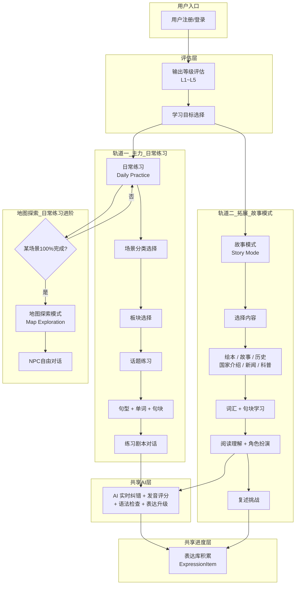
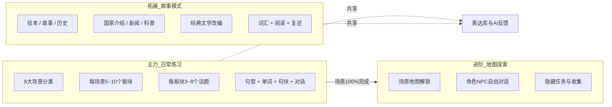
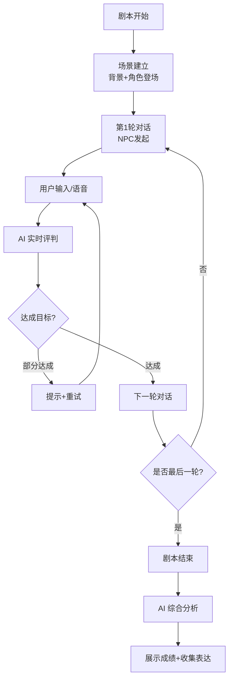
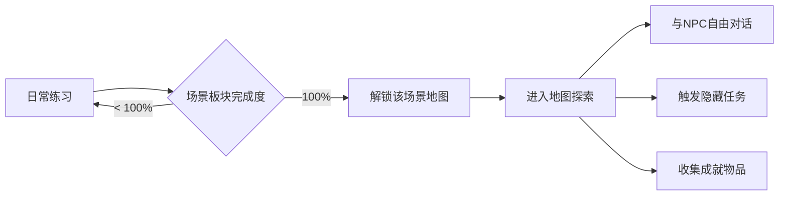
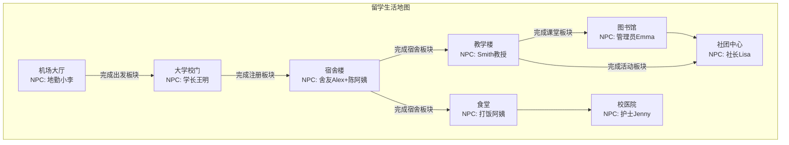
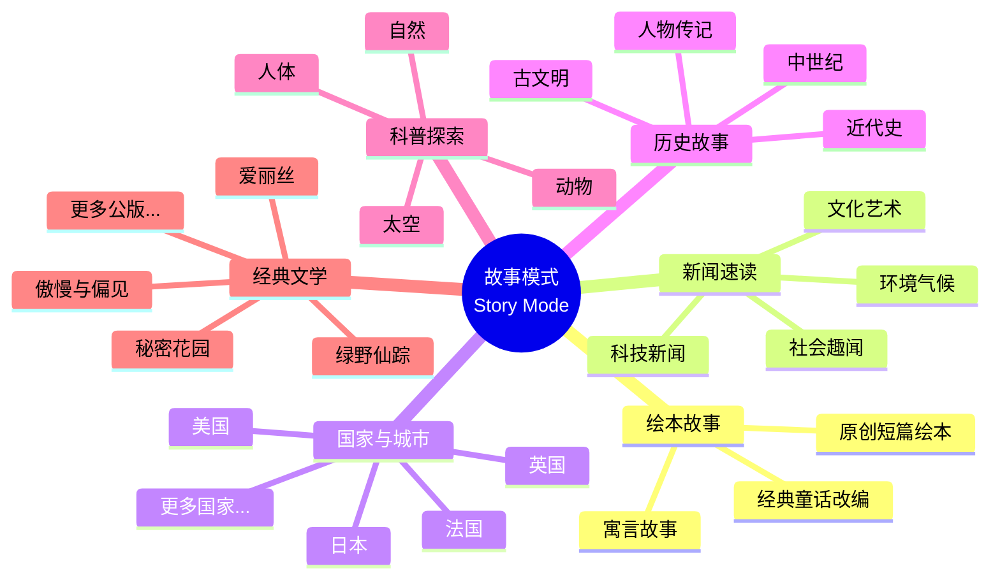
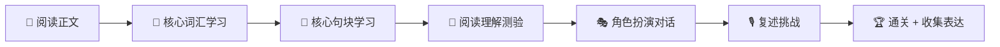
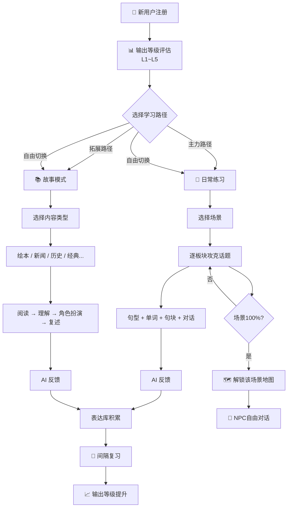
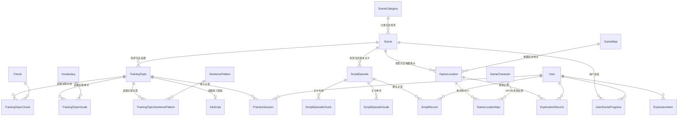

# 漫语町（ManYu）内容架构设计文档

> 版本：v1.1 | 日期：2026-06-12 | 状态：设计稿

---

## 目录

1. [整体数据流架构](#1-整体数据流架构)
2. [内容层级树结构](#2-内容层级树结构)
3. [场景分类体系](#3-场景分类体系)
4. [各场景板块与话题设计](#4-各场景板块与话题设计)
5. [话题内容要素设计](#5-话题内容要素设计)
6. [练习剧本设计规范](#6-练习剧本设计规范)
7. [地图探索模式](#7-地图探索模式)
8. [故事模式（泛内容阅读）](#8-故事模式泛内容阅读)
9. [用户成长路径](#9-用户成长路径)
10. [数据库模型映射](#10-数据库模型映射)

---

## 1. 整体数据流架构

### 1.1 核心数据流（双轨道并行）



### 1.2 三大模块关系：主力 + 拓展 + 进阶



> **关键设计原则**：
> - **日常练习** 是主力轨道，系统化训练交际英语，适合所有用户
> - **故事模式** 是拓展轨道，通过泛内容阅读（绘本/故事/历史/新闻…）让学习不枯燥，适合想接触更丰富英语内容的用户
> - 两条轨道**平行独立**，用户可自由选择入口，随时切换
> - 唯有 **地图探索** 需要在对应场景的日常练习 100% 完成后解锁
> - 两条轨道**共享**同一套 AI 反馈引擎和表达库（ExpressionItem），学习成果互通

---

## 2. 内容层级树结构

```
漫语町内容体系（主力 + 拓展双轨道）
│
├── 🌱 主力轨道：日常练习（Daily Practice）────── 系统化交际英语训练
│   ├── 场景分类（SceneCategory）× 8
│   │   ├── 🎓 留学生活（10个板块 / 37个话题）
│   │   ├── 💬 日常社交（7个板块 / 24个话题）
│   │   ├── ✈️ 旅行英语（7个板块 / 24个话题）
│   │   ├── 💼 职场交流（7个板块 / 23个话题）
│   │   ├── 🎯 学术挑战（5个板块 / 17个话题）
│   │   ├── 🏥 健康医疗（6个板块 / 18个话题）
│   │   ├── 🏠 独自生活（7个板块 / 21个话题）
│   │   └── 🎭 休闲娱乐（5个板块 / 13个话题）
│   │
│   └── 每个话题四要素 ──────────────────────
│       ├── 📝 句型（SentencePattern）── 3~5个
│       ├── 📖 单词（Vocabulary）──────── 5~10个
│       ├── 🧱 句块（Chunk）──────────── 3~6个
│       └── 🎬 练习剧本（InkScript）──── NPC互动对话
│
├── 📚 拓展轨道：故事模式（Story Mode）────────── 泛内容阅读·让学习不枯燥
│   │
│   ├── 📖 绘本故事（Picture Books）──────── 入门友好，图文并茂
│   │   ├── 《好饿的毛毛虫》The Very Hungry Caterpillar
│   │   ├── 《猜猜我有多爱你》Guess How Much I Love You
│   │   └── ...（经典儿童绘本改编）
│   │
│   ├── 📰 新闻速读（News Briefs）────────── 时事英语，LEVEL 分级
│   │   ├── 科技新闻（AI、太空探索、新能源）
│   │   ├── 环境气候（气候变化、环保行动）
│   │   ├── 文化艺术（电影、音乐、展览）
│   │   └── 社会趣闻（暖心故事、奇闻轶事）
│   │
│   ├── 🌍 国家与城市（Countries & Cities）─── 文化科普
│   │   ├── 🇬🇧 英国：伦敦、下午茶、皇室
│   │   ├── 🇺🇸 美国：纽约、硅谷、公路旅行
│   │   ├── 🇯🇵 日本：东京、京都、和食文化
│   │   ├── 🇫🇷 法国：巴黎、美食、艺术
│   │   └── ...（持续扩充）
│   │
│   ├── 📜 历史故事（History Tales）──────── 用英语读历史
│   │   ├── 古埃及金字塔
│   │   ├── 罗马帝国兴衰
│   │   ├── 丝绸之路
│   │   ├── 工业革命
│   │   └── ...（世界历史精选）
│   │
│   ├── 🔬 科普探索（Science）──────────── 趣味科普，涨知识学英语
│   │   ├── 太空探索（太阳系、火星任务）
│   │   ├── 动物世界（迁徙、捕食、共生）
│   │   ├── 人体奥秘（大脑、免疫系统）
│   │   └── 自然现象（极光、火山、潮汐）
│   │
│   ├── 🎭 经典文学（Classic Literature）──── 公版名著改编
│   │   ├── 《绿野仙踪》A2 / 24章
│   │   ├── 《秘密花园》A2 / 27章
│   │   ├── 《爱丽丝梦游仙境》B1 / 12章
│   │   ├── 《傲慢与偏见》B2 / 61章
│   │   └── ...（更多公版经典）
│   │
│   └── 每个故事关卡要素 ──────────────────
│       ├── 📖 核心词汇（Vocabulary）
│       ├── 🧱 核心句块（Chunk）
│       ├── 📝 核心句型（SentencePattern）
│       ├── 📄 阅读理解（Comprehension Quiz）
│       ├── 🎭 角色扮演对话（Role Play）
│       └── 🎙️ 复述挑战（Retell）
│
├── 🗺️ 进阶：地图探索（Map Exploration）──────── 场景100%后解锁
│   └── 每个场景对应一张地图，含多个地点 + NPC自由对话
│
└── 📦 共享层 ──────────────────────────── 两条轨道数据互通
    ├── ExpressionItem（表达库，统一收集）
    ├── AI 评分 / 纠错 / 升级建议（同一引擎）
    └── 间隔复习 Spaced Repetition（统一调度）
```

---

## 3. 场景分类体系

### 3.1 现有 7 个场景 + 建议新增

| # | 场景分类 | 英文名 | 图标建议 | 说明 |
|---|---------|--------|---------|------|
| 1 | 🎓 留学生活 | Study Abroad | `graduation-cap` | 出国留学全流程 |
| 2 | 💬 日常社交 | Daily Social | `users` | 交友、聚会、闲聊 |
| 3 | ✈️ 旅行英语 | Travel English | `plane` | 出境旅行全场景 |
| 4 | 💼 职场交流 | Workplace | `briefcase` | 面试、会议、邮件 |
| 5 | 🎯 学术挑战 | Academic | `book-open` | 论文、演讲、研究 |
| 6 | 🏥 健康医疗 | Healthcare | `heart-pulse` | 看病、买药、急救 |
| 7 | 🏠 独自生活 | Independent Living | `home` | 租房、银行、超市 |
| 8 | 🎭 休闲娱乐 | Leisure | `gamepad-2` | **新增** — 电影、运动、聚会 |

### 3.2 为什么不建议更多

保持 **8 个场景** 的理由：
- 每个场景 5~10 个板块、每个板块 3~8 个话题，总量已相当庞大
- 与现有 `SceneCategory` 表设计吻合，扩展性好
- 8 个场景足够覆盖 CEFR A1~B2 阶段的核心交际需求
- UI 展示友好（2行×4列 或 轮播布局）

---

## 4. 各场景板块与话题设计

### 4.1 🎓 留学生活（Study Abroad）

| 板块 | 话题数 | 话题列表 | NPC角色 | 场景设定 |
|------|--------|---------|---------|---------|
| **1. 出发与登机** | 3 | 值机托运、安检通关、机上服务 | 地勤人员、空乘 | 国际机场出发大厅 |
| **2. 入学注册** | 4 | 报到注册、选课咨询、领取学生证、参加迎新会 | 注册处老师、辅导员 | 大学行政楼/注册大厅 |
| **3. 入住宿舍** | 3 | 办理入住、认识舍友、宿舍规则 | 宿管阿姨、舍友 | 学生宿舍楼 |
| **4. 宿舍生活** | 4 | 作息协商、借还物品、打扫分工、宿舍聚会 | 舍友（2~3人） | 宿舍房间/公共区域 |
| **5. 课堂学习** | 5 | 自我介绍、课堂提问、小组讨论、课后请教、请假 | 教授、同学 | 教室/阶梯教室 |
| **6. 参加活动** | 4 | 社团招新、运动会、文化节、志愿者 | 社团成员、活动组织者 | 社团活动室/操场 |
| **7. 食堂就餐** | 3 | 点餐、询问菜品、饭卡充值 | 打饭阿姨、收银员 | 大学食堂 |
| **8. 图书馆学习** | 4 | 借书还书、预约座位、打印复印、查阅资料 | 图书管理员 | 大学图书馆 |
| **9. 校园购物** | 3 | 书店购书、便利店、校医院买药 | 店员、药剂师 | 校园书店/便利店 |
| **10. 考试与论文** | 4 | 备考讨论、交作业、论文答辩、成绩查询 | 教授、助教、同学 | 自习室/办公室 |

### 4.2 💬 日常社交（Daily Social）

| 板块 | 话题数 | 话题列表 | NPC角色 | 场景设定 |
|------|--------|---------|---------|---------|
| **1. 初次见面** | 4 | 自我介绍、交换联系方式、聊家乡、聊兴趣爱好 | 新朋友 | 咖啡馆/聚会 |
| **2. 朋友聚会** | 4 | 约饭、约看电影、生日派对、节日庆祝 | 朋友（2~4人） | 餐厅/KTV/家中 |
| **3. 闲聊寒暄** | 3 | 聊天气、聊周末计划、聊新闻 | 熟人/同事 | 茶水间/电梯里 |
| **4. 表达情感** | 4 | 表达感谢、道歉认错、安慰朋友、表达赞美 | 朋友/家人 | 多种场景 |
| **5. 约会交流** | 3 | 邀约、约会对话、表达好感 | 约会对象 | 餐厅/公园 |
| **6. 社交媒体** | 3 | 发帖评论、私信聊天、视频通话 | 网友/朋友 | 线上 |
| **7. 文化差异** | 3 | 解释习俗、节日介绍、饮食习惯 | 外国朋友 | 聚会/餐桌 |

### 4.3 ✈️ 旅行英语（Travel English）

| 板块 | 话题数 | 话题列表 | NPC角色 | 场景设定 |
|------|--------|---------|---------|---------|
| **1. 行前准备** | 3 | 订机票、订酒店、办签证 | 客服人员 | 线上/旅行社 |
| **2. 机场出行** | 4 | 值机、安检、登机、转机 | 地勤、安检员 | 机场 |
| **3. 酒店入住** | 3 | 办理入住、客房服务、退房 | 前台、服务员 | 酒店 |
| **4. 交通出行** | 4 | 打车、坐地铁、租车、问路 | 司机、路人 | 城市交通 |
| **5. 景点游玩** | 4 | 买门票、导游解说、拍照求助、纪念品购物 | 导游、售票员 | 景点 |
| **6. 餐饮美食** | 3 | 餐厅点餐、街边小吃、买单结账 | 服务员、摊主 | 餐厅/街边 |
| **7. 紧急情况** | 3 | 迷路求助、失物招领、使馆求助 | 警察、工作人员 | 街头/使馆 |

### 4.4 💼 职场交流（Workplace）

| 板块 | 话题数 | 话题列表 | NPC角色 | 场景设定 |
|------|--------|---------|---------|---------|
| **1. 求职面试** | 4 | 自我介绍、回答提问、询问待遇、后续跟进 | 面试官 | 会议室 |
| **2. 日常办公** | 4 | 安排会议、汇报工作、请假申请、茶水间闲聊 | 同事、上司 | 办公室 |
| **3. 邮件沟通** | 3 | 写邮件、回复邮件、跟进邮件 | — | 办公桌前 |
| **4. 商务会议** | 4 | 主持会议、发表观点、处理分歧、会议总结 | 与会者 | 会议室 |
| **5. 电话沟通** | 3 | 接听电话、预约确认、客户回访 | 客户/同事 | 办公室 |
| **6. 商务应酬** | 3 | 商务午餐、拜访客户、展会交流 | 客户、合作伙伴 | 餐厅/展会 |
| **7. 升职加薪** | 2 | 绩效面谈、薪资谈判 | 上司/HR | 办公室 |

### 4.5 🎯 学术挑战（Academic）

| 板块 | 话题数 | 话题列表 | NPC角色 | 场景设定 |
|------|--------|---------|---------|---------|
| **1. 学术演讲** | 3 | 准备演讲、正式演讲、回答提问 | 听众、评委 | 报告厅 |
| **2. 论文写作** | 4 | 选题讨论、文献综述、引用格式、导师反馈 | 导师、同学 | 办公室/图书馆 |
| **3. 学术讨论** | 3 | 研讨课发言、学术辩论、数据讨论 | 教授、同学 | 研讨室 |
| **4. 国际会议** | 3 | 注册签到、茶歇交流、海报展示 | 学者、主办方 | 会议中心 |
| **5. 申请留学** | 4 | 选校咨询、写个人陈述、面试准备、联系导师 | 导师、招生官 | 办公室/线上 |

### 4.6 🏥 健康医疗（Healthcare）

| 板块 | 话题数 | 话题列表 | NPC角色 | 场景设定 |
|------|--------|---------|---------|---------|
| **1. 预约挂号** | 3 | 电话挂号、线上挂号、前台挂号 | 接线员、前台 | 医院/线上 |
| **2. 就诊看病** | 4 | 描述症状、病史询问、检查建议、开药 | 医生、护士 | 诊室 |
| **3. 药店买药** | 3 | 非处方药、问药剂师、用药说明 | 药剂师 | 药店 |
| **4. 牙科就诊** | 3 | 预约、洗牙、补牙 | 牙医 | 牙科诊所 |
| **5. 紧急情况** | 3 | 叫救护车、急诊挂号、住院手续 | 急救员、护士 | 急诊室 |
| **6. 心理健康** | 2 | 预约咨询、与咨询师对话 | 心理咨询师 | 咨询室 |

### 4.7 🏠 独自生活（Independent Living）

| 板块 | 话题数 | 话题列表 | NPC角色 | 场景设定 |
|------|--------|---------|---------|---------|
| **1. 租房找房** | 3 | 看房、签合同、报修 | 房东、中介 | 公寓 |
| **2. 银行办事** | 3 | 开户、存款取款、挂失 | 柜员 | 银行 |
| **3. 超市购物** | 4 | 找商品、称重、结账、退货 | 店员 | 超市 |
| **4. 邮局快递** | 2 | 寄包裹、取快递 | 邮局职员 | 邮局 |
| **5. 水电物业** | 3 | 缴水电费、报修、投诉噪音 | 物业人员 | 物业处 |
| **6. 烹饪下厨** | 3 | 买菜、看食谱、厨房对话 | 室友/朋友 | 厨房 |
| **7. 交通出行** | 3 | 买车票、月票办理、问路 | 售票员、路人 | 车站/街头 |

### 4.8 🎭 休闲娱乐（Leisure）— 新增

| 板块 | 话题数 | 话题列表 | NPC角色 | 场景设定 |
|------|--------|---------|---------|---------|
| **1. 看电影** | 3 | 买票选座、讨论电影、买爆米花 | 售票员、朋友 | 电影院 |
| **2. 运动健身** | 3 | 办健身卡、请私教、打球约战 | 教练、球友 | 健身房/球场 |
| **3. 音乐会** | 2 | 买票入场、讨论演出 | 工作人员、朋友 | 音乐厅 |
| **4. 户外活动** | 3 | 爬山、野餐、海边游玩 | 朋友 | 户外 |
| **5. 游戏娱乐** | 2 | 桌游吧、电玩城 | 店员、朋友 | 桌游吧/电玩城 |

---

## 5. 话题内容要素设计

每个话题包含 **4 大要素**，以"入住宿舍 → 办理入住"为例：

### 5.1 📝 句型（SentencePattern）

| # | 句型 | 中文含义 | 难度 |
|---|------|---------|------|
| 1 | `I'd like to check in, please.` | 我想办理入住。 | L1 |
| 2 | `Which floor is my room on?` | 我的房间在几楼？ | L1 |
| 3 | `Could you show me how to use the key card?` | 能教我刷房卡吗？ | L2 |
| 4 | `Is there a curfew?` | 有宵禁吗？ | L2 |
| 5 | `What time does the front desk close?` | 前台几点关门？ | L2 |

### 5.2 📖 单词（Vocabulary）

| 单词 | 音标 | 词性 | 释义 | 难度 |
|------|------|------|------|------|
| check in | /tʃek ɪn/ | phrase | 办理入住 | L1 |
| dormitory | /ˈdɔːrmətɔːri/ | noun | 宿舍 | L1 |
| key card | /kiː kɑːrd/ | noun | 房卡 | L1 |
| front desk | /frʌnt desk/ | noun | 前台 | L1 |
| curfew | /ˈkɜːrfjuː/ | noun | 宵禁 | L2 |
| roommate | /ˈruːmmeɪt/ | noun | 舍友 | L1 |
| deposit | /dɪˈpɒzɪt/ | noun | 押金 | L2 |
| laundry | /ˈlɔːndri/ | noun | 洗衣房 | L1 |

### 5.3 🧱 句块（Chunk）

| 句块 | 含义 | 使用场景 | 难度 |
|------|------|---------|------|
| `I was wondering if...` | 我想知道是否... | 礼貌询问 | L2 |
| `Is it okay to...?` | 做...可以吗？ | 征求许可 | L1 |
| `How do I...?` | 我怎么...？ | 询问方法 | L1 |
| `Just to confirm...` | 确认一下... | 确认信息 | L2 |
| `Thanks for letting me know.` | 谢谢告知。 | 礼貌回应 | L1 |

### 5.4 🎬 练习剧本（InkScript 互动对话）

```yaml
# 话题: 办理入住
inkScript:
  title: "入住宿舍 - 办理入住"
  npc:
    name: "Mrs. Chen"
    role: "宿管阿姨"
    personality: "热心、耐心、喜欢唠家常"
    ttsVoice: "cartesia-sonic-multilingual-zh-en"
  scene:
    location: "学生宿舍一楼前台大厅"
    description: "明亮的大厅，墙上贴着各种通知，前台的陈阿姨正在整理文件"
    bgm: "casual_indoor"
  objectives:
    - id: "ask_checkin"
      description: "向宿管说明你要办理入住"
      chunk: "I'd like to check in"
    - id: "confirm_room"
      description: "确认房间号和楼层"
      chunk: "Which floor"
    - id: "ask_card"
      description: "询问房卡使用方法"
      chunk: "how to use the key card"
    - id: "ask_rules"
      description: "询问宿舍基本规则"
      chunk: "any rules I should know"
  passConditions:
    minObjectivesCompleted: 3
    passChunkCount: 2
  dialogueFlow:
    - round: 1
      npc: "你好！你是新来的学生吧？来办理入住的吗？"
      expectedResponse: "Yes, I'd like to check in, please. My name is [Name]."
      hints: ["I'd like to check in", "I'm here to check in"]
    - round: 2
      npc: "好的，让我查一下...你的房间是302，在三楼，这是你的房卡。"
      expectedResponse: "Thank you! Which floor is my room on? And how do I use the key card?"
      hints: ["Which floor", "how to use the key card"]
    - round: 3
      npc: "刷卡进门就行。另外，宿舍晚上11点关门，洗衣房在地下室。还有什么想问的吗？"
      expectedResponse: "Is there a curfew? What about laundry?"
      hints: ["Is there a curfew", "where is the laundry"]
    - round: 4
      npc: "对，11点后回来要登记的。洗衣房就在地下一层，投币使用。"
      expectedResponse: "Thanks for letting me know! Is there anything else I should know?"
      hints: ["anything else", "any other rules"]
  aiEvaluation:
    scoreRubric:
      fluency: 30%
      accuracy: 30%
      objectiveCompletion: 25%
      chunkUsage: 15%
```

---

## 6. 练习剧本设计规范

### 6.1 剧本结构



### 6.2 剧本设计模板

| 要素 | 说明 | 示例 |
|------|------|------|
| **话题标题** | 简明扼要的场景描述 | "入住宿舍 - 办理入住" |
| **NPC设定** | 姓名、角色、性格、语音 | 陈阿姨/宿管/热心耐心 |
| **场景描述** | 地点、环境、氛围 | 宿舍一楼前台大厅 |
| **对话目标** | 3~5个具体交际目标 | 办理入住/确认房间/询问规则 |
| **目标句型** | 每轮期望用户使用的句型 | "I'd like to check in" |
| **目标句块** | 话题相关核心表达块 | "I was wondering if..." |
| **通过条件** | 完成至少N个目标 + 使用M个句块 | 完成3/4目标 + 使用2个句块 |
| **容错机制** | 用户答不上来时NPC的引导 | 提示关键词/让用户尝试说简单版 |

### 6.3 NPC 角色设计原则

- **每个板块 1~2 个主要 NPC**，确保用户建立熟悉感
- NPC 要有 **名字 + 性格 + 口头禅**，增加沉浸感
- NPC 的 TTS 语音与角色匹配（年轻人用活泼音色，长辈用沉稳音色）
- 不同场景的 NPC 可以交叉出现在地图探索模式中

---

## 7. 地图探索模式

### 7.1 解锁条件



### 7.2 地图设计（以"留学生活"为例）



### 7.3 自由对话模式

- 每个地点有 **1~3个可对话NPC**
- 用户可 **选择话题方向**（闲聊/求助/询问信息）
- AI 根据 NPC 角色设定 **动态生成回应**
- 对话记录存入 `ExplorationRecord`
- 可能触发 **隐藏成就** 或 **彩蛋对话**

### 7.4 对应数据模型

- `GameMap` — 场景地图（如"留学生活地图"）
- `GameLocation` — 地图上的地点节点
- `GameCharacter` — NPC 角色
- `GameLocationNpc` — 地点与 NPC 的关联
- `ExplorationRecord` — 用户探索对话记录
- `GameSave` — 用户在探索模式中的存档状态

---

## 8. 故事模式（泛内容阅读）

> **与日常练习是平行关系，独立入口。** 日常练习是"教科书"，故事模式是"课外读物"——让用户在实际阅读中接触更丰富、更复杂的英语，保持学习兴趣。

### 8.1 定位

| 维度 | 日常练习（主力） | 故事模式（拓展） |
|------|-----------------|-----------------|
| **类比** | 教科书 + 练习册 | 课外读物 + 杂志 |
| **目标** | 系统掌握交际英语 | 在真实内容中自然习得 |
| **内容** | 场景化对话（功能性） | 叙事/说明/议论（多样性） |
| **难度** | L1~L4 严格分级 | L1~L5，按内容自然分布 |
| **频率** | 每天练习 | 碎片时间阅读 |
| **学习方式** | 句型→单词→句块→对话 | 阅读→理解→角色扮演→复述 |
| **用户画像** | 所有用户 | 想要更多英语输入的用户 |

### 8.2 内容分类体系



### 8.3 各内容类型详解

#### 8.3.1 📖 绘本故事（Picture Books）— 入门友好

适合 **L1~L2** 用户，图文并茂，句子简单，培养英语阅读习惯。

| 故事 | 难度 | 篇幅 | 主题 |
|------|------|------|------|
| 《好饿的毛毛虫》 | L1 | 短 | 食物、星期、数字 |
| 《猜猜我有多爱你》 | L1 | 短 | 亲情、比较级 |
| 《棕色的熊》 | L1 | 短 | 颜色、动物 |
| 《晚安月亮》 | L1 | 短 | 睡前仪式、房间物品 |
| 《野兽家园》 | L2 | 中 | 冒险、情绪表达 |

#### 8.3.2 📰 新闻速读（News Briefs）— 时事英语

适合 **L3~L5** 用户，每篇 200~500 词，附带词汇表和理解题。可定期更新（如每周 3 篇）。

| 类别 | 示例标题 | 难度 |
|------|---------|------|
| 科技 | "NASA's New Mars Rover Discovery" | L4 |
| 环境 | "How a Small Town Went 100% Solar" | L3 |
| 文化 | "The Return of Vinyl Records" | L3 |
| 社会 | "Community Garden Feeds 500 Families" | L2 |

#### 8.3.3 🌍 国家与城市（Countries & Cities）— 文化科普

适合 **L2~L4** 用户，每篇介绍一个国家/城市的文化、美食、习俗。

| 国家/城市 | 难度 | 关键词 |
|----------|------|--------|
| 🇬🇧 英国·伦敦 | L2 | afternoon tea, monarchy, underground |
| 🇺🇸 美国·纽约 | L3 | skyscraper, Broadway, melting pot |
| 🇯🇵 日本·京都 | L3 | temple, kimono, tea ceremony |
| 🇫🇷 法国·巴黎 | L3 | croissant, Louvre, Seine River |
| 🇮🇹 意大利·罗马 | L3 | colosseum, pasta, fountain |

#### 8.3.4 📜 历史故事（History Tales）— 英语读历史

适合 **L3~L5** 用户，用叙事方式讲述历史事件/人物，500~800 词。

| 故事 | 难度 | 核心词汇 |
|------|------|---------|
| 古埃及金字塔 | L3 | pyramid, pharaoh, mummy, tomb |
| 丝绸之路 | L4 | silk, caravan, spice, merchant |
| 工业革命 | L5 | steam engine, factory, revolution |
| 马可·波罗游记 | L4 | explorer, empire, route, treasure |

#### 8.3.5 🔬 科普探索（Science）— 趣味涨知识

适合 **L3~L5** 用户，用通俗英语解释科学概念。

| 主题 | 难度 | 核心词汇 |
|------|------|---------|
| 蜜蜂如何酿蜜 | L3 | hive, nectar, pollen, colony |
| 为什么天空是蓝色的 | L3 | scatter, wavelength, atmosphere |
| 人体免疫系统 | L4 | antibody, virus, defense, cell |
| 火星移民计划 | L5 | colony, radiation, terraform, habitat |

#### 8.3.6 🎭 经典文学（Classic Literature）— 公版名著

适合 **A2~B2**（L2~L5）用户，将公版名著改编为互动学习关卡。

| # | 作品 | 难度 | 章节数 | 特色 |
|---|------|------|--------|------|
| 1 | 《绿野仙踪》 | A2 | 24章 | 奇幻冒险，对话丰富 |
| 2 | 《秘密花园》 | A2 | 27章 | 自然描写，情感表达 |
| 3 | 《爱丽丝梦游仙境》 | B1 | 12章 | 荒诞幽默，想象力 |
| 4 | 《圣诞颂歌》 | B1 | 5章 | 短小精悍，节日主题 |
| 5 | 《彼得·潘》 | A2 | 17章 | 童年冒险，对话活泼 |
| 6 | 《柳林风声》 | B1 | 12章 | 动物故事，友谊主题 |
| 7 | 《傲慢与偏见》 | B2 | 61章 | 社会讽刺，高级句型 |
| 8 | 《福尔摩斯探案集》 | B2 | 多篇 | 悬念推理，逻辑表达 |

> ⚠️ **版权提示**：仅使用已进入公共领域的作品。不同国家公版年限不同（中国50年/美国70年），全球发布需确认目标市场版权法。

### 8.4 故事关卡通用结构

每个故事关卡（无论哪种内容类型）遵循统一的学习流程：



| 环节 | 说明 | 示例（以"蜜蜂酿蜜"为例） |
|------|------|------------------------|
| **阅读正文** | 200~800词原文，分段展示，点击生词可查释义 | "Honeybees live in colonies..." |
| **核心词汇** | 从文中提取 5~10 个关键词汇 | hive, nectar, pollen, colony... |
| **核心句块** | 3~6 个文中高频表达块 | "play a vital role in..." |
| **阅读理解** | 3~5 道选择题/判断题 | "What do bees collect from flowers?" |
| **角色扮演** | 化身文中角色，与NPC对话 | 扮演养蜂人，与参观者介绍蜜蜂 |
| **复述挑战** | 用自己的话复述故事大意，AI 评分 | "Tell me what you learned about bees" |

### 8.5 与日常练习的差异总结

| | 日常练习 | 故事模式 |
|---|---------|---------|
| **输入方式** | 先学句型/单词/句块 → 再对话 | 先阅读完整内容 → 再提取学习 |
| **对话目标** | 完成功能性任务（办入住、点餐…） | 理解内容 + 表达观点 |
| **NPC** | 场景角色（宿管、教授、店员…） | 故事角色（蜜蜂、探险家、历史人物…） |
| **评判维度** | 交际有效性 + 语法准确度 | 内容理解度 + 表达完整度 |
| **内容来源** | 教研团队设计 | 真实/改编内容（绘本、新闻、历史…） |
| **更新频率** | 相对固定 | 持续扩充（尤其是新闻类） |

---

## 9. 用户成长路径

### 9.1 完整用户旅程



### 9.2 主力 vs 拓展：定位差异

| 维度 | 主力：日常练习 | 拓展：故事模式 |
|------|--------------|--------------|
| **入口** | 主Tab"练习" | 主Tab"发现"或"阅读" |
| **类比** | 教科书 + 练习册 | 课外读物 + 杂志 + 纪录片 |
| **核心价值** | 系统掌握交际英语 | 在实际内容中自然接触更丰富的英语 |
| **内容来源** | 教研团队设计场景化话题 | 绘本/新闻/历史/科普/名著改编 |
| **组织结构** | 场景→板块→话题（三级树） | 内容类型→作品/文章→关卡 |
| **对话类型** | 功能性（办事、点餐、问路…） | 叙事性+观点性（讲故事、谈看法…） |
| **学习流程** | 先学后练（句型→单词→句块→对话） | 先读后学（阅读→理解→角色扮演→复述） |
| **难度控制** | 严格按L1~L4分级 | 按内容自然分级，用户自选 |
| **更新频率** | 稳定，定期扩充 | 高频（尤其新闻类可持续更新） |
| **地图探索** | 场景完成后解锁 | 不关联地图 |
| **数据互通** | 共享表达库 + AI引擎 | 共享表达库 + AI引擎 |

### 9.3 用户使用场景举例

| 用户类型 | 典型行为 |
|---------|---------|
| **新手小白（L1）** | 主力日常练习 + 偶尔看绘本故事培养兴趣 |
| **日常用户（L2~L3）** | 每天日常练习打卡，碎片时间刷一篇新闻/国家介绍 |
| **兴趣驱动型** | 被故事模式吸引进来，顺便做日常练习巩固 |
| **高阶用户（L4~L5）** | 日常练习刷完，主攻经典文学和历史故事 |
| **考试备考** | 以日常练习为主，用新闻速读练阅读速度 |

---

## 10. 数据库模型映射

### 10.1 内容体系 ↔ Prisma 模型

| 内容概念 | Prisma 模型 | 说明 |
|---------|------------|------|
| 场景分类 | `SceneCategory` | 8大场景分类 |
| 场景板块 | `Scene` | 每个场景下的细分板块 |
| 训练话题 | `TrainingTopic` | 每个板块下的具体话题 |
| 句型 | `SentencePattern` | 通过 `TrainingTopicSentencePattern` 关联 |
| 单词 | `Vocabulary` | 通过 `TrainingTopicVocab` 关联 |
| 句块 | `Chunk` | 通过 `TrainingTopicChunk` 关联 |
| 练习剧本 | `InkScript` (scriptType=episode) | 通过 `TrainingTopic.inkScriptId` 关联 |
| 剧本关卡 | `ScriptEpisode` | 经典剧本的每个章节 |
| 场景地图 | `GameMap` | 每个场景对应一个探索地图 |
| 地图地点 | `GameLocation` | 地图上的可交互位置 |
| NPC角色 | `GameCharacter` | 可对话的虚拟角色 |
| 练习记录 | `PracticeSession` + `PracticeTurn` | 日常练习的对话记录 |
| 剧本记录 | `ScriptRecord` + `ScriptDialogue` | 剧本模式的通关记录 |
| 探索记录 | `ExplorationRecord` | 地图模式的自由对话 |
| 场景进度 | `UserSceneProgress` | 用户在每个场景的完成度 |
| 表达库 | `ExpressionItem` | 用户积累的所有表达 |

### 10.2 关键关系图



---

## 附录 A：设计决策记录

| # | 决策 | 理由 |
|---|------|------|
| 1 | 场景数保持 8 个 | UI布局友好、内容量可控、覆盖核心需求 |
| 2 | 每个场景 5~10 个板块 | 保证内容深度，避免碎片化 |
| 3 | 每个板块 3~8 个话题 | 约3天可完成一个板块，保持成就感 |
| 4 | 剧本对话 3~5 轮 | 足够评测，又不会太冗长 |
| 5 | 地图模式需场景100%完成后解锁 | 保证用户有足够词汇/句型储备进行自由对话 |
| 6 | 故事模式为独立平行体系 | 与日常练习分开入口；是拓展"课外读物"而非学习前置条件 |
| 7 | 故事模式不只经典文学 | 加入绘本/新闻/历史/国家介绍/科普，覆盖更多兴趣点 |
| 8 | 故事模式先读后学 | 区别于日常练习的"先学后练"，模拟真实阅读体验 |
| 9 | 优先使用公版作品 | 避免版权纠纷，降低内容成本 |
| 10 | NPC 有固定姓名性格 | 增强沉浸感和情感连接 |
| 11 | 两条轨道共享表达库与AI引擎 | 学习成果互通，避免数据孤岛 |

---

## 附录 B：后续待细化

- [ ] 每个话题的具体句型/单词/句块内容填充（教研 + AI辅助）
- [ ] 每个话题的 InkScript 互动剧本编写
- [ ] 故事模式各内容类型的首期内容制作计划
  - [ ] 绘本故事 × 5 篇（L1~L2，优先上线）
  - [ ] 新闻速读 × 10 篇（L2~L4，建立更新管线）
  - [ ] 国家介绍 × 5 篇（L2~L3）
  - [ ] 历史故事 × 5 篇（L3~L4）
  - [ ] 科普探索 × 5 篇（L3~L4）
  - [ ] 经典文学 × 3 部（首期：《绿野仙踪》《秘密花园》《爱丽丝》）
- [ ] 故事模式与日常练习的独立入口 UI 设计（底部双 Tab？）
- [ ] 新闻速读的持续更新机制（CMS 后台 or 定期导入）
- [ ] 地图探索模式的 UI/UX 交互设计
- [ ] 内容审核流程和质量标准
- [ ] 用户测试与难度校准方案
