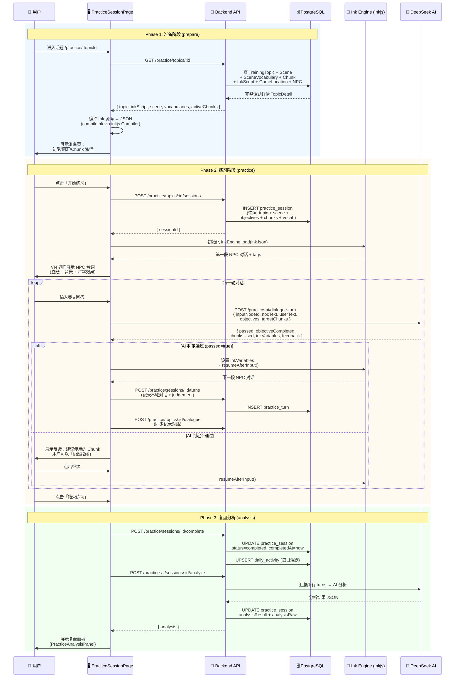
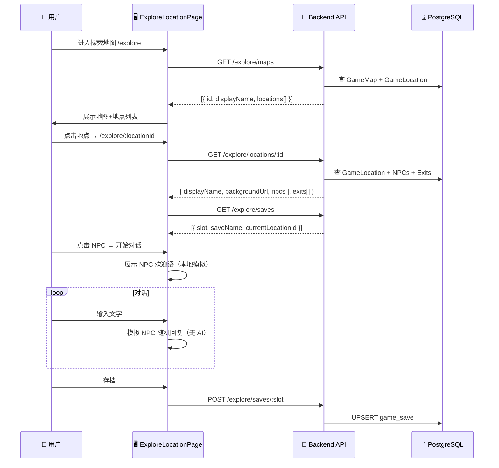

# VN 练习对话 — 架构全景

> 本文档梳理漫语町中 VN（Visual Novel）练习对话的两种实现路径、涉及的数据库表、前后端交互流程。

---

## 项目中有两条路径

| 路径 | 说明 | 引擎 | AI 判定 | 复盘分析 | 入口 |
|------|------|:--:|:--:|:--:|------|
| **路径一：Ink 叙事练习** | 正式练习模式，Ink 脚本驱动对话，AI 实时判定 | Ink (inkjs) | ✅ | ✅ | `PracticeSessionPage` |
| **路径二：探索自由对话** | 探索模式下轻量 NPC 闲聊 | 无（前端模拟） | ❌ | ❌ | `ExploreLocationPage` |

---

## 🎯 路径一：Ink 叙事驱动（主路径）

### 涉及的数据库表

| 表 | 用途 |
|---|---|
| `scene` | 场景定义（标题、地点、难度等级、是否免费） |
| `scene_category` | 场景分类（如"餐厅""机场"） |
| `scene_vocabulary` | 场景词汇（单词、音标、释义、例句、词性） |
| `training_topic` | 训练话题（中英文 prompt、教学 Markdown、关联 Ink 脚本） |
| `training_topic_chunk` | 话题 ↔ Chunk 多对多关联 |
| `training_topic_sentence_pattern` | 话题句型模板（pattern + 插槽 slots + 示例） |
| `chunk` | 表达块（核心表达/惯用语，含释义和例句） |
| `chunk_example` | Chunk 的例句（英+中+注释，分基础/进阶等级） |
| `ink_script` | Ink 互动叙事脚本（JSON + 源码），通过 `training_topic.inkScriptId` 关联 |
| `game_location` | 场景对应的游戏地点（提供背景图、BGM、环境音） |
| `game_location_npc` | 地点内 NPC 配置（日程、默认问候） |
| `game_character` | 角色信息（立绘 spriteBaseUrl、表情差分 expressions、头像 avatarUrl、TTS 音色） |
| `practice_session` | 练习会话（快照话题/场景/目标/Chunk/词汇/句型，记录对话轮次和分析结果） |
| `practice_turn` | 每轮对话记录（NPC 台词、用户回答、音频 URL、AI 评判 JSON、达成目标和使用的 Chunk） |
| `user_chunk_progress` | 用户 Chunk 掌握度（5 级状态：未学→已激活→能读→能输出→精通） |
| `expression_item` | 用户表达库（单词/Chunk/错句/句型，SM-2 间隔复习参数） |
| `daily_activity` | 每日活跃统计（按用户+日期去重） |
| `ai_usage_daily` | 每日 AI 调用配额追踪（对话/分析/Token 消耗） |
| `word_enrichment` | 单词增强缓存（词典/AI 查询结果缓存，避免重复调用） |

### 完整流程



### 关键组件链路

```
PracticeSessionPage
├── [prepare] 准备页
│   ├── 句型展示 Card
│   ├── ChunkActivationPanel          — 激活 Chunk（调用 chunkApi.activate）
│   ├── LearningInsightDialog          — 词汇/Chunk/句型详情弹窗（含词典+AI 增强）
│   └── PracticeVnDrawer               — 教学 Markdown 抽屉（teachingMarkdown）
│
├── [practice] 练习页
│   ├── VnPlayer (PIXI.js 渲染)        — VN 剧场模式
│   │   ├── PixiVnStage                 — PIXI 画布（背景 TilingSprite + 立绘 Sprite）
│   │   ├── 打字机效果                  — 逐字显示 NPC 台词
│   │   ├── VnInputPanel               — 用户输入框（支持录音按钮）
│   │   ├── TurnGuidanceCard           — 当前轮目标 objective / 提示 hint
│   │   └── PracticeTurnFeedback       — AI 反馈 inline 卡片（passed/retry/继续）
│   ├── DialogueListView               — 聊天列表模式（备选）
│   ├── useInkStory Hook
│   │   └── InkEngine (inkjs Story 封装)
│   │       ├── continue()             — 驱动叙事前进
│   │       ├── choose(index)          — 选择分支
│   │       ├── setVariable/getVariable — Ink 变量读写
│   │       ├── getCurrentTags()       — 读取 #speaker: #bg: #expression: 等标签
│   │       └── BindExternalFunction   — 绑定 waitForUserInput / triggerJudge 等
│   ├── PracticeVnDrawer               — 教学文档 + 进度面板（objectives/chunks）
│   └── VnSettingsDialog               — 显示模式/字体/自动播放/双语 设置
│
└── [analysis] 分析页
    └── PracticeAnalysisPanel          — AI 复盘结果（强项/弱项/建议/可收藏表达）
```

### Ink 标签系统

Ink 脚本通过 `#tag` 控制 VN 渲染：

| 标签 | 作用 | 示例 |
|------|------|------|
| `#speaker:Name` | 当前说话人（匹配角色立绘） | `#speaker:Lisa` |
| `#expression:happy` | 角色表情差分 | `#expression:surprised` |
| `#bg:url` | 切换背景图 | `#bg:https://cos.xxx/bg_cafe.png` |
| `#bgFit:cover` | 背景填充模式 | `#bgFit:contain` |
| `#position:left` | 立绘位置 | `#position:right` |
| `#audio:url` | 播放语音/TTS | `#audio:https://cos.xxx/line_01.mp3` |
| `#translation:中文` | 双语字幕 | `#translation:你好吗？` |
| `#input:id=greeting` | 等待用户输入（输入节点 ID） | `#input:id=order_food` |
| `#objective:目标描述` | 当前对话目标 | `#objective:点一杯咖啡` |
| `#hint:提示文字` | 给用户的提示 | `#hint:用 "I'd like" 开头` |
| `#chunks:chunk1\|chunk2` | 本轮目标 Chunk | `#chunks:I'd like to\|Can I have` |

### API 路由汇总

| 方法 | 路由 | 用途 |
|------|------|------|
| `GET` | `/practice/topics?sceneId=` | 获取场景下的话题列表 |
| `GET` | `/practice/topics/:id` | 话题详情（含词汇/Chunk/句型/Ink/角色） |
| `GET` | `/practice/topics/:id/teaching` | 获取教学 Markdown |
| `GET` | `/practice/topics/:id/ink` | 获取话题关联的 Ink 脚本 |
| `POST` | `/practice/topics/:id/sessions` | 创建练习会话（快照所有上下文） |
| `POST` | `/practice/topics/:id/dialogue` | 提交对话记录 |
| `GET` | `/practice/topics/:id/dialogues` | 获取话题对话历史 |
| `POST` | `/practice/topics/:id/save` | 保存表达到表达库 |
| `GET` | `/practice/sessions/:sessionId` | 获取会话详情 |
| `POST` | `/practice/sessions/:sessionId/turns` | 提交单轮对话（含 AI 评判） |
| `POST` | `/practice/sessions/:sessionId/complete` | 完成会话 |
| `POST` | `/practice-ai/dialogue-turn` | AI 单轮判定 |
| `POST` | `/practice-ai/sessions/:sessionId/analyze` | AI 汇总分析 |
| `POST` | `/practice-ai/word-enrichment` | 单词增强查询 |

---

## 🎭 路径二：探索模式自由对话（辅助路径）

### 涉及的数据库表

| 表 | 用途 |
|---|---|
| `game_map` | 游戏地图（背景图、缩略图、尺寸） |
| `game_location` | 地图上的地点（坐标、背景、BGM、环境音、关联场景） |
| `game_location_npc` | 地点中的 NPC 配置（日程、默认问候语、Ink 对话脚本） |
| `game_location_exit` | 地点之间的通路（带条件限制） |
| `game_character` | 角色信息（立绘、表情、头像、TTS 音色） |
| `game_save` | 游戏存档（Ink 状态、当前位置、已访问地点、标记位、多槽位） |
| `exploration_record` | 探索对话记录（用户 ↔ NPC 自由对话 + AI 反馈） |

### 流程



### API 路由汇总

| 方法 | 路由 | 用途 |
|------|------|------|
| `GET` | `/explore/maps` | 获取所有地图 |
| `GET` | `/explore/maps/:id` | 地图详情 |
| `GET` | `/explore/locations/:id` | 地点详情（含 NPC 和出口） |
| `GET` | `/explore/characters` | 所有角色 |
| `GET` | `/explore/characters/:id` | 角色详情 |
| `GET` | `/explore/ink/:key` | 获取 Ink 脚本 |
| `GET` | `/explore/saves` | 存档列表 |
| `GET` | `/explore/saves/:slot` | 读取存档 |
| `POST` | `/explore/saves/:slot` | 保存存档 |
| `POST` | `/explore/saves/:slot/delete` | 删除存档 |
| `GET` | `/explore/dialogues` | 对话历史 |
| `POST` | `/explore/dialogues` | 创建对话记录 |

---

## 🔑 两条路径对比

| 维度 | 路径一：Ink 练习 | 路径二：探索自由对话 |
|------|:--:|:--:|
| 入口页面 | `PracticeSessionPage` | `ExploreLocationPage` |
| 核心引擎 | Ink (inkjs) 编译+运行时 | 无（前端模拟 NPC 回复） |
| AI 实时判定 | ✅ DeepSeek 每轮判定 | ❌ |
| 对话持久化 | ✅ `practice_session` + `practice_turn` | 可选 `exploration_record`（当前未在页面中调用） |
| AI 复盘分析 | ✅ 会话结束后汇总分析 | ❌ |
| Chunk/目标追踪 | ✅ `#objective:` `#chunks:` 标签 + AI 判定 | ❌ |
| 立绘/背景驱动 | ✅ Ink `#speaker:` `#bg:` `#expression:` 标签 | 静态背景 + NPC 头像 |
| 分支选择 | ✅ Ink Choices | ❌ |
| 存档系统 | ❌（由 practice_session 替代） | ✅ `game_save` 多槽位 |
| 学习闭环 | 学→练→AI判→复盘→收藏 | 纯探索体验 |

---

## 🏗️ 前端组件架构

```
features/
├── vn-engine/                         — VN 渲染引擎（共享组件）
│   ├── vn-player.tsx                   — VN 播放器主组件（PIXI.js 渲染）
│   ├── vn-scene.tsx                    — VN 场景容器（背景+立绘层）
│   ├── dialogue-list-view.tsx          — 聊天列表模式渲染
│   ├── dialogue-box.tsx                — 单条对话气泡
│   ├── choice-buttons.tsx              — Ink 分支选择按钮
│   ├── vn-input-panel.tsx              — 用户输入面板
│   ├── practice-guidance.tsx           — 当前轮目标/提示卡片
│   ├── ink-engine.ts                   — Ink 引擎封装（inkjs Story）
│   └── use-ink-story.ts                — Ink 故事 React Hook
│
├── practice/                          — 练习模式
│   ├── api/english-practice-api.ts     — 练习 API 客户端
│   ├── pages/
│   │   ├── practice-hub-page.tsx       — 练习中心（场景选择）
│   │   └── practice-session-page.tsx    — 练习会话页（准备→VN练习→复盘）
│   └── components/
│       ├── chunk-activation-panel.tsx   — Chunk 激活面板
│       ├── learning-insight-dialog.tsx  — 学习洞察弹窗（词汇/Chunk/句型详情）
│       ├── practice-vn-drawer.tsx       — VN 教学抽屉
│       └── practice-analysis-panel.tsx  — AI 复盘面板
│
└── explore/                           — 探索模式
    ├── api/explore-api.ts              — 探索 API 客户端
    ├── pages/
    │   ├── explore-map-page.tsx         — 地图列表页
    │   └── explore-location-page.tsx    — 地点详情页（NPC 对话）
    └── components/
        └── save-load-panel.tsx          — 存档/读档面板
```

---

## 🔗 与其他模块的关系

```
                    ┌──────────────┐
                    │   Scene      │ 场景定义
                    └──────┬───────┘
           ┌───────────────┼───────────────┐
           ▼               ▼               ▼
    ┌──────────────┐ ┌──────────┐  ┌──────────────┐
    │TrainingTopic │ │  Chunk   │  │ScriptEpisode │ ← 剧本挑战（独立模块）
    └──────┬───────┘ └────┬─────┘  └──────────────┘
           │              │
           ▼              ▼
    ┌──────────────┐ ┌──────────────────┐
    │  InkScript   │ │UserChunkProgress │
    └──────┬───────┘ └──────────────────┘
           │
           ▼
    ┌─────────────────────────────────────┐
    │         PracticeSession             │ ← VN 练习核心
    │  (快照: topic + scene + objectives  │
    │   + chunks + vocab + patterns)      │
    └──────────────┬──────────────────────┘
                   │
                   ▼
    ┌─────────────────────────────────────┐
    │         PracticeTurn                │ ← 每轮对话 + AI 评判
    └──────────────┬──────────────────────┘
                   │
      ┌────────────┼────────────┐
      ▼            ▼            ▼
┌───────────┐ ┌──────────┐ ┌──────────────┐
│Expression │ │DailyAct. │ │AiUsageDaily  │
│  Item     │ │          │ │              │
│(表达库)   │ │(活跃统计)│ │(AI额度追踪)  │
└───────────┘ └──────────┘ └──────────────┘
```
