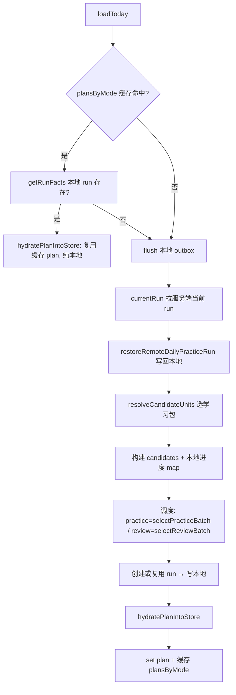
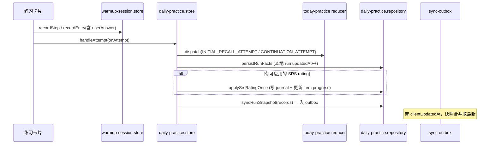
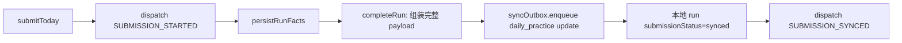
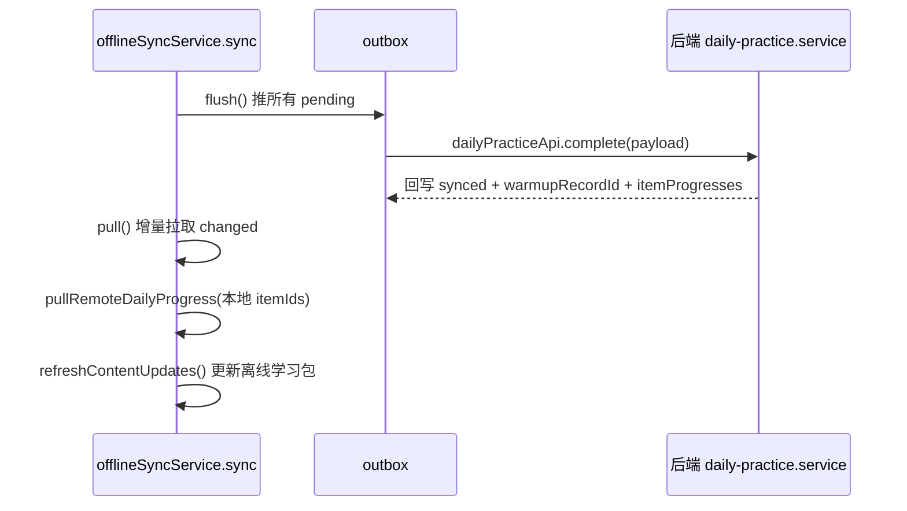

# 今日任务（今日练习 / 今日复习）数据流与实现说明

> 适用范围：前端「今日任务」页面（练习 + 复习 + 错题重练）及其离线同步链路。
> 最后更新：2026-08-21。若代码有变动，请同步更新本文。

---

## 1. 概述

「今日任务」是每日的限时练习/复习入口，分为两个 Tab：

- **今日练习**（`mode: 'practice'`）：新学 + 当日复习，按「话题内分阶段」出题，答错进入错题重练。
- **今日复习**（`mode: 'review'`）：从 SRS 到期欠账中按 `reviewBatchSize` 选一组复习。

两者共用同一套「**run**」状态机：一次进入今日任务 = 一个 `run`，run 内记录
`attempted / unresolved / srsApplied` 及每题的作答结果，并支持中途退出、切换
Tab、离线答题、事后同步恢复。

核心设计原则：

1. **run 是当日练习的权威数据源**（本地 `daily_practice_runs` 表）。
2. **warmup 记录**（`warmup_records`）是「可读的展示记录」，由 run 派生，保存
   用户的真实作答文本（`userAnswer`），用于记录抽屉与回顾。
3. **outbox 是唯一的同步通道**：所有改动先写本地、再经 outbox 合并后推服务端。
4. **本地新数据永远不被服务端旧快照覆盖**（详见 §7 防坑点）。
5. **warmup 记录顺序全程「最新在前」，唯一定义点只有一个**：`recordEntry`
   置顶；内存、本地索引、上传 payload、后端存储、pull 恢复、前端展示全部
   直接沿用该顺序，任何一层都不再重复排序（详见 §3.3）。

---

## 2. 模块地图

| 层 | 文件 | 职责 |
| --- | --- | --- |
| 页面 | `apps/frontend/src/features/learning/pages/today-task-page.tsx` | Tab 切换、练习会话 UI、提交、同步按钮、记录抽屉 |
| Store | `apps/frontend/src/stores/daily-practice.store.ts` | 主 store：`plan`、`plansByMode` 缓存、`loadToday`、`recordAttempt`、`submitToday`、`syncRunSnapshot` |
| Store | `apps/frontend/src/stores/today-practice.store.ts` | 今日 run 状态机（reducer、`deriveTodayPractice`、`serializeTodayRunFacts`） |
| Store | `apps/frontend/src/stores/warmup-session.store.ts` | warmup 会话记录（`records`、卡片 UI 状态 `stepStates`） |
| 离线 | `apps/frontend/src/lib/offline/daily-practice.repository.ts` | `buildTodayPlan`、run facts 读写、`applySrsRatingOnce`、`syncRunSnapshot`、`completeRun`、`restoreRemoteDailyPracticeRun`、`pullRemoteDailyProgress` |
| 离线 | `apps/frontend/src/lib/offline/daily-practice.planner.ts` | 纯函数：`selectPracticeBatch`、`selectReviewBatch`、`compareReviewDebt`、`deriveTodayScheduledPracticeIds` |
| 离线 | `apps/frontend/src/lib/offline/practice.repository.ts` | warmup 记录本地读写（`upsertLocalWarmupRecord`、`getLocalWarmupRecord`、`getWarmupEntriesByDate`） |
| 离线 | `apps/frontend/src/lib/offline/sync-outbox.ts` | 待同步队列（`enqueue`/`listPending`/`markSynced`，含 `clientUpdatedAt` 合并保护） |
| 离线 | `apps/frontend/src/lib/offline/offline-sync.service.ts` | `sync = flush + pull`、`replayItem`（daily_practice → `dailyPracticeApi.complete`） |
| 离线 | `apps/frontend/src/lib/spaced-repetition.ts` | SM-2 排期（`scheduleReview`） |
| API | `apps/frontend/src/features/practice/api/english-practice-api.ts` | `dailyPracticeApi.currentRun / progress / complete / recordActivity` |
| 后端 | `apps/backend/src/modules/practice-ai/daily-practice.controller.ts` | 接口：`GET run`、`POST progress`、`POST complete`、`POST activity` |
| 后端 | `apps/backend/src/modules/practice-ai/daily-practice.service.ts` | `getCurrentRun`、`complete`（run upsert + attempts + SM-2 重建 + warmup 记录 upsert） |

---

## 3. 核心概念

### 3.1 Run（今日练习会话）

一次进入「今日任务」（某一天、某模式）即一个 run。本地存储为
`StoredDailyPracticeRun`，字段：

- `id` = `clientRunId`（形如 `today_run_xxx`，除 `activity:` 前缀的计时记录）
- `date`、`mode`（practice/review）、`scope`（single/mixed）、`packIds`
- `scheduledItemIds`：本轮计划题
- `attemptedItemIds` / `unresolvedItemIds` / `srsAppliedItemIds`
- `initialRecallResults` / `continuationResults` / `remediationResults`
- `attemptHistory`、`submissionStatus`、`roundKind`（main/mistakeRetry）
- `sessionStepIds` / `currentStepId`（UI 会话恢复用）
- `updatedAt`：本地版本时间（同步合并的关键依据）

### 3.2 三种作答结果（状态机 `today-practice.store.ts`）

| 结果 | 含义 | 对应字段 |
| --- | --- | --- |
| `initialRecallResults` | 首次回忆（无 hint 答对=strong，hint 答对=ok，答错/不会=miss） | `{score, srsRating?}` |
| `continuationResults` | 首次 miss 后的「再试一次」 | `{latestScore: weak/miss, attemptCount}` |
| `remediationResults` | 错题重练（mistakeRetry）答对 | `{score, resolved: true, cycle}` |

### 3.3 warmup 记录（展示用）

`warmup_records` 表，key 形如 `today-warmup:${runId}`。`items` 是
`WarmupRecordEntry[]`，含 `zh / answer / userAnswer / passed / score / feedback`
等。**`userAnswer` 是用户真实输入，是“回答是否同步”的判定点。**

`fallbackWarmupRecords()` 会从 run 派生占位记录（`userAnswer: ''`），仅用于
纯 run 恢复场景；真实作答必须来自 warmup 记录。

**顺序约定（最新在前）**：

- `recordEntry`（`warmup-session.store.ts`）把新作答**置顶**，`records` 数组
  从此就是「最新在前」——这是**唯一的排序定义点**。
- `upsertLocalWarmupRecord` 存的就是这个顺序；`warmup_record_entries` 索引
  查询（`findByIndex`/`list`）的 SQL 已按 `updated_at DESC` 返回，前端展示
  不再排序。
- `createTodayRunSyncPayload` 让**真实作答（最新在前）优先**，fallback 只补
  缺失项，所以上传到后端的 `items` 顺序与前端一致（最新在前）。
- 后端 `complete` 原样存 `items` 数组顺序；pull 恢复（`applyWarmupRecordItem`）
  直接沿用，前端展示一致。

### 3.4 outbox（待同步队列）

所有上传统一走 `sync-outbox`。`daily_practice` 每 run 一个 outbox 项
（`entityId = runId`，`operation: 'update'`），新快照会**合并**（coalesce）覆盖
旧项，并通过 `payload.run.clientUpdatedAt` 拒绝“迟到的旧快照”。

---

## 4. 数据流

### 4.1 计划构建（buildTodayPlan）

要点：

- 切换「今日复习 ↔ 今日练习」时，若目标模式 plan 已缓存且本地 run 存在，
  **直接复用，不发任何服务端请求**（见 §4.6）。
- 需要真正构建时，先 `flush` 本地 outbox，确保 `currentRun` 拉到的是最新数据。
- `currentRun` 是「登录/换设备恢复」的权威读取（区别于增量 sync 的 cursor）。

### 4.2 练习答题（主轮 + 再试）

答题后的派生渲染由 `deriveTodayPractice` 计算：绿（答对）/红（答错未解决）/灰（未做）。

> 顺序：`recordEntry` 把每次作答**置顶**（最新在前），`records` 及后续存储/上传/展示直接沿用。

### 4.3 错题重练（mistakeRetry）

1. 主轮提交后若存在 `unresolvedItemIds`，页面出现「练习错题 N」入口。
2. `startMistakeRetry()` → dispatch `MISTAKE_RETRY_STARTED`，进入
   `roundKind: 'mistakeRetry'`，队列 = 未解决题。
3. 每题答题走 `RETRY_CYCLE_ATTEMPT`：
   - 答对 → 写入 `remediationResults[stepId] = {score, resolved: true}`，移出队列；
   - 答错/不会 → 记录 `retrievalFailed`，卡在原题，可再试。
4. 重练答对后**同样会**：`persistRunFacts` + `applySrsRatingOnce` + `syncRunSnapshot`，
   并且 `handleAttempt` 强制把重练轮的“再试”当正式重练记录（不会误判为普通
   rehearsal 而丢失）。
5. 重练完成后保留最终反馈卡，由用户手动关闭。

### 4.4 提交（submitToday）

`completeRun` 的 payload（`createTodayRunSyncPayload`）包含：

- `run`：完整 run 状态（含 `clientUpdatedAt`）
- `attempts`：未同步的 attempt（幂等键 `clientAttemptId`）
- `warmupRecord`：记录抽屉数据（**必须包含真实 userAnswer**；items 按真实作答
  顺序「最新在前」，fallback 只补缺失项）
- `localWarmupRecordId`：供同步成功后回写本地

### 4.5 同步（手动同步 / 登录 / 启动）

- 今日任务同步按钮 = `sync(quiet)` → `loadToday` → `sync(quiet)`，全程静默，
  只保留一条「今日任务已同步」提示（避免多次 toast）。
- 后端 `complete`：按 `userId + clientRunId` **upsert** run；attempt 以
  `clientAttemptId` 幂等去重；重算 item 的 SM-2 进度（`rebuildItemProgress`）；
  upsert `practiceWarmupRecord`；同步 scene 进度。

### 4.6 模式切换（今日复习 ↔ 今日练习）

- `switchPlanMode(nextMode)`：改 URL `mode`、存偏好，**不清理已构建的计划**。
- 触发 `loadToday(nextMode)`：
  - `plansByMode[nextMode]` 有缓存 → 直接 `hydratePlanIntoStore`（纯本地，秒切）。
  - 无缓存 → 走 §4.1 构建路径（先 flush，再 currentRun，再构建）。
- 切换不会丢数据：本地 run facts 是唯一的恢复源，服务端旧数据无法覆盖本地新数据。

### 4.8 学习包切换联动

- 学习计划页 `handleSetActivePracticePack` 切换「当前激活学习包」后调用
  `loadToday(null, null, mode)`，让今日任务基于新学习包重建计划。
- `plansByMode` 缓存 key = `mode + date + packId`；**未显式指定包时用当前激活
  学习包作为 packId 维度**。因此切包后 key 自然变化、自动重建，不会复用旧包
  计划；切 Tab（同一包）仍命中缓存秒切。

### 4.7 登录恢复 / 多端收敛

1. `buildTodayPlan`（非 forceNew）先 `currentRun` 拉服务端当前 run。
2. `restoreRemoteDailyPracticeRun` 写回本地：
   - **若本地 run 的 `updatedAt` 比服务端新，直接保留本地**（不覆盖）——
     因为本地可能还有未同步的作答（如错题重练），outbox 之后会推上去。
3. pull 增量拉回 `practiceWarmupRecord`：`applyWarmupRecordItem` 按
   `clientRunId` 落回本地 **`today-warmup:<clientRunId>`**（与本地作答同一
   key）；本地还有未同步新作答（`syncStatus === 'pending'`）时服务端旧快照
   不覆盖。
4. `loadToday` 从本地 run 恢复 facts → dispatch `RUN_LOADED` → 逐题恢复 SRS
   进度；恢复重发快照时能读到完整 warmup 记录（含 `userAnswer`），不会用空
   占位覆盖服务端。

---

## 5. 后端接口（`practice/daily-practice`）

| 接口 | 方法 | 用途 |
| --- | --- | --- |
| `/run` | GET | 返回某 `(date, mode, scope, packId)` 下服务端最新 run（恢复用） |
| `/progress` | POST | 按 `itemIds` 返回 item 权威进度 |
| `/complete` | POST | 提交 run 快照/完成：run upsert + attempts + SM-2 + warmup 记录 |
| `/activity` | POST | 记录每日活跃计时（`activity:` 前缀 run，不参与恢复） |

---

## 6. 本地存储表（SQLite / IndexedDB）

| 表 | 用途 | 关键字段 |
| --- | --- | --- |
| `daily_practice_runs` | run 本体 + 活动指针（`daily-active:...`）+ 当前包指针 | `updatedAt`（版本时间）、`submissionStatus` |
| `daily_practice_attempts` | 每题 SRS journal（`today-srs:${runId}:${stepId}`） | `applyStatus`、`syncStatus`、`clientAttemptId` |
| `daily_practice_items` | item 进度（SM-2） | `status/dueDate/bestScoreRank/...` |
| `warmup_records` | 展示用 warmup 记录（`today-warmup:${runId}`） | `items`、`remoteId`、`syncStatus` |
| `warmup_record_entries` | 按日期/step 索引的扁平记录 | `practiced_date`、`step_id` |
| `outbox` | 待同步队列 | `status`、`payload.run.clientUpdatedAt` |

---

## 7. 关键约束与防坑点（历史 bug 沉淀）

1. **服务端旧快照不得覆盖本地新数据**
   `restoreRemoteDailyPracticeRun` 守卫：本地 `updatedAt > remote` 一律保留本地。
   之前只保护 `submissionStatus !== 'synced'`，导致“已提交后又错题重练”的 run
   被旧数据覆盖 → 重练回答丢失。

2. **空记录快照不得覆盖真实作答**
   `syncRunSnapshot` 在无传入记录时回退读取持久化 `warmup_records`（含真实
   `userAnswer`）；若仍为空且 outbox 已有该 run 的 pending 快照，直接跳过。
   之前 `loadToday` 的恢复重发会用 `fallbackWarmoutRecords`（`userAnswer: ''`）
   顶掉带答案的快照 → 同步后回答变空。

3. **outbox 合并必须“新的赢”**
   `sync-outbox.enqueue` 用 `payload.run.clientUpdatedAt` 拒绝“迟到的旧快照”
   （例如最初全错的提交晚到，不能覆盖后来的重练结果）。

4. **切换模式先复用缓存，再考虑构建**
   `plansByMode` 缓存避免每次切换都 `buildTodayPlan` + 拉服务端；只有真正需要
   构建时才先 `flush` 再拉取，保证服务端拿到最新数据。

5. **重练轮的“再试”必须算正式重练**
   `handleAttempt` 中 `reviewRoundActive` 时，卡片的 rehearsal 语义被强制转为
   正式 remediation attempt，避免被当成普通练习丢掉。

6. **warmup 记录与 run 必须“同快照”**
   记录抽屉读的是日期范围的持久化记录（`getWarmupEntriesByDate`），不依赖当前
   Tab 的内存 store；模式切换清空内存后仍可完整展示。索引查询 SQL 已按
   `updated_at DESC` 返回，`getWarmupEntriesByDate` 不再额外排序。

7. **手动同步保持安静**
   `offlineSyncService.sync(userId, { quiet: true })` 抑制内部成功 toast，
   避免一次点击弹出多条。

8. **warmup 记录排序只有一个定义点**
   `recordEntry` 置顶（最新在前）→ 内存/本地索引/上传 payload/后端存储/pull
   恢复/前端展示全部沿用；`createTodayRunSyncPayload` 让真实作答优先、
   fallback 只补缺失。曾出现各层重复排序/置顶导致顺序漂移的问题，现已收敛。

9. **pull 恢复必须把 warmup 记录落回与 run 一致的 key**
   `applyWarmupRecordItem` 用 `clientRunId` 写 `today-warmup:<clientRunId>`。
   曾用 `remote-warmup:<服务端id>` 导致退出重登后 `loadToday` 恢复读不到完整
   作答，空占位快照覆盖服务端记录（同步后回答变空）。

10. **切换学习包必须让今日任务重建**
   `plansByMode` 缓存 key 含「当前激活学习包」（未显式指定包时），切包后
   key 变化自动重建。曾因缓存 key 不含包维度，切包后仍命中旧包计划导致
   今日任务不更新。

---

## 8. 常见问题排查

- **切换 Tab 后回答不见了** → 检查 §7-1/§7-2；确认本地 `daily_practice_runs.updatedAt`
  与服务端对比、`warmup_records` 是否有真实 `userAnswer`。
- **同步后内容为空** → 确认 outbox 快照的 `warmupRecord.items.userAnswer` 非空；
  确认 `syncRunSnapshot` 走了持久化回退而非 fallback 占位。
- **退出重登后记录不完整/为空** → 检查 §7-9：pull 恢复是否按 `clientRunId`
  落回 `today-warmup:<clientRunId>`；确认 `createTodayRunSyncPayload` 真实作答
  优先、fallback 只补缺失。
- **记录顺序不对** → 确认 `recordEntry` 置顶（最新在前）；不要在各层再叠加
  排序（索引 SQL 已按 `updated_at DESC`）。
- **同步多次 toast** → 确认调用走 `{ quiet: true }`。
- **本地与服务端不一致** → 用 `/run` 与 `/progress` 对比；检查 `restoreRemoteDailyPracticeRun`
  是否被守卫拦截（本地新）。
