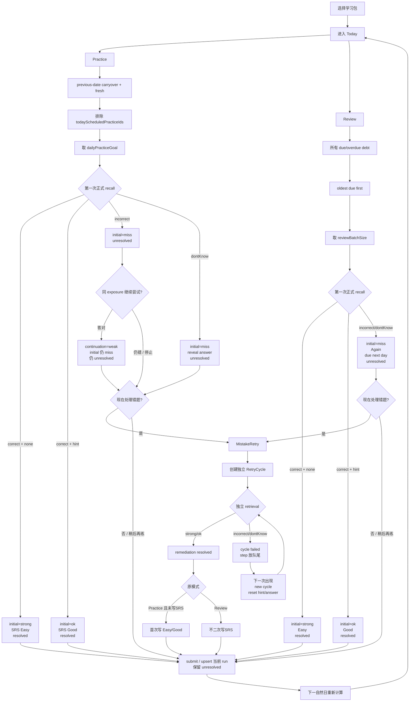
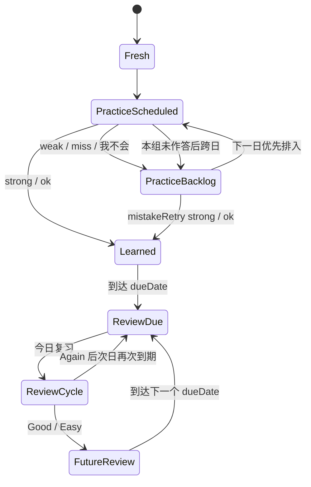
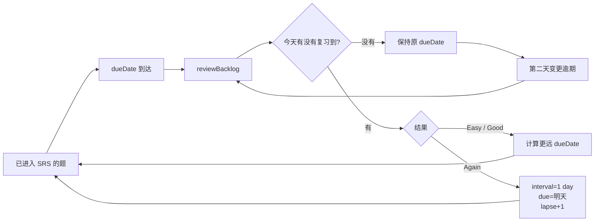

# 今日任务（今日复习 + 今日练习）V2.5.1 Frozen Implementation Spec

> 本文档是「今日任务」功能的 **V2.5.1 Frozen Implementation Spec**。
>
> 本版已经冻结业务语义。核心模型是：
>
> - `initialRecallResult`：第一次正式 recall，不可变
> - `continuationResult`：同一 scheduled exposure 失败后的继续尝试
> - `remediationResult`：mistakeRetry 新独立 cycle 的纠错结果
> - `attemptedIds`：已经发生第一次正式 recall
> - `unresolvedIds`：已经 attempted 但尚未解决
> - `srsAppliedIds`：当前 scheduled exposure 已经正式写过一次 SRS
>
> Today Task 的重点不是“把页面状态搬进 Zustand”，而是让 **领域语义、状态机、Run Identity、SRS、hydrate、offline submit** 使用同一套事实模型。
>
> 核心原则：
>
> 1. **Practice 与 Review 共用 Run / Session / Retry / Submit 骨架，但候选来源、跨日语义和 SRS 规则不同**
> 2. **答案是否正确 ≠ 当前 scheduled exposure 是否 learningPassed**
> 3. **`initialRecallResult` 创建后不可修改**
> 4. **`attempted` ≠ `resolved`；`unattempted` 不属于 `unresolved`**
> 5. **当前 session 队列必须稳定，答错不能动态删除当前题**
> 6. **day ≠ run；同一天允许 Practice / Review / 多个 batch 分别拥有 runId**
> 7. **rehearsal ≠ mistakeRetry ≠ 下一组**
> 8. **同一 `(runId, stepId)` 最多一次正式 SRS rating**
> 9. **Today UI 的 Green / Red / Gray ≠ SRS 历史事实**
>
> 涉及文件：
>
> - `apps/frontend/src/stores/today-practice.store.ts`（新增：Today 运行态 + 状态机）
> - `apps/frontend/src/features/learning/pages/today-task-page.tsx`
> - `apps/frontend/src/stores/daily-practice.store.ts`
> - `apps/frontend/src/stores/warmup-session.store.ts`
> - `apps/frontend/src/stores/preferences.store.ts`
> - `apps/frontend/src/lib/offline/daily-practice.repository.ts`
> - `apps/frontend/src/lib/offline/practice.repository.ts`
> - `apps/frontend/src/features/practice/components/*-drill-card.tsx`
> - `apps/frontend/src/features/learning/components/today-records-drawer.tsx`
>
> 建议新增测试：
>
> - `apps/frontend/src/stores/__tests__/today-practice.store.test.ts`
> - `apps/frontend/src/lib/offline/__tests__/daily-practice.repository.test.ts`


> **实现基线声明**
>
> 从 V2.5.1 开始，本文件是 Today Task 的唯一实现规格。代码、Store、Repository、UI、测试与迁移均以本文件为准。
> 若实现过程中发现代码现状与本文件冲突，优先修改代码；若发现本文件内部存在无法同时满足的规则，先记录 `spec conflict`，不得在代码层自行发明隐式规则。

---

# 1. 范围与目标

## 1.1 功能范围

「今日任务」是移动端每日学习核心入口，包含两种计划模式：

| 模式 | 内容 | 步骤来源 |
|---|---|---|
| 今日复习 `review` | 已进入 SRS 且 `dueDate <= targetDate` 的到期 / 逾期内容 | `reviewDebt`：`dueDate ASC → lapseCount DESC → stable id` |
| 今日练习 `practice` | 历史未解决 carryover + 当前学习包 fresh 内容 | `previous-date carryover + fresh`，并排除 `todayScheduledPracticeIds` |

两种模式共用：

- 计划加载
- 当前组运行态
- 作答记录
- 三色进度
- 错题池
- 错题重练
- 会话恢复
- 提交
- 打卡
- 下一组
- 历史记录展示

两种模式共用运行骨架，但以下业务语义不同：

| 维度 | Practice | Review |
|---|---|---|
| 候选来源 | previous-date carryover + fresh | due / overdue SRS debt |
| 失败后的 SRS | initial miss 不写 SRS | initial miss 立即写 Again |
| 同日 remediation | strong/ok 可首次进入 SRS | 不二次写 SRS |
| 跨日 | unresolved 进入 Practice carryover | 未做继续 overdue；Again 按新 dueDate |
| 分组设置 | `dailyPracticeGoal` | `reviewBatchSize` |

## 1.2 V2.5.1 设计目标

1. **领域事实优先于 UI 临时状态**
2. **状态机不依赖 React 数组索引**
3. **当前打开 session 使用稳定 `sessionStepIds + currentStepId`**
4. **刷新后准确恢复 initialRecall / continuation / remediation / attempted / unresolved / srsApplied**
5. **每个任务批次拥有独立 `runId`**
6. **Practice 当天 unresolved 不自动进入下一组，次日才成为 carryover**
7. **Review debt 不丢失，只按 `reviewBatchSize` 分批**
8. **同一 scheduled exposure 的 SRS 更新幂等**
9. **rehearsal 不污染 scheduled run / SRS / activity**
10. **历史答案不污染新的 active retrieval**
11. **所有三色、CTA 和完成判断从同一套 run-local facts 派生**

---

# 2. 核心领域语义（V2.5.1 唯一真相源）

V2.5.1 规定：

```text
第一次正式 recall 的事实
≠
同一题后续继续学习的结果
≠
mistakeRetry 的纠错结果
≠
当前 UI 展示状态
```

后续所有章节、Store、Repository、UI、测试都必须服从本节。

---

## 2.1 AttemptOutcome

```ts
type AttemptOutcome =
  | 'correct'
  | 'incorrect'
  | 'dontKnow'
```

```text
correct
= 用户提交了可接受答案

incorrect
= 用户提交了答案，但答案错误

dontKnow
= 用户未提交可判断答案，而是主动点击「我不会」
```

因此：

```ts
answerCorrect =
  outcome === 'correct'
    ? true
    : outcome === 'incorrect'
      ? false
      : null
```

---

## 2.2 AssistanceLevel

正式 retrieval 中只允许：

```ts
type AssistanceLevel =
  | 'none'
  | 'hint'
```

完整答案不是 assistance。

```text
提示
= retrieval 仍在继续

完整答案
= 当前 retrieval 已经结束
```

---

## 2.3 InitialRecallScore

第一次正式 recall 只可能产生：

```ts
type InitialRecallScore =
  | 'strong'
  | 'ok'
  | 'miss'
```

唯一规则：

```text
correct + none
→ strong

correct + hint
→ ok

incorrect
→ miss

dontKnow
→ miss
```

**第一次正式 recall 不存在 `weak`。**

---

## 2.4 WarmupScore

系统整体仍保留：

```ts
type WarmupScore =
  | 'strong'
  | 'ok'
  | 'weak'
  | 'miss'
```

其中：

```text
strong / ok
= 独立 retrieval 成功

weak
= 当前 scheduled exposure 已经发生过失败，
  后续在同一个 exposure 内又答对

miss
= 当前仍错误 / dontKnow
```

统一：

```ts
function isLearningPassed(score: WarmupScore) {
  return score === 'strong' || score === 'ok'
}
```

---

## 2.5 retrievalFailed

```ts
retrievalFailed: boolean
```

一个 scheduled exposure 初始：

```text
false
```

一旦发生：

```text
incorrect
dontKnow
```

立即：

```text
retrievalFailed=true
```

并且在**同一个 scheduled exposure** 内不能重置。

所以：

```text
第一次 incorrect
→ 后续同 exposure 即使答对
→ 只能 weak
→ 不算 learningPassed
```

---

## 2.6 answerRevealed

```ts
answerRevealed: boolean
```

只允许在 retrieval 已结束后为 true。

允许场景：

```text
① dontKnow
② 当前 retrieval 主动结束后进入教学回顾
③ mistakeRetry 某个失败 cycle 主动结束后
④ 历史记录 / read-only view
```

正常作答中禁止：

```text
查看答案
参考答案
完整 correction
```

---

## 2.7 initialRecallResult

V2.5.1 正式定义第一次 recall 的不可变结果：

```ts
interface InitialRecallResult {
  stepId: string
  outcome: AttemptOutcome
  assistance: AssistanceLevel
  score: InitialRecallScore

  srsRating?: 'easy' | 'good' | 'again'
}
```

它表示：

> **当前 scheduled exposure 第一次正式 recall 的不可变事实。**

因此：

```text
第一次 incorrect
→ initialRecallResult.score = miss

同 exposure 后来答对 weak
→ initialRecallResult 仍然 miss

mistakeRetry 后来 strong
→ initialRecallResult 仍然 miss
```

**`initialRecallResult` 创建后不可修改。**

SRS 是否已经真正应用，不保存在 `InitialRecallResult` 中。

唯一事实源是：

```text
srsAppliedIds
```

这样避免：

```text
initialRecallResult.srsApplied
与
srsAppliedIds
```

出现双真相。

---

## 2.8 continuationResult

同一个 scheduled exposure 发生第一次失败后，用户仍可继续学习。

建议记录：

```ts
interface ContinuationResult {
  stepId: string
  latestScore: 'weak' | 'miss'
  attemptCount: number
}
```

它只表示：

> 第一次 recall 已失败以后，当前卡内继续尝试到了什么程度。

例如：

```text
initialRecallResult = miss
→ 用户继续尝试
→ 最后答对

continuationResult.latestScore = weak
```

但：

```text
仍 unresolved
不写 Practice SRS
不改 Review SRS rating
```

---

## 2.9 remediationResult

mistakeRetry 是新的独立 retrieval cycle。

```ts
interface RemediationResult {
  stepId: string
  score: 'strong' | 'ok'
  resolved: boolean
  cycle: number
}
```

只有新的独立 retry cycle：

```text
strong / ok
```

才可以：

```text
resolved=true
```

它不能覆盖：

```text
initialRecallResult
```

---

## 2.10 attempted / unresolved / srsApplied

三个集合必须精确定义：

```ts
attemptedIds: Set<string>
unresolvedIds: Set<string>
srsAppliedIds: Set<string>
```

### attempted

```text
当前 run 已经发生第一次正式 recall
```

### unresolved

```text
已经 attempted
且当前尚未真正解决
```

所以：

```text
unattempted ∉ unresolvedIds
```

这是强约束。

### srsApplied

```text
当前 scheduled exposure 已经正式向 SRS 写过一次 rating
```

---

## 2.11 Practice 状态

```text
unattempted
→ attempted=false
→ unresolved=false
→ stepId ∉ srsAppliedIds

strong/ok
→ attempted=true
→ unresolved=false
→ apply SRS once
→ srsAppliedIds.add(stepId)

miss
→ attempted=true
→ unresolved=true
→ stepId ∉ srsAppliedIds

miss 后同 exposure weak
→ attempted=true
→ unresolved=true
→ stepId ∉ srsAppliedIds

mistakeRetry 新 cycle strong/ok
→ remediation.resolved=true
→ unresolved=false
→ 如果 !srsAppliedIds.has(stepId)
   则首次写 SRS，并 add(stepId)
```

---

## 2.12 Review 状态

第一次正式 recall：

```text
strong → Easy
ok     → Good
miss   → Again
```

其中：

```text
incorrect
dontKnow
```

都归为：

```text
miss → Again
```

**`weak` 不独立触发 Again。**

如果第一次已经 miss / Again，后续：

```text
同 exposure weak
mistakeRetry strong/ok
```

都不能修改：

```text
initialRecallResult.srsRating = again
```

---

## 2.13 UI State

三色是 Today 当前状态，不等于 SRS 历史事实。

```text
Gray
= 未 attempted

Red
= attempted && unresolved

Green
= attempted && !unresolved
```

因此：

```text
Review initial miss/Again
+ remediation strong
→ Green / 今日已重新掌握
```

但历史仍是：

```text
Again
```

---

## 2.14 一个 scheduled exposure 最多一次 SRS

唯一约束：

```text
(runId, stepId)
→ 最多一次正式 SRS rating
```

通过：

```text
srsAppliedIds
+
本地 repository 幂等
+
服务端幂等
```

共同保证。

# 3. 决策基线

| # | 决策 | 说明 |
|---|---|---|
| D0 | **§2 是唯一语义真相源** | 其它章节不得重新定义 recall / score |
| D1 | **initialRecallResult 永不可变** | 第一次 recall 是 miss，就永远保留 miss |
| D2 | **weak 不属于第一次 recall** | weak 只属于 failed exposure 的继续尝试 |
| D3 | **unresolved 不包含 unattempted** | `unresolved = attempted && not resolved` |
| D4 | **allResolved 必须包含 allAttempted 条件** | 防止没做完却误判 resolved |
| D5 | **dontKnow 独立于 incorrect** | `answerCorrect=null` |
| D6 | **完整答案只在 retrieval 结束后出现** | 正常作答只有 none/hint |
| D7 | **Practice strong/ok 才首次写 SRS** | initial miss / continuation weak 不写 |
| D8 | **Review miss 首次正式写 Again** | incorrect/dontKnow 都归 miss |
| D9 | **Review weak 不独立产生 rating** | 沿用第一次 miss 的 Again |
| D10 | **remediation 不覆盖 initial recall** | Today 可变绿，SRS 历史不变 |
| D11 | **mistakeRetry 使用独立 RetryCycle** | failed cycle → 队尾 → new cycle |
| D12 | **Retry queue 不持久化** | 从 `unresolvedIds + roundStepIds` 派生 |
| D13 | **Practice 当天已 scheduled item 不进下一组** | 当天错题只主动 mistakeRetry |
| D14 | **Practice unresolved 次日 carryover** | 占 dailyPracticeGoal |
| D15 | **Review debt 自然累积** | overdue 不丢 |
| D16 | **Review 分组只限 batch，不删 debt** | reviewBatchSize |
| D17 | **active run 配置冻结** | 设置只影响下一 run |
| D18 | **mode switch suspend/restore** | 不销毁另一 mode |
| D19 | **runId 独立于 date** | 同日多 run 不覆盖 |
| D20 | **历史答案不进入 active retrieval** | history/read-only 隔离 |
| D21 | **retryCurrentStep = rehearsal** | 不改 scheduled truth |
| D22 | **SRS rating 映射只有一处定义** | 不允许各层自行推断 |
| D23 | **Review 示例必须可逐日验算** | debt 必须按来源拆分 |
| D24 | **三色只由 attempted/unresolved 派生** | Green/Red/Gray 互斥 |

# 4. 系统设置与跨日排程

## 4.1 两个独立设置

V2.5.1 明确废弃“一个 `dailyGoal` 同时控制 Practice 与 Review”的语义，拆成两个独立设置。

推荐设置：

```ts
dailyPracticeGoal = 20
reviewBatchSize = 20
```

### dailyPracticeGoal

表示：

> 每个 Practice run 默认要推进多少道“新学 / 未学会”题。

Practice backlog 会占用这个名额。

### reviewBatchSize

表示：

> Review debt 每次打开一个 review run 时最多取多少题。

它**不代表总债务上限**。

例如：

```text
Review debt = 47
reviewBatchSize = 20

第1组 = 20
第2组 = 20
第3组 = 7
```

未做的 debt 不会消失。

---

## 4.2 Practice 跨日 backlog

Practice 候选优先级：

```text
P1 历史 attempted && unresolved
P2 历史 scheduled && unattempted
P3 fresh new
```

其中“历史”指：

```text
run.date < targetDate
```

当天已经被任意 Practice run scheduled 过的 item，不得自动进入当天下一组。

### todayScheduledPracticeIds

这是一个**日期级派生集合**，不是单个 run 的持久化字段。

```ts
todayScheduledPracticeIds =
  union(
    allPracticeRuns
      .filter(run =>
        run.date === targetDate &&
        samePracticeScope(run, requestedScope, packKey)
      )
      .flatMap(run => run.scheduledItemIds)
  )
```

因此：

```text
run1 今天 scheduled A
A unresolved
→ 用户选择“稍后再练”
→ 创建 run2
→ run2 自动排除 A
```

A 今天如果要继续处理：

```text
只能主动进入 mistakeRetry
```

如果到当天结束仍 unresolved：

```text
下一自然日
→ A 成为 previous-date carryover
```

Planner 不需要把 `todayScheduledPracticeIds` 复制保存到每个 run；每次创建新的 Practice run 时，从当天已有 Practice runs 派生即可。

## 4.3 Practice backlog 不是 yesterday-only

必须查询：

```text
所有历史 Practice run
```

找出：

```text
scheduled 过
但截至 targetDate 之前仍 unresolved
```

的 item。

不能只查昨天。

---

## 4.4 Review debt

Review 候选来自：

```text
所有 SRS progress 中 dueDate <= targetDate
且今天尚未对该 exposure 应用正式 review rating
```

因此：

```text
昨天没做的 overdue
+
今天新到期
+
更早没清完的 overdue
=
availableReviewCount
```

Review debt 是真实时间债务，允许累积。

---

## 4.5 Review 排序

统一：

```text
1. dueDate ASC
2. lapseCount DESC
3. stable itemId / stableHash
```

禁止：

```text
随机打散 overdue
```

`dailyPracticeRandomOrder` 只影响 Practice fresh 内容，不影响 Review debt。

---

## 4.6 active run 配置冻结

设置变化时：

```text
当前正在执行的 run 不重建
当前 sessionStepIds 不改变
当前 currentStepId 不改变
```

新设置只在：

```text
下一 run
下一组
下一自然日创建新 run
```

时生效。

因此 `configFingerprint` 的用途是：

```text
创建 / 恢复 run 时判断 run 是否属于同一配置
```

不是：

```text
设置一改就把正在练的 active run invalidate
```

---

## 4.7 mode switch

Practice 与 Review 分别拥有 active run pointer。

```text
Practice 做到 8/20
→ 切 Review
→ Review 做到 5/20
→ 切回 Practice
→ 恢复原 Practice currentStep / progress
```

模式切换：

```text
suspend current
restore target mode
```

不是：

```text
destroy current
create new
```

---

## 4.8 pack switch

Practice active run 以 pack 为作用域保存。

切换学习包：

```text
原 pack active run 保存
新 pack restore/create
```

Review：

```text
mixed=false → 当前 pack debt
mixed=true  → 所有符合条件 pack debt
```

---

## 4.9 跨午夜

如果 Drawer 正在作答：

```text
允许完成当前 interaction
```

回到 Today 页面时检测日期变化：

```text
persist old run
→ new targetDate
→ restore/build new-day Practice context
→ recalc Review debt
```

旧 run 不被修改日期。

# 5. Identity：Plan / Run / Round / Session / RetryCycle

## 5.1 Plan

Plan：

> 根据 targetDate、mode、pack、冻结配置和候选池，计算某个 run 的 scheduled items。

---

## 5.2 Run

Run：

> 一次真正独立的 Today scheduled 批次。

```ts
type StoredDailyPracticeRun = {
  id: string // runId

  date: string
  mode: 'practice' | 'review'
  scope: 'single' | 'mixed'
  packIds: string[]

  configFingerprint: string
  scheduledItemIds: string[]

  // Today run-local facts
  attemptedItemIds: string[]
  unresolvedItemIds: string[]
  srsAppliedItemIds: string[]
  initialRecallResults: Record<string, InitialRecallResult>
  continuationResults: Record<string, ContinuationResult | undefined>
  remediationResults: Record<string, RemediationResult | undefined>

  createdAt: string
  updatedAt: string

  syncStatus: 'pending' | 'synced'
  activityMarked: boolean
}
```

**目标模型不再依赖：**

```text
completedItemIds
```

学习通过、未解决、UI 三色都从：

```text
initialRecallResults
continuationResults
remediationResults
attemptedItemIds
unresolvedItemIds
```

派生。

---

## 5.3 Active Run Pointer

指针和 run 本体分离。

建议：

```text
daily-active:{date}:{mode}:{scope}:{packKey}
```

值：

```ts
{ runId }
```

---

## 5.4 RoundKind

```ts
type RoundKind =
  | 'main'
  | 'mistakeRetry'
```

禁止把 mistakeRetry 叫 `review`。

---

## 5.5 PracticePurpose

```ts
type PracticePurpose =
  | 'scheduled'
  | 'mistakeRetry'
  | 'rehearsal'
```

---

## 5.6 RetryCycle

mistakeRetry 内每道题可能经历多次独立 retrieval cycle。

```ts
interface RetryCycleState {
  stepId: string
  cycle: number
  retrievalFailed: boolean
  answerRevealed: boolean
}
```

### cycle 规则

进入 mistakeRetry：

```text
cycle=1
retrievalFailed=false
answerRevealed=false
```

如果本 cycle：

```text
strong/ok
→ resolved
→ 移出 retry pending
```

如果：

```text
incorrect
→ 本 cycle 失败
→ 可给提示
→ 当前题可以继续学习
```

但为了形成下一次真正独立 retrieval：

```text
结束本 cycle
→ step 移到 retry 队尾
→ 下次再次出现时 cycle+1
→ retrievalFailed=false
→ hint reset
→ answerRevealed=false
```

如果：

```text
dontKnow
→ 结束本 cycle
→ 可 reveal answer
→ step 移到 retry 队尾
```

**不能在同一个 failed cycle 中不断提交，最后 strong/ok 就算解决。**

只有新的独立 cycle 才能真正解决 retry。

---

## 5.7 Session

Drawer 打开时：

```text
sessionStepIds = stable snapshot
currentStepId = stable id
```

Drawer 生命周期内不因派生集合变化动态删当前题。

---

## 5.8 Replay / retryCurrentStep

答对后的“重新练习当前题”属于：

```text
rehearsal
```

不是 scheduled exposure，也不是 mistakeRetry。

因此：

```text
不改 initialRecallResult
不改 remediationResult
不改 SRS
不改 Today completion
```

只记录可选 rehearsal history。

# 6. Today Practice Store

## 6.1 Store 职责

`today-practice.store` 管理当前 active run 的 UI / 状态机事实：

- run identity
- initialRecallResults
- remediationResults
- attempted / unresolved / srsApplied
- session snapshot
- currentStepId
- mistakeRetry cycles
- hydrate lifecycle
- submission status

Repository 管理持久化和 SRS。

---

## 6.2 推荐状态

```ts
interface TodayPracticeState {
  runId: string | null
  mode: 'practice' | 'review'
  roundKind: 'main' | 'mistakeRetry'

  roundStepIds: string[]

  attemptedIds: Set<string>
  unresolvedIds: Set<string>
  srsAppliedIds: Set<string>

  initialRecallResults: Record<string, InitialRecallResult>
  continuationResults: Record<string, ContinuationResult | undefined>
  remediationResults: Record<string, RemediationResult | undefined>

  sessionStepIds: string[]
  currentStepId: string | null

  retryQueueIds: string[]
  retryCycles: Record<string, RetryCycleState>

  sessionHydrated: boolean

  submissionStatus:
    | 'idle'
    | 'dirty'
    | 'submitting'
    | 'synced'
    | 'failed'
}
```

---

## 6.3 CurrentStep

唯一导航身份：

```ts
currentStepId
```

索引只作为渲染派生：

```ts
currentIdx =
  sessionStepIds.findIndex(id => id === currentStepId)
```

---

## 6.4 Step Card 临时 UI 状态

`warmup-session.store.stepStates` 可以保存：

```ts
{
  userAnswer
  hintLevel: 'none' | 'hint'
  feedback
  skipped
  retrievalFailed
  answerRevealed
}
```

但它不是业务事实源。

正式业务事实必须在 Today run：

```text
initialRecallResults
continuationResults
remediationResults
attemptedIds
unresolvedIds
srsAppliedIds
```

---

## 6.5 历史答案隔离

新的 active Today retrieval：

```text
禁止 hydrate 历史答案进 stepStates
```

`hydrateHistoricalStepStates()` 在 Today active practice 上应废弃或仅保留 read-only 场景。

历史记录只能进入：

```text
history drawer
reviewData
read-only record view
```

不能成为当前作答提示。

# 7. 队列模型

## 7.1 roundStepIds

当前 run 固定 scheduled 集合。

run 生命周期内不变化。

---

## 7.2 main session

点击继续练习：

```text
生成 mainSessionCandidateIds
→ snapshot 到 sessionStepIds
```

当前主轮 session 打开后：

```text
答错不会把当前题从数组删除
currentStepId 不变化
```

关闭 Drawer 后再次进入“继续练习”：

```text
默认从未 attempted 的题继续
```

当前 unresolved 题通过：

```text
练习错题
```

处理，而不是偷偷混回主继续队列。

---

## 7.3 mistakeRetry queue

进入：

```ts
retryQueueIds =
  unresolvedIds 按 roundStepIds 原顺序
```

每个 step 开始：

```text
new retry cycle
```

成功：

```text
strong/ok
→ remediation.resolved=true
→ unresolvedIds.delete(stepId)
→ 从 retry queue 移除
```

失败：

```text
incorrect/dontKnow
→ 当前 cycle 结束
→ step 放到 retry queue 尾部
```

下一次再出现：

```text
cycle + 1
retrievalFailed=false
answerRevealed=false
hint=none
```

这解决：

```text
“failed retry cycle 不会 resolved”
```

与：

```text
“failed exposure 最多 weak”
```

之间的死循环。

---

## 7.4 retry 中「我不会」

V2.5.1 明确允许：

```text
mistakeRetry 中仍可点击「我不会」
```

行为：

```text
dontKnow
→ 当前 cycle miss
→ reveal answer
→ cycle 结束
→ 放到队尾
```

下一次轮到该题时重新隐藏答案并开始新 cycle。

因此不再使用：

```text
retryDontKnowPolicy=true
```

作为统一 retry 规则。

可以把文案改成：

```text
我还是不会
```

---

## 7.5 当天 Practice 下一组排除

需要：

```ts
todayScheduledPracticeIds
```

当天任何 Practice run 已经 scheduled 过的 item：

```text
不再进入当天自动“下一组”
```

未解决：

```text
第二天才进入 carryover
```

用户今天想继续处理：

```text
只能主动 mistakeRetry
```

避免：

```text
稍后再练 → 下一组 → 同一错题自动又出现
```

# 8. 派生统计

派生函数：

```ts
deriveTodayPractice({
  roundStepIds,
  attemptedIds,
  unresolvedIds,
  initialRecallResults,
  continuationResults,
  remediationResults,
  roundKind,
})
```

输出：

```ts
{
  greenStepIds,
  redStepIds,
  grayStepIds,

  greenCount,
  redCount,
  grayCount,

  attemptedCount,
  unresolvedCount,

  allAttempted,
  allResolved,

  retryPendingCount,
}
```

---

## 8.1 UI 三色算法

颜色只能由：

```text
attemptedIds
unresolvedIds
```

派生。

```ts
grayStepIds =
  roundStepIds.filter(id => !attemptedIds.has(id))

redStepIds =
  roundStepIds.filter(id =>
    attemptedIds.has(id) &&
    unresolvedIds.has(id)
  )

greenStepIds =
  roundStepIds.filter(id =>
    attemptedIds.has(id) &&
    !unresolvedIds.has(id)
  )
```

因此：

```text
Gray  = !attempted
Red   = attempted && unresolved
Green = attempted && !unresolved
```

`initialRecallResult / continuationResult / remediationResult` 用于解释学习历史与状态转移，**不是第二套颜色算法**。

例如 Review：

```text
initialRecallResult=miss / Again
→ unresolved=true
→ Red

mistakeRetry strong
→ remediationResult.resolved=true
→ unresolvedIds.delete(stepId)
→ Green
```

历史仍然保留：

```text
initial Again
```

## 8.2 互斥 invariant

必须：

```ts
green ∩ red = ∅
green ∩ gray = ∅
red ∩ gray = ∅

greenCount + redCount + grayCount
=== roundStepIds.length
```

---

## 8.3 allAttempted

```ts
allAttempted =
  roundStepIds.every(id => attemptedIds.has(id))
```

不是：

```text
greenCount === total
```

---

## 8.4 allResolved

```ts
const allAttempted =
  roundStepIds.every(id => attemptedIds.has(id))

const allResolved =
  allAttempted && unresolvedIds.size === 0
```

因此：

```text
未 attempted 的题
不会进入 unresolvedIds
但会让 allAttempted=false
所以 allResolved 也必然=false
```

---

## 8.5 Topic 累计进度

包 / 话题累计：

```text
bestScoreRank >= 2
```

只表示：

> 这道题历史上至少真正通过过一次 Practice / learning。

Review 当天 Again 不会把：

```text
bestScoreRank
```

倒退。

所以：

```text
累计已练 X/Y
```

和：

```text
当前 Review 是否记住
```

是两个不同指标。

# 9. warmup-session.store 的语义

## 9.1 stepStates

只保存卡片 UI 临时状态：

```text
输入
提示
feedback
skipped
retrievalFailed
answerRevealed
```

不是 run 的官方事实。

---

## 9.2 attemptHistory

建议增加：

```ts
attemptHistory: AttemptHistoryEntry[]
```

记录每次真实提交 / retry cycle / rehearsal。

用途：

- debug
- AI assessment
- 练习次数
- 行为分析

---

## 9.3 不再把 `records` 作为 initialRecallResult 唯一来源

旧的：

```text
records = 每 step 最新 snapshot
```

无法表示：

```text
Review main miss / Again
→ mistakeRetry strong
```

因为 strong 会覆盖 miss。

V2.5.1 目标模型：

```text
Today Run:
  initialRecallResults       // 不可被 remediation 覆盖
  remediationResults    // 同日纠错状态

Warmup Session:
  stepStates            // UI
  attemptHistory        // 所有尝试
```

如果为兼容旧代码暂时保留：

```text
records
```

只能作为 UI / submit compatibility adapter。

不能再作为：

```text
SRS initial-recall truth
```

---

## 9.4 reset API

明确拆开：

```ts
resetStepUi(stepId)
resetRetryCycleUi(stepId)
clearSessionUi()
```

避免模糊：

```ts
resetSteps()
```

把业务记录一起删掉。

`retryCurrentStep()`：

```text
只 reset UI
不删 initialRecall/remediation/history
```

# 10. 会话恢复（hydrate）

## 10.1 顺序

```text
1. resolve active run pointer
2. load StoredDailyPracticeRun
3. hydrate initialRecallResults
4. hydrate continuationResults
5. hydrate remediationResults
6. hydrate attemptedIds
7. hydrate unresolvedIds
8. hydrate srsAppliedIds
9. hydrate UI stepStates（仅当前 run）
10. hydrate submissionStatus
11. sessionHydrated=true
```

---

## 10.2 禁止再从 completedItemIds 恢复业务状态

V2.5.1 目标模型：

```text
completedItemIds 不参与 Today hydrate
```

如果迁移期旧表仍存在：

```text
只用于兼容迁移
```

迁移完成后删除。

---

## 10.3 当前 run 与历史隔离

current run：

```text
initialRecall/continuation/remediation/attempted/unresolved/srsApplied
```

可以恢复当前 Today 状态。

historical：

```text
不能进入当前 active retrieval 的 stepStates
```

尤其不能恢复：

```text
历史答案
历史 correction
历史 failed UI
```

到当前正在做的题。

---

## 10.4 RetryCycle 恢复

V2.5.1 明确：

```text
retryQueueIds 不持久化
retryCycles 不作为核心 run state 持久化
```

刷新后：

```ts
retryQueueIds =
  roundStepIds.filter(id => unresolvedIds.has(id))
```

然后对当前第一个 retry step：

```text
开启一个新的独立 RetryCycle
retrievalFailed=false
answerRevealed=false
hint=none
```

### cycle 编号

cycle number 只用于：

```text
debug
attemptHistory
analytics
```

如果需要连续编号：

```ts
cycle =
  max(previousAttemptHistoryCycleForStep) + 1
```

如果不做 analytics：

```text
cycle 可以从 1 重新开始
```

业务正确性不能依赖 cycle number。

重要的是：

```text
刷新后不能恢复一个已经被 hint / answer 污染的半个 cycle
```

而是重新开始一次干净的 independent retrieval。

## 10.5 Submission 恢复

绑定：

```text
runId
```

恢复：

```text
idle / dirty / synced / failed
```

不能使用全局：

```text
hasSubmittedToday
```

# 11. 作答流程

## 11.1 统一卡片事件

推荐：

```ts
onAttempt({
  stepId,
  outcome,
  assistance,
})
```

Today 层计算：

```text
score
retrievalFailed
initialRecallResult
remediationResult
SRS action
```

卡片不自己决定：

```text
这个结果是否要写 SRS
```

---

## 11.2 Practice 主轮

### 首次独立正确

```text
outcome=correct
assistance=none
retrievalFailed=false

→ initialRecallResult.score=strong
→ attempted=true
→ unresolved=false

→ rating=easy
→ apply SRS once
→ srsAppliedIds.add(stepId)
```

### 提示后正确

```text
outcome=correct
assistance=hint
retrievalFailed=false

→ initialRecallResult.score=ok
→ attempted=true
→ unresolved=false

→ rating=good
→ apply SRS once
→ srsAppliedIds.add(stepId)
```

### 普通错误

第一次错误：

```text
outcome=incorrect
→ initialRecallResult.score=miss
→ retrievalFailed=true
→ attempted=true
→ unresolved=true
→ 不写 SRS
```

`initialRecallResult` 此后不可修改。

当前卡允许继续学习。

如果后续同 exposure 答对：

```text
continuationResult.latestScore=weak
→ initialRecallResult 仍为 miss
→ unresolved 仍 true
→ 不写 SRS
```

这表示：

> 当前 exposure 有改善，但第一次 recall 已经失败，仍未真正 learningPassed。

### 我不会

```text
outcome=dontKnow
answerCorrect=null

→ initialRecallResult.score=miss
→ attempted=true
→ retrievalFailed=true
→ unresolved=true
→ Practice 不写 SRS

→ answerRevealed=true
→ 当前 retrieval 结束
```

这里的 `miss` 属于：

```text
initialRecallResult
```

不是 `continuationResult`。

---

## 11.3 Review 主轮

Review 的正式 SRS rating 只由**第一次正式 recall**决定。

### strong

```text
correct + none
→ initialRecallResult.score=strong
→ initialRecallResult.srsRating=easy
→ attempted=true
→ unresolved=false
→ apply SRS once
→ srsAppliedIds.add(stepId)
```

### ok

```text
correct + hint
→ initialRecallResult.score=ok
→ initialRecallResult.srsRating=good
→ attempted=true
→ unresolved=false
→ apply SRS once
→ srsAppliedIds.add(stepId)
```

### incorrect / dontKnow

```text
→ initialRecallResult.score=miss
→ initialRecallResult.srsRating=again
→ attempted=true
→ unresolved=true
→ apply SRS once
→ srsAppliedIds.add(stepId)
```

如果是 dontKnow：

```text
answerRevealed=true
```

之后同 exposure 即使答对：

```text
continuationResult.latestScore=weak
```

也不能修改：

```text
initialRecallResult.score=miss
initialRecallResult.srsRating=again
dueDate=Again 计算结果
```

**Review 中 weak 不独立触发 Again；Again 已经在第一次 miss 时产生。**

## 11.4 Practice mistakeRetry

进入新的独立 retry cycle。

如果：

```text
strong/ok
```

则：

```text
remediationResult.resolved=true
unresolved=false

如果 !srsAppliedIds.has(stepId)
→ 首次写 Practice SRS
→ srsAppliedIds.add(stepId)
```

注意：

```text
原 initialRecallResult 若为 miss，必须永久保留 miss
```

如果同 exposure 曾继续答对：

```text
continuationResult.latestScore='weak'
```

再由 mistakeRetry 成功写：

```text
remediationResult=strong/ok
```

三层事实互不覆盖。

---

## 11.5 Review mistakeRetry

如果：

```text
strong/ok
```

则：

```text
remediationResult.resolved=true
unresolved=false
Today UI 可显示“已重新掌握”
```

但：

```text
不再次 scheduleReview
不改 initialRecallResult.srsRating=again
不改 Again 后的 dueDate
```

---

## 11.6 Retry cycle 失败

如果一个 retry cycle：

```text
incorrect
dontKnow
```

则：

```text
当前 cycle 结束
step 放队尾
```

下一次再出现：

```text
cycle+1
retrievalFailed=false
hint reset
answer hidden
```

**只有新 cycle 的独立 strong/ok 才能 resolved。**

---

## 11.7 retryCurrentStep

答对后的即时重练：

```text
purpose=rehearsal
```

结果：

```text
不改 initialRecallResult
不改 remediationResult
不改 unresolved
不改 srsAppliedIds
不改 activity
```

只写可选：

```text
attemptHistory
```

---

## 11.8 API / Action 命名

不建议继续使用：

```ts
completeStep()
```

这种同时混合：

```text
写 Today 状态
+
学习是否解决
+
SRS 更新
+
持久化
```

的含糊动作。

### Today 状态机 action

```ts
recordInitialRecallResult()
recordContinuationResult()
recordRemediationResult()
```

只修改 run-local facts。

### Repository / SRS action

```ts
persistRunFacts()
applySrsRatingOnce()
submitRun()
```

职责：

```text
状态机
→ 决定发生了什么

Repository
→ 负责持久化

SRS
→ 只根据 §12.7 的映射更新一次
```

禁止让 Card 自己决定是否写 SRS。

# 12. Repository / 持久层

## 12.1 真实 runId

禁止：

```text
daily:{date}
```

表示所有 Today run。

每个 run：

```ts
runId = createId('today_run')
```

Practice / Review / 下一组均不同。

---

## 12.2 Active pointer

```text
daily-active:{date}:{mode}:{scope}:{packKey}
→ runId
```

---

## 12.3 Practice plan

输入：

```text
previous-date carryover
fresh pool
dailyPracticeGoal
targetDate
scope / packKey
```

先派生：

```ts
const todayScheduledPracticeIds =
  deriveTodayScheduledPracticeIds({
    targetDate,
    scope,
    packKey,
    practiceRuns,
  })
```

其中：

```text
todayScheduledPracticeIds
=
当天所有匹配 Practice run 的 scheduledItemIds 并集
```

然后：

```ts
candidates = dedupe([
  ...previousDateCarryover,
  ...orderedFresh,
])

scheduled = candidates
  .filter(item => !todayScheduledPracticeIds.has(item.itemId))
  .slice(0, dailyPracticeGoal)
```

注意：

```text
todayScheduledPracticeIds 不属于 StoredDailyPracticeRun 字段
```

它是 planner 每次创建新 run 时的日期级派生事实。

## 12.4 Review plan

```ts
reviewDebt = allDueItems
  .filter(item => !reviewInitialRecallAlreadyAppliedToday(item))
  .sort(compareReviewDebt)

scheduled = reviewDebt.slice(0, reviewBatchSize)
```

其中：

```text
compareReviewDebt:
dueDate ASC
→ lapseCount DESC
→ stable id
```

---

## 12.5 Review Already Applied Today

如果今天 A：

```text
main Review → Again
```

虽然：

```text
dueDate=明天
```

它本身已经不属于今日新的 review debt。

同日纠正：

```text
走 mistakeRetry
```

不能下一组又自动抽 A。

---

## 12.6 Practice unresolved 跨日

今天 unresolved：

```text
不会自动进入当天下一组
```

明天：

```text
targetDate > original run.date
→ carryover
```

---

## 12.7 SRS Rating 唯一映射

SRS 映射只允许通过以下两个入口。

### A. 第一次正式 recall

```ts
function toInitialSrsRating(
  mode: 'practice' | 'review',
  result: InitialRecallResult,
): 'easy' | 'good' | 'again' | null {
  if (result.score === 'strong') return 'easy'
  if (result.score === 'ok') return 'good'

  // 此时只剩 miss
  return mode === 'review' ? 'again' : null
}
```

得到：

```text
Practice initial strong → Easy
Practice initial ok     → Good
Practice initial miss   → null

Review initial strong → Easy
Review initial ok     → Good
Review initial miss   → Again
```

### B. Practice remediation 首次进入 SRS

只允许 Practice 调用：

```ts
function toPracticeRemediationSrsRating(
  result: RemediationResult,
): 'easy' | 'good' {
  return result.score === 'strong' ? 'easy' : 'good'
}
```

前提：

```text
mode='practice'
!srsAppliedIds.has(stepId)
remediation.resolved=true
```

### Review remediation

明确禁止调用 SRS mapping：

```text
Review remediation
→ no SRS
→ 保留 initial Again / dueDate
```

### weak

```text
weak 永远不直接映射成 SRS rating
```

它只可能存在于：

```text
continuationResult
```

---

## 12.8 SRS API 幂等

建议：

```ts
applySrsRatingOnce({
  runId,
  stepId,
  rating,
})
```

本地和服务端都以：

```text
(runId, stepId)
```

做幂等 key。

---

## 12.9 Progress 与 Run 分层

`daily_practice_items`：

```text
长期 SRS progress
```

Today Run：

```text
今天这次 scheduled exposure 的事实
```

不能再用：

```text
scheduleStatus(lastPracticedAt===today)
```

推断整个 Today run 状态。

`lastPracticedAt` 只属于 SRS progress，不是 Today UI 的完整状态机。

# 13. warmupRecordId

## 13.1 scheduled run

建议稳定为：

```ts
warmupRecordId = `today-warmup:${runId}`
```

主轮与 mistakeRetry 都属于同一个 scheduled run。

同一个 warmup record 中，每个 step 必须分别保存：

```text
initialRecallResult
continuationResult
remediationResult
attemptHistory
```

更新规则：

```text
initialRecallResult
→ 第一次正式 recall 创建
→ 之后不可覆盖

continuationResult
→ 同 exposure 第一次失败后的继续尝试可以更新

remediationResult
→ mistakeRetry 新独立 cycle 成功后更新

attemptHistory
→ 每次真实 attempt / retry cycle / rehearsal append
```

因此禁止再引入一个单一的：

```text
latestResult
```

去覆盖这三层事实。

原因：

```text
Review initial miss / Again
→ continuation weak
→ remediation strong
```

这三个事实必须同时存在，不能被一个“latest”覆盖。

## 13.2 replay

```ts
replayRecordId =
  `today-replay:${runId}:${replayNonce}`
```

避免重新练习把原 scheduled run 的 synced record 改回 pending。

---

# 14. 提交模型

## 14.1 submissionStatus

```ts
type SubmissionStatus =
  | 'idle'
  | 'dirty'
  | 'submitting'
  | 'synced'
  | 'failed'
```

绑定：

```text
runId
```

---

## 14.2 dirty 的唯一来源

以下 run-local fact 变化：

```text
initialRecallResults
continuationResults
remediationResults
attemptedIds
unresolvedIds
srsAppliedIds
```

都可使：

```text
submissionStatus='dirty'
```

**不再使用 completedItemIds 判断 dirty。**

---

## 14.3 主轮提交

当：

```text
allAttempted=true
```

即可提交当前主轮事实。

如果有 unresolved：

```text
弹：
练习错题
稍后再练
```

选择稍后：

```text
可以先 submit 当前 run
```

之后 mistakeRetry 解决部分 unresolved：

```text
run 再次 dirty
→ upsert 同一 run
```

---

## 14.4 已 synced 后的 remediation

允许：

```text
synced
→ mistakeRetry success
→ dirty
→ 再次 submit
```

但：

```text
SRS 不重复
activity 不重复
server run 不重复创建
```

---

## 14.5 Replay / rehearsal

默认：

```text
不改变 scheduled run submission
```

如需记录，使用：

```text
独立 attemptHistory / replay record
```

不污染 scheduled run 的 initial-recall SRS 结果。

# 15. 服务端 / outbox 幂等要求

## 15.0 本地 SRS 原子性

`applySrsRatingOnce()` 不能只靠 UI 层先后执行多个独立写操作。

一次正式 SRS 应用必须保证下面这些事实一起成功或可恢复：

```text
1. daily_practice_items / SRS progress 更新
2. 对应 attempt 写入
3. 当前 run 的 srsAppliedItemIds 写入
4. outbox / pending sync 状态写入
```

首选：

```text
同一个本地数据库 transaction 原子提交
```

如果当前存储层暂时不支持跨表 transaction，则必须使用：

```text
稳定 clientAttemptId / (runId, stepId)
+
幂等 applySrsRatingOnce
+
启动 / hydrate 时 reconciliation
```

保证崩溃窗口：

```text
SRS progress 已推进
但 run 还没记录 srsApplied
```

不会导致下一次启动再次推进 SRS。

强约束：

```text
srsAppliedIds.add(stepId)
只能在本地正式 SRS 更新成功后落盘
```

不能：

```text
先 add(stepId)
→ SRS 更新失败
```

也不能留下：

```text
SRS 已成功
→ 永久没有任何幂等记录
```

---


## 15.1 必须以稳定 clientRunId 幂等

请求 payload 建议包含：

```ts
run: {
  clientRunId: runId
  date
  mode
  scope
  ...
}
```

服务端必须：

```text
same clientRunId
→ update / upsert
→ 不重复创建 run
```

---

## 15.2 warmup record 幂等

同一个 scheduled run：

```text
same runId
→ same logical warmup record
```

mistakeRetry 补提交只更新。

不能：

```text
main submit → create record #1
retry submit → create record #2
```

---

## 15.3 打卡幂等

打卡以：

```text
runId
```

或者等价幂等 key 保证：

```text
同一 run 多次 submit
→ 只计一次 Today activity
```

Replay 默认不重复计 Today scheduled activity。

---

## 15.4 outbox entityId

禁止再使用过粗的：

```text
daily:{date}
```

建议：

```ts
entityId = runId
```

同一 run retry：

```text
更新 / 合并 pending operation
```

避免同一天不同 run 相互覆盖。

---

# 16. 进度统计口径

## 16.1 当前组三色

唯一统计口径与 §8.1 完全相同：

```text
Gray  = !attempted
Red   = attempted && unresolved
Green = attempted && !unresolved
```

禁止再从：

```text
score
initialRecallResult
remediationResult
```

单独计算另一套颜色。

这些结果对象只用于：

```text
解释状态为什么发生
历史展示
SRS / remediation 语义
```

例如：

```text
Review initial miss / Again
→ attempted=true
→ unresolved=true
→ Red

同日 remediation strong
→ unresolved=false
→ Green + “今日已重新掌握”
```

但 SRS 历史仍为：

```text
Again / 明天再次复习
```

## 16.2 Badge

主轮：

```text
attemptedCount / roundTotal
```

表示：

> 今天这组已经实际处理了多少题。

mistakeRetry：

```text
resolvedRetryCount / retryTotal
```

---

## 16.3 累计学习包进度

```text
已练 X/Y
```

使用：

```text
bestScoreRank >= 2
```

表示历史至少真正 learningPassed 一次。

Review Again：

```text
不会让 bestScoreRank 倒退
```

所以：

```text
累计学习进度
≠
当前记忆稳定度
```

---

# 17. 主操作按钮

## 17.1 Practice

| 状态 | CTA |
|---|---|
| 本组无题 | `暂无练习` |
| 有未 attempted | `继续练习` |
| 有 unresolved | `练习错题 (N)` |
| 未 attempted + unresolved 同时存在 | `继续练习` + `练习错题 (N)` |
| 本组全部 resolved | `重新练习`；若仍有当天未 scheduled fresh，则可 `下一组` |

注意：

```text
“下一组”
不会重新抽取今天已经 scheduled 过但 unresolved 的题。
```

---

## 17.2 Review

| 状态 | CTA |
|---|---|
| 本组有未 attempted | `继续复习` |
| 有 unresolved | `练习错题 (N)` |
| 本组处理完成且 debt 仍有剩余 | `下一组复习` |
| debt=0 | `今日到期复习已处理` |

---

## 17.3 练习错题

```text
startMistakeRetry(unresolvedIds)
```

生成稳定 retry queue。

---

## 17.4 重新练习当前题

```text
retryCurrentStep()
```

= rehearsal。

不改：

```text
initialRecallResult
continuationResult
remediationResult
attempted / unresolved
SRS
activity
```

---

## 17.5 重新练习整组

如果保留该产品入口：

```text
purpose=rehearsal
```

重做当前 scheduled items。

默认：

```text
不更新 scheduled SRS
不重复打卡
```

---

## 17.6 下一组

Practice：

```text
create new runId
→ previous-date carryover + fresh
→ exclude todayScheduledPracticeIds
→ slice dailyPracticeGoal
```

Review：

```text
create new runId
→ recalc remaining review debt
→ slice reviewBatchSize
```

---

# 18. mistakeRetry 状态机

## 18.1 进入

```text
retryQueueIds = unresolvedIds 按原 round 顺序
roundKind='mistakeRetry'
```

每题开始独立：

```text
RetryCycle
```

---

## 18.2 成功

新 cycle 中：

```text
strong / ok
```

才算 resolved。

Practice：

```text
如果 !srsAppliedIds.has(stepId)
→ 首次进入 SRS
→ srsAppliedIds.add(stepId)
```

Review：

```text
不再次 SRS
```

---

## 18.3 失败

本 cycle：

```text
incorrect
dontKnow
```

均不会 resolved。

cycle 结束：

```text
step → retry queue 尾部
```

下一次再出现：

```text
cycle+1
retrievalFailed=false
answerRevealed=false
hint=none
```

---

## 18.4 「我还是不会」

retry 中允许：

```text
dontKnow
```

行为：

```text
score=miss
reveal answer
结束当前 cycle
放到队尾
```

不能立即抄答案转绿。

---

## 18.5 完成

```text
retryQueueIds empty
```

表示当前 run unresolved 已全部 remediation resolved。

随后：

```text
run dirty
→ submit/upsert
→ roundKind='main'
```

---

## 18.6 中途关闭

关闭 retry Drawer：

```text
结束当前 UI session
保留 unresolved
保留已完成 remediation
roundKind='main'
```

下次再点错题：

```text
只重新收集仍 unresolved 的题
```

---

# 19. Drawer / Session 关闭规则

主 Drawer 关闭：

```text
只关闭 UI session
不删除 initialRecallResults
不删除 continuationResults
不删除 remediationResults
不删除 attempted/unresolved/srsApplied
```

retry Drawer 关闭：

```text
结束当前 retry cycle
保存已产生的业务事实
未解决题仍 unresolved
```

答对后的 rehearsal 关闭：

```text
scheduled 原结果完全不变
```

---

# 20. 历史记录与用户展示

历史记录至少需要区分：

```text
scheduled initialRecall result
same-exposure continuation
same-day remediation
rehearsal
guided warmup
```

Review Again + remediation success 推荐展示：

```text
首次复习：遗忘（Again）
今日纠错：已重新掌握
下次复习：明天
```

不要只显示：

```text
strong
```

否则会丢失真实 SRS 历史。

历史答案：

```text
只存在 read-only 页面
```

不能 hydrate 到新的 active retrieval。

---

# 21. daily-practice.store / repository 职责

负责：

```text
load / create run
persist run-local facts
构建 Practice / Review plan
应用 SRS（幂等）
submit / upsert run
offline outbox / sync
```

推荐持久层 API：

```ts
loadRun()
saveRun()
buildPracticePlan()
buildReviewPlan()
applySrsRatingOnce()
submitRun()
```

不负责：

```text
currentStepId
sessionStepIds
retry queue UI
retry cycle UI
Drawer state
Card input/hint state
```

`initialRecallResult / continuationResult / remediationResult` 的**业务转移规则**由 Today 状态机决定；Repository 只负责正确持久化这些事实。

# 22. warmup-session.store 职责

负责：

```text
step UI state
attemptHistory
audio/input/hint/reveal UI
```

不负责：

```text
initialRecallResult
continuationResult
remediationResult
SRS truth
Today unresolved truth
run identity
```

旧 `records`：

```text
仅兼容 adapter
```

不能成为正式业务真相源。

---

# 23. preferences.store 职责

目标设置：

```ts
dailyPracticeGoal
reviewBatchSize
dailyPracticeMixedPacks
dailyPracticeRandomOrder
dailyPracticeLastMode
```

规则：

```text
active run 冻结创建时配置
设置变化只影响下一 run
```

URL 显式 mode 可以决定打开哪个 mode，但：

```text
不销毁另一个 mode active run
```

---

# 24. 边界情况最终清单

1. Practice 首次独立答对 → strong → SRS once。
2. Practice hint 后首次答对 → ok → SRS once。
3. Practice incorrect → miss → unresolved → no SRS。
4. Practice incorrect 后同 exposure 再答对 → `initialRecallResult` 仍为 miss；`continuationResult.latestScore=weak`；仍 unresolved。
5. Practice dontKnow → miss → reveal answer → unresolved。
6. Practice 当天 unresolved 不进入下一组。
7. Practice 次日 unresolved 进入 carryover。
8. Practice carryover 优先占 dailyPracticeGoal。
9. Practice 多天未打开，carryover 不丢。
10. Review strong → Easy once。
11. Review hint 后 correct → Good once。
12. Review incorrect → Again once。
13. Review dontKnow → Again once。
14. Review Again 后 remediation strong → Today resolved，但 initial Again 不变。
15. Review 未作答 → dueDate 不变，次日 overdue。
16. Review debt 大于 reviewBatchSize → 分组，剩余 debt 不丢。
17. retry cycle incorrect → 队尾 → 新 cycle。
18. retry cycle dontKnow → reveal → 队尾 → 新 cycle。
19. 新 retry cycle 不带上次答案/提示。
20. retryCurrentStep → rehearsal，不改 scheduled truth。
21. active run 中途改设置 → 当前 run 不变。
22. mode switch → suspend/restore。
23. pack switch → 原 pack run 可恢复。
24. 跨午夜 → 旧 run 保持旧日期。
25. offline → 本地 facts 优先，联网后幂等同步。
26. duplicate callback → SRS 最多一次。
27. main synced 后 remediation → run 可重新 dirty/upsert，但 SRS 不重复。
28. 历史答案不能出现在新的 active retrieval。
29. green/red/gray 互斥。
30. `bestScoreRank>=2` 与 Review 当前表现分离。

---

# 25. 纯状态机 API

建议事件：

```ts
type TodayPracticeEvent =
  | { type: 'RUN_LOADED'; run: StoredDailyPracticeRun }
  | { type: 'MAIN_SESSION_OPENED'; stepIds: string[]; startStepId: string | null }
  | { type: 'INITIAL_RECALL_ATTEMPT'; stepId: string; outcome: AttemptOutcome; assistance: AssistanceLevel }
  | { type: 'CONTINUATION_ATTEMPT'; stepId: string; outcome: 'correct' | 'incorrect' }
  | { type: 'ANSWER_REVEALED'; stepId: string }
  | { type: 'MISTAKE_RETRY_STARTED'; stepIds: string[] }
  | { type: 'RETRY_CYCLE_STARTED'; stepId: string; cycle: number }
  | { type: 'RETRY_CYCLE_FAILED'; stepId: string; outcome: 'incorrect' | 'dontKnow' }
  | { type: 'RETRY_CYCLE_RESOLVED'; stepId: string; score: 'strong' | 'ok' }
  | { type: 'REHEARSAL_STARTED'; stepId: string }
  | { type: 'SESSION_CLOSED' }
  | { type: 'SUBMISSION_DIRTY' }
  | { type: 'SUBMISSION_STARTED' }
  | { type: 'SUBMISSION_SYNCED' }
  | { type: 'SUBMISSION_FAILED' }
```

顺序：

```text
pure reducer
→ invariant tests
→ Zustand wrapper
→ React UI
```

---

# 26. 必须新增的单元测试

## 26.1 initialRecall / remediation 不覆盖

```text
Review initialRecall miss/Again
→ retry strong
```

断言：

```text
initialRecall.srsRating === 'again'
remediation.resolved === true
```

---

## 26.2 Practice failed exposure 上限

```text
第一次：
incorrect
→ initialRecallResult.score=miss

同一个 scheduled exposure：
再次 correct
```

断言：

```ts
initialRecallResult.score === 'miss'
continuationResult.latestScore === 'weak'
unresolved === true
!srsAppliedIds.has(stepId)
```

禁止出现：

```ts
initialRecallResult.score = 'weak'
```

## 26.3 Retry cycle

```text
cycle1 incorrect
→ queue tail
→ cycle2 strong
```

断言：

```text
cycle2 retrievalFailed initially false
remediation.resolved true
```

---

## 26.4 Practice 当日排除

```text
run1 scheduled A
A unresolved
run2 next group
```

断言：

```text
run2 不包含 A
```

下一天：

```text
A 在 carryover
```

---

## 26.5 Review debt

```text
debt=38
reviewBatchSize=20
```

断言：

```text
run1=20
remaining=18
```

---

## 26.6 Hydrate

刷新后：

```text
initialRecall/continuation/remediation/attempted/unresolved/srsApplied
```

完全恢复。

不得：

```text
从历史答案生成当前 stepState
```

---

## 26.7 Active config freeze

当前：

```text
20题 run 已开始
```

设置改：

```text
dailyPracticeGoal=10
```

断言：

```text
当前 run 仍20题
下一 run 使用10
```

---

## 26.8 幂等

重复：

```text
callback
submit
outbox replay
```

断言：

```text
SRS rating once
activity once
server logical run once
```

---

# 27. 实施顺序（V2.5.1）

## Phase 0：冻结领域模型

先落：

```text
AttemptOutcome
AssistanceLevel
WarmupScore
InitialRecallResult
ContinuationResult
RemediationResult
RetryCycleState
```

和 invariant tests。

## Phase 1：Run / Repository

- 真实 runId
- active pointer
- initialRecall/remediation persistence
- attempted/unresolved/srsApplied
- 派生 `todayScheduledPracticeIds`（当天 Practice runs 的 scheduledItemIds 并集，不持久化到单 run）
- Practice carryover
- Review debt
- SRS 幂等

## Phase 2：纯状态机

- main session
- retry cycles
- rehearsal
- mode suspend/restore
- hydrate

## Phase 3：Zustand

只包装纯状态机。

## Phase 4：卡片 contract

移除：

```text
HintLevel.answer
passed 作为学习完成真相
普通错误完整 correction
```

新增：

```text
outcome
retrievalFailed
answerRevealed
```

## Phase 5：页面接入

移除旧 reducer / 动态队列 / 全局提交布尔值。

## Phase 6：Submission / Offline

- dirty/synced/failed
- upsert same run
- outbox idempotency
- activity idempotency

## Phase 7：UI / 历史

最后处理：

- 三色
- CTA
- Review debt
- Practice backlog composition
- initialRecall + continuation + remediation 历史展示

# 28. 验收清单（V2.5.1 最终）

## 领域语义

- [ ] `dontKnow` 与 `incorrect` 分离。
- [ ] `answerCorrect` 对 dontKnow 为 `null`。
- [ ] 正常 retrieval 只有 `none/hint`。
- [ ] 完整答案只在 retrieval 终止后 reveal。
- [ ] `retrievalFailed=true` 后同 exposure 的后续正确只能写 `continuationResult.latestScore='weak'`；`initialRecallResult` 不变。
- [ ] `initialRecallResult`、`continuationResult`、`remediationResult` 三层事实分离。
- [ ] `continuationResult` 不能覆盖 `initialRecallResult`。
- [ ] remediation 不能覆盖 initialRecall SRS rating。

## Practice

- [ ] strong/ok 才首次进入 SRS。
- [ ] Practice `initialRecallResult=miss` 不写 SRS；同 exposure `continuationResult=weak` 也不写 SRS；二者均保持 unresolved。
- [ ] 当天 unresolved 不自动进入下一组。
- [ ] 次日 unresolved 优先进入 carryover。
- [ ] carryover 占 `dailyPracticeGoal`，不额外叠加。
- [ ] `todayScheduledPracticeIds` 从当天匹配 Practice runs 的 `scheduledItemIds` 并集派生；不持久化到单 run；下一组据此排除。

## Review

- [ ] debt = 所有 due/overdue 且今天尚未正式 review 的 item。
- [ ] debt 按 dueDate ASC → lapse DESC 排序。
- [ ] 每组最多 `reviewBatchSize`，剩余 debt 不丢。
- [ ] strong → Easy。
- [ ] ok → Good。
- [ ] incorrect/dontKnow → Again。
- [ ] Again 后 due=次日，lapse+1。
- [ ] remediation success 不二次 scheduleReview。
- [ ] initial Again 永远保留。

## Retry

- [ ] mistakeRetry 使用独立 retry cycle。
- [ ] cycle failure 后 step 放队尾。
- [ ] 下一 cycle 重置 retrievalFailed/hint/answerRevealed。
- [ ] retry 中允许“我还是不会”。
- [ ] retry dontKnow 后 reveal answer，但下 cycle 重新隐藏。
- [ ] Practice retry strong/ok 可首次写 SRS。
- [ ] Review retry strong/ok 不再写 SRS。
- [ ] retryCurrentStep 属于 rehearsal，不改 scheduled run。

## Run / Persist

- [ ] 同日 practice/review/下一组 runId 不同。
- [ ] active pointer 与 run 本体分离。
- [ ] active run 配置冻结。
- [ ] mode switch suspend/restore。
- [ ] pack switch 可恢复原 active run。
- [ ] hydrate 不依赖 completedItemIds。
- [ ] active retrieval 不 hydrate 历史答案。
- [ ] refresh 不重复 SRS。
- [ ] duplicate callback 不重复 SRS。
- [ ] synced run remediation 后可以再次 dirty/upsert。

## UI / 统计

- [ ] green/red/gray 互斥。
- [ ] green+red+gray=roundTotal。
- [ ] Review initial Again + remediation resolved 可以显示“已重新掌握”，但历史仍显示 Again。
- [ ] 累计已练使用 `bestScoreRank>=2`，Review Again 不把累计已练倒退。
- [ ] Practice 页面显示旧题/新题组成。
- [ ] Review 页面显示 debt 总数 + 当前组数。

## 跨日 / 离线

- [ ] Practice unresolved 次日进入 carryover。
- [ ] Review 未作答次日继续 overdue。
- [ ] Review Again 次日重新 due。
- [ ] 跨午夜旧 run 不改日期。
- [ ] 离线先落本地 run/progress/attempt，联网后幂等同步。

# 29. 最终数据流（V2.5.1）

```text
                       选择学习包 / 日期 / 模式
                                  │
                    ┌─────────────┴─────────────┐
                    │                           │
                 Practice                    Review
                    │                           │
        previous-date carryover          due / overdue debt
             + fresh new                     │
                    │                  oldest due first
        exclude todayScheduled               │
                    │                           │
       slice dailyPracticeGoal       slice reviewBatchSize
                    │                           │
                    └─────────────┬─────────────┘
                                  ▼
                            create/restore Run
                                  │
              initialRecallResults / remediationResults
              attempted / unresolved / srsApplied
                                  │
                                  ▼
                            stable session
                                  │
                                  ▼
                           正式 retrieval
                                  │
          ┌───────────────────────┼──────────────────────┐
          │                       │                      │
     correct+none            correct+hint          incorrect/dontKnow
          │                       │                      │
       strong                    ok                    miss
          │                       │                      │
   Practice→SRS             Practice→SRS          Practice→unresolved
   Review→Easy             Review→Good           Review→Again
          │                       │                      │
          └───────────────────────┴──────────┬───────────┘
                                             ▼
                                      unresolved ?
                                      │        │
                                     no       yes
                                      │        │
                                   submit   mistakeRetry
                                               │
                                        independent cycles
                                               │
                                  ┌────────────┴────────────┐
                                  │                         │
                              success                    failure
                                  │                         │
                       remediation resolved        step → queue tail
                                  │                    next cycle
                                  ▼
                       Practice: 首次可写SRS
                       Review: 不二次写SRS
                                  │
                                  ▼
                               submit
```

跨日：

```text
Practice unresolved
→ 次日 carryover
→ 占 dailyPracticeGoal

Review 未作答
→ due 不变
→ 次日 overdue

Review Again
→ due=次日
→ 次日重新 review

当天已 scheduled Practice unresolved
→ 不自动进入当天下一组
→ 只由 mistakeRetry 主动处理
```

# 30. V2.5.1：作答与重试行为对照表

| 用户行为 | 写 initialRecallResult | 写 continuationResult | 写 remediationResult | SRS |
|---|---:|---:|---:|---|
| 第一次正常提交 | 是，只写一次 | 否 | 否 | 按 mode + initial score |
| 第一次答错后同 exposure 继续尝试 | 否 | 是 | 否 | 不新增 |
| 点击「我不会」 | 是，miss | 否 | 否 | Practice=null；Review=Again |
| mistakeRetry 新 cycle 成功 | 否 | 否 | 是 | Practice 可首次写；Review 不再写 |
| mistakeRetry cycle 失败 | 否 | 否 | 不 resolved | 不新增 |
| 答对后「重新练习当前题」 | 否 | 否 | 否 | rehearsal，不写 |

---

## 30.1 第一次正式 recall

第一次只会生成：

```text
strong
ok
miss
```

不会生成：

```text
weak
```

---

## 30.2 普通答错后继续作答

```text
initialRecallResult = miss
```

永久保留。

继续尝试后答对：

```text
continuationResult = weak
```

但：

```text
unresolved=true
```

真正解决必须进入新的独立 mistakeRetry cycle。

---

## 30.3 我不会

```text
outcome=dontKnow
answerCorrect=null
initialRecallResult.score=miss
```

随后：

```text
answerRevealed=true
```

不能在同一 retrieval 中抄答案转绿。

---

## 30.4 mistakeRetry

mistakeRetry 不修改 initial recall。

成功：

```text
remediationResult = strong/ok
resolved=true
```

失败：

```text
当前 cycle 结束
step → queue tail
```

下一次再出现：

```text
新 cycle
hint reset
answer hidden
retrievalFailed=false
```

---

## 30.5 retryCurrentStep

属于：

```text
rehearsal
```

只 reset 当前 UI：

```ts
resetStepUi(stepId)
```

保留：

```text
initialRecallResult
continuationResult
remediationResult
attempted/unresolved/srsApplied
```

rehearsal 结果只进：

```text
attemptHistory
```

不修改 scheduled truth。

# 31. 整个 Today Task 的用户业务流程图



跨日：

```text
Practice unattempted
→ previous-date carryover

Practice attempted but unresolved
→ previous-date carryover

Review 未作答
→ dueDate 不变
→ 次日 overdue

Review initial miss / Again
→ due=次日

当天已 scheduled 的 Practice unresolved
→ 不进入当天下一组
→ 当天只能主动 mistakeRetry
```

# 32. 两个长期生命周期

## 32.1 新学题生命周期



## 32.2 Review 债务生命周期



---

# 33. 100 题学习包：7 天可验算示例

假设：

```text
学习包总题数 = 100
dailyPracticeGoal = 20
reviewBatchSize = 20
Practice 首次 strong/ok 后，首次 due=次日
Review Again 后 due=次日
为方便验算：本示例中 Review Good/Easy 成功后至少隔 >1 天才再次到期
```

> 这个示例只用于验证 backlog/debt 流转，不模拟真实每一道题完整 SM-2 间隔。

---

## Day 1

Practice：

```text
scheduled 20
实际 attempted 15

12 strong/ok
3 miss/weak/dontKnow
5 unattempted
```

结束：

```text
learned = 12
Practice carryover for Day2 = 8
Day2 newly due Review = 12
```

---

## Day 2

Review 开始：

```text
12 newlyDueFromPractice
=
12 debt
```

处理：

```text
9 success
3 Again
```

所以：

```text
Day3 againDue = 3
```

Practice：

```text
8 carryover + 12 fresh = 20
17 learningPassed
3 unresolved
```

所以：

```text
Day3 newlyDueFromPractice = 17
```

Day3 Review：

```text
17 newlyDueFromPractice
+ 3 againDue
=
20
```

---

## Day 3

Review：

```text
debt = 20
实际处理 14

11 success
3 Again
6 unattemptedReview
```

因此 Day4：

```text
6 overdueCarryover
3 againDue
```

Practice：

```text
3 carryover + 17 fresh = 20
18 learningPassed
2 unresolved
```

因此：

```text
Day4 newlyDueFromPractice = 18
```

Day4 Review debt：

```text
6 overdueCarryover
+ 3 againDue
+ 18 newlyDueFromPractice
=
27
```

---

## Day 4

Review：

```text
debt = 27
reviewBatch = 20

处理20：
16 success
4 Again

剩余7未处理
```

因此 Day5：

```text
7 overdueCarryover
4 againDue
```

Practice：

```text
2 carryover + 18 fresh = 20
实际 attempted 12

9 learningPassed
3 unresolved
8 unattempted
```

所以 Day5 Practice carryover：

```text
3 unresolved + 8 unattempted = 11
```

Day5 newlyDueFromPractice：

```text
9
```

Day5 Review debt：

```text
7 overdueCarryover
+ 4 againDue
+ 9 newlyDueFromPractice
=
20
```

---

## Day 5

Review：

```text
debt = 20
实际处理 18

14 success
4 Again
2 unattemptedReview
```

Day6：

```text
2 overdueCarryover
4 againDue
```

Practice：

```text
11 carryover + 9 fresh = 20
18 learningPassed
2 unresolved
```

Day6 newlyDueFromPractice：

```text
18
```

Day6 Review debt：

```text
2 overdueCarryover
+ 4 againDue
+ 18 newlyDueFromPractice
=
24
```

---

## Day 6

Review：

```text
debt = 24
reviewBatch = 20

16 success
4 Again
4 未处理
```

Day7：

```text
4 overdueCarryover
4 againDue
```

Practice：

```text
2 carryover + 18 fresh = 20
19 learningPassed
1 unresolved
```

Day7 newlyDueFromPractice：

```text
19
```

Day7 Review debt：

```text
4 overdueCarryover
+ 4 againDue
+ 19 newlyDueFromPractice
=
27
```

---

## Day 7

Review：

```text
debt = 27
当前 batch = 20
remaining debt = 7
```

Practice：

```text
1 carryover + 6 fresh = 7
6 learningPassed
1 unresolved
```

结束：

```text
累计 learned = 99/100
Practice carryover = 1
fresh remaining = 0
```

---

## 33.1 七天 Review debt 可验算表

| Day | overdueCarryover | againDue | newlyDueFromPractice | Review debt 开始 | 实际 Review | 当天 Again | 当天未处理 |
|---|---:|---:|---:|---:|---:|---:|---:|
| 1 | 0 | 0 | 0 | 0 | 0 | 0 | 0 |
| 2 | 0 | 0 | 12 | 12 | 12 | 3 | 0 |
| 3 | 0 | 3 | 17 | 20 | 14 | 3 | 6 |
| 4 | 6 | 3 | 18 | 27 | 20 | 4 | 7 |
| 5 | 7 | 4 | 9 | 20 | 18 | 4 | 2 |
| 6 | 2 | 4 | 18 | 24 | 20 | 4 | 4 |
| 7 | 4 | 4 | 19 | 27 | 20 | — | 7 |

公式：

```text
reviewDebt(day N)
=
overdueCarryover
+ againDue
+ newlyDueFromPractice
```

本表故意不加入“成功后隔 1 天再次到期”的额外短间隔项，避免示例无法从表内直接验算。

真实系统仍然以：

```text
每个 item 的真实 dueDate
```

为唯一 Review debt 来源。

# 34. Today 首页 / 模式切换的推荐体验

## 34.1 首页信息不要混成一个数字

建议同时展示：

```text
今日复习
待复习 38
本组 20
[开始复习]

今日练习
本组 7
其中旧题 1 · 新题 6
累计已练 93/100
[继续练习]
```

Review 是时间债务。

Practice 是学习包推进。

两者不能用一个：

```text
20/20
```

混在一起，否则用户不知道自己究竟完成了什么。

---

## 34.2 模式切换不能销毁另一个模式的当前 run

V1 里“切换模式就 resetRound + reload”的思路不够稳。

V2.5.1 固定为：

```text
Practice active run
    │
切到 Review
    │
    ├─ 保存 Practice runId + session progress
    └─ restore/create Review active run

Review 做一半
    │
切回 Practice
    │
    ├─ 保存 Review run
    └─ 恢复之前同一天 Practice run
```

也就是说：

```text
mode switch = suspend / restore
```

不是：

```text
mode switch = destroy / recreate
```

建议 active pointer：

```ts
daily-active:{date}:{mode}:{scope}:{packKey}
```

Practice 与 Review 分别存在。

---

## 34.3 默认入口

推荐：

```text
有 Review debt
→ 首页把“今日复习”放在前面并标记“建议先复习”

无 Review debt
→ Practice 为主
```

但不强制锁死 Practice。

用户仍可：

```text
先练新题
```

只是 UI 应告诉他当前有到期复习。

---

# 35. 关键边界的最终裁决

## 35.1 Practice 本组没做完就跨日

```text
initial strong/ok → 已进入 SRS
initial miss / continuation weak → unresolved，跨日进入 Practice carryover
未作答 → unattempted，跨日进入 Practice carryover
```

第二天：

```text
backlog 优先占 dailyPracticeGoal
剩余名额才补 fresh
```

---

## 35.2 Review 本组没做完就跨日

未作答的题：

```text
不更新 dueDate
不更新 lastPracticedAt
```

第二天继续：

```text
overdue
```

不会消失。

---

## 35.3 Review 答错 / 我不会

必须立即：

```text
Again
```

而不是：

```text
什么都不写，等以后再说
```

否则 SRS 无法知道用户已经遗忘。

---

## 35.4 Review Again 后同日纠错成功

```text
UI 可以 green
但 dueDate 保持 Again 的 tomorrow
```

因为：

```text
第一次间隔 recall 失败
```

才是今天真正的 SRS 信号。

---

## 35.5 Practice 普通答错后再次答对

普通答错后：

```text
不展示完整答案
只给错误反馈 + 提示
```

即使用户随后自己修正并答对，因为：

```text
retrievalFailed=true
```

当前 scheduled step 必须保持：

```text
initialRecallResult.score = miss
continuationResult.latestScore = weak
unresolved = true
```

不能：

```text
initial miss
→ 同 exposure 再试一次
→ 把 initial 改成 strong/ok
```

真正 learningPassed 要等之后独立的 mistakeRetry。

---

## 35.6 用户点“重新练习当前题”后直接退出

原 scheduled result 不变。

例如：

```text
原来 strong/green
→ 点 retryCurrentStep
→ 清输入
→ 直接关闭
```

结果仍然：

```text
strong/green
```

不能变 gray。

---

## 35.7 用户不停“重新练习当前题”

属于 rehearsal：

```text
不推进 SRS
不改变 attempted / unresolved / resolved
不增加 scheduled activity
```

只可进入 attemptHistory。

---

## 35.8 用户切换模式

Practice 和 Review active run 分开保存。

切换回来：

```text
恢复之前的位置
```

不重新抽题、不换题序。

---

## 35.9 用户切换学习包

Practice：

```text
按当前包独立 active run / backlog
```

原学习包 run 不删除。

切回来可恢复。

Review：

```text
mixed=false → 当前包 debt
mixed=true  → 所有已加入且安装的 practice 包 debt
```

---

## 35.10 用户修改 dailyPracticeGoal / reviewBatchSize / random / mixed

已经打开的 active run：

```text
不在中途变形
```

新设置从：

```text
下一 run / 下一组
```

开始生效。

避免：

```text
正在做第 12/20
→ 设置改成 10
→ 当前题突然消失
```

---

## 35.11 跨午夜

旧日期 run 不直接改成新日期。

推荐：

```text
正在作答 → 允许完成当前提交
关闭 / 返回 Today 首页
→ 检测 date changed
→ persist old run
→ build new-day context
```

Practice backlog 与 Review debt 都根据新日期重新派生。

---

## 35.12 离线

本地：

```text
attempt
progress
run
srsApplied
```

先落盘。

联网后：

```text
按 runId / clientAttemptId 幂等同步
```

远端旧值不能覆盖本地 pending attempt。

---

## 35.13 完成 100 题的定义

不能使用：

```text
曾经 scheduled 过 100 题
```

也不能使用：

```text
attempted 100 题
```

学习包累计完成必须是：

```text
100 个 item 全部 bestScoreRank >= 2
```

即每道题至少真正得到过一次：

```text
strong / ok
```

---

# 36. 正常做题阶段的 UI 规则

V2.5.1 规定卡片在 retrieval 中最多只有：

```text
题目
输入框
提交
提示
我不会
```

不允许：

```text
查看答案
参考答案
隐藏答案
完整 correction
```

## 36.1 普通答错

显示：

```text
你的答案还不对
+ 简短原因
+ 一个不会直接泄露完整答案的提示
```

保持输入可编辑。

## 36.2 使用提示

提示可以：

- 给关键词方向
- 给句型骨架
- 给首词 / 局部结构
- 解释语义区别

但不能：

- 直接给完整目标句
- 给足以原样复制的完整 correction

## 36.3 我不会

点击后：

```text
score=miss
skipped=true
retrieval 结束
```

然后展示：

```text
完整答案
解释
学习说明
```

并提供：

```text
下一题
稍后练错题
```

而不是继续让用户抄写提交。

## 36.4 mistakeRetry

进入 mistakeRetry 时：

```text
answerRevealed=false
hint reset
input reset
```

重新进行一次真正 retrieval。


# 37. 实现前必须补的测试矩阵

| Case | 必须断言 |
|---|---|
| Practice 首次无提示 correct | `initialRecallResult.score='strong'`；learningPassed；首次写 SRS |
| Practice 首次 hint 后 correct | `initialRecallResult.score='ok'`；learningPassed；首次写 SRS |
| Practice 普通 incorrect | `initialRecallResult.score='miss'`；`unresolved=true`；红；不显示完整答案；输入仍可编辑 |
| Practice incorrect → 同 exposure 再次 correct | `initialRecallResult.score='miss'`；`continuationResult.latestScore='weak'`；`unresolved=true`；不写 SRS |
| Practice 我不会 | `outcome=dontKnow`；`answerCorrect=null`；`initialRecallResult.score='miss'`；skipped；随后才 reveal answer |
| Practice 我不会后 | 不能在同一 retrieval 里抄答案转绿 |
| Practice initial miss / continuation weak → mistakeRetry strong | 首次写 SRS；remediation resolved；Today UI 转绿 |
| Practice strong → retryCurrentStep | rehearsal；scheduled green 保留；SRS 不变 |
| retryCurrentStep 后退出 | scheduled record 不被删除 |
| Review strong | Easy；只应用一次 |
| Review hint 后 correct | Good；只应用一次 |
| Review 普通 incorrect | Again；红；due=次日 |
| Review 我不会 | Again；`answerCorrect=null`；红；due=次日 |
| Review Again → same-day retry strong | UI 可绿；due 仍次日；SRS 调用次数仍 1 |
| 正常作答 UI | 不存在“查看答案 / 参考答案”控制 |
| 普通错误反馈 | 不泄露完整目标答案 |
| mistakeRetry 打开 | `answerRevealed=false`；hint reset |
| Practice 15/20 后跨日 | backlog 优先，占次日 Practice 配额 |
| Review 14/20 后跨日 | 剩余 6 次日 overdue |
| Review debt 38 | 本组分批；剩余 debt 不丢 |
| mode switch halfway | 两个 active run 都可恢复 |
| dailyPracticeGoal / reviewBatchSize mid-run change | 当前 run 不截断；下一 run 生效 |
| randomOrder mid-run change | 当前 session 顺序不变 |
| pack switch halfway | 原 pack active run 可恢复 |
| midnight rollover | 旧 run 保留；新日创建新 context |
| duplicate callback | `(runId, stepId)` SRS 最多一次 |
| offline retry | outbox 不重复 activity / run / SRS |

# 38. 一句话实现原则

> **Today 页不是“几个 useState + 一个题目数组”，而是一个管理 retrieval 语义、Practice backlog、SRS Review debt、稳定 Run Identity、一次性 SRS rating、稳定 Session Queue、可恢复状态与幂等同步的任务状态机。提示帮助 retrieval，答案终止 retrieval。**


---

# 39. 与当前代码相比，V2.5.1 必须改掉的现状

当前仓库与 V2.5.1 目标模型之间，至少存在这些明确差异：

1. 当前 `HintLevel` 仍包含 `answer`；V2.5.1 正常 retrieval 只允许 `none/hint`。
2. 当前普通答错可能直接展示完整 `correction`；V2.5.1 普通答错只能给非泄露反馈 + hint。
3. 当前「我不会」主要表现为 `passed=false`；V2.5.1 必须保留 `outcome='dontKnow'` 与 `answerCorrect=null`。
4. 当前 `warmup-session.store.records` 是 step 最新 snapshot；无法同时保留 Review `Again` 与后续 remediation strong。必须引入 `initialRecallResults + continuationResults + remediationResults + attemptHistory`。
5. 当前 `resetSteps()` 会删 stepStates 和 records；`retryCurrentStep()` 只能 reset UI，不能删除业务事实。
6. 当前 Today 逻辑仍广泛依赖 `passed` / `completedItemIds`；V2.5.1 目标模型改为 `attempted/unresolved/srsApplied/initialRecall/remediation`。
7. 当前 `daily_practice_runs` 仍使用 `daily:{date}`；必须迁移真实 runId + active pointer。
8. 当前 Practice plan 只看 `progress.status === 'new'`；还没有历史 unresolved carryover 与 todayScheduledPracticeIds 排除。
9. 当前 Review backlog 为 overdue 随机 + review 随机；V2.5.1 改为 oldest due first。
10. 当前 Review scheduled 没有按独立 `reviewBatchSize` 分批。
11. 当前实现仍以单个 `dailyGoal` 作为计划目标来源；V2.5.1 目标模型拆成 `dailyPracticeGoal` 与 `reviewBatchSize`。
12. 当前 `completeItem()` 把“更新 SRS”和“完成 Today step”绑在一起；V2.5.1 必须拆 API。
13. 当前 `scheduleStatus()` 用 `lastPracticedAt === date` 返回 done；不能再把它当 Today run 完整事实源。
14. 当前 mode switch 逻辑倾向 reset/reload；V2.5.1 必须 suspend/restore 各自 active run。
15. 当前历史 stepStates 可能恢复进 Today 卡；V2.5.1 active retrieval 禁止 hydrate 历史答案。
16. 当前 mistakeRetry 没有正式 retry cycle；V2.5.1 要支持失败→队尾→新 cycle。
17. 当前部分 retry 路径会通过 `disableSkip` 禁用「我不会」；V2.5.1 retry 允许「我还是不会」，但该操作结束当前 cycle 并将题放回队尾。
18. 当前设置变化可能使计划立即重建；V2.5.1 active run 冻结 config，新设置从下一 run 生效。

---

# 40. V2.5.1 Frozen Implementation Contract

实现与后续文档修改必须满足：

```text
1. initialRecallResult 创建后不可修改
2. weak 不属于第一次正式 recall
3. unattempted 不属于 unresolvedIds
4. allResolved = allAttempted && unresolvedIds.size===0
5. continuationResult ≠ remediationResult
6. remediationResult ≠ initialRecallResult
7. Today UI 状态 ≠ SRS 历史事实
8. Practice unresolved ≠ Review debt
9. 当天下一组 ≠ 当天 mistakeRetry
10. failed retry cycle ≠ resolved
11. retryQueueIds 从 unresolvedIds + roundStepIds 派生，不持久化
12. 同一 (runId, stepId) 最多一次 SRS rating
13. active run 配置冻结
14. 历史答案不得污染 active retrieval
15. todayScheduledPracticeIds 是日期级派生集合，不是单 run 持久字段
16. continuationResults 的变化必须参与 run dirty / persist / hydrate
17. `srsAppliedIds` 是“SRS 是否已应用”的唯一 run-local 事实源
18. SRS progress / attempt / srsAppliedIds / outbox 必须原子提交或具备可恢复幂等 reconciliation
19. SRS rating 映射只能由 §12.7 定义
20. Review 示例必须可从 debt 来源逐项验算
```

如果未来新需求与上述契约冲突：

```text
先修改 §2 领域模型
→ 再修改状态机
→ 再修改 Repository
→ 再修改测试
→ 最后修改 UI
```

禁止只在页面层增加例外判断。

---

# 41. Frozen 说明（实现阶段）

V2.5.1 之后：

```text
不再继续新增 Today Task 业务语义
```

后续工作应进入：

```text
实现
单元测试
迁移
回归测试
```

如果实现过程中发现无法满足本规格：

```text
先记录为 spec conflict
不要直接在代码里创造新的隐式规则
```


---

# 42. 实现交接清单（Coding Handoff）

开始编码前，开发者必须先确认以下约束已经理解：

```text
A. 第一次 recall
initialRecallResult
→ 只写一次
→ 不可修改

B. 同 exposure 继续尝试
continuationResult
→ 可以更新
→ 永远不能让 initial miss 变 strong/ok

C. mistakeRetry
remediationResult
→ 新独立 retrieval cycle
→ Practice 可首次进入 SRS
→ Review 不二次进入 SRS

D. 未做与错题
unattempted
≠
unresolved

E. 完成判断
allResolved
=
allAttempted && unresolvedIds.size===0

F. Practice 当天下一组
todayScheduledPracticeIds =
当天所有匹配 Practice runs 的 scheduledItemIds 并集
→ planner 派生
→ 不保存到单 run
→ 下一组排除

G. Review
debt 由真实 dueDate 决定
reviewBatchSize 只负责分批

H. SRS
srsAppliedIds = 是否已应用的唯一 run-local 真相
同一 (runId, stepId) 最多一次正式 rating
SRS progress + attempt + srsAppliedIds + outbox
必须 transaction 或可恢复幂等

I. Run
active run 配置冻结
mode switch = suspend / restore

J. UI
Green / Red / Gray 只是 Today 当前状态
不等于 SRS 历史事实
```

推荐实现顺序严格遵循：

```text
1. types / domain model
2. pure reducer + invariants
3. repository / persistence
4. SRS idempotency
5. Zustand store
6. card contract
7. Today page
8. hydrate / offline
9. history UI
10. E2E regression
```

在任何一步，如果需要为了“让页面先跑起来”而违反 §40：

```text
停止实现
记录 spec conflict
先修领域层
```

不要在 React 页面里加入无法解释的例外状态。
