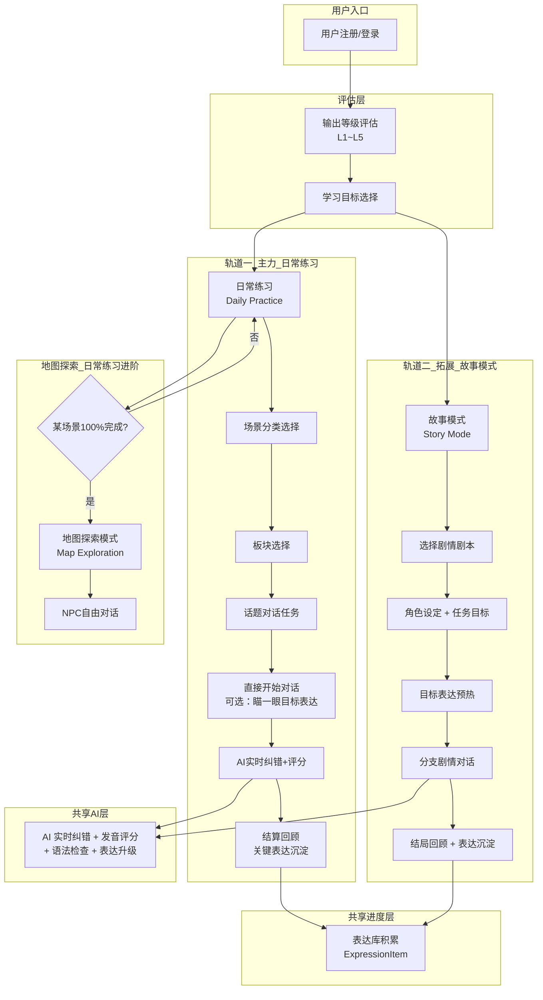
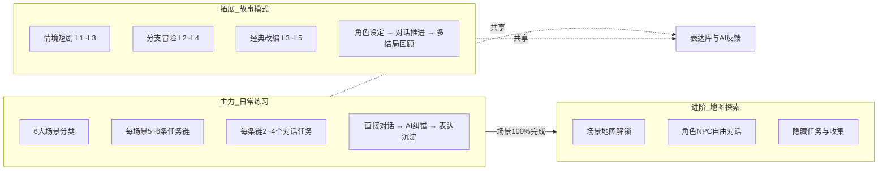
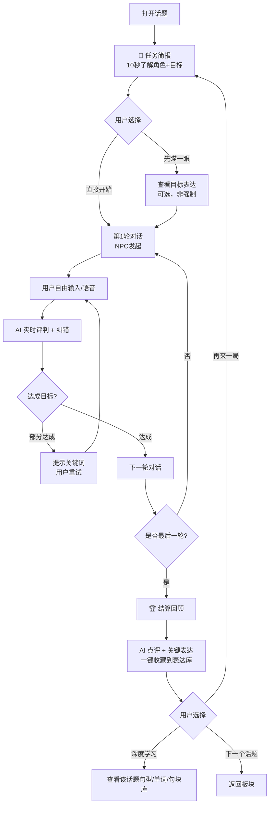
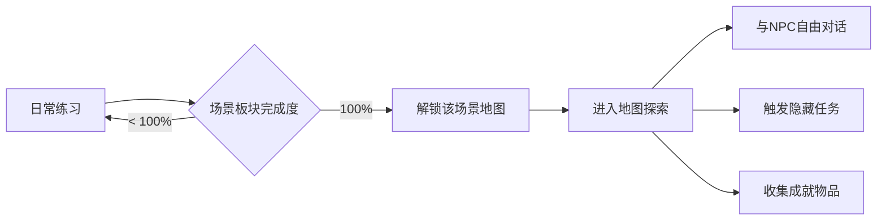
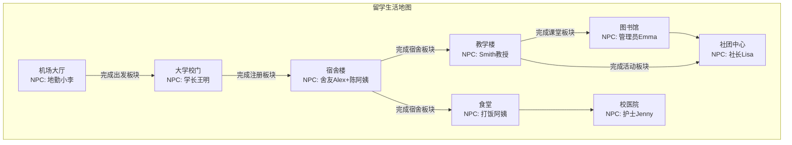
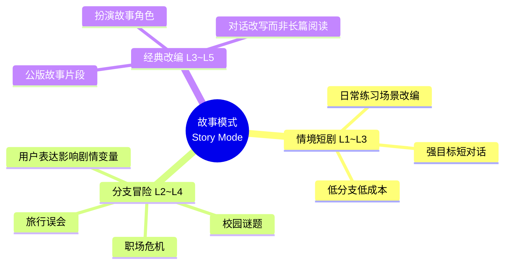
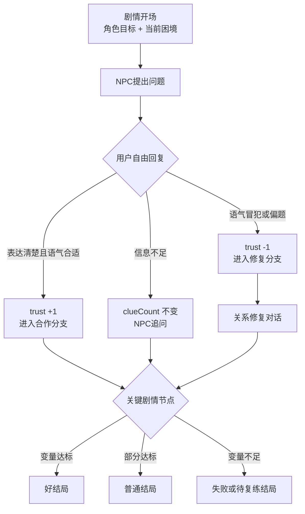
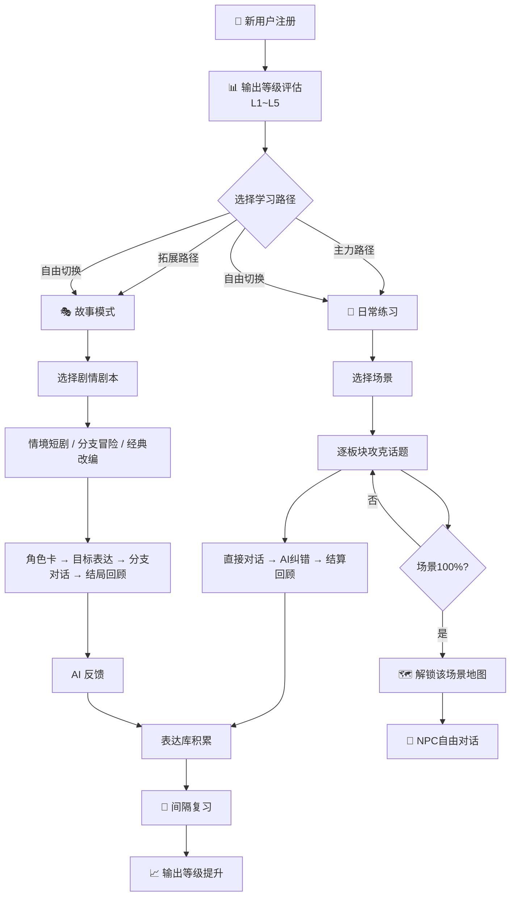

# 漫语町（ManYu）内容架构设计文档

> 版本：v1.6 | 日期：2026-07-21 | 状态：当前实现与产品版本边界对齐稿

> **阅读优先级**：§0 是依据当前代码、数据库和产品分期整理出的最新架构，是后续产品与开发决策的准绳；§1～§9 保留早期内容策划和场景示例，其中“6 大场景”“场景 100% 才解锁地图”等描述属于历史方案，不应再直接映射为当前数据结构或 V1 交付范围。

---

## 目录

0. [当前内容架构结论（v1.5）](#0-当前内容架构结论v15)
1. [整体数据流架构](#1-整体数据流架构)
2. [内容层级树结构](#2-内容层级树结构)
3. [场景分类体系](#3-场景分类体系)
4. [各场景板块与话题设计](#4-各场景板块与话题设计)
5. [话题内容要素设计](#5-话题内容要素设计)
6. [练习剧本设计规范](#6-练习剧本设计规范)
7. [地图探索模式](#7-地图探索模式)
8. [故事模式（互动剧情对话）](#8-故事模式互动剧情对话)
9. [用户成长路径](#9-用户成长路径)
10. [数据库模型映射](#10-数据库模型映射)

---

## 0. 当前内容架构结论（v1.5）

### 0.1 先给结论：不要把所有 VN 当成同一种内容

当前产品中容易混淆的其实是三个彼此正交的维度：

1. **内容归属**：它属于某个学习话题，还是属于一个独立剧情包，还是属于地图中的 NPC/房间。
2. **学习玩法**：它是练习实战、互动故事、自由探索，还是视频跟读。
3. **呈现方式**：它由 Pixi-VN 实时渲染，还是由时间轴/视频播放器呈现。

因此，“Pixi VN”和“视频跟读”不是与“练习 VN / 故事 VN”同一层级的内容分类。前者是**播放器/呈现形态**，后者是**内容用途和归属**。一个话题实战和一个独立故事都可以使用 Pixi；同一份 Ink 内容也可以生成线性时间轴，用于视频预览或跟读。

### 0.2 最新四层内容树

```text
内容目录（Catalog）
└── 学习包 / 内容包（LearningPackage）
    └── 内容容器（Scene；当前实现中通常一个包对应一个 Scene）
        ├── 训练话题（TrainingTopic）× N
        │   ├── Warmup / 句块 / 词汇 / 句型
        │   └── 话题实战 VN（InkScript, scriptType=practice）0..1
        │
        ├── 剧情章节（chapterKey，仅在剧情内容中使用）× 0..N
        │   └── 剧情集 / 关卡（StoryEpisode）× N
        │       └── 剧情 VN（InkScript, scriptType=episode）1
        │
        └── 世界扩展（可选）
            └── 地图（GameMap）0..N
                └── 地点（GameLocation）× N
                    └── 房间（GameRoom）× N
                        ├── 房间脚本（InkScript）0..1
                        └── NPC（GameRoomNpc）× N
                            └── NPC 对话 / 支线（InkScript, side_quest/free_talk）0..N
```

这里的关键约束是：

- **不是每个学习包都必须有故事或地图。** `foundation`、`course`、`daily`、`exam` 包只要有训练话题就可以成立。
- **每个训练话题可以有一个练习型 VN，但不是必须有。** 它是“学完就用”的短实战，直接归属于 `TrainingTopic`。
- **独立剧情内容使用 `StoryEpisode`。** 多集故事通过 `chapterKey + sortOrder` 组织，不应伪装成训练话题。
- **地图只服务需要空间连续性和持续世界状态的内容。** 地图是剧情包的可选世界外壳，不是所有 VN 的前置条件。

### 0.3 三类 VN 的职责与归属

| 类型 | 产品名称建议 | 必须归属 | 典型长度 | 是否评分 | 是否需要地图 | 当前记录模型 |
|---|---|---|---:|---|---|---|
| Topic Practice VN | 话题实战 | `LearningPackage → Scene → TrainingTopic` | 3～5 轮 | 轻反馈、隐性纠错为主 | 否 | `PracticeSession` / `PracticeTurn` |
| Story Episode VN | 剧情关卡 | `story` 包 → `Scene → StoryEpisode` | 5～15 轮，可分支 | 目标达成 + 剧情结果 | 可选 | `StoryRecord` / `StoryTurn` |
| Exploration VN（V2） | 探索对话 / 支线 | `GameMap → GameLocation → GameRoom → NPC` | 不固定 | 通常不做硬评分 | 是 | `ExplorationRecord` / `GameSave` |

#### A. 话题实战 VN（练习型 VN）

它是学习闭环的一部分，不是独立作品：

```text
学习包 → 话题 → Warmup / 句块 / 句型 → 话题实战 VN → 复盘
```

- 内容目标必须来自该话题的 chunks、vocabulary、sentence patterns。
- 用户从“场景”Tab 也可以找到它，但列表必须展示来源面包屑，例如：
  `零基础 05 · 表达进行中的动作 / Topic 03 · 你现在在做什么`。
- 解锁建议绑定“话题已学习”或 Warmup 达标；不建议绑定整包 100%。
- 没有合适的对话场景时，话题可以没有 VN，不应为了数量强行生产。

#### B. 剧情关卡 VN（独立故事 VN）

它是可被连续消费的剧情内容：

```text
剧情包 → 章节 → 剧集 → 场景节点 / 分支 → 结局
```

- 使用 `StoryEpisode.chapterKey` 表示章节，`sortOrder` 表示集序。
- 使用 `prerequisiteEpisodeIds` 控制前后集解锁。
- 可以引用多个话题的句块和句型，但**不属于某一个 TrainingTopic**。
- 它适合独立出现在“场景 / 剧场”入口，并展示封面、章节进度、已解锁集数和结局收集。

#### C. 探索 VN（地图中的 NPC 对话）

它属于持续世界，而不是课程目录：

```text
地图 → 地点 → 房间 → NPC → 日常对话 / 支线任务
```

- `GameMap` 负责世界级目录与解锁。
- `GameLocation` 负责地图上的地点和与学习 `Scene` 的可选关联。
- `GameRoom` 负责实际 VN 背景、环境音、房间脚本。
- `GameRoomNpc` 负责 NPC 出现位置、日程、问候语与专属对话。
- `GameSave.inkState / flags` 保存跨房间、跨剧集的世界状态。

### 0.4 Pixi 对话与视频跟读的真实关系

当前后台编辑器围绕同一份 Ink / Composer 内容提供四种预览：`portrait`、`landscape`、`mixed`、`video`。其中：

| 呈现形态 | 当前实现 | 适用内容 | 交互特征 |
|---|---|---|---|
| Pixi-VN | `VnPlayer` + `PixiVnStage` | 话题实战、剧情关卡、探索 NPC | 实时选择、语音/文字自由输入、Ink 分支推进 |
| Mixed Timeline | `VnMixedPreviewPlayer` | 编辑和质检 | 将 Ink/Composer 展平为静态时间轴，不触发 AI |
| Video / 跟读 | `NqtrVideoPreviewPlayer` + `NqtrVideoComposition` | 线性观看、逐句跟读、内容导出 | 视频时间轴播放；可在指定帧打开跟读 |

因此建议把播放器配置从内容类型中拆出来，形成统一概念：

```ts
type ExperienceMode = 'interactive' | 'watch_and_repeat'
type Renderer = 'pixi_vn' | 'timeline' | 'video'
```

同一个内容单元可以发布多个体验版本，例如：

```text
StoryEpisode: 咖啡店初遇
├── interactive + pixi_vn       // 用户自由回答，进入分支
└── watch_and_repeat + video    // 先看示范，再逐句跟读
```

当前数据库尚无正式的 `ExperienceVariant` / `renderer` 字段，后台的 `previewLayout` 只是本地预览状态，不能作为发布态数据。短期可继续由路由约定播放器；内容规模扩大前，应新增版本表或在 manifest 中显式保存体验形态，避免通过 `scriptType` 猜播放器。

### 0.5 产品版本边界：V1 双体验，V2 再做探索

当前产品以英语学习效果为核心，不以建设完整游戏世界为 V1 目标。剧情包应先完成两种已经具备技术基础、学习目标明确且可以复用同一套剧情资产的核心体验：

```text
V1：剧情包双体验
└── 剧情包 → 章节 → 章节剧情
    ├── 互动剧情（interactive + pixi_vn）
    │   ├── Ink 分支推进
    │   ├── 用户语音 / 文字自由回答
    │   ├── AI 反馈与隐性纠错
    │   └── 核心目标：主动组织语言并输出
    │
    └── 跟读剧场（watch_and_repeat + video）
        ├── React Video / 时间轴播放
        ├── 逐句跟读与录音回放
        ├── 原音对比、跟读反馈
        └── 核心目标：沉浸输入、模仿发音与语流

V2：重点剧情包的世界探索扩展
└── 地图 → 地点 → 房间
    ├── 可交互物体与动画
    ├── NPC 点击对话
    ├── 单词 / Chunk / 语音任务绑定
    ├── Ink 支线与世界状态
    └── 核心目标：在持续空间语境中理解并使用英语
```

版本约束如下：

- **V1 的正式交付范围只有互动剧情与跟读剧场。** 二者不是互相替代的播放器：互动剧情训练主动输出，跟读剧场训练沉浸输入、发音、语调与节奏。
- 同一个 `StoryEpisode` 可以发布互动版和跟读版；角色、音色、背景、立绘、对白和教学目标应尽量复用，避免维护两套剧情源内容。
- **剧情包在 V1 不要求创建地图。** 没有 `GameMap`、`GameLocation`、`GameRoom` 或 NPC 探索内容，不得阻止剧情包编辑、发布、解锁或完成。
- 地图、房间、NPC 和探索存档属于 **V2 能力储备**。现有数据库模型和后台实验编辑器可以保留，但不进入 V1 用户主路径，也不作为 V1 内容完整性校验项。
- V2 不应给所有剧情包补地图，只为确实依赖空间连续性、物体互动、NPC 常驻和支线状态的重点剧情包建设探索世界。
- 探索模式仍使用 Pixi 作为轻量 2D 交互画布；React 负责学习卡片、录音、反馈和后台表单，Ink 负责对话分支。V2 出现自由移动、碰撞、寻路等明确需求前，不引入更重的游戏引擎。

V1 的优先验收顺序：

1. 章节 Ink 编辑、保存、编译和分支推进稳定。
2. Pixi VN 在移动端稳定呈现背景、立绘、对话与选择，并支持语音 / 文字主动回答。
3. TTS 角色音色、STT、AI 反馈和学习记录形成闭环。
4. 跟读时间轴支持逐句播放、录音、回放、对比与结果保存。
5. 视频生成或录屏分享作为跟读体验的输出能力，不反向耦合互动剧情运行时。
6. 同一章节的互动版与跟读版拥有明确的发布配置和用户入口。

只有 V1 的内容生产流程、移动端稳定性和学习效果得到验证后，才进入 V2 房间分层、交互物体、动画、NPC 支线和探索存档建设。

### 0.6 哪些包需要故事与地图

| 包类型 | 训练话题 | 话题实战 VN | 独立剧情集 | 地图探索 | 推荐策略 |
|---|:---:|:---:|:---:|:---:|---|
| `foundation` | 必须 | 推荐，允许缺省 | 可选 | 通常不需要 | 先完成基础学习闭环 |
| `course` | 必须 | 按话题适配 | 可选 | 通常不需要 | 语法/专项内容不要强行世界化 |
| `daily` | 必须 | 推荐 | 可选短剧 | V1 不做，V2 按需 | 高频生活主题可在 V2 选择性扩展 |
| `exam` | 必须 | 按题型适配 | 通常不需要 | 不需要 | 保持任务和评分导向 |
| `story` | 可选 | 可选 | 必须 | V1 不要求，V2 按需 | 剧集是主体；重点长线剧情可在 V2 增加世界导航层 |

最终规则：**练习话题允许只有练习；剧情包必须有 StoryEpisode，但 V1 不要求地图；V2 只为需要“地点移动、NPC 常驻、物体互动、支线和世界状态”的重点剧情包建设地图。**

### 0.7 面向大量 VN 的后台信息架构

VN 数量增长后，后台不能继续只做一个平铺的“剧本列表”。建议用两套目录视图，共享同一个编辑器：

```text
教学内容
└── 包类型 → 学习包 → Scene → Topic → 练习 VN

剧情内容
└── 剧情包 → 章节 → StoryEpisode → 互动版 / 跟读版
    └── 可选世界：Map → Location → Room → NPC / 支线
```

每条剧本在列表中至少展示：

- 稳定 key、标题、发布状态、版本。
- 内容用途：`practice / episode / side_quest / free_talk`。
- 完整归属路径：包、Scene、Topic 或 Episode、地图/地点/房间/NPC。
- 体验形态：interactive / watch-and-repeat；渲染器：Pixi / video。
- 教学目标来源、难度、预计时长、最后更新时间。
- 完整性告警：孤儿脚本、重复绑定、缺角色、缺背景、缺音频、缺默认回答。

### 0.8 标识与命名规范

不要靠标题反查归属。标题会改名，也可能重复；所有引用使用稳定 ID，并给内容 key 加可读命名空间：

```text
practice.{packageKey}.{topicKey}
story.{packageKey}.{chapterKey}.{episodeKey}
quest.{mapKey}.{locationKey}.{questKey}
talk.{mapKey}.{roomKey}.{characterKey}
```

示例：

```text
practice.foundation-05.present-progressive-now
story.city-mystery.ch01.first-meeting
quest.manyu-town.cafe.lost-wallet
talk.manyu-town.cafe.barista
```

用户端所有 VN 卡片必须带来源上下文，不能只显示剧本标题。推荐统一返回 `ContentBreadcrumb`：

```ts
type ContentBreadcrumb = {
  packageId: string
  packageTitle: string
  sceneId: string
  sceneTitle: string
  topicId?: string
  topicTitle?: string
  chapterKey?: string
  chapterName?: string
  episodeId?: string
  episodeTitle?: string
  mapId?: string
  locationId?: string
}
```

### 0.9 用户端入口与解锁

底部“场景”Tab 承载所有“用英语”的体验，但首屏应按来源分区，而不是混成一个无限 VN 列表。V1 只开放前三个入口，探索世界在 V2 上线：

```text
场景
├── 刚学完，去实战          // Topic Practice VN
├── 继续故事                // StoryEpisode
├── 跟读剧场                // watch_and_repeat variants
└── 探索世界（V2）          // GameMap
```

解锁分别计算：

- 话题实战：对应 Topic 已开始 / Warmup 达标。
- 剧情集：用户等级 + `prerequisiteEpisodeIds` + 可选剧情 flags。
- 地图地点（V2）：`requiredOutputLevel + requiredSceneIds + requiredFlags`。
- 视频跟读：通常跟随源内容解锁，也可作为免费试看入口。

不再采用统一的“场景 100% → 解锁所有地图/VN”规则。统一规则看似简单，但会把课程进度、剧情顺序和世界探索三种不同逻辑耦合在一起。

### 0.10 当前实现缺口与演进顺序

当前代码已经具备 `TrainingTopic`、`StoryEpisode`、Ink、Pixi-VN、视频时间轴，以及作为 V2 技术储备的三级地图模型；V1 的主要缺口是“归属约束、体验版本、发布模型和移动端学习闭环”，不是继续扩展地图播放器。

1. **先统一查询层**：建立场景 Tab 的聚合 DTO，始终返回内容类型、完整 breadcrumb、解锁状态和播放器信息。
2. **再补强数据约束**：`StoryEpisode.inkScriptId` 当前只是字符串；`InkScript` 又保留 `episodeId/topicId/locationId/roomId` 多个松散反向字段，需收敛为明确关系并校验唯一归属。
3. **新增体验版本**：引入 `ExperienceVariant`（或 manifest 等价结构），正式保存 interactive / watch-and-repeat 与 renderer，而不是依赖后台预览布局。
4. **完成 V1 双体验闭环**：优先稳定互动剧情的主动回答，以及跟读剧场的播放、录音、回放和结果保存。
5. **扩展 V1 内容量**：在目录、归属校验、资源完整性和发布状态完善后，再批量开放 VN，避免产生大量孤儿脚本。
6. **V2 再接地图探索**：只为经过验证且需要持续世界的重点剧情包创建 Map → Location → Room → NPC，并逐步增加可交互物体和动画。

### 0.11 后台页面落地（2026-07-21）

后台按内容归属拆成两个工作区，但复用同一个 `InkStoryEditor`：

- **练习话题**（`/admin/nqtr`）：只列出 `scriptType=practice` 的话题实战，服务学习包 `TrainingTopic`；不再在此维护角色和地图。
- **剧情包内容**（`/admin/narrative`）：只维护剧情包、章节与章节剧情，不在包内创建或管理资产。
- **剧情共享资产**（`/admin/narrative-assets`）：全局维护角色资产和音色资产；地图世界作为 V2 实验资产保留。资产供多个剧情包、章节和练习 VN 复用。TTS 厂商凭证与默认模型仍由 `/admin/ai-models` 管理；音色资产通过厂商接口同步或手工录入。
- 后台侧边栏将“剧情包内容”和“剧情共享资产”归入独立一级菜单组 **“剧情管理”**，不再放在通用“内容管理”中。它代表独立的 VN 游玩式产品线，同时保持与已经定型的学习内容体系隔离。
- V2 实验性的“地图世界”后台采用两级 Pixi 所见即所得编辑：世界地图以 `GameMap.backgroundUrl` 为底图、`GameLocation.icon + posX/posY` 为地点图片热点；进入地点后，以 `GameLocation.backgroundUrl` 为场景底图、`GameRoom.icon` 为房间图片热点。房间热点布局保存在现有 `GameMap.editorData.explorationScenes` JSON 中，不新增数据库表。它不是 V1 剧情包发布的必填流程。
- 地图后台前端按职责拆分：`MapsTab` 负责数据编排，`ExplorationEditorToolbar` 负责层级导航，`ExplorationResourceList` 负责地点/房间目录，`ExplorationPixiCanvas` 与 `HotspotNode` 负责渲染和拖拽，`ExplorationInspector` 负责选中对象信息，`exploration-map-model` 负责 `editorData` 的读写与默认布局。Pixi 组件不直接调用 API；V1 阶段只维护其可运行性，不继续扩大编辑能力。
- 后端 `GET /admin/content/stories` 使用 `scope=practice|narrative` 做归属过滤；页面不通过标题或前端二次过滤猜测内容类型。
- 剧情脚本与练习脚本的编辑、编译、Pixi 预览、Mixed timeline 和视频跟读预览继续使用同一套界面。
- “剧情包内容 → 章节剧情”采用两栏工作台：左侧章节目录，中间复用 `InkStoryEditor`；章节信息通过左侧编辑按钮打开 Dialog。章节首次保存脚本时自动创建 `scriptType=episode` 的 `InkScript` 并回写 `StoryEpisode.inkScriptId`。
- 剧情创作后台不展示词汇/Chunk 门槛、最少轮次、复述、NPC 文本字段或奖励 JSON；这些旧训练字段仅保留数据库兼容默认值。

后台产品术语统一为：**剧情包（一本书）→ 章节 → 章节剧情**。在不修改现有数据库的前提下，每条 `StoryEpisode` 作为一个章节记录使用，`chapterKey/chapterName` 保存章节标识与名称，InkScript 保存本章剧情。

剧情后台采用包级路由上下文：先在 `/admin/narrative` 选择剧情包，再进入 `?packageId={sceneId}`。章节剧情必须按该 `sceneId` 查询，不提供跨包的全局列表。角色和地图在 `/admin/narrative-assets` 独立维护；章节编辑器加载全局候选项并保存 `characterId`、`locationId` 等引用，不复制资产，也不把资产归属到剧情包。被引用的资产删除时，后端应返回引用冲突并提示先解除引用，避免级联破坏剧情内容。

角色音色不直接保存厂商 Voice ID。`TtsVoiceAsset` 以 `AiProvider + externalVoiceId` 唯一标识厂商音色，`CharacterVoiceBinding` 保存角色到音色资产的引用，并允许覆盖模型和厂商特有参数。运行时按当前激活的 TTS 厂商选择该角色对应绑定；没有绑定时不猜测厂商，也不使用角色旧字段回退。

剧情包与学习计划虽然复用 `Scene` / `LearningPackage` 基础设施，但后台入口和产品语义完全隔离：学习计划管理结构化话题训练，剧情包管理沉浸式输出。剧情包的创建、编辑和卡片目录全部留在 `/admin/narrative`，写入时固定 `packageType=story`，不得跳转到学习包页面完成管理。

练习话题和剧情剧集并非同表：练习叶子是 `TrainingTopic`，剧情叶子是 `StoryEpisode`。二者仅共享 `Scene` 作为内容容器，以及 Chunk / Vocabulary / SentencePattern 等教学资源。当前没有独立 `StoryChapter` 表，章节 key/name 暂存于 `StoryEpisode`；后台不得暴露 `chapterKey`，编辑者只选择已有章节或输入新章节名称，内部 key 自动生成。

---

## 1. 整体数据流架构

### 1.1 核心数据流（双轨道并行）



### 1.2 三大模块关系：主力 + 拓展 + 进阶



> **关键设计原则**：
> - **日常练习** 是主力轨道，采用"对话即练习"模式：用户拿到任务直接开口说，AI 实时纠错；对话结束后回顾关键表达并一键收藏。句型/单词/句块作为参考库按需查阅，不作为强制前置步骤
> - **故事模式** 是拓展轨道，本质是更剧情化、更自由的角色扮演剧本练习；它让用户在故事身份、任务目标和分支选择中继续练英语输出
> - 两条轨道**平行独立**，用户可自由选择入口，随时切换
> - 唯有 **地图探索** 需要在对应场景的日常练习 100% 完成后解锁
> - 两条轨道**共享**同一套 AI 反馈引擎和表达库（ExpressionItem），学习成果互通

---

## 2. 内容层级树结构

```
漫语町内容体系（主力 + 拓展双轨道）
│
├── 🌱 主力轨道：日常练习（Daily Practice）────── 系统化交际英语训练
│   ├── 场景分类（SceneCategory）× 6
│   │   ├── 🌍 落地生根（6条任务链 / 17个对话任务）
│   │   ├── 🏠 日常闯关（6条任务链 / 17个对话任务）
│   │   ├── 💬 人来人往（5条任务链 / 15个对话任务）
│   │   ├── 💼 学业职场（6条任务链 / 18个对话任务）
│   │   ├── 🏥 搞定麻烦（5条任务链 / 14个对话任务）
│   │   └── 🎭 出门玩乐（5条任务链 / 15个对话任务）
│   │
│   └── 每个话题 = 一个对话任务 ──────────────
│       ├── 🎯 任务简报 ── 10秒了解：我是谁·要做什么·对谁说话
│       ├── 💬 直接对话 ── 3~5轮NPC互动（核心环节，学习在此发生）
│       ├── 🏆 结算回顾 ── AI点评 + 我用了/错过了哪些关键表达
│       └── 📚 表达库 ──── 句型/单词/句块按需查阅，非强制先修
│
├── 🎭 拓展轨道：故事模式（Story Mode）────────── 互动剧情·角色扮演·分支对话
│   │
│   ├── 🎬 情境短剧（Scene Drama）──────── L1~L3，日常场景的剧情化延伸
│   │   ├── 初到宿舍、错过航班、社团试镜
│   │   ├── 强目标、短流程、低分支
│   │   └── 首期 8~12 个短剧，复用日常练习场景资源
│   │
│   ├── 🧭 分支冒险（Branching Quest）────── L2~L4，根据用户表达推进不同剧情
│   │   ├── 校园谜题、旅行误会、职场危机
│   │   ├── 选择 + 自由回复共同影响剧情状态
│   │   └── 首期 4~6 个中短篇，验证分支体验
│   │
│   ├── 📚 经典改编（Classic Roleplay）───── L3~L5，公版故事的角色代入
│   │   ├── 《绿野仙踪》片段：扮演 Dorothy 或旅伴
│   │   ├── 《秘密花园》片段：扮演 Mary 与园丁沟通
│   │   └── 首期 1 部小规模试做，控制改编成本
│   │
│   └── 每个故事关卡要素 ──────────────────
│       ├── 🎭 玩家角色卡（Role Card）
│       ├── 🎯 剧情任务目标（Story Goal）
│       ├── 🧱 目标句块（Chunk）
│       ├── 💬 分支对话（Branching Dialogue）
│       └── 🏁 结局回顾（Ending Review）
│
├── 🗺️ 进阶：地图探索（Map Exploration）──────── 场景100%后解锁
│   └── 每个场景对应一张地图，含多个地点 + NPC自由对话
│
└── 📦 共享层 ──────────────────────────── 两条轨道数据互通
    ├── ExpressionItem（表达库，统一收集）
    ├── AI 评分 / 纠错 / 升级建议（同一引擎）
    └── 间隔复习 Spaced Repetition（统一调度）
```

---

## 3. 场景分类体系（精简重构）

### 3.1 从 8 个场景合并为 6 个

旧版 8 个场景存在大量重叠（留学生活 vs 独自生活 vs 旅行英语互相交叉），用户困惑"租房"该去哪个场景。重构后合并为 6 个，每个场景有清晰的叙事边界：

| # | 场景 | 英文名 | 图标 | 一句话定位 | 合并了哪些旧场景 |
|---|------|--------|------|-----------|----------------|
| 1 | 🌍 落地生根 | Arrival & Roots | `map-pin` | 初到英语环境，搞定落脚和手续 | 留学生活(出发/注册/入住) + 旅行英语(行前/机场/酒店) + 独自生活(租房/银行) |
| 2 | 🏠 日常闯关 | Daily Hustle | `home` | 吃住行购，把日子过明白 | 留学生活(宿舍/食堂/图书馆/购物) + 独自生活(超市/物业/烹饪/交通) |
| 3 | 💬 人来人往 | People | `users` | 交朋友、处关系、应对社交场合 | 日常社交(全部) + 留学生活(活动) + 休闲娱乐(聚会/游戏) |
| 4 | 💼 学业职场 | Work & Study | `briefcase` | 课堂、面试、开会、写邮件 | 留学生活(课堂/考试) + 学术挑战(全部) + 职场交流(全部) |
| 5 | 🏥 搞定麻烦 | Crisis Mode | `shield-alert` | 看病、紧急情况、投诉维权 | 健康医疗(全部) + 旅行英语(紧急) + 生活意外 |
| 6 | 🎭 出门玩乐 | Out & About | `compass` | 旅行、美食、演出、运动 | 旅行英语(交通/景点/餐饮) + 休闲娱乐(电影/运动/户外) |

### 3.2 为什么这样合并

| 原则 | 说明 |
|------|------|
| **一个场景一个"人设"** | 用户打开每个场景时很清楚自己在扮演谁：新移民、普通人、社交者、职场人、求助者、游客 |
| **消除重叠** | "租房"只出现在"落地生根"，不再同时出现在留学生活和独自生活 |
| **控制总量** | 6 场景 × 5~6 任务链 × 2~4 对话任务 ≈ **~96 个对话任务**（原 177 → 减 46%） |
| **叙事张力** | 每个任务链是一个微型故事线，任务之间有因果关系 |

### 3.3 从"板块→话题"到"任务链→对话任务"

旧版的三级结构（场景→板块→话题）像教科书目录。新设计用"任务链→对话任务"替代：

```
旧：留学生活 → 课堂学习 → 自我介绍          （像课本章节）
新：学业职场 → 课堂风云 → 教授点你回答问题但你刚才走神了  （像一个真实会发生的事）
```

每个对话任务名字就是一句话情境，用户一看就知道"我要面对什么"。

---

## 4. 各场景任务链与对话任务

> **阅读说明**：每个任务链是一个微型故事线（2~4 个连续对话），任务之间有因果关系。用户完成一条链后解锁下一条。链内任务必须按顺序完成。

### 4.1 🌍 落地生根（Arrival & Roots）
> 从踏上飞机到安顿下来。你是初来乍到的"新人"，每句话都可能影响你接下来几个月的生活质量。

| 任务链 | 任务数 | 对话任务 | NPC | 场景设定 |
|--------|--------|---------|-----|---------|
| **1. 机场惊魂** | 3 | ① 行李超重，和地勤斗智斗勇 ② 安检被拦：包里那瓶水惹的祸 ③ 登机口改了，广播没听懂 | 地勤、安检员 | 国际机场 |
| **2. 宿舍第一天** | 3 | ① 房间被分错了，和宿管沟通 ② 室友是个夜猫子：作息谈判 ③ 空调坏了，打电话报修 | 宿管、室友 | 学生宿舍 |
| **3. 租房记** | 3 | ① 和中介看房，挑出五个毛病 ② 合同里的隐藏条款 ③ 邻居深夜派对，去敲门 | 中介、房东、邻居 | 公寓楼 |
| **4. 银行那些事** | 2 | ① 开户时柜员说的术语听不懂 ② 卡被ATM吞了，紧急求助 | 银行柜员 | 银行 |
| **5. 报到日** | 3 | ① 注册系统里查不到你的名字 ② 想选的课满了，说服辅导员 ③ 迎新会突然被cue：30秒自我介绍 | 辅导员、同学 | 校园 |
| **6. 第一次出门** | 3 | ① 地铁买错票，工作人员来帮忙 ② 打车但司机找不到你的地址 ③ 租车还车时发现多了一笔费用 | 地铁员工、司机、租车店员 | 城市交通 |

> 共 6 条任务链，17 个对话任务

### 4.2 🏠 日常闯关（Daily Hustle）
> 日常生活的"微挑战"：买东西、做饭、跑腿。每个任务都是你真的会遇到的状况。

| 任务链 | 任务数 | 对话任务 | NPC | 场景设定 |
|--------|--------|---------|-----|---------|
| **1. 室友那些事** | 3 | ① 冰箱里的东西被吃了，怎么问 ② 制定值日表：谁该打扫了 ③ 想办个聚会，和室友商量 | 室友 | 合租公寓 |
| **2. 食堂生存** | 3 | ① 今天菜单一个词都看不懂 ② 打饭阿姨给太少了，委婉开口 ③ 饭卡余额不足，尴尬了 | 打饭阿姨、收银员 | 食堂 |
| **3. 图书馆日常** | 2 | ① 预约的座位被人占了 ② 打印机卡纸，找管理员 | 图书管理员、占座者 | 图书馆 |
| **4. 买东西** | 3 | ① 找不到想要的调料，问店员 ② 结账发现价格不对，去服务台 ③ 网购商品有问题，要求退货 | 店员、客服 | 超市/商场 |
| **5. 家务新手** | 3 | ① 照着英文食谱做菜，缺了关键食材 ② 洗衣机按钮全是英文，不敢乱按 ③ 水电费异常高，打电话问 | 室友、客服 | 家中 |
| **6. 跑腿办事** | 3 | ① 寄国际包裹，填表填到崩溃 ② 公交卡丢了，补办一张 ③ 去邮局取快递但没带证件 | 邮局职员、公交员工 | 邮局/车站 |

> 共 6 条任务链，17 个对话任务

### 4.3 💬 人来人往（People）
> 社交的核心：破冰、维系、表达情感、处理冲突。最难也最有用的英语场景都在这里。

| 任务链 | 任务数 | 对话任务 | NPC | 场景设定 |
|--------|--------|---------|-----|---------|
| **1. 破冰** | 3 | ① 咖啡店里和旁边的人搭话 ② 对方说的梗你没听懂，怎么化解 ③ 聊得来但想走了，如何自然结束 | 陌生人 | 咖啡馆/聚会 |
| **2. 朋友之间** | 3 | ① 朋友推荐的电影你觉得很烂，怎么说 ② 朋友迟到了一小时，表达不满但不伤感情 ③ 帮朋友搬家但受伤了，婉拒下次请求 | 朋友 | 多种场景 |
| **3. 聚会社交** | 3 | ① 派对上被介绍给一群人，逐一寒暄 ② 有人说了冒犯的话，如何得体回应 ③ 想提前走但主人一直挽留 | 聚会主人、宾客 | 派对/聚会 |
| **4. 好好说话** | 3 | ① 朋友失恋了，怎么安慰 ② 室友帮了大忙，真诚感谢 ③ 你做错了事，需要认真道歉 | 朋友、室友 | 多种场景 |
| **5. 跨文化** | 3 | ① 解释春节为什么要发红包 ② 外国朋友请你吃奇怪的食物 ③ 讨论餐桌礼仪：你们国家筷子怎么用 | 外国朋友 | 聚会/餐桌 |

> 共 5 条任务链，15 个对话任务

### 4.4 💼 学业职场（Work & Study）
> 从课堂到会议室。正式和非正式之间的分寸感，是你输出水平的分水岭。

| 任务链 | 任务数 | 对话任务 | NPC | 场景设定 |
|--------|--------|---------|-----|---------|
| **1. 课堂风云** | 3 | ① 教授点你回答问题，但你刚才走神了 ② 小组讨论时有人一直打断你 ③ 课后找教授请教，但他的解释你听不懂 | 教授、同学 | 教室/阶梯教室 |
| **2. 考试与论文** | 3 | ① 申请论文延期，给出充分理由 ② 小组项目有成员摸鱼，怎么沟通 ③ 答辩时被评委质疑研究方法 | 教授、同学、评委 | 办公室/报告厅 |
| **3. 面试** | 3 | ① 自我介绍：3分钟让面试官记住你 ② 被问"你最大的弱点是什么" ③ 面试结束时反问面试官 | 面试官 | 会议室 |
| **4. 办公室生存** | 3 | ① 向领导汇报进度，但进度其实落后了 ② 同事抢了你的功劳，在会议上怎么回应 ③ 想请假但项目正处于关键阶段 | 上司、同事 | 办公室 |
| **5. 开会这件事** | 3 | ① 主持会议：把跑题的讨论拉回来 ② 在会上反对一个方案，不让提议者难堪 ③ 会议总结：确保每人知道自己的任务 | 与会者 | 会议室 |
| **6. 对外沟通** | 3 | ① 给客户写邮件解释项目延期（口述版本） ② 电话里安抚一个生气的客户 ③ 商务午餐：边吃边谈，分寸怎么把握 | 客户、合作伙伴 | 办公室/餐厅 |

> 共 6 条任务链，18 个对话任务

### 4.5 🏥 搞定麻烦（Crisis Mode）
> 看病、紧急情况、投诉——压力最大的对话，也是最需要练的。

| 任务链 | 任务数 | 对话任务 | NPC | 场景设定 |
|--------|--------|---------|-----|---------|
| **1. 看医生** | 3 | ① 电话预约，说不出自己的症状 ② 医生问病史，有些词你真不会 ③ 开的药太贵，问有没有便宜替代 | 接线员、医生 | 诊所/医院 |
| **2. 牙科与药房** | 2 | ① 洗牙时牙医一直说话（你嘴里塞着东西） ② 药剂师问了一堆问题，你只听懂一半 | 牙医、药剂师 | 牙科/药房 |
| **3. 紧急情况** | 3 | ① 朋友受伤了，打911怎么说 ② 街头丢了钱包和护照，找警察 ③ 航班取消，在柜台争取最快改签 | 急救员、警察、地勤 | 街头/机场 |
| **4. 生活意外** | 3 | ① 水管爆了，紧急联系房东 ② 钥匙锁在房间里，找开锁师傅 ③ 手机被偷，去警察局报案 | 房东、锁匠、警察 | 公寓/街头 |
| **5. 投诉维权** | 3 | ① 外卖送错了还凉了，打电话投诉 ② 理发师把你的头发剪坏了 ③ 快递一直没到，联系客服退款 | 客服、理发师 | 电话/店铺 |

> 共 5 条任务链，14 个对话任务

### 4.6 🎭 出门玩乐（Out & About）
> 旅行、美食、演出——轻松场景里的对话也有坑。

| 任务链 | 任务数 | 对话任务 | NPC | 场景设定 |
|--------|--------|---------|-----|---------|
| **1. 旅行路上** | 3 | ① 订酒店确认特殊需求（加床、无烟房） ② 租车发现问题，要求换一辆 ③ 迷路了，向路人问路并二次确认 | 前台、租车店员、路人 | 酒店/街头 |
| **2. 景点打卡** | 3 | ① 买票发现网上订的更便宜，当场理论 ② 请路人拍照，但对方拍得…不太行 ③ 导游推荐的纪念品店，到底去不去 | 售票员、路人、导游 | 景点 |
| **3. 吃货之旅** | 3 | ① 菜单没图片，全靠英文描述猜 ② 点的菜和想象完全不同，要不要退 ③ 结账发现多收了一道菜的钱 | 服务员 | 餐厅 |
| **4. 电影与演出** | 3 | ① 买电影票选座，和售票员沟通偏好 ② 散场后和朋友争论剧情，各执一词 ③ 音乐会中途手机响了，尴尬到想钻地 | 售票员、朋友、邻座观众 | 电影院/音乐厅 |
| **5. 运动与户外** | 3 | ① 办健身卡时和销售斗智斗勇不被套路 ② 第一次上瑜伽课，听不懂教练的口令 ③ 爬山遇到岔路，和同伴商量走哪条 | 销售、健身教练、同伴 | 健身房/户外 |

> 共 5 条任务链，15 个对话任务

---

### 4.7 内容总量对比

| | 旧版 (v1.3) | 新版 (v1.4) | 变化 |
|---|---|---|---|
| 场景数 | 8 | 6 | -25% |
| 板块/任务链 | 54 | 33 | -39% |
| 话题/对话任务 | 177 | **96** | **-46%** |
| 平均每场景任务数 | 22 | 16 | 更聚焦 |

> **96 个对话任务 = 教研团队可以聚焦打磨每个任务的剧本质量，而不是被 177 个话题的数量压垮。** 后续根据用户数据决定扩充优先级。

---

---

## 5. 话题内容要素设计（对话即练习）

> **核心原则：用户打开一个话题，直接进入对话。** 句型、单词、句块不再作为"必须先学完才能开口"的前置步骤，而是作为：
> - **对话中的可选提示**（用户卡住时点一下看看）
> - **结算回顾的匹配库**（AI 根据用户实际表达，匹配他用了哪些、错过了哪些）
> - **按需查阅的参考材料**（想深度学习时自己翻）

### 5.1 用户看到的：一个对话任务

以"入住宿舍 → 办理入住"为例，用户打开话题后看到的是：

```
┌─────────────────────────────────────────┐
│  🎯 任务简报                             │
│                                         │
│  你是：刚到的留学生                       │
│  你要：办理宿舍入住                       │
│  对方：宿管陈阿姨（热心、耐心）             │
│                                         │
│  ┌─────────────────────────────────┐    │
│  │  💡 可能需要这些表达（点击查看）    │    │
│  │  · I'd like to check in         │    │
│  │  · Which floor...               │    │
│  │  · how to use the key card      │    │
│  │  · any rules I should know      │    │
│  └─────────────────────────────────┘    │
│                                         │
│         [ 🎙️ 开始对话 ]                  │
└─────────────────────────────────────────┘
```

用户点击"开始对话"后直接进入 4 轮 NPC 互动（见 5.3 剧本），**不需要先背完单词句型**。

### 5.2 对话结束后的：结算回顾

对话结束后，AI 生成一份轻量"战报"：

```
┌─────────────────────────────────────────┐
│  🏆 对话完成！                           │
│                                         │
│  ⭐ 综合评分：85%                         │
│  ✅ 你成功表达了：                         │
│     · "I'd like to check in" ✓          │
│     · "Which floor is my room on" ✓     │
│                                         │
│  💡 你错过了这些关键表达：                  │
│     · "Is there a curfew?" → 你说了意思但没用这个词 │
│     · "Just to confirm..." → 可以更礼貌  │
│                                         │
│  📝 AI 优化建议：                         │
│     "I need to know what time..."        │
│     → "Could you tell me what time..."   │
│                                         │
│  [📥 一键收藏到表达库]  [🔄 再来一局]       │
└─────────────────────────────────────────┘
```

### 5.3 🎬 练习剧本（InkScript — 核心载体）

剧本仍然是核心，用户在一个话题里主要做的事就是走完这个对话：

```yaml
# 话题: 办理入住
inkScript:
  title: "入住宿舍 - 办理入住"
  npc:
    name: "Mrs. Chen"
    role: "宿管阿姨"
    personality: "热心、耐心、喜欢唠家常"
    ttsVoice: "cartesia-sonic-multilingual-zh-en"
  scene:
    location: "学生宿舍一楼前台大厅"
    description: "明亮的大厅，墙上贴着各种通知，前台的陈阿姨正在整理文件"
    bgm: "casual_indoor"
  objectives:
    - id: "ask_checkin"
      description: "向宿管说明你要办理入住"
      chunk: "I'd like to check in"
    - id: "confirm_room"
      description: "确认房间号和楼层"
      chunk: "Which floor"
    - id: "ask_card"
      description: "询问房卡使用方法"
      chunk: "how to use the key card"
    - id: "ask_rules"
      description: "询问宿舍基本规则"
      chunk: "any rules I should know"
  passConditions:
    minObjectivesCompleted: 3
    passChunkCount: 2
  dialogueFlow:
    - round: 1
      npc: "你好！你是新来的学生吧？来办理入住的吗？"
      expectedResponse: "Yes, I'd like to check in, please. My name is [Name]."
      hints: ["I'd like to check in", "I'm here to check in"]
    - round: 2
      npc: "好的，让我查一下...你的房间是302，在三楼，这是你的房卡。"
      expectedResponse: "Thank you! Which floor is my room on? And how do I use the key card?"
      hints: ["Which floor", "how to use the key card"]
    - round: 3
      npc: "刷卡进门就行。另外，宿舍晚上11点关门，洗衣房在地下室。还有什么想问的吗？"
      expectedResponse: "Is there a curfew? What about laundry?"
      hints: ["Is there a curfew", "where is the laundry"]
    - round: 4
      npc: "对，11点后回来要登记的。洗衣房就在地下一层，投币使用。"
      expectedResponse: "Thanks for letting me know! Is there anything else I should know?"
      hints: ["anything else", "any other rules"]
  aiEvaluation:
    scoreRubric:
      fluency: 30%
      accuracy: 30%
      objectiveCompletion: 25%
      chunkUsage: 15%
```

### 5.4 后台内容库（按需查阅，非强制先修）

句型、单词、句块仍然存在于数据库中，但**不作为对话的前置条件**。它们的作用是：

| 内容 | 数据库角色 | 用户体验 |
|------|-----------|---------|
| 📝 句型 (SentencePattern) | AI 的评分参考 & 结算匹配源 | 对话前可瞄一眼；结算时看"哪些你没用上" |
| 📖 单词 (Vocabulary) | 为句型提供词汇支撑 | 结算后如果想深度学习，点进去看释义和例句 |
| 🧱 句块 (Chunk) | 目标表达的核心粒度 | 对话中的提示、结算中的"关键表达"匹配 |
| 🎬 剧本 (InkScript) | 对话骨架 & NPC 行为定义 | **用户唯一必须完成的事** |

#### 句型库示例（后台存在，对话前可选查看）

| # | 句型 | 中文含义 | 难度 |
|---|------|---------|------|
| 1 | `I'd like to check in, please.` | 我想办理入住。 | L1 |
| 2 | `Which floor is my room on?` | 我的房间在几楼？ | L1 |
| 3 | `Could you show me how to use the key card?` | 能教我刷房卡吗？ | L2 |
| 4 | `Is there a curfew?` | 有宵禁吗？ | L2 |
| 5 | `What time does the front desk close?` | 前台几点关门？ | L2 |

#### 句块库示例

| 句块 | 含义 | 使用场景 | 难度 |
|------|------|---------|------|
| `I was wondering if...` | 我想知道是否... | 礼貌询问 | L2 |
| `Is it okay to...?` | 做...可以吗？ | 征求许可 | L1 |
| `How do I...?` | 我怎么...？ | 询问方法 | L1 |
| `Just to confirm...` | 确认一下... | 确认信息 | L2 |
| `Thanks for letting me know.` | 谢谢告知。 | 礼貌回应 | L1 |

> **关键区别**：v1.3 及之前，这些表格是用户"必须先学"的内容；v1.4 起，这些是"对话后的复盘素材"和"对话中的提示弹药"。

---

## 6. 练习剧本设计规范

### 6.1 剧本结构（对话即练习）



### 6.2 两种练习模式

同一个剧本支持两种打开方式，用户自己选：

| | 🚀 快速模式（默认） | 📚 学习模式（可选） |
|---|---|---|
| **入口** | 话题卡片 → 直接点"开始对话" | 话题卡片 → 点"先看看有什么表达" |
| **前置步骤** | 无，10秒看任务简报就开口 | 浏览句型/句块/单词 1~2分钟 |
| **对话体验** | 和快速模式相同 | 和快速模式相同 |
| **结算回顾** | 更强调"你错过了什么" | 更强调"你用了哪些学过的东西" |
| **适合谁** | 所有人（默认） | 想先准备再开口的用户 |
| **设计意图** | 降低开口门槛，对话本身就是练习 | 保留传统学习路径，但不强制 |

> **关键**：快速模式是默认体验。不要让用户在"学单词→练句型→背句块→终于对话"的流程里消耗掉所有耐心。开口说才是核心价值。

### 6.3 剧本设计模板

| 要素 | 说明 | 示例 |
|------|------|------|
| **话题标题** | 简明扼要的场景描述 | "入住宿舍 - 办理入住" |
| **NPC设定** | 姓名、角色、性格、语音 | 陈阿姨/宿管/热心耐心 |
| **场景描述** | 地点、环境、氛围 | 宿舍一楼前台大厅 |
| **对话目标** | 3~5个具体交际目标 | 办理入住/确认房间/询问规则 |
| **目标句块** | 话题相关核心表达块（提示用+结算匹配用） | "I was wondering if..." |
| **通过条件** | 完成至少N个目标 + 使用M个句块 | 完成3/4目标 + 使用2个句块 |
| **容错机制** | 用户卡住时，轻点一下查看提示关键词 | 不强制、不打断、不扣分 |

### 6.4 NPC 角色设计原则

- **每个板块 1~2 个主要 NPC**，确保用户建立熟悉感
- NPC 要有 **名字 + 性格 + 口头禅**，增加沉浸感
- NPC 的 TTS 语音与角色匹配（年轻人用活泼音色，长辈用沉稳音色）
- 不同场景的 NPC 可以交叉出现在地图探索模式中

---

## 7. 地图探索模式

### 7.1 解锁条件



### 7.2 地图设计（以"留学生活"为例）



### 7.3 自由对话模式

- 每个地点有 **1~3个可对话NPC**
- 用户可 **选择话题方向**（闲聊/求助/询问信息）
- AI 根据 NPC 角色设定 **动态生成回应**
- 对话记录存入 `ExplorationRecord`
- 可能触发 **隐藏成就** 或 **彩蛋对话**

### 7.4 对应数据模型

- `GameMap` — 场景地图（如"留学生活地图"）
- `GameLocation` — 地图上的地点节点
- `GameCharacter` — NPC 角色
- `GameLocationNpc` — 地点与 NPC 的关联
- `ExplorationRecord` — 用户探索对话记录
- `GameSave` — 用户在探索模式中的存档状态

---

## 8. 故事模式（互动剧情对话）

> **故事模式应定位为"互动剧情对话"，而不是泛内容阅读。** 它仍然服务于漫语町的核心能力：让用户在具体角色、具体关系和具体目标里开口说英语。区别在于，日常练习强调"把一件事办成"，故事模式强调"在剧情里做选择、扮演角色、推动关系变化"。

### 8.1 重构原则

| 原则 | 说明 |
|------|------|
| **对话优先** | 每个故事关卡都必须以多轮对话为核心，阅读只作为背景铺垫 |
| **角色代入** | 用户进入故事时先拿到角色身份、关系、动机和限制，而不是只读一篇文章 |
| **可控分支** | 剧情允许根据用户表达走向不同结果，但分支数量要可控，避免内容制作爆炸 |
| **表达目标内嵌** | 每关仍绑定 3~6 个目标句块/表达，保证剧情自由不牺牲学习收益 |
| **复用主线资产** | 场景、NPC、句块、AI 反馈与日常练习共用，故事模式是"剧情化复练" |
| **结局可回顾** | 通关后展示用户关键选择、表达亮点、错失机会和可复练分支 |

### 8.2 内容分类体系（从"阅读品类"改为"剧情剧本品类"）



### 8.3 各内容类型详解

#### 8.3.1 🎬 情境短剧（Scene Drama）— L1~L3

把日常练习里的高频场景包装成小剧情。用户仍然练"办入住、问路、解释问题、提出请求"，但对话多了角色关系和轻微情绪变化。

| 剧本 | 难度 | 来源场景 | 用户角色 | 核心任务 |
|------|------|---------|---------|---------|
| 宿舍第一晚 | L1 | 留学生活 | 新入住学生 | 认识室友并协商作息 |
| 错过登机广播 | L2 | 旅行英语 | 独自出行者 | 向地勤解释情况并争取改签 |
| 社团试镜 | L2 | 休闲娱乐 | 新成员 | 自我介绍并回应追问 |
| 会议前十分钟 | L3 | 职场交流 | 项目成员 | 说明进度、承认风险、提出方案 |

> 首期建议 8~12 个短剧。每个短剧 5~8 轮，只有 1~2 个轻分支，优先验证用户是否喜欢"带剧情的练习"。

#### 8.3.2 🧭 分支冒险（Branching Quest）— L2~L4

这是故事模式的核心形态：用户的话不仅被评分，也会改变剧情状态。系统不只判断"说得对不对"，还判断"这个表达会让 NPC 更信任你、误会你，还是把任务带向另一个方向"。

| 剧本 | 难度 | 剧情变量 | 可能结局 |
|------|------|---------|---------|
| 校园寻物任务 | L2 | trust, clueCount | 找回物品 / 找错地点 / 触发隐藏线索 |
| 旅行中的误会 | L3 | politeness, urgency | 成功解释 / 需要第三方协助 / 冲突升级 |
| 实习生危机 | L4 | credibility, teamSupport | 补救成功 / 延期交付 / 失去客户信任 |

分支设计采用"状态变量 + 节点跳转"：



#### 8.3.3 📚 经典改编（Classic Roleplay）— L3~L5

经典内容不再作为"长篇阅读任务"，而是作为角色扮演素材。用户扮演故事中的一个角色，通过对话改变某个片段的推进方式。

| 作品片段 | 用户角色 | NPC | 对话目标 |
|---------|---------|-----|---------|
| 《绿野仙踪》初遇稻草人 | Dorothy | Scarecrow | 询问对方困境，并邀请同行 |
| 《秘密花园》发现钥匙 | Mary | Gardener | 旁敲侧击询问花园线索 |
| 《爱丽丝梦游仙境》茶会 | Alice | Hatter | 在混乱对话中澄清规则和意图 |

> 版权仍需注意：仅使用公版作品或原创改编素材。首期建议只做 1 部作品的 3~5 个片段，不做完整长篇阅读线。

### 8.4 故事关卡通用结构

每个故事关卡由"剧情骨架 + 表达目标 + AI分支判定"组成：


| 环节 | 说明 | 示例（以"错过登机广播"为例） |
|------|------|----------------------------|
| **剧情预告** | 用 2~3 句中文/英文交代冲突，不做长篇阅读 | 你在转机时错过广播，登机口刚刚关闭 |
| **角色卡** | 用户身份、目标、关系、语气建议 | 独自旅行者；目标是争取改签；需要礼貌但坚定 |
| **目标表达** | 3~6 个可在剧情中自然使用的句块 | "Is there any chance that..." |
| **分支对话** | 5~10 轮 NPC 对话，用户可自由输入 | 地勤追问迟到原因、行李状态、下一班需求 |
| **关键选择点** | 用户表达影响剧情变量和后续节点 | 解释是否清楚、语气是否合适、是否提出备选方案 |
| **结局回顾** | 展示结局、关键表达、错失信息和复练建议 | 成功改签 / 需支付费用 / 被建议去服务台 |

### 8.5 AI 分支判定机制

故事模式的 AI 不只做纠错，还承担轻量 DM（剧情主持人）职责：

| 判定维度 | 用途 | 输出 |
|---------|------|------|
| **意图识别** | 判断用户是否回应了当前剧情问题 | matchedIntent, missingInfo |
| **表达质量** | 评估语法、词汇、清晰度、自然度 | score, correction, upgrade |
| **语气关系** | 判断是否礼貌、紧急、真诚、强硬过头 | toneTag, npcReaction |
| **剧情变量** | 更新 trust / urgency / clueCount 等状态 | stateDelta |
| **节点选择** | 决定进入合作、追问、修复或失败分支 | nextNodeId |

### 8.6 与日常练习的差异总结

| | 日常练习（主力） | 故事模式（互动剧情） |
|---|---------------|-------------------|
| **投入占比** | 核心资源 | 拓展资源，但与主线强关联 |
| **用户身份** | 自己在真实场景中办事 | 扮演某个角色进入剧情 |
| **对话目标** | 完成功能性任务（办入住、点餐、问路） | 推动剧情、经营关系、达成角色目标 |
| **对话结构** | 固定目标 + 3~5 轮练习 | 剧情节点 + 5~10 轮分支对话 |
| **自由度** | 中等，围绕任务表达 | 更高，用户表达会影响剧情变量 |
| **评判维度** | 交际有效性 + 语法准确度 + 句型使用 | 交际有效性 + 角色贴合度 + 剧情推进 |
| **内容来源** | 教研团队设计场景化话题 | 日常场景改编、原创分支剧本、公版故事片段 |
| **产出沉淀** | 表达库、练习记录 | 表达库、剧情结局、分支记录 |

---

## 9. 用户成长路径

### 9.1 完整用户旅程



### 9.2 主力 vs 拓展：定位差异

| 维度 | 主力：日常练习 | 拓展：故事模式 |
|------|--------------|--------------|
| **入口** | 主Tab"练习" | 主Tab"故事"或"剧场" |
| **类比** | 情景对话任务 | 互动剧本 + 角色扮演 |
| **核心价值** | 系统掌握交际英语 | 在剧情压力和角色关系中练输出 |
| **内容来源** | 教研团队设计场景化话题 | 日常场景改编、原创分支剧本、公版故事片段 |
| **组织结构** | 场景→板块→话题（三级树） | 剧本品类 → 剧本 → 剧情关卡 |
| **对话类型** | 功能性（办事、点餐、问路…） | 剧情性（解释、说服、试探、修复关系…） |
| **学习流程** | 对话即练习（任务简报→直接开口→结算回顾） | 先入戏后表达（角色卡→目标表达→分支对话→结局回顾） |
| **难度控制** | 严格按L1~L4分级 | 按剧本 + 角色任务 + 分支复杂度分级 |
| **更新频率** | 稳定，定期扩充 | 按需补充 |
| **地图探索** | 场景完成后解锁 | 不关联地图 |
| **数据互通** | 共享表达库 + AI引擎 | 共享表达库 + AI引擎 |

### 9.3 用户使用场景举例

| 用户类型 | 典型行为 |
|---------|---------|
| **新手小白（L1）** | 主力日常练习快速模式（直接开口），偶尔玩情境短剧 |
| **日常用户（L2~L3）** | 每天日常练习打卡，碎片时间玩一个情境短剧 |
| **兴趣驱动型** | 被分支剧情吸引进来，再回到日常练习补表达 |
| **高阶用户（L4~L5）** | 主攻分支冒险和经典改编，挑战更复杂的角色表达 |
| **考试备考** | 以日常练习为主，用故事模式练临场组织和观点表达 |

---

## 10. 数据库模型映射

> **说明**：以下映射以 `schema.prisma`（2026-06-18）为准。Prisma 模型名与物理表名通过 `@@map` 分离，表中列出的是 Prisma 模型名。

### 10.1 内容体系 ↔ Prisma 模型

| 内容概念 | Prisma 模型 | 物理表 | 补充说明 |
|---------|------------|--------|---------|
| 场景分类 | `SceneCategory` | `scene_category` | 6大场景分类；见 §3 |
| 场景 | `Scene` | `scene` | 含 `packageType`（daily/exam/story/course/foundation）和 `isFree` 字段 |
| 训练话题 | `TrainingTopic` | `training_topic` | 含 `type` 字段（daily/ielts），`metadata` 字段存 `outputTraining` |
| 句型 | `SentencePattern` | `sentence_pattern` | 通过 `TrainingTopicSentencePattern` 关联 |
| 单词 | `Vocabulary` | `vocabulary` | 含 `outputPriority`（low/medium/high）、`collocations` |
| 句块 | `Chunk` | `chunk` | 通过 `TrainingTopicChunk` 关联 |
| 练习剧本（Ink） | `InkScript` | `ink_script` | `scriptType=episode` 为话题剧本；也支持 `locationId`/`characterId` |
| 剧情关卡 | `StoryEpisode` | `script_episode` | 故事模式的剧本关卡；Prisma 模型已改名，物理表通过 `@@map` 兼容 |
| 剧情对话轮次 | `StoryTurn` | `script_dialogue` | 用户在每个剧情关卡中的对话记录 |
| 剧情通关记录 | `StoryRecord` | `script_record` | 用户对剧情关卡的完成状态 |
| 剧情词汇关联 | `StoryEpisodeVocabulary` | `script_episode_vocab` | 关卡绑定的目标词汇 |
| 剧情句块关联 | `StoryEpisodeChunk` | `script_episode_chunk` | 关卡绑定的目标句块 |
| 剧情句型关联 | `StoryEpisodeSentencePattern` | `script_episode_sentence_pattern` | 关卡绑定的目标句型 |
| ~~剧情节点~~ | ~~`ScriptNode`~~ | ~~—~~ | ❌ **已取消**（设计阶段认为需要，实际未落地，现有 Ink 剧本 + AI 判定替代） |
| ~~剧情边~~ | ~~`ScriptEdge`~~ | ~~—~~ | ❌ **已取消** |
| ~~剧情变量~~ | ~~`ScriptState`~~ | ~~—~~ | ❌ **已取消**（剧情变量通过 Ink 变量 + AI 判定动态管理） |
| 学习包 | `LearningPackage` | `learning_package` | 含 `type`/`status`/`fileAssetId`/`zipChecksum` |
| 增量更新包 | `DeltaPackage` | `delta_package` | 学习包 v2 架构的增量更新产物 |
| 场景地图 | `GameMap` | `game_map` | 每个场景对应一个探索地图 |
| 地图地点 | `GameLocation` | `game_location` | 地图上的可交互位置；可关联 `Scene` 和 `InkScript` |
| NPC角色 | `GameCharacter` | `game_character` | 含 `ttsVoice`/`ttsModel`/`ttsParams` 等 TTS 配置 |
| 地点NPC关联 | `GameLocationNpc` | `game_location_npc` | 地点与 NPC 的关联，含 `inkTalkScriptId` |
| 地点出口路径 | `GameLocationExit` | `game_location_exit` | 地图地点之间的连通关系 |
| 练习会话 | `PracticeSession` | `practice_session` | 日常练习的对话会话，含 `topicSnapshot`/`analysisResult` |
| 练习轮次 | `PracticeTurn` | `practice_turn` | 含 `isRetry`/`parentTurnId`（修正重说支持） |
| 探索记录 | `ExplorationRecord` | `exploration_record` | 地图模式的自由对话 |
| 场景进度 | `UserSceneProgress` | `user_scene_progress` | 用户在每个场景的完成度 |
| 句块掌握度 | `UserChunkProgress` | `user_chunk_progress` | 含 `correctUseCount`/`usedSceneIds` |
| 表达库 | `ExpressionItem` | `expression_item` | 含 SM-2 复习算法字段（`easeFactor`/`reviewCount`/`nextReviewAt`） |
| 游戏存档 | `GameSave` | `game_save` | 探索模式中的存档状态，含 `inkState`/`flags` |
| 成就定义 | `AchievementDef` | `achievement_def` | V2 成就系统 |
| 用户成就 | `UserAchievementV2` | `user_achievement_v2` | V2 用户成就进度 |
| 签到 | `UserCheckIn` | `user_check_in` | 每日签到记录，含连续天数 `streak` |
| 积分交易 | `PointTransaction` | `point_transaction` | 积分变动流水 |
| AI 用量日统计 | `AiUsageDaily` | `ai_usage_daily` | 免费用户 AI 调用额度追踪 |
| 移动端 OTA 包 | `MobileBundle` | `mobile_bundle` | Capacitor OTA 热更新管理 |
| 词典条目 | `DictionaryEntry` | `dictionary_entry` | FreeDictionaryAPI 清洗数据 |

### 10.2 关键关系图

```mermaid
erDiagram
    SceneCategory ||--o{ Scene : "分类包含场景"
    Scene ||--o{ TrainingTopic : "场景包含话题"
    Scene ||--o{ StoryEpisode : "场景包含剧情关卡"
    Scene ||--o{ GameLocation : "场景对应地图地点"
    Scene ||--o{ UserSceneProgress : "用户进度"
    Scene ||--o{ LearningPackage : "场景学习包"
    
    TrainingTopic ||--o{ TrainingTopicChunk : "话题关联句块"
    TrainingTopic ||--o{ TrainingTopicVocab : "话题关联单词"
    TrainingTopic ||--o{ TrainingTopicSentencePattern : "话题关联句型"
    TrainingTopic ||--o| InkScript : "话题练习剧本"
    TrainingTopic ||--o{ PracticeSession : "练习记录"
    
    Chunk ||--o{ TrainingTopicChunk : ""
    Vocabulary ||--o{ TrainingTopicVocab : ""
    SentencePattern ||--o{ TrainingTopicSentencePattern : ""
    
    LearningPackage ||--o{ DeltaPackage : "增量更新包"
    LearningPackage }o--o| FileAsset : "zip 产物"
    
    GameMap ||--o{ GameLocation : "地图包含地点"
    GameLocation ||--o{ GameLocationNpc : "地点有NPC"
    GameCharacter ||--o{ GameLocationNpc : "NPC在各地出现"
    GameLocation ||--o{ ExplorationRecord : "探索记录"
    GameLocation ||--o{ GameLocationExit : "出口路径"
    
    StoryEpisode ||--o{ StoryEpisodeChunk : "关卡目标句块"
    StoryEpisode ||--o{ StoryEpisodeVocabulary : "关卡单词"
    StoryEpisode ||--o{ StoryEpisodeSentencePattern : "关卡句型"
    StoryEpisode ||--o{ StoryRecord : "通关记录"
    StoryEpisode ||--o{ StoryTurn : "对话轮次"
    
    User ||--o{ UserSceneProgress : ""
    User ||--o{ PracticeSession : ""
    User ||--o{ StoryRecord : ""
    User ||--o{ ExplorationRecord : ""
    User ||--o{ ExpressionItem : ""
    User ||--o{ UserChunkProgress : ""
    User ||--o{ GameSave : ""
    User ||--o{ UserCheckIn : ""
    User ||--o{ PointTransaction : ""
```



---

## 附录 A：设计决策记录

| # | 决策 | 理由 |
|---|------|------|
| 1 | 场景数从 8 精简为 6 | 合并重叠场景，每个场景有清晰叙事边界 |
| 2 | 每个场景 5~6 条任务链 | 保证内容深度，链条之间有叙事关系 |
| 3 | 每条任务链 2~4 个对话任务 | 一条链就是一个小故事，一次可刷完 |
| 4 | 剧本对话 3~5 轮 | 足够评测，又不会太冗长 |
| 5 | 地图模式需场景100%完成后解锁 | 保证用户有足够词汇/句型储备进行自由对话 |
| 6 | 故事模式为独立平行体系 | 与日常练习分开入口；是拓展"互动剧情剧本"而非学习前置条件 |
| 7 | 故事模式精简为 3 剧本品类 | 降低制作成本，同时覆盖短剧、分支、经典改编三种体验 |
| 8 | 故事模式先入戏后表达 | 区别于日常练习的"先学后练"，强调角色目标和剧情推进 |
| 9 | 分支采用状态变量控制 | 让用户表达影响剧情，同时避免手写无限分支 |
| 10 | 经典改编只做片段试验 | 先验证角色扮演体验，不投入完整长篇阅读线 |
| 11 | 日常练习采用"对话即练习" | 句型/单词/句块从强制前置步骤降级为提示弹药和复盘素材 |
| 12 | 快速模式为默认体验 | 降低开口门槛，对话本身就是练习；学习模式保留但不强制 |
| 13 | NPC 有固定姓名性格 | 增强沉浸感和情感连接 |
| 14 | 两条轨道共享表达库与AI引擎 | 学习成果互通，避免数据孤岛 |

---

## 附录 B：后续待细化

- [ ] 96 个对话任务的 InkScript 互动剧本编写（首批优先做 L1~L2 低难度任务链）
- [ ] 每个对话任务的句型/单词/句块库填充（作为提示弹药和结算匹配源）
- [ ] 故事模式首期剧本制作计划（互动剧情版）
  - [ ] 情境短剧 × 8~12 个（L1~L3，优先复用日常练习场景）
  - [ ] 分支冒险 × 4~6 个（L2~L4，验证状态变量和多结局体验）
  - [ ] 经典改编 × 1 部的 3~5 个片段（L3~L5，只做角色扮演片段）
- [x] 分支剧情数据结构：~~`ScriptNode` / `ScriptEdge` / `ScriptState`~~ → **已取消**（由 Ink 剧本 + AI 判定替代）
- [ ] AI 分支判定 Prompt 与评分 Rubric 设计
- [ ] 故事模式与日常练习的独立入口 UI 设计（建议命名"故事"或"剧场"）
- [ ] 地图探索模式的 UI/UX 交互设计
- [ ] 内容审核流程和质量标准
- [ ] 用户测试与难度校准方案

---

## 附录 C：数据模型重构归档

本节合并原 `数据模型命名与重构方案.md`。该方案已实施完毕，保留关键结论作为历史索引；实际结构以 `apps/backend/prisma/schema.prisma` 为准。

### C.1 已实施项

| 提案 | 状态 | 当前落点 |
|------|------|----------|
| `ScriptEpisode` → `StoryEpisode` 命名收敛 | 已完成 | Prisma model `StoryEpisode`，底层表通过 `@@map` 兼容。 |
| 学习包类型 | 已完成 | `LearningPackageType { daily exam story course foundation }` |
| `LearningPackage` / `DeltaPackage` | 已完成 | 离线学习包发布与增量包模型。 |
| `TrainingTopic.type` / `metadata` | 已完成 | 区分 daily / ielts，承载 outputTraining 等结构化配置。 |
| `Vocabulary.outputPriority` / `collocations` | 已完成 | 支持词汇输出优先级和搭配。 |
| `PracticeTurn.isRetry` / `parentTurnId` | 已完成 | 支持 retry/correction 链路。 |
| 成就系统 V2 | 已完成 | `AchievementDef` / `UserAchievementV2` 为当前使用。 |
| 字段命名统一 | 已完成 | `chapterKey` / `chapterName` / `characterName` 等已落地。 |

### C.2 当前主干判断

当前内容系统主干：

```text
LearningPackage
  -> Scene
    -> TrainingTopic
    -> GameMap / GameLocation / GameCharacter
```

当前阶段可以继续理解为：

```text
一个学习包 = 一个 Scene = 一组训练话题 + 可选实战地图/故事入口
```

类型分流：

- `daily`：训练话题 + 实战地图。
- `foundation`：零基础体系，结构上也是学习包。
- `course`：语法或主题课程包。
- `story`：剧情章节/剧集 + 可选故事地图。
- `exam`：考试题型、专项话题模块、模拟考试入口。

保留差异的是 play / attempt 记录：

- daily：`PracticeSession` / `PracticeTurn`
- story：`StoryEpisode` / `StoryTurn` / `StoryRecord`
- exam：当前先复用 `PracticeSession`，后续必要时新增 `ExamAttempt`

### C.3 后续遗留清理

- [ ] 删除或彻底迁移 `sentencePatternsDeprecated`。
- [ ] 清理 `InkScript` 冗余反向 id。
- [ ] 将 total count 类字段派生化，避免内容变更后不同步。
- [ ] 前端 `script` feature 命名是否完全改为 `story`，等移动端入口稳定后再做。
