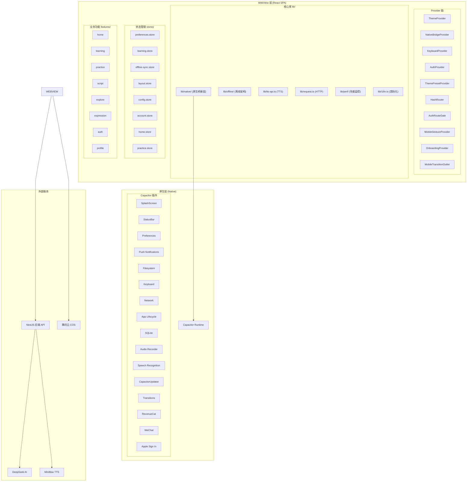

# 漫语町 前端移动端架构与性能优化

> 适用平台：iOS / Android (Capacitor) + Web (PWA 降级)
> 最后更新：2026-07-05

---

## 一、技术栈总览

| 层级 | 技术选型 | 用途 |
|------|----------|------|
| **跨平台框架** | Capacitor 8 | iOS / Android 原生壳，WebView 容器 |
| **UI 框架** | React 18 + TypeScript strict | 声明式 UI |
| **样式方案** | Tailwind CSS + shadcn/ui | 语义化设计系统 |
| **状态管理** | Zustand (11 stores, 含 persist) | 全局状态 + localStorage 持久化 |
| **路由** | React Router v6 (Hash 路由) | 兼容静态部署 + Capacitor |
| **HTTP 客户端** | Axios (统一拦截器, 请求去重, 故障冷却) | API 通信 |
| **离线存储** | `@capacitor-community/sqlite` + `@capacitor/filesystem` | 结构化数据 + 二进制资源 |
| **包管理** | pnpm monorepo (`@manyu/frontend`) | 依赖隔离 |
| **构建工具** | Vite 5 | 开发/生产构建 |

### Capacitor 已安装插件

| 插件 | 包名 | 用途 |
|------|------|------|
| Splash Screen | `@capacitor/splash-screen` | 启动画面控制 |
| Status Bar | `@capacitor/status-bar` | 状态栏样式 |
| Preferences | `@capacitor/preferences` | 原生键值存储（Web→localStorage 降级） |
| Push Notifications | `@capacitor/push-notifications` | APNs/FCM 推送 |
| Filesystem | `@capacitor/filesystem` | 本地文件读写 |
| Keyboard | `@capacitor/keyboard` | 键盘弹出/收起事件 |
| Network | `@capacitor/network` | 网络状态检测 |
| App | `@capacitor/app` | 应用生命周期（resume/back） |
| Clipboard | `@capacitor/clipboard` | 剪贴板读写 |
| Share | `@capacitor/share` | 原生分享面板 |
| SQLite | `@capacitor-community/sqlite` | 离线数据库 |
| Audio Recorder | `@capgo/capacitor-audio-recorder` | 录音 |
| Speech Recognition | `@capgo/capacitor-speech-recognition` | 原生语音识别 |
| Capacitor Updater | `@capgo/capacitor-updater` | OTA 热更新（self-hosted） |
| Capacitor Transitions | `@capgo/capacitor-transitions` | 原生页面转场动画 |
| RevenueCat | `@revenuecat/purchases-capacitor` | IAP 订阅管理 |
| RevenueCat UI | `@revenuecat/purchases-capacitor-ui` | 原生内购 Paywall |
| WeChat | `capacitor-wechat` | 微信登录/分享 |
| Social Login | `@capgo/social-login` | Apple Sign In |

---

## 二、整体架构图



---

## 三、Provider 链与启动流程

### 3.1 Provider 层级顺序（不可颠倒）

```
<ThemeProvider>           → 主题系统（next-themes）
  <NativeBridgeProvider>  → 原生能力初始化
    <KeyboardProvider>    → 键盘事件监听
    <AuthProvider>        → 认证状态 + 离线同步
      <ThemePresetProvider> → 主题预设
      <HashRouter>        → 路由系统
        <AuthRouteGate>   → 鉴权守卫
          <MobileGestureProvider>  → 手势导航
          <OnboardingProvider>     → 引导流程
          <MobileTransitionOutlet> → 原生转场
            <Routes>...</Routes>
```

### 3.2 启动时序（严格延迟策略）

```
Frame 0 (首帧)
  ├─ requestAnimationFrame → NativeBridgeProvider 标记 ready
  ├─ SplashScreen.hide()           ← 立即
  ├─ StatusBar.setStyle(Dark)      ← 立即
  ├─ Updater.notifyAppReady()      ← 立即（10s 超时硬性要求）
  └─ RevenueCat.configure()        ← 立即

Frame 0 + 8s
  └─ offlineSyncService.sync()     ← requestIdleCallback 延迟

Frame 0 + 10s
  └─ learningStore.checkPackUpdates()  ← 学习包更新检查

Frame 0 + 15s
  └─ Updater.checkUpdate()         ← OTA 更新检查

App resume (后台恢复)
  ├─ 5 分钟节流检查
  ├─ OTA 检查延迟 5s
  └─ 学习包检查延迟 8s

App pause (进入后台)
  └─ 学习包下载/卸载/排队任务标记为 paused，并持久化到 localStorage
```

学习包任务不是原生后台下载器。App 回到前台后不会自动继续，用户需要在学习计划页的“学习包任务” drawer 或学习包卡片里点“继续下载 / 继续卸载”。如果只是 WebView 短暂暂停，原异步任务仍可能自然完成；如果进程被系统杀掉，重新打开后会显示“上次任务已暂停”，继续时重新执行当前学习包任务。

### 3.3 Web ↔ Native 路由区分

- **Capacitor 端不注册**：`/admin/*`（后台管理）、`/portal`（官网）、`/company`（企业页）
- 通过 `isNative()` 在 `App.tsx` 的 `<Route>` 条件渲染中区分

---

## 四、原生桥接层（Native Bridge）架构

### 4.1 设计模式

```
lib/native/
├── index.ts                    # Barrel export
├── platform.ts                 # isNative(), isIOS(), isAndroid(), getPlatform()
├── types.ts                    # 所有服务接口类型定义
├── native-bridge.provider.tsx  # React Context Provider + useNativeBridge() hook
├── splash-screen.ts            # @capacitor/splash-screen 封装
├── status-bar.ts               # @capacitor/status-bar 封装
├── updater.ts                  # @capgo/capacitor-updater OTA 热更新
├── preferences.ts              # @capacitor/preferences（fallback → localStorage）
├── push-notifications.ts       # @capacitor/push-notifications
├── filesystem.ts               # @capacitor/filesystem
├── revenuecat.ts               # RevenueCat IAP 订阅
├── vn-voice-input.ts           # 原生语音输入
├── wechat.ts                   # 微信 SDK 桥接
├── apple.ts                    # Apple Sign In 桥接
├── save-password.ts            # iOS Keychain 密码保存
└── in-app-review.ts            # 应用内评分
```

### 4.2 核心设计决策

| 决策 | 说明 |
|------|------|
| **Provider Pattern** | 每个原生服务独立封装，`import()` 懒加载原生模块 |
| **Web Fallback** | `preferences` 降级到 `localStorage`；其他服务 Web 环境返回 no-op |
| **React Context + Static Access** | `useNativeBridge()` 用于组件，`getNativeBridge()` 用于非 React 场景 |
| **编译时静态导入** | 服务实例在模块顶层创建，零异步开销 |

---

## 五、离线架构（概要）

> 详细设计见 `学习包离线与今日任务系统.md`

离线能力由三个独立子系统组成：

| 子系统 | 用途 | 存储介质 |
|--------|------|----------|
| **LearningPack** | 学习包结构化内容与 zip 安装记录 | SQLite |
| **AssetCache** | warmup 音频、图片等二进制资源 | Filesystem |
| **MobileBundle** | Web App zip 增量更新 | COS → Capacitor 原生插件 |

核心设计原则：**数据与资源分离**（结构化数据→SQLite，二进制资源→Filesystem）。

知识点练习和今日任务的音频播放优先读取学习包内置本地 mp3。若本地 `local_assets` 记录存在但文件丢失，会删除坏记录并通过 `audioAssetId` 请求 `/file-assets/:id/private-url` 重新缓存；Web 端只要有 `audioAssetId`，播放前也会走 private URL，避免旧签名 URL 过期。

---

## 六、OTA 热更新架构

- **Self-hosted 模式**：`autoUpdate: 'off'`，纯手动控制
- **强制更新 vs 普通更新**：`isMandatory=true` → `set()` 重启；`false` → `next()`
- **自动回滚**：启动失败自动回滚到上一个可用版本
- **10 秒超时**：`notifyAppReady()` 必须在 `appReadyTimeout` 内调用

---

## 七、移动端导航与交互

### 底部导航栏

```
┌──────────┬──────────────┬──────────────┐
│  🏠 首页  │  📖 学习计划  │  📚 我的词库  │
└──────────┴──────────────┴──────────────┘
```

### 手势导航

| 手势 | 效果 |
|------|------|
| 左滑 | 主 Tab 间向右切换 |
| 右滑 | 主 Tab 间向左切换 / 返回上一页 |
| 交互元素内 | 不触发导航 |
| 弹窗打开时 | 全局禁用手势 |

### 沉浸模式

练习页面、剧本播放等自动进入沉浸模式，隐藏 BottomNav、Header、Footer。

---

## 八、语音输入架构

双轨策略：

1. **原生语音识别（优先）**：`SpeechRecognition.start()` → 端侧离线识别，实时 partial results
2. **原生录音（降级）**：`CapacitorAudioRecorder` → 上传 Whisper 转文字
3. **Web 端降级**：`MediaRecorder` → Whisper

---

## 九、TTS 语音合成架构

| Provider | 用途 | 特点 |
|----------|------|------|
| **MiniMax** (speech-2.8-hd) | 默认 TTS 引擎 | 中文+英文、词级时间戳 |
| **Cartesia** | 备用 TTS 引擎 | 极低延迟、流式合成 |

缓存策略：`configHash = SHA1(provider+model+voiceId+params)` 命中直接返回。

---

## 十、状态管理 (Zustand Stores)

| Store | 持久化 | 用途 |
|-------|--------|------|
| `preferences.store` | ✅ localStorage | TTS 设置、主题、语言 |
| `learning.store` | 部分 localStorage | 学习单元、商店、签到、学习包下载/卸载任务 |
| `offline-sync.store` | ✅ localStorage | 同步状态、日志 |
| `layout.store` | ❌ 内存 | BottomNav 显隐、沉浸模式 |
| `config.store` | ❌ 内存 | 练习配置绑定 |
| `account.store` | ❌ 内存 | 用户资料、会员状态 |
| `home.store` | ❌ 内存 | 首页数据缓存 |
| `practice.store` | ❌ 内存 | 练习会话状态 |
| `search.store` | ✅ localStorage | 搜索历史 |
| `onboarding.store` | ❌ 内存 | 引导流程 |
| `theme-preset.store` | ✅ localStorage | 主题预设配置 |

---

## 十一、HTTP 请求层（request.ts）

| 特性 | 实现 |
|------|------|
| **Axios 实例** | `baseURL` 可配置，timeout 15s |
| **Bearer Token 自动注入** | 请求拦截器从 localStorage 读取 |
| **响应自动解包** | 自动提取 `data.data` |
| **401 自动跳转** | 清除 token → 重定向 `#/auth/login` |
| **请求去重** | 相同 method+url+params+data 共享同一个 Promise |
| **故障冷却** | GET 失败后 30s 内返回缓存错误 |
| **离线检测** | `navigator.onLine === false` → 抛出 `offline` 错误 |
| **Token 刷新** | 401 时自动调用 refresh，队列化并发请求 |

---

## 十二、性能分析与优化方案

### 12.1 当前性能现状

当前 Capacitor 端可以运行，但首包偏重：

- 主 JS 包约 4+ MB，gzip 后约 1.28 MB
- CSS 约 174 KB
- `sql-wasm` 适配资源各约 653 KB
- `logo.png` 约 985 KB

瓶颈不在网络下载（本地加载），而在 WebView 对 JS 的解析、编译和执行。

### 12.2 已实施的优化

| 措施 | 效果 |
|------|------|
| OTA 检查延迟 15s | 减少首帧竞争 |
| 离线同步延迟 8s + requestIdleCallback | 首帧不阻塞同步 |
| Pixi.js 移动端降级（resolution=1） | 减少 GPU 负载 |
| Keyboard 监听暂停 Pixi | 键盘弹出时不渲染动态背景 |
| 低内存设备自动降级（≤4GB） | 避免 OOM |
| Long Task Monitor | 开发环境 >200ms 长任务告警 |
| OfflineSync pull 分页上限 5 页 | 防止一次性拉取过多 |
| Resume 节流（5 分钟间隔） | 减少后台恢复开销 |

### 12.3 第一阶段：低风险拆包（路由懒加载）

将 `App.tsx` 中页面组件改为 `React.lazy`：

- 全部 `/admin/*` 页面 → 整组拆为 `admin-routes.tsx`
- `/portal`、`/company`
- `/script/:episodeId`、`/explore`、`/practice/session/:topicId` 等较重页面

保留首屏必须的页面静态加载：`/`、`/learning`、`/today`、`/auth/login`

重依赖按组件延迟加载：`recharts`、`@uiw/react-md-editor`、`wavesurfer`、`pixi.js`、`react-markdown`

### 12.4 第二阶段：移动端专用构建

目标：Capacitor 包中不包含后台/PC 代码。

- 新增 `App.mobile.tsx` 移动端入口
- Vite `--mode mobile` 独立构建
- alias stub 掉 `@/features/admin`（防止误引用）
- 将用户端引用的后台类型迁移到共享 `shared/domain` 目录

### 12.5 移动端偶发卡顿排查

高嫌疑点：

1. **OTA 检查**：启动/resume 时触发的下载和安装标记 → 延迟 + 节流
2. **离线同步**：登录后立即执行 → 首屏渲染完成后再启动，分片执行
3. **Pixi 动态背景**：低端设备降级，切后台暂停 ticker
4. **大包解析**：重页面二级懒加载，虚拟滚动
5. **键盘弹起**：已安装 `@capacitor/keyboard`，管理 resize 和布局

建议增加 Long Task Monitor 和关键任务耗时日志定位根因。

### 12.6 优化目标

| 阶段 | 目标 | 预期效果 |
|------|------|----------|
| 第一阶段 | 路由级拆包 | 主包降到 1.5-2.5 MB |
| 第二阶段 | 移动端专用构建 | 排除 PC/后台代码 |
| 第三阶段 | 运行时性能优化 | 降低首屏 JS 执行和内存 |

---

## 十三、内购与订阅（RevenueCat）

```typescript
REVENUECAT_UNLIMITED_ENTITLEMENT_ID = 'pro_member'
```

核心 API：`configure()` → `purchasePackage()` / `restorePurchases()` / `presentPaywall()`

---

## 十四、国际化 (i18n)

- 使用 `react-i18next`
- 当前支持：`zh-CN`（默认）、`en`
- 语言偏好持久化到 `localStorage('manyu-language')`

---

## 十五、关键数据结构速查

### 学习包 Manifest

```typescript
interface LearningPackManifest {
  packId: string; version: number; title: string; updatedAt: string
  units: string[]; topics: string[]; vocabularies: string[]
  chunks: string[]; sentencePatterns: string[]; scriptEpisodes: string[]
  inkScripts: string[]; assets: AssetRef[]
  contentHash?: string
}
```

### 资源引用

```typescript
interface AssetRef {
  assetId?: string; url: string; sha256?: string | null
  mimeType?: string | null; size?: number | null
  role?: 'background' | 'sprite' | 'voice' | 'bgm' | 'sfx' | 'thumbnail' | 'warmup_audio' | 'warmup_image'
}
```

### 本地资源状态

```typescript
interface LocalAsset {
  id: string; remoteUrl: string; sha256?: string | null
  localPath: string | null; localUri: string | null
  status: 'missing' | 'downloading' | 'ready' | 'failed'
}
```

### 下载任务

```typescript
interface DownloadTask {
  packId: string; title: string; progress: number
  kind?: 'download' | 'uninstall'
  step?: string; stepLabel?: string
  currentItem?: string; current?: number; total?: number
  status: 'queued' | 'downloading' | 'extracting' | 'uninstalling' | 'paused' | 'done' | 'error'
  pausedFrom?: Exclude<DownloadTask['status'], 'paused'>
  error?: string
}
// 最大并发：MAX_CONCURRENT_DOWNLOADS = 2
// 当前任务持久化 key：manyu.learning-pack.tasks.v1
```

---

## 十六、目录结构总览

```
apps/frontend/src/
├── App.tsx                          # 根组件（Provider 链 + 路由）
├── main.tsx                         # 入口
├── index.css                        # 全局样式 + Tailwind
├── lib/
│   ├── native/                      # 原生桥接层
│   ├── offline/                     # 离线架构
│   │   └── sqlite/                  # DDL + 存储后端
│   ├── perf/                        # 性能监控
│   ├── request.ts                   # Axios 封装
│   ├── tts-api.ts                   # TTS API
│   ├── cn.ts                        # className 合并
│   └── i18n.ts                      # 国际化
├── stores/                          # Zustand (11 stores)
├── providers/                       # React Context Provider
├── layout/                          # 布局组件
├── features/                        # 业务功能（按域组织）
│   ├── home/ learning/ practice/ script/ explore/
│   ├── expression/ auth/ profile/ achievement/
│   ├── membership/ notification/ feedback/ referral/
│   └── admin/ company/ system/
├── components/ui/                   # shadcn/ui 组件
├── components/common/               # 业务通用组件
├── hooks/                           # 自定义 hooks
└── routes/                          # 路由配置
```

---

## 十七、技术决策总结

| 决策 | 选择 | 原因 |
|------|------|------|
| 跨平台方案 | Capacitor | 复用 Web 技术栈，渐进增强原生能力 |
| 路由模式 | Hash 路由 | 兼容静态部署 + Capacitor iOS |
| 离线存储 | SQLite + Filesystem 分离 | 结构化数据与二进制资源独立管理 |
| OTA 方案 | Capgo CapacitorUpdater（self-hosted） | 纯手动控制 |
| 语音识别 | 原生 SpeechRecognition 优先 | 端侧离线识别，低延迟 |
| 内购 | RevenueCat | 跨平台订阅管理 |
| 状态管理 | Zustand | 轻量、按需订阅、persist |
| 原生桥接 | Provider Pattern + 静态导出 | React 内外均可访问 |
| 性能监控 | PerformanceObserver | 定位 WebView 卡顿根因 |
