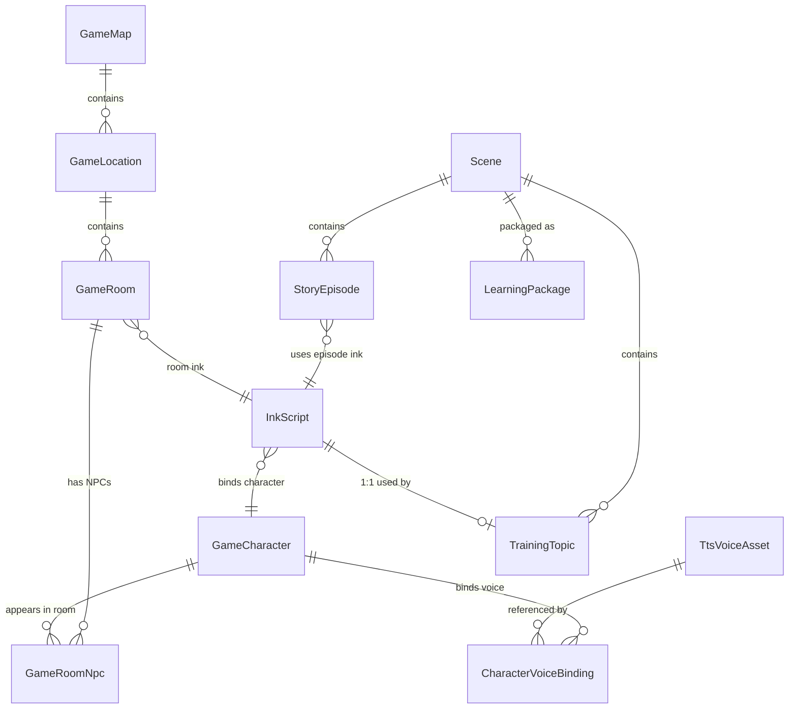

# 剧情内容与 Ink 剧本指南（AI 参考手册）

> **用途**：为 AI 助手（GitHub Copilot、Cursor 等）提供参考，理解漫语町的剧情内容体系与 Ink 剧本 `#tag` 系统。
> **说明**：本文档合并自《Ink 标签规则说明》与《NQTR 内容工坊架构文档》，内容以当前代码实现为准（更新于 2026-08）。
> **适用代码**：
> - 剧本解析/序列化：`apps/frontend/src/features/admin/components/composer-parser.ts`、`ink-compiler.ts`
> - VN 运行时：`apps/frontend/src/features/vn-engine/`（`use-ink-story.ts`、`ink-engine.ts`、`pixi-vn-stage.tsx`）
> - 混合模式时间轴：`apps/frontend/src/features/admin/components/vn-mixed-timeline.ts`
> - 数据模型：`apps/backend/prisma/schema.prisma`
> - 剧本内容：`apps/backend/prisma/data/packages/*/ink-scripts/*.ink`

---

## 目录

1. [内容体系总览](#1-内容体系总览)
2. [Ink 剧本规范（核心）](#2-ink-剧本规范核心)
3. [数据模型](#3-数据模型)
4. [解析与渲染管线](#4-解析与渲染管线)
5. [Admin 路由与 UI](#5-admin-路由与-ui)
6. [API 参考](#6-api-参考)
7. [快速上手](#7-快速上手)
8. [常见问题](#8-常见问题)

---

## 1. 内容体系总览

漫语町的剧情/练习内容由四个后台工作区组成，已取代早期的 NQTR 四步工作流（角色 → 地图 → 故事 → 场景）：

| 工作区 | Admin 路径 | 职责 |
|--------|-----------|------|
| 剧情包内容 | `#/admin/narrative` | 剧情包（Scene, packageType=story）→ 章节 → 剧集（StoryEpisode）的创作与管理 |
| 剧情共享资产 | `#/admin/narrative-assets` | 全局共享的**角色资产 / 音色资产 / 地图世界**，供剧情包统一引用 |
| 练习话题 | `#/admin/nqtr` | TrainingTopic 对应的话题实战 VN（Ink 剧本） |
| 学习包内容 | `#/admin/learning-content` | 场景（Scene）与训练话题（TrainingTopic）的常规学习内容管理 |

> 旧路由 `#/admin/characters`、`#/admin/maps`、`#/admin/stories` 仍存在，仅作兼容入口，主入口已迁移至上述工作区。

### 数据链路



### 创作流程

```
① 共享资产：角色 + 音色 + 地图世界（narrative-assets）
      │
② 剧情包：包 → 章节 → 剧集（narrative）       练习话题 VN（nqtr）
      │                                              │
③ Ink 剧本：剧集绑定 episode Ink / 话题绑定 practice Ink
      │
④ 学习包内容：场景 → 训练话题（learning-content）→ 用户练习
```

**关联链**：
- 剧情包：`Scene(story) → StoryEpisode.inkScriptId → InkScript`
- 练习话题：`Scene → TrainingTopic.inkScriptId → InkScript`
- 资产引用：`InkScript.locationId → GameLocation`、`InkScript.characterId → GameCharacter`、`GameCharacter → CharacterVoiceBinding → TtsVoiceAsset`

---

## 2. Ink 剧本规范（核心）

### 2.1 文件结构与 Frontmatter

```ink
---
key: practice_course-adverbs_方式副词
title: 副词·方式与评论副词 - 方式副词
locationId: loc_xxx        # 可选：绑定的地点 ID
characterId: char_xxx       # 可选：绑定的主要角色 ID
---

-> start

=== start ===
...
```

| Frontmatter 字段 | 说明 |
|------------------|------|
| `key` | 全局唯一键（必须） |
| `title` | 剧本展示标题（必须） |
| `locationId` | 可选，故事发生地点 |
| `characterId` | 可选，故事主要角色 |

> 脚本生成的文件头**不含** `scriptType` 字段；`scriptType`（`practice` / 非 practice）由后端按工作区写入。

### 2.2 基础语法

```ink
=== knot_name ===       // 节点（场景段落）定义
-> knot_name            // 跳转到指定节点
-> END                  // 剧情结束
*   [选项文本] -> knot   // 用户选项（3 空格缩进，方括号内为展示文本）
```

### 2.3 标签系统

#### 台词前标签（角色/场景元信息）— 格式 `# tag:value`

| 标签 | 示例 | 说明 |
|------|------|------|
| `# speaker:` | `# speaker:Emma` | 发言角色，与 `GameCharacter.name` 一致；每句 NPC 台词前必须标记 |
| `# expression:` | `# expression:happy` | 角色表情，常见值 `default/happy/thinking/surprised/sad/angry/shy/confident` |
| `# position:` | `# position:center` | 角色站位 `left/center/right`，单角色默认 `center` 可省略 |
| `# translation:` | `# translation:%E6%AC%A2...` | 中文翻译，值必须 **URL 编码**（`encodeURIComponent`） |
| `# audio:` | `# audio:https://...` | 台词配音音频 URL（URL 编码存储） |
| `# portraitScale:` | `# portraitScale:80` | 立绘缩放百分比（数字，默认 100，仅与默认值不同时序列化） |

#### 背景标签

| 标签 | 示例 | 说明 |
|------|------|------|
| `# bg:` | `# bg:/assets/bg/kitchen.png` | 场景背景图；也支持资产别名（见 2.6），含 `http(s)` 的 URL 编译前会被自动 URL 编码 |
| `# bgFit:` | `# bgFit:cover` | 背景填充：`cover` / `contain` / `stretch` / `repeat` |

#### 输入等待标签

| 标签 | 说明 |
|------|------|
| `# wait:input` | 等待用户输入（语音/文本），触发麦克风/输入框 |
| `# wait:user_input` | 同上，等价写法 |
| `# input` / `# user_input` | 同上，等价写法（运行时统一识别） |
| `# wait` | 纯等待，用户点击"继续"，无输入 |

#### wait 指令标签（写在 NPC 台词之后、`# wait:input` 之前）

| 标签 | 示例 | 说明 |
|------|------|------|
| `# objective:` | `# objective:用方式副词描述你阅读食谱的方式` | 本轮对话目标，每个 `# wait:input` 前**有且仅有一个** |
| `# hint:` | `# hint:用 "I read it carefully" ... 来描述你的感受` | 提示语，中文描述 + 英文示例 |
| `# chunks:` | `# chunks:Please read carefully.,He quickly finished his homework.` | 目标句块，句块之间可用英文逗号、分号或中文逗号/分号分隔（`/[,;，；]/`），建议 2~4 个 |
| `# defaultAnswer:` | `# defaultAnswer:Hi%2C%20I%27m%20Alex.` | **仅后台混合模式预览用**：默认回答（URL 编码），用于时间轴自动推进，不代表正式用户答案 |
| `# defaultAnswerAudio:` | `# defaultAnswerAudio:https://...` | 默认回答的配音音频 URL（URL 编码，可选） |

#### 选项相关标签

| 标签 | 示例 | 说明 |
|------|------|------|
| `# choiceCharacter:` | `# choiceCharacter:hide` | 选项展示时是否保留角色立绘：`show`（默认）/ `hide`；写在选项行之前 |

### 2.4 标签顺序（完整模板）

```
=== knot_name ===
# bg:/assets/bg/xxx.png           ① 背景图（仅节点开头）
# bgFit:cover                      ② 背景填充（仅节点开头）
# speaker:角色名                    ③ 发言角色
# expression:表情                   ④ 角色表情
# position:位置                     ⑤ 角色站位
# translation:URL编码的中文翻译      ⑥ 中文翻译
# audio:URL编码的配音               ⑦ 可选配音
# portraitScale:80                 ⑧ 可选立绘缩放
NPC: English dialogue line.        — NPC 台词
# objective:本轮目标                 ⑨ 对话目标
# hint:提示语                       ⑩ 可选提示
# chunks:句块1.,句块2.,句块3.       ⑪ 目标句块
# defaultAnswer:URL编码的默认回答    ⑫ 可选（仅混合模式预览）
# wait:input                        ⑬ 等待输入（或用 # wait 纯等待）
-> knot_name                        ⑭ 跳转下一节点
```

### 2.5 完整示例

```ink
---
key: practice_course-adverbs_方式副词
title: 副词·方式与评论副词 - 方式副词
---

-> start

=== start ===
# bg:/assets/bg/kitchen.png
# bgFit:cover
# speaker:Emma
# expression:happy
# position:center
# translation:%E6%AC%A2%E8%BF%8E%E6%9D%A5%E5%88%B0%E6%88%91%E7%9A%84%E5%8E%A8%E6%88%BF%E5%A4%A7%E5%86%92%E9%99%A9%EF%BC%81
Emma: Welcome to my kitchen adventure!
# objective:用方式副词描述你阅读食谱的方式（carefully/quickly/easily）
# hint:用 "I read it carefully", "I quickly looked through it" 来描述你看完食谱后的感觉
# chunks:Please read carefully.,He quickly finished his homework.,She easily solved the problem.
# wait:input
-> prep_work

=== prep_work ===
# speaker:Emma
# expression:default
Emma: Great! Let's prepare the ingredients.
*   [Let's start!] -> END
```

### 2.6 资产别名（assetMap）

Ink 源码中的背景/音频可使用**稳定别名**（如 `bg_cafe`、`audio_door`），而非直接写 URL：

- 别名通过 `InkScript.assetMap`（`{ [alias]: { fileAssetId, type, mimeType } }`）注册为文件资产。
- 运行时（`resolveTimelineAssetAliases`）将别名解析为带签名的真实 URL；未注册的别名不会被当作相对路径处理。
- 优点：资源替换无需改动剧本；支持学习包离线打包。

### 2.7 标签速查表

| 标签 | 位置 | 格式 | 说明 |
|------|------|------|------|
| `# bg` | 台词前 | `# bg:path-or-alias` | 背景图 |
| `# bgFit` | 台词前 | `# bgFit:cover` | 背景填充（cover/contain/stretch/repeat） |
| `# speaker` | 台词前 | `# speaker:Emma` | 发言角色 |
| `# expression` | 台词前 | `# expression:happy` | 角色表情 |
| `# position` | 台词前 | `# position:center` | 角色站位 |
| `# translation` | 台词前 | `# translation:URL编码` | 中文翻译 |
| `# audio` | 台词前 | `# audio:URL编码` | 台词配音 |
| `# portraitScale` | 台词前 | `# portraitScale:80` | 立绘缩放百分比 |
| `# objective` | 台词后 | `# objective:文本` | 对话目标（wait:input 必备） |
| `# hint` | 台词后 | `# hint:文本` | 提示语 |
| `# chunks` | 台词后 | `# chunks:句块列表` | 目标句块（2~4 个） |
| `# defaultAnswer` | 台词后 | `# defaultAnswer:URL编码` | 混合模式默认回答（仅后台预览） |
| `# defaultAnswerAudio` | 台词后 | `# defaultAnswerAudio:URL编码` | 默认回答配音（可选） |
| `# wait:input` | 台词后 | `# wait:input` | 等待输入（等价：wait:user_input / input / user_input） |
| `# wait` | 剧情末尾 | `# wait` | 纯等待（点击继续） |
| `# choiceCharacter` | 选项前 | `# choiceCharacter:show` | 选项时是否显示立绘 |

### 2.8 AI 生成剧本的硬性规则（后端提示词要求）

- 每条 NPC 对白都必须配 `# translation:`（地道中文）。
- 每个 `# wait:input` 必须配套 `# objective:`（中文目标）、`# hint:`（中文提示）、`# chunks:`（从话题句块选 1~3 个）。
- `# wait:input` 与 `* 选项` **不能紧挨着**：NPC 提问 → wait:input → NPC 回应 → 选项。
- **所有对白都是 NPC 说的**，不要写玩家（You/Player）对白行；学员通过 wait:input 参与。
- 不要假设玩家姓名（禁用 "Nice to meet you, Li Ming" 等），一律用 "you"。
- 对白与选项用英文；3~6 个场景、总对白 10~25 行为宜。

---

## 3. 数据模型

### 3.1 角色与音色（Routine）

**`GameCharacter`**（表 `game_character`）

| 字段 | 类型 | 说明 |
|------|------|------|
| `name` | String | 内部标识（如 `emma`），Ink `# speaker` 引用此值 |
| `displayName` | String | 显示名（如 `Emma`） |
| `role` | String | 角色定位（`host` / `librarian` 等） |
| `personality` | String? | 性格描述（供 AI 参考） |
| `avatarUrl` | String? | 头像 URL |
| `spriteBaseUrl` | String? | 立绘基础 URL |
| `expressions` | Json? | 表情集 `{ "happy": "url", "sad": "url", ... }` |
| `defaultPosition` | String? | 默认站位（left/center/right） |

**`TtsVoiceAsset`**（表 `tts_voice_asset`）— 全局音色资产库
从 TTS 厂商（MiniMax / Cartesia）同步或手工录入，含 `providerId`、`externalVoiceId`、`displayName`、`category`（system/cloned/designed/custom）、`language`、`gender`、`previewUrl`、`isAvailable` 等。

**`CharacterVoiceBinding`**（表 `character_voice_binding`）— 角色 ↔ 音色引用
`characterId + voiceAssetId` 复合唯一；`model` / `params` 仅作该角色的可选覆盖；`isDefault` 标记默认音色。

> 早期文档中角色直接持有的 `ttsVoice/ttsModel/ttsParams` 字段已废弃，统一改为引用音色资产库。

### 3.2 地图世界（Navigation）

**`GameMap`**（表 `game_map`）

| 字段 | 类型 | 说明 |
|------|------|------|
| `name` / `displayName` | String | 标识 / 显示名 |
| `backgroundUrl` / `thumbnailUrl` / `icon` | String? | 背景 / 缩略图 / 图标 |
| `width` / `height` | Int | 画布尺寸（默认 1920×1080） |
| `editorData` | Json? | 编辑器附加数据 |
| `requiredOutputLevel` | String | 解锁等级（L1~L5） |
| `requiredChapterId` | String? | 前置章节 |
| `disabled` / `hidden` / `isPreview` | Boolean | 禁用 / 隐藏 / 预览标记 |
| `sortOrder` | Int | 排序 |

**`GameLocation`**（表 `game_location`）— 地点容器

| 字段 | 类型 | 说明 |
|------|------|------|
| `name` / `displayName` / `description` | String | 标识 / 显示名 / 描述 |
| `mapId` | String | 所属地图 |
| `posX` / `posY` | Float | 地图坐标 |
| `icon` / `iconWidth` / `iconHeight` | String? / Int | 图标与尺寸 |
| `locationType` | String | `building` / `outdoor` / `district` |
| `backgroundUrl` / `bgmUrl` / `ambientUrl` | String? | 背景 / BGM / 环境音 |
| `sceneId` | String? | 关联的学习场景 |
| `requiredOutputLevel` / `requiredSceneIds` / `requiredFlags` | — | 解锁条件 |
| `disabled` / `hidden` / `isPreview` / `sortOrder` | — | 状态与排序 |

**`GameRoom`**（表 `game_room`）— 核心导航单元

| 字段 | 类型 | 说明 |
|------|------|------|
| `name` / `displayName` / `description` | String | 标识 / 显示名 / 描述 |
| `roomType` | String | `vn_scene` / `hub` / `shop` / `quest` |
| `isEntrance` | Boolean | 进入 Location 的默认房间 |
| `backgroundUrl` / `bgmUrl` / `ambientUrl` | String? | 背景 / BGM / 环境音 |
| `icon` | String? | 图标 |
| `inkScriptId` | String? | 房间绑定的 Ink 脚本 |
| `requiredOutputLevel` / `requiredFlags` | — | 解锁条件 |
| `disabled` / `hidden` / `isPreview` / `sortOrder` | — | 状态与排序 |

**`GameRoomNpc`**（表 `game_room_npc`）— 房间 NPC 绑定（`@@unique([roomId, characterId])`）

| 字段 | 类型 | 说明 |
|------|------|------|
| `schedule` | Json? | NPC 出现时段 |
| `defaultGreeting` | String? | 默认问候语 |
| `inkTalkScriptId` | String? | 会话 Ink 脚本（可选，覆盖房间默认脚本） |
| `sortOrder` | Int | 排序 |

> 导航方式与 Pixi-VN 一致：设置 `navigator.currentRoom` 直接跳转，无显式出口（Exit）中间表。

### 3.3 Ink 脚本（Quest）

**`InkScript`**（表 `ink_script`）

| 字段 | 类型 | 说明 |
|------|------|------|
| `key` | String (unique) | 脚本键 |
| `title` | String | 标题 |
| `scriptType` | String | `practice`（练习话题）/ 非 practice（剧情剧集） |
| `inkSource` | String? | Ink DSL 源码 |
| `inkJson` | Json? | inkjs 编译后的 JSON |
| `episodeId` | String? | 绑定的剧集（StoryEpisode） |
| `locationId` / `roomId` / `characterId` | String? | 地点 / 房间 / 角色绑定 |
| `topicId` | String? (unique) | 绑定的训练话题（1:1，经 `TopicInkScript` 关系） |
| `declaredVariables` | Json? | Ink 变量声明 |
| `assetMap` | Json? | 资产别名注册表 `{ [alias]: { fileAssetId, type, mimeType } }` |
| `version` | Int | 版本号（每次保存 +1） |
| `changelog` | String? | 变更记录 |

### 3.4 剧情包与剧集（Time + Quest）

- **`Scene`**（`packageType='story'` 时为剧情包）：标题、分类、封面、是否免费。
- **`StoryEpisode`**（表 `script_episode`）— 剧集/章节：

| 字段 | 说明 |
|------|------|
| `chapterKey` / `chapterName` / `sortOrder` | 章节标识 / 名称 / 顺序 |
| `title` / `description` | 剧集标题与描述 |
| `requiredOutputLevel` / `requiredUserLevel` | 解锁等级 |
| `requiredVocabularyCount` / `totalVocabularyCount` | 通过所需词汇数 / 总词汇数 |
| `requiredChunkCount` / `totalChunkCount` | 通过所需句块数 / 总句块数 |
| `prerequisiteEpisodeIds` | 前置剧集 |
| `objectives` / `requiredObjectiveCount` | 目标清单 / 通过所需目标数 |
| `requiredUsedChunkCount` / `requiresRetell` / `minimumTurnCount` | 通过条件（使用句块数 / 是否复述 / 最少轮次） |
| `rewards` | 奖励配置 |
| `characterName` / `characterRole` / `characterPersona` | 剧集 NPC 设定 |
| `inkScriptId` | 绑定的 Ink 剧本 |
| `vocabularies` / `chunks` / `sentencePatterns` | 关联的词汇 / 句块 / 句型 |

### 3.5 训练话题（练习 VN）

**`TrainingTopic`**：`sceneId` 所属场景；`inkScriptId`（unique，1:1 绑定 Ink 剧本）；`teachingMarkdown` 教学文档；`promptEn/promptZh` AI 评分提示词；`difficulty` 难度；`metadata.outputTraining` 知识点训练管线（含 `materialUsage` 素材使用统计）。关联 `TrainingTopicVocab` / `TrainingTopicChunk` / `TrainingTopicSentencePattern`。

---

## 4. 解析与渲染管线

### 4.1 编译（ink-compiler.ts）

1. `extractInkMeta()` 剥离 YAML Frontmatter（`key/title/locationId/characterId`）。
2. `encodeUrlTags()` 预处理：`# bg:` / `# sprite:` 中的 `http(s)` URL 自动 `encodeURIComponent`（inkjs 对含特殊字符的标签值会编译失败）。
3. `ensureEntryPoint()`：若首个节点是 `=== start ===`，自动补 `-> start`。
4. inkjs `Compiler` 编译为 JSON，错误/警告/作者消息（TODO）一并返回；编译产物存入 `InkScript.inkJson`。

### 4.2 运行时（vn-engine / use-ink-story.ts）

- InkEngine 逐行推进；输入等待标签统一识别：`input`、`user_input`、`wait:input`、`wait:user_input` 及 `input:` 前缀（`INPUT_TAGS`）。
- 遇到输入标签：暂停并激活输入模式（语音/文本），其后的台词行缓存为 pending，待用户作答后刷新。
- `# speaker / expression / position / translation / audio / portraitScale / bg / bgFit` 等标签随台词行更新舞台状态（Pixi 舞台负责渲染背景与立绘）。

### 4.3 编辑器结构化解析（composer-parser.ts）

`parseComposer()` 将 Ink 源码解析为结构化场景树（`ComposerScene[]`），元素类型：`line` / `choice` / `background` / `wait` / `divert` / `tag`；`serializeComposer()` 反向生成源码（写入时统一规范格式）。编辑器基于此做可视化编辑与校验。

### 4.4 混合模式时间轴（vn-mixed-timeline.ts）

- `flattenComposerToTimeline()` 将 `ComposerScene[]` 铺平为线性帧（`MixedTimelineFrame[]`），帧类型 `line` / `choice` / `userInput` / `missingInput`。
- **`# defaultAnswer` 驱动自动推进**：混合模式不允许管理员手动输入，缺省回答帧以 `speaker: You`、`source: defaultAnswer` 展示；缺少 `defaultAnswer` 时生成 `missingInput` 帧（歌词栏提示缺失），时间轴停止展开后续帧。
- 资产别名（assetMap）在铺平前统一解析为签名 URL（`resolveTimelineAssetAliases`）。
- 混合模式为只读预览：不写练习结果、不触发 AI 评估。

---

## 5. Admin 路由与 UI

| URL | 页面 | 说明 |
|-----|------|------|
| `#/admin/narrative` | 剧情包内容 | 剧情包列表 → 章节工作室（StoryChapterStudio） |
| `#/admin/narrative?packageId=xxx` | 剧情包详情 | 编辑章节、剧集、沉浸式输出体验 |
| `#/admin/narrative-assets` | 剧情共享资产 | Tab：角色资产 / 音色资产 / 地图世界 |
| `#/admin/nqtr` | 练习话题 | 话题实战 VN 的故事工坊（workspace=practice） |
| `#/admin/nqtr?storyId=xxx` | 练习话题 | 直接打开指定剧本编辑 |
| `#/admin/learning-content` | 学习包内容 | 场景与训练话题管理（含质量审查、批量生成） |
| `#/admin/characters` `#/admin/maps` `#/admin/stories` | 兼容入口 | 旧独立页，主入口已迁移 |

故事工坊组件 `StoryWorkshopTab` 通过 `workspace` 区分范围：
- `practice`：`scriptType='practice'`（练习话题 VN）
- `narrative`：`scriptType != 'practice'`（剧情剧集）

---

## 6. API 参考

业务前缀：`/api/v1/manyu/admin/content/`（Controller：`admin/content`，需管理员会话）。

### 故事 API（InkScript）

| 方法 | 路径 | 说明 |
|------|------|------|
| `GET` | `/stories` | 列表；参数 `search` / `scriptType` / `scope`（practice\|narrative）/ `packageType` / `categoryId` / `page` / `pageSize` |
| `GET` | `/stories/filters` | 过滤选项（scriptTypes / packageTypes / categories） |
| `GET` | `/stories/:id` | 单个故事详情（含 inkSource、inkJson） |
| `POST` | `/stories` | 创建故事 |
| `PATCH` | `/stories/:id` | 更新故事（版本号 +1，记录 changelog） |
| `DELETE` | `/stories/:id` | 删除故事 |
| `DELETE` | `/stories/by-scene/:sceneId` | 按场景删除（剧情包清理用） |

### 角色 / 地点 / 地图 API

| 方法 | 路径 | 说明 |
|------|------|------|
| `GET` | `/characters` | 角色列表（含音色绑定） |
| `POST` / `PATCH` / `DELETE` | `/characters[/:id]` | 角色增删改 |
| `GET` | `/locations` | 地点列表（含地图 → 地点 → 房间 → NPC） |
| `POST` / `PATCH` / `DELETE` | `/locations[/:id]` | 地点增删改 |
| `POST` | `/maps` | 创建地图 |
| `PATCH` / `DELETE` | `/maps/:id` | 更新 / 删除地图 |
| `POST` | `/room-npcs` | 绑定 NPC 到房间 |
| `DELETE` | `/room-npcs/:id` | 移除 NPC 绑定 |

### 场景 / 话题 API

| 方法 | 路径 | 说明 |
|------|------|------|
| `GET` | `/scenes` | 场景列表 |
| `GET` | `/scenes/categories` | 场景分类 |
| `GET` / `PATCH` | `/training-topics/:id` | 获取 / 更新训练话题（含 Ink 绑定、outputTraining） |

---

## 7. 快速上手

### 7.1 创建剧情包并编写剧集剧本

1. `#/admin/narrative-assets`：先创建角色（配置立绘表情、绑定音色资产）与地图世界（地点 → 房间）。
2. `#/admin/narrative`：新建剧情包（标题、分类、简介、封面、是否免费）。
3. 进入剧情包 → 章节工作室创建章节与剧集，填写 NPC 设定、通过条件（目标数、句块数、复述、最少轮次），编写或引用 Ink 剧本。
4. 在 Ink 编辑器中编写剧本（Frontmatter 含 key/title；NPC 台词前写 speaker/expression/translation，输入轮次写 objective/hint/chunks + wait:input）。
5. 保存后编译校验（inkjs），用竖屏 / 横屏 / 混合模式预览。

### 7.2 为训练话题编写练习 VN

1. `#/admin/nqtr`：新建故事（workspace=practice），绑定角色与地点。
2. 编写剧本（同上规范；`# bg` 可引用房间背景或资产别名）。
3. 在 `#/admin/learning-content` 的对应训练话题中，将剧本绑定到话题（`TrainingTopic.inkScriptId`）。
4. 用户即可在 App 中进入该话题进行对话练习；练习结果由 `metadata.outputTraining` 管线驱动知识点训练。

---

## 8. 常见问题

**Q: 一个轮次可以有多个 `# objective` 吗？**
不可以。每个 `# wait:input` 前只能有一个。

**Q: `# chunks` 中的句块有数量限制吗？**
建议 2~4 个；分隔符支持英文逗号、分号及中文逗号/分号。

**Q: `# translation` / `# defaultAnswer` 的值为什么要 URL 编码？**
规避特殊字符（引号、逗号等）在 Ink 标签中的解析问题，生成时 `encodeURIComponent()`，解析时自动解码。`# bg` 的 `http(s)` URL 由编译器预处理自动编码，手写无需处理。

**Q: 标签名大小写敏感吗？**
敏感，统一小写：`# objective` 而非 `# Objective`。

**Q: 背景图可以直接写 URL 吗？**
可以（`# bg:https://...` 编译时自动编码）；推荐使用资产别名（assetMap），便于资源替换与离线打包。

**Q: `# wait` 和 `# wait:input` 的区别？**
`# wait` 纯确认（点击继续）；`# wait:input` 等待用户语音/文本输入，是口语训练的核心节点，必须配套 `objective/hint/chunks`。

**Q: 混合模式下 `# defaultAnswer` 是必须的吗？**
不是强制语法，但缺少时混合模式时间轴会在该输入节点停止展开并提示"缺少默认回答"；正式用户练习不读取该字段。

**Q: `# wait:input` 与 `* 选项` 可以相邻吗？**
不可以。两者之间必须插入至少一条 NPC 对白（AI 生成规则亦如此）。

---

## 相关文档

- [内容架构设计](./内容架构设计.md) — 整体内容体系设计
- [输出练习链路设计方案](./输出练习链路设计方案.md) — 用户练习流程
- [离线学习与沉浸式播放器手册](./离线学习与沉浸式播放器手册.md) — 学习路径、离线包和今日任务
