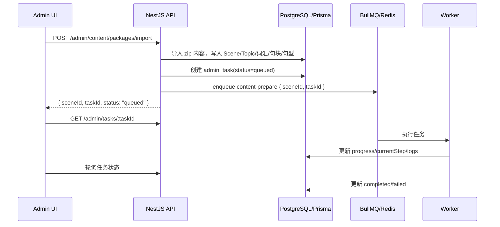

# 后台任务与学习包内容同步设计

> 本文针对后台 `http://localhost:5173/#/admin/learning-content` 的学习包导入后内容准备流程。
> 目标：把“同步/补全单词、句型、句块”等慢流程从前端请求中拆出来，改为后端后台任务，并提供任务页面查看进度、失败原因和重试入口。
> 最后更新：2026-07-01

---

## 一、结论

当前导入学习包后的慢流程不适合继续放在前端串行执行。

建议使用：

| 能力 | 推荐方案 | 说明 |
|---|---|---|
| 后台任务队列 | `@nestjs/bullmq` + `bullmq` | NestJS 官方生态常用方案，适合长任务、重试、并发控制、失败记录。 |
| 队列存储 | Redis | BullMQ 必须依赖 Redis。Redis 负责队列、锁、延迟任务、重试状态。 |
| 业务状态持久化 | Prisma + 数据库 `admin_task` / `admin_task_log` | 前端任务页、审计、重启后可查历史都应该读数据库，而不是只读 Redis。 |
| 实时状态 | 轮询优先，WebSocket 可选 | 管理后台用 `GET /admin/tasks/:id` 每 1-2 秒轮询已经足够；后续可接 WebSocket。 |
| 定时任务 | `@nestjs/schedule` 只做辅助 | 适合清理历史任务、扫描卡住的任务，不适合作为主要长任务执行框架。 |

换句话说：Redis 负责“任务怎么跑”，数据库负责“任务跑到哪了、结果是什么、谁触发的、失败能不能追”。

### 最新边界（2026-07-01）

本文的“内容同步”只指后台内容生产链路，不指移动端用户练习数据同步。

| 链路 | 作用 | 主要模块 | 主要存储 |
| --- | --- | --- | --- |
| 后台内容准备 | 导入学习包后补齐词汇、句块、句型、题目配置，生成可下载学习包。 | `admin-tasks` / content prepare processor | PostgreSQL `admin_task` / `admin_task_log` |
| 学习包内容分发 | 移动端检查、下载、安装学习包内容和资源。 | `learning-pack.service.ts` / `/learning/packs/check` | SQLite `downloaded_*` + Filesystem assets |
| 用户练习同步 | 今日任务、知识点练习、VN 练习的用户作答数据同步。 | `offline-sync.service.ts` / `/sync/push` / `/sync/pull` | SQLite `warmup_records` / `daily_practice_*` + 后端用户表 |

这三条链路共享学习包内容 ID，但职责不能混在一起：

- 后台任务解决“内容怎么准备好”。
- 学习包同步解决“内容怎么到用户设备上”。
- 用户练习同步解决“用户练过什么、答案是什么、下次什么时候复习”。

---

## 二、当前问题

现在后台学习包导入流程大致是：

```text
前端上传 zip
  -> POST /admin/content/packages/import
  -> 后端解压、写入 Scene / Topic / Vocabulary / Chunk / Pattern
  -> 前端拿到 sceneId
  -> 前端调用 prepareImportedPackageContent(sceneId)
      -> listTrainingTopics(sceneId)
      -> 逐个单词执行“词典查询 + AI 翻译/音标校核 + 字段合并”
      -> 逐个句块 aiEnrichChunk + updateLibraryChunk
      -> 逐个句型 aiEnrichPattern + updateLibraryPattern
```

这会带来几个问题：

- 页面必须一直开着，刷新或关闭会中断后续内容准备。
- 浏览器请求链路长，容易遇到接口超时、网络波动、登录态过期。
- AI / 词典调用本身慢且不稳定，失败需要分项重试。
- 前端只能显示一个 toast，不方便看“当前跑到第几个单词/句块/句型”。
- 并发导入多个学习包时，前端难以统一排队和限流。

这类流程应该由后端开任务执行，前端只负责创建任务和查看任务状态。

---

## 三、命名边界

项目里已经有 `apps/backend/src/modules/sync`，它目前是移动端/客户端离线同步：

- `POST /sync/push`
- `GET /sync/pull`
- `GET /sync/content/manifest`

学习包导入后的“同步单词、句型、句块”不要继续叫通用 `sync`，否则会和客户端离线同步混淆。

建议命名为：

| 场景 | 建议命名 |
|---|---|
| 后台任务模块 | `admin-tasks` 或 `jobs` |
| 学习包导入后内容准备任务 | `learning-package-content-prepare` |
| UI 页面 | “任务中心” / “内容任务” |
| 操作按钮 | “准备内容” / “重新准备内容” |

文档后续使用 `content-prepare` 指代这条任务。

---

## 四、目标流程

### 4.1 导入后自动创建任务



### 4.1.1 从后台导入到移动端可练的完整链路

```mermaid
flowchart TD
  A[管理员导入学习包 zip] --> B[后端解压并写入 Scene / Topic / Vocabulary / Chunk / Pattern]
  B --> C[创建 AdminTask<br/>learning-package-content-prepare]
  C --> D[BullMQ / Redis 排队]
  D --> E[Worker 补齐词汇、句块、句型、outputTraining]
  E --> F[写入业务表 + admin_task_log]
  F --> G[生成 / 发布学习包 zip + manifest]
  G --> H[COS / FileAsset]

  I[移动端启动或进入学习计划] --> J[/learning/packs/check]
  J --> K{是否有新版本}
  K -->|有| L[下载 zip]
  L --> M[校验 SHA256 / 解压]
  M --> N[SQLite downloaded_packs / downloaded_unit_details / ink_scripts]
  M --> O[Filesystem offline-assets + asset_refs]
  N --> P[今日任务 / 知识点练习从本地 outputTraining 抽题]
```

关键点：

- `AdminTask` 不直接写移动端 SQLite；它只把服务端内容准备好。
- 移动端永远通过学习包下载/更新拿内容，避免后台任务和客户端设备状态强耦合。
- `outputTraining.pipeline` 是今日任务和知识点练习共同消费的题目来源，因此后台内容准备阶段必须保证 pipeline 完整性。

### 4.2 任务页查看进度

后台新增任务中心页面，例如：

```text
/#/admin/tasks
```

在学习包内容管理页导入成功后：

- toast 显示“已开始后台准备内容”。
- 提供“查看任务”按钮，跳转到任务详情。
- 学习包列表行可以展示最近一次内容准备状态。

---

## 五、任务拆分

`content-prepare` 任务建议分成四个阶段。

| 阶段 | 内容 | 可跳过条件 |
|---|---|---|
| `scan` | 读取 scene 下所有 topic，收集唯一的 vocab / chunk / pattern | 无 |
| `vocabulary` | 单词执行现有 `handleDictionaryLookup` 同款流程：词典查询、音频/音标提取、AI 翻译和音标校核、字段合并后写库 | 已有完整词典、AI 字段、音频和音标 |
| `chunk` | 句块缺说明或例句时调用 AI 生成，并更新 `Chunk` | `description` 和 `examples` 已存在 |
| `pattern` | 句型缺说明或例句时调用 AI 生成，并更新 `SentencePattern` | `description` 和 `examples` 已存在 |

每个 item 都应该独立捕获错误。单个词失败不应导致整个学习包任务直接失败，除非是系统性错误，例如数据库不可用、AI provider 配置缺失、Redis 连接异常。

任务最终结果建议分为：

| 状态 | 语义 |
|---|---|
| `completed` | 所有阶段跑完，可能包含少量 item 失败。 |
| `failed` | 任务无法继续，例如初始化失败、数据库异常、worker 崩溃超过重试次数。 |
| `partial_failed` | 可选状态。如果希望 UI 更明确，可表示“跑完了，但存在 item 失败”。 |

为了简单，第一版可以只用 `completed`，同时在 `summary.errors` 里记录失败数量。

### 5.1 单词阶段必须合并现有词典 + AI 逻辑

后台任务里的单词补全不要只调用旧的 `enrichVocabulary(vocab.id)`。现在后台内容库中单词按钮的真实逻辑是 `handleDictionaryLookup`：

```text
输入 word
  -> lookupWord(word)
  -> 取 entries[0]
  -> getBestPhonetic(entry)
  -> 提取美式/英式音频 URL，并规范化 // 开头的协议相对路径
  -> 提取 definitions: ["partOfSpeech: definition"]
  -> 提取最多 5 条词典例句 examples: [{ en, zh: "", level: "intermediate" }]
  -> 调用 aiEnrichVocabulary({ word, definitions, examples, phoneticUs, phoneticUk })
  -> AI 结果覆盖/补充音标
  -> definitions + definitionTranslations 合并为 definitionEn
  -> AI generatedExamples 替换词典例句；AI 失败才用词典例句兜底
  -> meaning 优先用 AI meaning；兜底 deriveMeaning(definitionEn)
  -> 写回 Vocabulary
```

也就是说，后台任务中的 `VocabularyContentPrepareService` 应该抽出一个可复用方法，例如：

```ts
async prepareVocabulary(vocabId: string) {
  const vocab = await this.prisma.vocabulary.findUniqueOrThrow({ where: { id: vocabId } });
  const word = vocab.word.trim();

  const dict = await this.dictionaryLookupService.lookupWord(word);
  if (!dict.entries.length) {
    return { status: 'skipped', reason: 'dictionary_not_found' };
  }

  const fields = await this.vocabularyMergeService.buildFieldsFromDictionaryAndAi(word, dict.entries[0]);

  await this.prisma.vocabulary.update({
    where: { id: vocabId },
    data: {
      audioUsUrl: fields.audioUsUrl,
      audioUkUrl: fields.audioUkUrl,
      phoneticUs: fields.phoneticUs,
      phoneticUk: fields.phoneticUk,
      definitionEn: fields.definitionEn,
      partOfSpeech: fields.partOfSpeech,
      examples: fields.examples,
      description: fields.description,
      meaning: fields.meaning,
    },
  });

  return { status: 'updated' };
}
```

前端的 `showDiff('词典+AI', diffFields)` 在后台任务里不再弹出人工确认，而是直接写数据库。原因是学习包导入后的批量准备目标是“自动补齐缺失内容”；如果未来需要人工审核，可以再增加 `review_required` 状态，把 diff 存到 `AdminTaskLog.meta` 或单独的审核表。

字段合并规则必须保持和当前前端一致：

| 字段 | 后台任务来源 |
|---|---|
| `audioUsUrl` | `entry.phonetics` 中第一个带 audio 的发音，`//` 开头补成 `https://` |
| `audioUkUrl` | `entry.phonetics` 中第二个带 audio 的发音，`//` 开头补成 `https://` |
| `phoneticUs` | 先用 `getBestPhonetic(entry)`，AI 返回 `phoneticUs` 时覆盖 |
| `phoneticUk` | 先用 `entry.phonetics[1].text ?? entry.phonetics[0].text`，AI 返回 `phoneticUk` 时覆盖 |
| `definitionEn` | `definitions[i] + "  [" + ai.definitionTranslations[i] + "]"` 后用 `; ` 拼接 |
| `partOfSpeech` | `entry.meanings[0].partOfSpeech` |
| `examples` | 优先 `ai.generatedExamples`；AI 失败时用词典例句前 5 条 |
| `description` | AI 返回时写入；没有则不覆盖已有说明 |
| `meaning` | 优先 `ai.meaning`；兜底用 `deriveMeaning(definitionEn)` |

AI 调用失败时，单词 item 不应整体失败。后台任务应至少写入词典可得到的音频、音标、英文释义、词典例句；同时记录一条 `warn` 日志：`ai_enrich_failed`。

### 5.2 句块和句型阶段使用已确认的页面接口

句块和句型页面已经有稳定的 AI 生成接口，导入后的批处理当前也在使用同一组前端 API。

| 类型 | 页面调用 | 后端接口 | 入参 | 返回 | 写库 |
|---|---|---|---|---|---|
| 句块 | `aiEnrichChunk` | `POST /admin/content/library/chunks/ai-enrich` | `{ text, meaning }` | `{ description, examples }` | `PATCH /admin/content/library/chunks/:id` |
| 句型 | `aiEnrichPattern` | `POST /admin/content/library/patterns/ai-enrich` | `{ pattern, meaning }` | `{ description, examples }` | `PATCH /admin/content/library/patterns/:id` |

对应代码位置：

- 前端 API：`apps/frontend/src/features/admin/api-content-admin.ts`
- 页面按钮：`apps/frontend/src/features/admin/pages/admin-content-library-page.tsx`
- 导入后批处理：`apps/frontend/src/features/admin/package-import-enrichment.ts`
- 后端接口：`apps/backend/src/modules/admin/content-admin.controller.ts`

后台任务迁移时，句块和句型的行为应该保持和页面按钮一致：

```text
句块:
  aiEnrichChunk({ text: chunk.text, meaning: chunk.meaning ?? "" })
  -> description: result.description || 原 description
  -> examples: result.examples.length ? result.examples : 原 examples
  -> 写回 Chunk

句型:
  aiEnrichPattern({ pattern: pattern.pattern, meaning: pattern.meaning ?? "" })
  -> description: result.description || 原 description
  -> examples: result.examples.length ? result.examples : 原 examples
  -> 写回 SentencePattern
```

注意：`Chunk` 的 examples 是独立表 `ChunkExample`，当前 `PATCH /admin/content/library/chunks/:id` 会先删除旧 examples，再按 `sortOrder` 重建。`SentencePattern.examples` 是 JSON 字段，直接更新即可。

---

## 六、数据模型

建议新增两张表。

### 6.1 `AdminTask`

```prisma
enum AdminTaskStatus {
  queued
  running
  completed
  failed
  canceled
}

model AdminTask {
  id            String          @id @default(cuid())
  type          String
  status        AdminTaskStatus @default(queued)
  title         String
  targetType    String?
  targetId      String?
  bullJobId     String?
  progress      Int             @default(0)
  currentStep   String?
  totalItems    Int             @default(0)
  processedItems Int            @default(0)
  successItems  Int             @default(0)
  failedItems   Int             @default(0)
  payload       Json?
  summary       Json?
  errorMessage  String?
  createdById   String?
  startedAt     DateTime?
  finishedAt    DateTime?
  createdAt     DateTime        @default(now())
  updatedAt     DateTime        @updatedAt

  logs          AdminTaskLog[]

  @@index([type, status, createdAt])
  @@index([targetType, targetId, createdAt])
  @@map("admin_task")
}
```

### 6.2 `AdminTaskLog`

```prisma
enum AdminTaskLogLevel {
  info
  warn
  error
}

model AdminTaskLog {
  id        String            @id @default(cuid())
  taskId    String
  task      AdminTask         @relation(fields: [taskId], references: [id], onDelete: Cascade)
  level     AdminTaskLogLevel @default(info)
  step      String?
  message   String
  meta      Json?
  createdAt DateTime          @default(now())

  @@index([taskId, createdAt])
  @@map("admin_task_log")
}
```

说明：

- `payload` 保存任务输入，例如 `{ sceneId, packageDirName }`。
- `summary` 保存最终汇总，例如词汇检查数、补全数、失败明细。
- `targetType = "scene"`，`targetId = sceneId`，方便在学习包详情中查最近任务。
- 失败明细如果很多，不要全部塞进 `summary`；可以只保留前 50 条，其余通过日志查。

---

## 七、NestJS 模块设计

建议新增独立模块：

```text
apps/backend/src/modules/admin-tasks/
  admin-tasks.module.ts
  admin-tasks.controller.ts
  admin-tasks.service.ts
  admin-tasks.gateway.ts        # 可选，后续 WebSocket 推送
  processors/
    content-prepare.processor.ts
  jobs/
    content-prepare.service.ts
```

### 7.1 依赖包

```bash
pnpm --filter @manyu/backend add @nestjs/bullmq bullmq ioredis
```

### 7.2 Module 示例

```ts
import { BullModule } from '@nestjs/bullmq';
import { Module } from '@nestjs/common';

@Module({
  imports: [
    BullModule.forRoot({
      connection: {
        url: process.env.REDIS_URL ?? 'redis://127.0.0.1:6379',
      },
    }),
    BullModule.registerQueue({
      name: 'admin-content',
      defaultJobOptions: {
        attempts: 3,
        backoff: { type: 'exponential', delay: 5000 },
        removeOnComplete: { age: 7 * 24 * 3600, count: 1000 },
        removeOnFail: { age: 30 * 24 * 3600 },
      },
    }),
  ],
})
export class AdminTasksModule {}
```

### 7.3 Processor 示例

```ts
import { Processor, WorkerHost } from '@nestjs/bullmq';
import type { Job } from 'bullmq';

@Processor('admin-content', { concurrency: 1 })
export class ContentPrepareProcessor extends WorkerHost {
  async process(job: Job<{ taskId: string; sceneId: string }>) {
    if (job.name === 'content-prepare') {
      return this.contentPrepareService.run(job.data.taskId, job.data.sceneId, {
        reportProgress: (progress) => job.updateProgress(progress),
      });
    }
  }
}
```

第一版建议 `concurrency: 1` 或 `2`，因为 AI 补全会打外部模型和词典服务，盲目并发会放大失败率和费用。

---

## 八、API 设计

### 8.1 创建内容准备任务

导入接口可以直接返回 `taskId`：

```http
POST /admin/content/packages/import
```

响应：

```json
{
  "sceneId": "xxx",
  "sceneTitle": "宿舍第一天",
  "vocabCount": 32,
  "chunkCount": 18,
  "topicCount": 5,
  "patternCount": 10,
  "contentPrepareTaskId": "task_xxx"
}
```

也可以单独提供手动触发接口：

```http
POST /admin/content/packages/:sceneId/prepare-content
```

响应：

```json
{
  "taskId": "task_xxx",
  "status": "queued"
}
```

### 8.2 查询任务列表

```http
GET /admin/tasks?type=learning-package-content-prepare&status=running&page=1&pageSize=20
```

返回：

```json
{
  "items": [
    {
      "id": "task_xxx",
      "type": "learning-package-content-prepare",
      "title": "准备学习包内容：宿舍第一天",
      "status": "running",
      "progress": 42,
      "currentStep": "vocabulary",
      "processedItems": 18,
      "totalItems": 43,
      "failedItems": 1,
      "createdAt": "2026-06-26T10:00:00.000Z"
    }
  ],
  "total": 1
}
```

### 8.3 查询任务详情

```http
GET /admin/tasks/:id
```

返回任务主体、最近日志、summary。

### 8.4 重试失败任务

```http
POST /admin/tasks/:id/retry
```

重试策略：

- 如果任务是 `failed`，用原 `payload` 创建一个新任务，避免覆盖历史。
- 如果任务是 `completed` 但有 item 失败，可以提供 `retryFailedOnly`，只重试失败 item。

### 8.5 取消任务

```http
POST /admin/tasks/:id/cancel
```

第一版可以只支持取消 `queued` 任务。正在执行中的任务需要 processor 在每个 item 前检查数据库状态是否为 `canceled`，再主动退出。

---

## 九、前端任务页面

### 9.1 路由

建议后台新增：

```tsx
<Route path="tasks" element={<AdminTasksPage />} />
<Route path="tasks/:id" element={<AdminTaskDetailPage />} />
```

### 9.2 列表字段

任务中心至少展示：

- 任务标题
- 类型
- 状态
- 进度条
- 当前阶段
- 成功/失败 item 数
- 创建人
- 创建时间
- 完成时间
- 操作：查看、重试、取消

### 9.3 学习包页面联动

`AdminScenesPage` 中导入后不再调用前端 `prepareImportedPackageContent(sceneId)`。

改为：

```text
导入成功
  -> 后端返回 contentPrepareTaskId
  -> toast: "学习包已导入，内容准备任务已开始"
  -> 按钮: "查看任务"
```

学习包列表可增加一列或 badge：

```text
内容准备：运行中 42%
内容准备：已完成，失败 1 项
内容准备：未执行
```

---

## 十、任务执行细节

### 10.1 幂等

任务必须可重复执行：

- 单词已有词典/AI 字段则跳过。
- 句块已有 `description + examples` 则跳过。
- 句型已有 `description + examples` 则跳过。
- 更新数据库用当前 item 的主键，不依赖前端传回的临时状态。

这样重试不会重复污染数据，也不会把已经成功的 item 再花钱生成一遍。

### 10.2 进度计算

扫描阶段结束后计算：

```text
totalItems = vocabCount + chunkCount + patternCount
processedItems 每处理一个 item +1
progress = floor(processedItems / totalItems * 100)
```

如果 `totalItems = 0`，直接标记完成。

### 10.3 错误策略

单 item 错误：

- 写 `AdminTaskLog(level=error, step, message, meta)`。
- `failedItems + 1`。
- 继续下一个 item。

系统错误：

- 标记任务 `failed`。
- 写 `errorMessage`。
- 交给 BullMQ attempts/backoff 自动重试。

### 10.4 并发与限流

第一版建议：

```text
queue concurrency = 1
vocabulary/chunk/pattern item 串行
AI provider 内部如有并发限制，先尊重 provider 限制
```

后续如果任务太慢，可以在 service 内做小并发，例如每批 2-3 个，但要先确认：

- AI 调用费用可控。
- provider rate limit 足够。
- 数据库连接池不会被占满。
- 日志顺序不依赖严格串行。

---

## 十一、Redis 与部署

### 11.1 本地开发

可以用 Docker 启 Redis：

```bash
docker run --name manyu-redis -p 6379:6379 -d redis:7-alpine
```

`.env` 增加：

```env
REDIS_URL=redis://127.0.0.1:6379
```

如果 Redis 有密码，格式为：

```env
REDIS_URL=redis://:your-redis-password@127.0.0.1:6379
```

### 11.2 生产

生产建议使用独立 Redis：

- 腾讯云 Redis / Upstash / 自托管 Redis 都可以。
- Redis 不要和业务数据库混用职责。
- 开启持久化更稳，但任务业务状态仍以数据库为准。
- 后端服务多实例部署时，所有实例连接同一个 Redis 队列即可。

### 11.3 Worker 部署方式

第一阶段可以让 API 进程同时跑 worker，最简单。

当任务变多后，建议拆成两个进程：

```text
backend-api     只处理 HTTP 请求
backend-worker  只处理 BullMQ 任务
```

这样 AI 慢任务不会影响管理后台接口响应。

---

## 十二、和现有代码的迁移路径

### Phase 1：先补任务表和任务页

- 新增 `AdminTask` / `AdminTaskLog` Prisma 模型。
- 新增 `AdminTasksModule`。
- 新增任务列表和详情接口。
- 前端新增 `/#/admin/tasks` 页面。

### Phase 2：把现有前端准备逻辑搬到后端

把 `apps/frontend/src/features/admin/package-import-enrichment.ts` 的核心逻辑迁到后端 service：

| 现前端调用 | 后端对应能力 |
|---|---|
| `listTrainingTopics(sceneId)` | Prisma 查询 `trainingTopic.findMany`，include vocabs/chunks/patterns |
| `handleDictionaryLookup` 中的 `lookupWord(word)` | 抽成后端 `DictionaryLookupService.lookupWord(word)`，返回和前端 `dictionary-api` 等价的数据结构 |
| `getBestPhonetic(entry)` | 后端实现同款 phonetic 选择函数，保证批量任务和手动按钮结果一致 |
| `normalizeAudio(url)` | 后端实现同款 URL 规范化：空值返回空字符串，`//` 开头补 `https:` |
| `aiEnrichVocabulary({ word, definitions, examples, phoneticUs, phoneticUk })` | 复用/抽出当前 `ContentAdminController.aiEnrichVocabulary` 的 DeepSeek 能力，建议沉到 service 里，controller 和 job 共用 |
| `showDiff('词典+AI', diffFields)` | 后台任务不弹 diff，直接 `prisma.vocabulary.update`；diff 可写入 task log 供审计 |
| `aiEnrichChunk` | 后端 AI service |
| `updateLibraryChunk` | Prisma 更新 `Chunk` |
| `aiEnrichPattern` | 后端 AI service |
| `updateLibraryPattern` | Prisma 更新 `SentencePattern` |

特别注意：单词阶段以后台内容库里的 `handleDictionaryLookup` 为准，不以 `package-import-enrichment.ts` 当前的 `enrichVocabulary(vocab.id)` 为准。`package-import-enrichment.ts` 只是导入后批处理的壳，真正要迁移的是“词典 + AI 合并”的字段生成规则。

### Phase 3：导入接口创建后台任务

- `POST /admin/content/packages/import` 完成 DB 导入后，创建 `content-prepare` 任务。
- 响应增加 `contentPrepareTaskId`。
- 前端去掉 `await preparePackageContent(sceneId)`。

### Phase 4：重试、取消和运营观察

- 任务详情页增加失败 item 列表。
- 增加重试失败项。
- 增加清理历史任务定时任务。
- 任务失败触发轻量运营告警。

---

## 十三、为什么不用纯前端或纯定时任务

### 13.1 不继续前端跑

前端跑慢流程最大的问题不是“能不能跑”，而是“不可靠”：

- 页面生命周期不适合承载后台工作。
- 用户无法关闭页面。
- 失败后缺少统一审计。
- 多管理员同时操作时难以控制并发。

### 13.2 不只用 `@nestjs/schedule`

`@nestjs/schedule` 适合：

- 每天清理旧任务。
- 定时扫描异常状态。
- 定时刷新缓存。

但不适合：

- 用户触发的长任务排队。
- 任务重试和退避。
- 并发控制。
- 任务进度追踪。

这些是 BullMQ 更擅长的领域。

---

## 十四、第一版验收标准

第一版做到下面这些，就可以替换现有前端慢流程：

- 上传学习包后，接口在导入完成后尽快返回，不等待所有词典/AI 补全。
- 返回 `contentPrepareTaskId`。
- 任务中心能看到 queued/running/completed/failed。
- 任务详情能看到当前阶段、进度、成功数、失败数和最近错误。
- 刷新页面后任务仍继续执行。
- 后端重启后，未完成任务可以由 BullMQ 恢复或标记失败后手动重试。
- 单个单词/句块/句型失败不会阻塞整个学习包。
- 可以手动对某个学习包重新发起内容准备。

---

## 十五、建议优先级

优先做：

1. `@nestjs/bullmq` + Redis 接入。
2. `AdminTask` / `AdminTaskLog` 表。
3. `content-prepare` processor。
4. 导入接口返回 `taskId`。
5. 管理后台任务中心列表和详情。

暂缓做：

- WebSocket 实时推送。
- 复杂 DAG 工作流。
- 多 worker 自动扩缩容。
- 失败 item 的精细选择重试。

先把慢流程从前端迁出来，任务可见、可追、可重试，就是这次最关键的收益。
