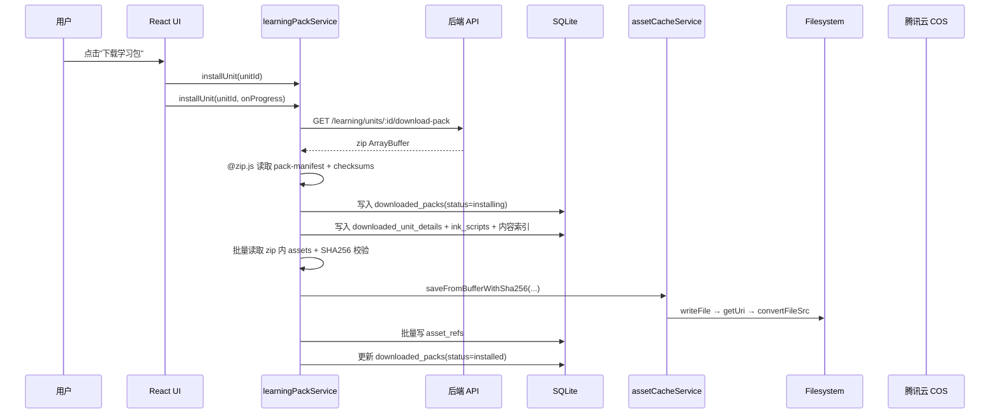

# 漫语町 学习包离线与今日任务系统

> 本文档合并原 `离线架构与学习包方案.md` 和 `学习计划与今日任务联动设计.md`。现在以一份文档记录学习包安装、离线资源、学习计划、今日任务和 zip 学习包架构。
> 最后更新：2026-07-05

---

# Part A：当前离线架构

> 适用平台：iOS / Android (Capacitor) + Web (PWA 降级)

---

## A.1 架构概览

离线能力由三个独立但协作的子系统组成：

| 子系统 | 用途 | 存储介质 | 关键模块 |
|--------|------|----------|----------|
| **LearningPack**（学习包） | 场景、词汇、句块、知识点练习、离线 manifest | Capacitor SQLite | `learning-pack.service.ts` |
| **AssetCache**（资源缓存） | 图片、角色资源、知识点练习音频等二进制资源 | Capacitor Filesystem | `asset-cache.service.ts` |
| **MobileBundle**（OTA 热更新） | Web App zip 增量更新 | COS → Capacitor 原生插件 | `mobile-updates.service.ts` |

> **重要区分**：MobileBundle 是 **App 更新**（代码级），LearningPack 是 **内容下载**（数据级）。

---

## A.2 设计评估

### 优点

**数据与资源分离（黄金法则）**：
```
结构化数据（JSON）  →  SQLite     ← 支持复杂查询、索引、关系
二进制资源（mp3/png）→  Filesystem ← 避免 SQLite 大 blob 性能问题
```

SQLite 存 blob 会导致读写放大、无法利用 OS 文件缓存、WKWebView 无法直接加载。

**SHA256 去重 + 完整性校验**：同一资源跨包共享只存一份，下载后校验防止传输损坏。

**iOS WKWebView 兼容**：必须使用 `Capacitor.convertFileSrc()` 转换为 `capacitor://localhost` scheme。

**引用计数卸载**：卸载包时检查其他包是否引用同一资源，防止误删共享文件。

**离线优先 + 同步出队**：离线安装学习包 → 写入 outbox → 联网时同步到服务端。

**状态机管理**：`missing → downloading → ready` / `failed → (可重试)`

### 可改进之处 ⚠️

| 问题 | 现状 | 方案 |
|------|------|------|
| 无字节级下载进度 | zip 下载仍是一次性 ArrayBuffer | 目前展示阶段进度：下载 zip、解析、读/校验资源、写入本地、收尾 |
| 后台中断不可见 | WebView 退后台可能暂停/被杀 | 任务标记 `paused` 并持久化，用户回前台可继续 |
| 无网络感知 | 不区分 WiFi/蜂窝 | 已在下载入口使用 `@capacitor/network` 守卫 |
| 版本管理粗糙 | `version = Date.now()` | → 语义化版本（见 Part B） |
| 无缓存驱逐 | 只显式卸载才删除 | → LRU 驱逐策略 |
| JSON 无校验 | 二进制有 SHA256，JSON 无 | → manifest 级别 contentHash |

---

## A.3 数据流详解

### 学习包安装流程



### 运行时资源加载

```
组件需要资源 → isNative? → 查 local_assets → ready? → stat 本地文件存在? → convertFileSrc
                                                       ↓ 文件丢失/未缓存
                       如果有 assetId → /file-assets/:id/private-url → download → 写入 Filesystem
                       如果只有旧 url → 尝试旧 url；失败则无法长期保证
```

知识点练习/今日任务音频的播放优先级：

1. Capacitor：优先播放学习包 zip 解出的本地 mp3。
2. 本地记录存在但文件丢失：删除坏缓存，使用 `audioAssetId` 换 private URL，重新下载缓存后播放。
3. Web：只要有 `audioAssetId`，播放前都请求 `/file-assets/:id/private-url`，避免旧 `audioUrl` 过期。
4. 播放失败会再次用 fresh private URL 兜底；正常情况仍然不绕过本地缓存。

### 练习数据同步流程

练习数据采用离线优先：

```mermaid
flowchart TD
  A[用户提交 warmup / 今日任务] --> B[写 React store<br/>即时反馈]
  B --> C[SQLite warmup_records<br/>完整 session]
  B --> D[SQLite warmup_record_entries<br/>题目级索引]
  B --> E[SQLite daily_practice_*<br/>排程、run、attempt]

  C --> F[sync_outbox]
  E --> F
  F --> G[offlineSyncService.flush]
  G --> H[/sync/push<br/>warmup_records]
  G --> I[/practice/daily-practice/complete<br/>daily run + attempts]

  H --> J[后端 PracticeWarmupRecord]
  I --> K[后端 UserDailyPracticeRun / Attempt / Progress]

  L[App 启动/手动同步] --> M[offlineSyncService.pull]
  M --> N[/sync/pull?cursor=...]
  N --> O[practiceWarmupRecords / dailyPracticeProgress]
  O --> C
  O --> D
  O --> E
```

同步规则：

- 本地先写，UI 不等待网络。
- `warmup_records` 通过统一 `/sync/push` 成为后端 `PracticeWarmupRecord`。
- 今日任务的 run、attempt、item progress 通过 `/practice/daily-practice/complete` 同步。
- pull 回来的远端 warmup 记录写入 `warmup_records` 后，同时更新 `warmup_record_entries`，保证最近答案和记录 drawer 不需要额外扫描。
- 同步成功只改变 `syncStatus` / `remoteId`，不应该改变题目“最近作答时间”，避免网络延迟导致旧答案看起来更新。

### 资源回收

```
卸载包 A → 遍历 assets → 检查其他包引用 → 无引用: Filesystem.deleteFile
                                        → 有引用: 保留文件
```

### 练习测试数据清理

存储管理 drawer 中的“清空练习测试数据”清理以下本地表：

```text
user_progress
practice_records
warmup_records
warmup_record_entries
daily_activity
daily_progress
daily_practice_items
daily_practice_runs
daily_practice_attempts
```

同时会清除 practice 相关 outbox 和 guided warmup localStorage key，并写入本地 reset marker。reset marker 用于隐藏清理时间之前从后端 pull 回来的旧练习记录，方便当前阶段从空数据重新测试；它不是后端删除操作。

---

## A.4 关键数据结构

### Manifest

```typescript
interface LearningPackManifest {
  packId: string; version: number; title: string; updatedAt: string
  contentHash?: string
  units: string[]; topics: string[]; vocabularies: string[]
  chunks: string[]; sentencePatterns: string[]; scriptEpisodes: string[]
  inkScripts: string[]; assets: AssetRef[]
}
```

### AssetRef

```typescript
interface AssetRef {
  assetId?: string; url: string; sha256?: string
  mimeType?: string; size?: number
  role?: 'background' | 'sprite' | 'voice' | 'bgm' | 'sfx' | 'thumbnail' | 'warmup_audio' | 'warmup_image'
}
```

### SQLite 表结构

| 表名 | 用途 | 关键字段 |
|------|------|----------|
| `downloaded_packs` | 已安装的学习包 | packId, manifest, status, installedAt |
| `downloaded_unit_details` | 场景/话题详细数据 | unitId, topicId, detail (JSON) |
| `ink_scripts` | Ink 叙事脚本缓存 | unitId, topicId, inkJson |
| `local_assets` | 资源文件缓存状态 | remoteUrl, localUri, status, sha256 |
| `offline_vocabularies` | 离线词汇 | id, word, data |
| `offline_chunks` | 离线句块 | id, text, data |
| `offline_patterns` | 离线句型 | id, pattern, data |
| `offline_content_refs` | 内容引用关系 | kind, contentId, packId |
| `asset_refs` | 资源引用计数 | sha256, packId, logicalPath |
| `warmup_records` | 今日任务/知识点热身整组作答明细 | topicId, items, syncStatus |
| `warmup_record_entries` | warmup 题目级索引表 | recordId, stepId, practicedDate, recordUpdatedAt |
| `daily_practice_items` | 知识点练习排期与掌握度 | itemId, packId, topicId, status, dueDate |
| `daily_practice_attempts` | 知识点练习 attempt | itemId, score, practicedAt, syncStatus |
| `daily_practice_runs` | 当日任务集合与完成状态 | date, scope, scheduledItemIds, completedItemIds |
| `outbox` | 离线操作出队 | entityType, operation, payload, status |

### Warmup 记录双表设计

`warmup_records` 和 `warmup_record_entries` 是一组配套表：

```text
warmup_records
  保存一次 session 的完整 JSON：topic、items、反馈、录音、同步状态

warmup_record_entries
  将 items 按题目拆开：recordId、stepId、practicedDate、recordUpdatedAt、record
  用于今日记录、最近答案、覆盖更新等高频查询
```

为什么不只保留 `warmup_records`：

- `warmup_records.items` 是 JSON 数组，按日期或 stepId 查询需要全表扫描并 hydrate 大对象。
- 移动端今日记录 drawer、题目恢复最近答案都是高频路径，必须走 SQLite 索引。
- 同步 payload 仍需要完整 session，所以不能只保留 entry 表。

关键索引：

```sql
CREATE INDEX idx_warmup_entries_record_id ON warmup_record_entries (record_id);
CREATE INDEX idx_warmup_entries_step_id ON warmup_record_entries (step_id);
CREATE INDEX idx_warmup_entries_practiced_date ON warmup_record_entries (practiced_date);
CREATE INDEX idx_warmup_entries_topic_id ON warmup_record_entries (topic_id);
```

当前 SQLite schema 版本：`DB_VERSION = 10`。

### 本地文件路径

```
Directory.Data/
└── offline-assets/
    ├── {sha256}.mp3    # 音频文件
    ├── {sha256}.png    # 图片文件
    └── {sha256}.webp   # 精灵图等
```

---

## A.5 当前学习包任务与进度实现

学习包下载、暂停、继续、卸载统一由 `learning.store.ts` 的 `downloadTasks` 管理，并由学习计划页的“学习包任务” drawer 展示。

### 任务状态

```typescript
interface DownloadTask {
  packId: string
  title: string
  kind?: 'download' | 'uninstall'
  progress: number
  step?: string
  stepLabel?: string
  currentItem?: string
  current?: number
  total?: number
  status: 'queued' | 'downloading' | 'extracting' | 'uninstalling' | 'paused' | 'done' | 'error'
  pausedFrom?: Exclude<DownloadTask['status'], 'paused'>
}
```

### 进度口径

当前不是字节级进度，而是阶段进度：

- 0-15：下载 zip
- 15-40：解析 manifest、内容 JSON、写索引
- 40-75：读取/校验 zip 内资源
- 75-95：写入本地 Filesystem / local_assets / asset_refs
- 99：收尾
- 100：真正安装完成

进度在 store 层只允许前进，不允许从 99 回退到 95。

### App 后台边界

- Capacitor `pause`：正在下载/卸载/排队的任务标记为 `paused`，并持久化到 localStorage。
- 回到前台：不会自动继续。用户可在学习计划卡片或任务 drawer 点击“继续下载/继续卸载”。
- 如果进程只是暂停，原异步任务可能自然完成；如果进程被杀，重新打开后任务以“上次任务已暂停”恢复展示，点击继续会重新执行当前包任务。
- 这不是原生后台下载器。若要后台长期下载，需要接原生 Background Transfer / Download Manager。

---

# Part B：学习计划与今日任务

## B.1 核心概念

| 概念 | 当前代码中的含义 | 主要来源 |
| --- | --- | --- |
| 学习单元 / 学习包 | 一个 `Scene`，包含 `TrainingTopic`、词汇、句块、句型、剧本入口等内容。 | 后端 `LearningService.getLearningUnits()` / `getLearningUnitDetail()` |
| 我的学习 / 学习计划 | 用户已经开始学习的 `Scene` 列表。后端以 `UserSceneProgress` 表示“已加入计划”。 | `/learning/my-units` |
| 今日任务 | 当天从某个已安装学习包的 `trainingTopics.metadata.outputTraining.pipeline` 中抽出的输出练习列表。 | 前端 `TodayTaskPage` |
| 学习包安装状态 | 客户端本地是否已安装 zip / manifest 内容。 | SQLite `downloaded_packs` |
| 学习包任务 | 下载、卸载、暂停、继续等长耗时操作。 | `learning.store.downloadTasks` + 学习计划页 drawer |
| 今日完成状态 | 当天已完成的题目、attempt 和 run 状态。 | SQLite `daily_practice_items` / `daily_practice_attempts` / `daily_practice_runs` |
| 今日练习记录 | 今日任务和知识点练习共用的 warmup 作答明细、最近答案、同步状态。 | SQLite `warmup_records` / `warmup_record_entries` |

当前产品关系：

```text
学习计划 = 用户选择的内容池
今日任务 = 从当前内容池里按天抽取的输出训练
```

这不是服务端每日调度系统。当前 `TodayTaskPage` 不调用 `/learning/today`，而是直接从离线学习包生成页面内容。

## B.2 后端链路

学习计划列表：

- `GET /learning/my-units`
- 控制器：`apps/backend/src/modules/learning/learning.controller.ts`
- 服务：`apps/backend/src/modules/learning/learning.service.ts`

后端查询当前用户的 `UserSceneProgress`，并带出关联 `Scene`、分类、`TrainingTopic` 和数量统计。数量统计口径：

- `vocabCount`：按 `TrainingTopic.topicVocabs.vocabId` 去重。
- `chunkCount`：按 `TrainingTopic.activeChunks.chunkId` 去重。
- `topicCount`：话题数量。

学习商店列表和我的学习列表使用同一套去重口径，避免同一个词汇/句块跨多个话题时被重复计数。

开始学习：

- `POST /learning/units/:id/start`
- 校验学习包访问权限。
- 最多允许同时学习 3 个未完成单元。
- 对 `UserSceneProgress` 做 upsert。
- 已经存在进度的学习包可以继续学习。

学习包相关接口：

- `GET /learning/units/:id`
- `GET /learning/units/:id/download-pack`
- `GET /learning/packs/check`
- `GET /learning/units/:id/download-delta`

今日任务需要的关键字段来自：

```text
UnitDetail.trainingTopics[].metadata.outputTraining.pipeline[]
```

后端仍有旧接口 `GET /learning/today` / `LearningService.getTodayTasks()`，但当前前端 `TodayTaskPage` 不调用它。它不能代表当前页面主链路，后续应明确废弃或改造，避免两套今日任务模型并存。

## B.3 前端学习计划链路

主要文件：

- `apps/frontend/src/features/learning/pages/learning-plan-page.tsx`
- `apps/frontend/src/features/learning/components/my-learning-view.tsx`
- `apps/frontend/src/stores/learning.store.ts`
- `apps/frontend/src/lib/offline/learning.repository.ts`
- `apps/frontend/src/lib/offline/learning-pack.service.ts`

页面加载：

1. `LearningPlanPage` 调用 `fetchMyLearning()` 和 `fetchDownloadedPacks()`。
2. `fetchMyLearning()` 先读 `learningRepository.getMyUnits()`。
3. `learningRepository.getMyUnits()` 优先返回本地 `my_learning_units`，本地没有时请求 `/learning/my-units`。
4. `MyLearningView` 根据 `downloaded_packs` 判断学习包是否已安装。
5. 未安装时，学习单元卡片显示下载动作，并阻止进入学习单元详情。

用户加入学习包：

1. `enrollUnit(unitId)` 调用 `learningRepository.enrollUnit()`。
2. repository 先把摘要写入本地 `my_learning_units`，并把 `my_unit:create` 放入 outbox。
3. 在线时调用 `/learning/units/:id/start`，成功后刷新 `/learning/my-units`。
4. store 将学习包加入下载任务。
5. 下载任务调用 `learningPackService.installUnit()`。
6. 安装完成后刷新 `downloaded_packs` 和 `myUnits`。

这保证学习计划页和今日任务页共享同一批本地学习包数据。

## B.4 学习包任务 UI

学习计划页顶部有固定的学习包任务按钮：

- 平时只显示下载 icon。
- 有下载/卸载/暂停任务时，右上角显示与首页同步状态一致的 `Loader2` 徽标。
- 点击打开“学习包任务” drawer。

任务 drawer 只展示未完成任务，下载和卸载共用同一套卡片样式：

- 下载：`queued → downloading → extracting → done/error`
- 卸载：`uninstalling → done/error`
- 退后台：`paused`

用户可以在 drawer 或学习计划卡片中点击“继续下载 / 继续卸载”。暂停态不会和“本地学习包已清除，需要重新下载”同时显示；卡片只保留一条统一的 amber 操作条。

下载进度采用阶段进度，不是字节级进度。资源阶段被拆分为读取/校验 zip 内资源、写入本地资源、收尾，且进度只允许前进。

## B.5 今日任务生成链路

主要文件：

- `apps/frontend/src/features/learning/pages/today-task-page.tsx`
- `apps/frontend/src/lib/offline/learning.repository.ts`
- `apps/frontend/src/lib/offline/practice.repository.ts`
- `apps/frontend/src/stores/warmup-session.store.ts`

选择学习包：

1. 如果 URL 有 `packId`，优先读取该学习包的本地详情。
2. 否则读取本地 `downloaded_packs` 和 `my_learning_units`。
3. 优先选择“我的学习中第一个已安装包”。
4. 如果没有匹配的我的学习包，则选择第一个已安装包。
5. 如果没有任何已安装包，显示空态，引导去学习计划选择学习包。

抽题来源：

```text
unit.trainingTopics[].metadata.outputTraining.pipeline[]
```

支持题型：

- `chunk_substitution`：句块替换 / 词汇替换
- `vocab_drill`：词汇输出
- `vocab_sentence_building`：一词多句
- `pattern_drill`：句型操练
- `sentence_decomposition`：句子拆解

今日任务传递题目时会保留 `audioUrl` 和 `audioAssetId`。句子拆解的音频在 `levels[]` 上逐级保存；替换练习、句型操练在 `items[]` 上保存；一词多句的源数据在 `patterns[].items[]` 上保存，渲染时会抽成单条 prompt 交给同一套练习卡片。

每日题量来自 `usePreferencesStore((s) => s.dailyGoal)`。生成策略是先按题型保证多样性，每种已有题型尽量取 1 道，再随机补足到 `dailyGoal`。

## B.6 今日进度、练习记录与音频

当前实现把今日任务拆成两类本地状态：

| 状态 | 本地表 | 作用 |
| --- | --- | --- |
| 今日任务进度 | `daily_practice_items` / `daily_practice_attempts` / `daily_practice_runs` | 记录每个知识点练习 item 的复习排期、attempt、当天 run 和完成状态。 |
| 每题作答明细 | `warmup_records` / `warmup_record_entries` | 记录用户答案、反馈、纠正、录音、分数和题目级最近答案。 |

今日任务和知识点练习都使用 `useCachedAudio()`：

1. Capacitor 原生端优先读取学习包 zip 解出的本地 mp3。
2. 本地 `local_assets` 记录存在但文件丢失时，会删除坏记录并通过 `audioAssetId` 换取 private URL 重新下载缓存。
3. Web 端只要有 `audioAssetId`，播放前都会请求 `/file-assets/:id/private-url`，不依赖可能过期的旧 `audioUrl`。
4. 播放失败时会再次用 fresh private URL 兜底。

因此内容作者应优先保存并传递 `audioAssetId`；`audioUrl` 只作为旧数据兼容字段。

## B.7 当前边界

1. 今日任务要求学习包已安装。本地没有 `downloaded_packs` 和 `downloaded_unit_details` 时，页面无法生成任务。
2. 学习计划允许最多 3 个未完成单元；今日任务默认只选其中一个包。
3. 同一天默认题目相对稳定；“换一批题目”只更换当前今日任务 run 的题目集合。
4. 今日任务完成后保存的是 warmup 记录，不直接混入 VN 对话练习口径。
5. “跨学习包复习”只在复习模式扩大候选范围；新学只引入从未练过的内容，并始终从当前学习包按话题顺序推进。
6. “话题内随机出题”只打乱当前话题同一训练阶段内的题目，不改变话题和训练阶段顺序。
7. 跨包复习保持逾期优先、到期其次，并在同一优先级内随机；生成后的当天任务仍通过 run 缓存保持稳定。
5. `PracticeWarmupRecord` 通过统一同步链路写入后端：本地 `warmup_records` → `sync_outbox` → `POST /sync/push`。

---

# Part C：学习包架构升级方案 v2

> 状态：已落地为当前 zip 模式，delta 仍作为扩展能力保留 | 日期：2026-07-05

---

## C.1 旧架构问题

| 问题 | 说明 |
|------|------|
| **无版本管理** | `version` 用 `Date.now()`，无法追踪内容变更 |
| **N+1 下载** | 每个资源单独 HTTP 请求，移动端易中断 |
| **无增量更新** | 任何变更都需重新下载全部资源 |
| **无后台管理** | 学习包只能前端动态拼装 |
| **无校验机制** | 下载资源无完整性校验 |
| **无压缩** | 散文件存储，占用空间大 |

---

## C.2 已落地目标

1. **学习包 = zip 文件**：场景内容 + 资源打包为一个 zip，一次性下载
2. **后台管理页面**：运营可创建、编辑、发布学习包
3. **COS 存储 + 版本管理**：zip 上传 COS，`FileAsset` 统一管理，语义化版本
4. **移动端任务化安装**：学习计划页统一展示下载、卸载、暂停和继续
5. **复用现有基础设施**：`FileAsset`（sha256）、`MobileBundle` 模式、Capacitor Filesystem

### V1 vs V2 范围

| 特性 | V1 | V2 |
|------|:--:|:--:|
| 全量 zip 下载 | ✅ | - |
| 版本检查 + 更新状态 | ✅ | - |
| 后台管理 CRUD | ✅ | - |
| manifest + SHA256 校验 | ✅ | - |
| 资产文件跨包去重 | ✅ | - |
| 本地内容索引表 | ✅ | - |
| 增量更新 (delta zip) | - | ✅ |
| 安装统计 | - | ✅ |

---

## C.3 数据模型：`LearningPackage`

```prisma
model LearningPackage {
  id            String        @id @default(cuid())
  sceneId       String
  scene         Scene         @relation(fields: [sceneId], references: [id])
  version       String        // 语义化版本 "1.0.0"
  title         String
  description   String?       @db.Text
  coverUrl      String?

  // 打包产物
  fileAssetId   String?
  fileAsset     FileAsset?     @relation(fields: [fileAssetId], references: [id])
  checksum      String?        // 全量 zip SHA256
  fileSize      Int?
  fileSizeHuman String?

  // manifest 快照（存 DB 用于增量 diff）
  manifestSnapshot Json?

  // 发布控制
  status        PackageStatus  @default(draft)  // draft | published | archived
  isMandatory   Boolean        @default(false)
  releaseNotes  String?        @db.Text
  minAppVersion String?

  // 统计
  downloadCount Int            @default(0)
  installCount  Int            @default(0)

  publishedAt   DateTime?
  createdAt     DateTime       @default(now())
  updatedAt     DateTime       @updatedAt

  @@unique([sceneId, version])
  @@map("learning_package")
}

enum PackageStatus { draft published archived }
```

> V1 固定：**1 Scene = 1 Pack**。多 Scene 包留到未来。

---

## C.4 学习包 zip 结构

```
learning-pack-{packId}-v{version}.zip
├── manifest.json          # 包元数据
├── checksums.json         # 逐文件 SHA256 清单
├── content/
│   ├── scene.json
│   ├── topics/{topicId}.json
│   ├── episodes/{episodeId}.json
│   ├── inks/{inkScriptKey}.json
│   └── indexes/           # 可选：派生索引（去重词汇/语块/句型清单）
└── assets/
    ├── backgrounds/
    ├── characters/{charId}/
    └── audio/warmup/
```

> zip 是**传输格式**。客户端解压后：资产文件按 SHA256 存入全局池，内容 JSON 写入 SQLite。

---

## C.5 后台管理

### API 路由

| 方法 | 路径 | 说明 |
|------|------|------|
| `GET` | `/admin/learning-packs` | 列表（分页、搜索、筛选） |
| `POST` | `/admin/learning-packs` | 创建 |
| `POST` | `/admin/learning-packs/:id/generate` | **触发打包**（异步生成 zip + manifest） |
| `POST` | `/admin/learning-packs/:id/publish` | 发布 |
| `POST` | `/admin/learning-packs/:id/archive` | 归档 |

### 打包生成流程

```
管理员点击「生成学习包」
  → 收集 Scene + Topics + Episodes 数据
  → 收集资源 URL（角色/背景/音频）
  → 生成 content/ JSON 文件
  → 下载资源到临时目录
  → 生成 manifest.json + checksums.json
  → 打包 zip + 计算 SHA256
  → 上传 COS + 关联 FileAsset
  → manifestSnapshot 存入 DB
```

---

## C.6 移动端同步与下载

### 客户端 API

| 方法 | 路径 | 说明 |
|------|------|------|
| `GET` | `/learning/units` | **学习商店列表**（保持不变） |
| `POST` | `/learning/packs/check` | 版本检查（V1 只返回 `updateType: "full"`） |
| `GET` | `/learning/units/:id/download-pack` | 下载全量包 → 302 COS 签名 URL |

### 下载与安装流程

```
① 触发检查（App 启动/resume 延迟执行）
② POST /check → 上报已安装包列表
③ 写入 availablePackUpdates，必要时 toast 提示
④ 用户在学习计划页主动触发下载/更新
⑤ 下载 zip → SHA256 校验 → 解压
⑥ 资产文件 → SHA256 校验 → 全局池（复用/移入）
⑦ 内容 JSON → 写入 SQLite（双轨：业务表 + 派生索引表）
⑧ 更新 downloaded_packs + 清理临时文件
```

### 版本检查逻辑

```jsonc
// Request
{ "installed": [{ "packId": "clx001abc", "version": "1.2.0", "manifestChecksum": "sha256:abc..." }] }

// Response (有更新)
{ "updates": [{ "packId": "clx001abc", "toVersion": "1.3.0", "updateType": "full", "downloadUrl": "...", "checksum": "..." }] }
```

---

## C.7 跨包去重设计（关键）

### 资产文件去重：SHA256 全局池 + 引用计数

```
本地文件系统：
  offline-assets/              ← 全局资产池（按 SHA256 命名）
  ├── a1b2c3.webp              ← 机场背景（被 packA + packB 引用）
  └── d4e5f6.mp3               ← 词汇音频（仅 packA 引用）

SQLite asset_refs 表：
  sha256 + packId + logicalPath → 引用计数（实时 COUNT）

卸载时：refCount 归零才删物理文件
```

### 内容数据去重：业务表 + 派生索引表

保持现有 topic/episode 自包含结构不变，同时写入派生索引：

- `offline_vocabularies` / `offline_chunks` / `offline_patterns` — 扁平内容记录
- `offline_content_refs` — 记录内容被哪些 pack/topic 引用

### 去重对存储的影响

| 场景 | 无去重 | 有去重 | 节省 |
|------|--------|--------|------|
| 3 个机场场景（大量共享资源） | ~150MB | ~70MB | 53% |
| 典型混合场景 | ~135MB | ~95MB | 30% |

---

## C.8 缓存清除与数据恢复

### 清除场景

| 场景 | 处理方式 |
|------|----------|
| **A. iOS 删除 App 重装** | 本地数据归零，按首次安装流程重新下载 |
| **B. App 内「清除离线数据」** | 按引用计数正确清理，共享资产不误删 |
| **C. 文件缺失/写入异常** | 加载时回退远程 URL + 后台静默修复 |

### 存储管理 UI

设置页展示：已下载学习包数、离线资源大小、按包管理删除。

---

## C.9 Capacitor 集成

| API | 用途 |
|-----|------|
| `@capacitor/filesystem` | 文件读写、目录管理 |
| `@capacitor/network` | 网络状态检测 |
| `@capacitor/preferences` | 版本检查时间戳等 |
| `@zip.js/zip.js` | **V1 解压库**（已安装 v2.8.26） |

> Capacitor Filesystem 没有内置 unzip API，已使用 `@zip.js/zip.js` 处理。

---

## C.10 环境变量新增

```bash
LEARNING_PACK_TMP_DIR=/tmp/learning-packs    # 服务端打包临时目录
LEARNING_PACK_DOWNLOAD_URL_EXPIRES=3600      # COS 签名 URL 有效期
LEARNING_PACK_BUILD_TIMEOUT_MS=300000        # 打包任务超时
```

---

## C.11 当前状态与后续规划

### 已落地

- `LearningPackage` 数据模型、后台 CRUD、生成、上传、发布流程。
- 全量 zip 下载、`@zip.js/zip.js` 解压、manifest/checksum 读取。
- 学习包内容写入 SQLite，warmup 音频等资产写入 Filesystem，并通过 `asset_refs` 做引用关系。
- 学习计划页下载/卸载任务 drawer、暂停、继续、退后台持久化。
- 知识点练习和今日任务优先播放本地音频，缺失时用 `audioAssetId` private URL 重新缓存。

### 后续规划

- DeltaPackage 表 + 发布时自动生成 delta zip
- 增量下载 + 合并 + 降级逻辑
- 安装统计

---

> **相关文档**：`前端移动端架构与优化.md` — 前端架构与性能优化；`学习包开发规范.md` — 内容生产规范
