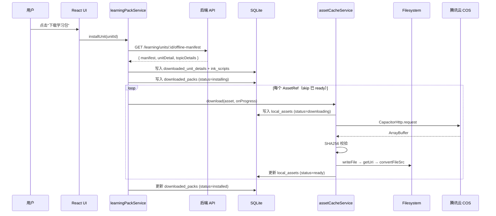

# 漫语町 离线架构与学习包方案

> 本文档分两大部分：**Part A** 描述当前离线架构现状与改进方案；**Part B** 描述学习包架构升级方案 v2（zip 模式替代 N+1 下载）。
> 最后更新：2026-06-14

---

# Part A：当前离线架构

> 适用平台：iOS / Android (Capacitor) + Web (PWA 降级)

---

## A.1 架构概览

离线能力由三个独立但协作的子系统组成：

| 子系统 | 用途 | 存储介质 | 关键模块 |
|--------|------|----------|----------|
| **LearningPack**（学习包） | 场景、词汇、句块等结构化学习内容 | Capacitor SQLite | `learning-pack.service.ts` |
| **AssetCache**（资源缓存） | 音频、图片等二进制资源 | Capacitor Filesystem | `asset-cache.service.ts` |
| **MobileBundle**（OTA 热更新） | Web App zip 增量更新 | COS → Capacitor 原生插件 | `mobile-updates.service.ts` |

> **重要区分**：MobileBundle 是 **App 更新**（代码级），LearningPack 是 **内容下载**（数据级）。

---

## A.2 设计评估

### 优点

**数据与资源分离（黄金法则）**：
```
结构化数据（JSON）  →  SQLite     ← 支持复杂查询、索引、关系
二进制资源（mp3/png）→  Filesystem ← 避免 SQLite 大 blob 性能问题
```

SQLite 存 blob 会导致读写放大、无法利用 OS 文件缓存、WKWebView 无法直接加载。

**SHA256 去重 + 完整性校验**：同一资源跨包共享只存一份，下载后校验防止传输损坏。

**iOS WKWebView 兼容**：必须使用 `Capacitor.convertFileSrc()` 转换为 `capacitor://localhost` scheme。

**引用计数卸载**：卸载包时检查其他包是否引用同一资源，防止误删共享文件。

**离线优先 + 同步出队**：离线安装学习包 → 写入 outbox → 联网时同步到服务端。

**状态机管理**：`missing → downloading → ready` / `failed → (可重试)`

### 可改进之处 ⚠️

| 问题 | 现状 | 方案 |
|------|------|------|
| 无下载进度 | `fetch()` 无进度回调 | → `CapacitorHttp` 原生 progress |
| 无断点续传 | 中途失败整个包标记 failed | → 检查 `local_assets` skip ready |
| 无网络感知 | 不区分 WiFi/蜂窝 | → `@capacitor/network` 守卫（**已安装**） |
| 版本管理粗糙 | `version = Date.now()` | → 语义化版本（见 Part B） |
| 无缓存驱逐 | 只显式卸载才删除 | → LRU 驱逐策略 |
| JSON 无校验 | 二进制有 SHA256，JSON 无 | → manifest 级别 contentHash |

---

## A.3 数据流详解

### 学习包安装流程



### 运行时资源加载

```
组件需要资源 → isNative? → 查 local_assets → ready? → convertFileSrc
                                    ↓ 未缓存
                              download → 写入 Filesystem
```

### 资源回收

```
卸载包 A → 遍历 assets → 检查其他包引用 → 无引用: Filesystem.deleteFile
                                        → 有引用: 保留文件
```

---

## A.4 关键数据结构

### Manifest

```typescript
interface LearningPackManifest {
  packId: string; version: number; title: string; updatedAt: string
  contentHash?: string
  units: string[]; topics: string[]; vocabularies: string[]
  chunks: string[]; sentencePatterns: string[]; scriptEpisodes: string[]
  inkScripts: string[]; assets: AssetRef[]
}
```

### AssetRef

```typescript
interface AssetRef {
  assetId?: string; url: string; sha256?: string
  mimeType?: string; size?: number
  role?: 'background' | 'sprite' | 'voice' | 'bgm' | 'sfx' | 'thumbnail'
}
```

### SQLite 表结构

| 表名 | 用途 | 关键字段 |
|------|------|----------|
| `downloaded_packs` | 已安装的学习包 | packId, manifest, status, installedAt |
| `downloaded_unit_details` | 场景/话题详细数据 | unitId, topicId, detail (JSON) |
| `ink_scripts` | Ink 叙事脚本缓存 | unitId, topicId, inkJson |
| `local_assets` | 资源文件缓存状态 | remoteUrl, localUri, status, sha256 |
| `offline_vocabularies` | 离线词汇 | id, word, data |
| `offline_chunks` | 离线句块 | id, text, data |
| `offline_patterns` | 离线句型 | id, pattern, data |
| `offline_content_refs` | 内容引用关系 | kind, contentId, packId |
| `asset_refs` | 资源引用计数 | sha256, packId, logicalPath |
| `warmup_records` | 今日任务/知识点热身作答明细 | topicId, items, syncStatus |
| `daily_practice_items` | 知识点练习排期与掌握度 | itemId, packId, topicId, status, dueDate |
| `daily_practice_attempts` | 知识点练习 attempt | itemId, score, practicedAt, syncStatus |
| `daily_practice_runs` | 当日任务集合与完成状态 | date, scope, scheduledItemIds, completedItemIds |
| `outbox` | 离线操作出队 | entityType, operation, payload, status |

### 本地文件路径

```
Directory.Data/
└── offline-assets/
    ├── {sha256}.mp3    # 音频文件
    ├── {sha256}.png    # 图片文件
    └── {sha256}.webp   # 精灵图等
```

---

## A.5 P0/P1 改进实施方案

### 核心变更：`fetch()` → `CapacitorHttp`

```typescript
import { CapacitorHttp } from '@capacitor/core'

const options: HttpOptions = {
  url, method: 'GET', responseType: 'arraybuffer',
  progress: (e) => onProgress(e.loaded, e.total),
}
const response = await CapacitorHttp.request(options)
const buffer = response.data as ArrayBuffer  // 直接就是 ArrayBuffer
```

### 断点续传

`install()` 开头检查 `local_assets`，跳过 `status='ready'` 的资产；新增 `retryFailedPack()`。

### 网络感知

`downloadUnitPack()` 入口用 `Network.getStatus()` 检查连接类型，蜂窝网络弹确认。

### 改动文件清单

```
asset-cache.service.ts     ← fetch→CapacitorHttp + progress (~60行)
learning-pack.service.ts   ← skip ready + 进度聚合 + retry (~50行)
learning.store.ts          ← 网络守卫 + progress透传 (~40行)
UI 层                      ← 进度条 + 下载状态 (~50行)
package.json               ← 新增 @capacitor/network
```

---

# Part B：学习包架构升级方案 v2

> 状态：设计阶段 | 日期：2026-06-11

---

## B.1 当前架构问题

| 问题 | 说明 |
|------|------|
| **无版本管理** | `version` 用 `Date.now()`，无法追踪内容变更 |
| **N+1 下载** | 每个资源单独 HTTP 请求，移动端易中断 |
| **无增量更新** | 任何变更都需重新下载全部资源 |
| **无后台管理** | 学习包只能前端动态拼装 |
| **无校验机制** | 下载资源无完整性校验 |
| **无压缩** | 散文件存储，占用空间大 |

---

## B.2 升级目标

1. **学习包 = zip 文件**：场景内容 + 资源打包为一个 zip，一次性下载
2. **后台管理页面**：运营可创建、编辑、发布学习包
3. **COS 存储 + 版本管理**：zip 上传 COS，`FileAsset` 统一管理，语义化版本
4. **移动端智能同步**：启动/恢复时检查版本；WiFi 静默更新，蜂窝仅更新 UI 状态
5. **复用现有基础设施**：`FileAsset`（sha256）、`MobileBundle` 模式、Capacitor Filesystem

### V1 vs V2 范围

| 特性 | V1 | V2 |
|------|:--:|:--:|
| 全量 zip 下载 | ✅ | - |
| 版本检查 + 自动同步 | ✅ | - |
| 后台管理 CRUD | ✅ | - |
| manifest + SHA256 校验 | ✅ | - |
| 资产文件跨包去重 | ✅ | - |
| 本地内容索引表 | ✅ | - |
| 增量更新 (delta zip) | - | ✅ |
| 安装统计 | - | ✅ |

---

## B.3 数据模型：`LearningPackage`

```prisma
model LearningPackage {
  id            String        @id @default(cuid())
  sceneId       String
  scene         Scene         @relation(fields: [sceneId], references: [id])
  version       String        // 语义化版本 "1.0.0"
  title         String
  description   String?       @db.Text
  coverUrl      String?

  // 打包产物
  fileAssetId   String?
  fileAsset     FileAsset?     @relation(fields: [fileAssetId], references: [id])
  checksum      String?        // 全量 zip SHA256
  fileSize      Int?
  fileSizeHuman String?

  // manifest 快照（存 DB 用于增量 diff）
  manifestSnapshot Json?

  // 发布控制
  status        PackageStatus  @default(draft)  // draft | published | archived
  isMandatory   Boolean        @default(false)
  releaseNotes  String?        @db.Text
  minAppVersion String?

  // 统计
  downloadCount Int            @default(0)
  installCount  Int            @default(0)

  publishedAt   DateTime?
  createdAt     DateTime       @default(now())
  updatedAt     DateTime       @updatedAt

  @@unique([sceneId, version])
  @@map("learning_package")
}

enum PackageStatus { draft published archived }
```

> V1 固定：**1 Scene = 1 Pack**。多 Scene 包留到未来。

---

## B.4 学习包 zip 结构

```
learning-pack-{packId}-v{version}.zip
├── manifest.json          # 包元数据
├── checksums.json         # 逐文件 SHA256 清单
├── content/
│   ├── scene.json
│   ├── topics/{topicId}.json
│   ├── episodes/{episodeId}.json
│   ├── inks/{inkScriptKey}.json
│   └── indexes/           # 可选：派生索引（去重词汇/语块/句型清单）
└── assets/
    ├── backgrounds/
    ├── characters/{charId}/
    └── audio/vocab/
```

> zip 是**传输格式**。客户端解压后：资产文件按 SHA256 存入全局池，内容 JSON 写入 SQLite。

---

## B.5 后台管理

### API 路由

| 方法 | 路径 | 说明 |
|------|------|------|
| `GET` | `/admin/learning-packs` | 列表（分页、搜索、筛选） |
| `POST` | `/admin/learning-packs` | 创建 |
| `POST` | `/admin/learning-packs/:id/generate` | **触发打包**（异步生成 zip + manifest） |
| `POST` | `/admin/learning-packs/:id/publish` | 发布 |
| `POST` | `/admin/learning-packs/:id/archive` | 归档 |

### 打包生成流程

```
管理员点击「生成学习包」
  → 收集 Scene + Topics + Episodes 数据
  → 收集资源 URL（角色/背景/音频）
  → 生成 content/ JSON 文件
  → 下载资源到临时目录
  → 生成 manifest.json + checksums.json
  → 打包 zip + 计算 SHA256
  → 上传 COS + 关联 FileAsset
  → manifestSnapshot 存入 DB
```

---

## B.6 移动端同步与下载

### 客户端 API

| 方法 | 路径 | 说明 |
|------|------|------|
| `GET` | `/learning/units` | **学习商店列表**（保持不变） |
| `POST` | `/learning/packs/check` | 版本检查（V1 只返回 `updateType: "full"`） |
| `GET` | `/learning/units/:id/download-pack` | 下载全量包 → 302 COS 签名 URL |

### 下载与安装流程

```
① 触发检查（App 启动/resume）
② POST /check → 上报已安装包列表
③ 网络判断：
   WiFi → 静默下载更新
   蜂窝 → 仅更新 UI 状态，由用户主动触发
④ 下载 zip → SHA256 校验 → 解压
⑤ 资产文件 → SHA256 校验 → 全局池（复用/移入）
⑥ 内容 JSON → 写入 SQLite（双轨：业务表 + 派生索引表）
⑦ 更新 downloaded_packs + 清理临时文件
```

### 版本检查逻辑

```jsonc
// Request
{ "installed": [{ "packId": "clx001abc", "version": "1.2.0", "manifestChecksum": "sha256:abc..." }] }

// Response (有更新)
{ "updates": [{ "packId": "clx001abc", "toVersion": "1.3.0", "updateType": "full", "downloadUrl": "...", "checksum": "..." }] }
```

---

## B.7 跨包去重设计（关键）

### 资产文件去重：SHA256 全局池 + 引用计数

```
本地文件系统：
  offline-assets/              ← 全局资产池（按 SHA256 命名）
  ├── a1b2c3.webp              ← 机场背景（被 packA + packB 引用）
  └── d4e5f6.mp3               ← 词汇音频（仅 packA 引用）

SQLite asset_refs 表：
  sha256 + packId + logicalPath → 引用计数（实时 COUNT）

卸载时：refCount 归零才删物理文件
```

### 内容数据去重：业务表 + 派生索引表

保持现有 topic/episode 自包含结构不变，同时写入派生索引：

- `offline_vocabularies` / `offline_chunks` / `offline_patterns` — 扁平内容记录
- `offline_content_refs` — 记录内容被哪些 pack/topic 引用

### 去重对存储的影响

| 场景 | 无去重 | 有去重 | 节省 |
|------|--------|--------|------|
| 3 个机场场景（大量共享资源） | ~150MB | ~70MB | 53% |
| 典型混合场景 | ~135MB | ~95MB | 30% |

---

## B.8 缓存清除与数据恢复

### 清除场景

| 场景 | 处理方式 |
|------|----------|
| **A. iOS 删除 App 重装** | 本地数据归零，按首次安装流程重新下载 |
| **B. App 内「清除离线数据」** | 按引用计数正确清理，共享资产不误删 |
| **C. 文件缺失/写入异常** | 加载时回退远程 URL + 后台静默修复 |

### 存储管理 UI

设置页展示：已下载学习包数、离线资源大小、按包管理删除。

---

## B.9 Capacitor 集成

| API | 用途 |
|-----|------|
| `@capacitor/filesystem` | 文件读写、目录管理 |
| `@capacitor/network` | 网络状态检测 |
| `@capacitor/preferences` | 版本检查时间戳等 |
| `@zip.js/zip.js` | **V1 解压库**（已安装 v2.8.26） |

> Capacitor Filesystem 没有内置 unzip API，已使用 `@zip.js/zip.js` 处理。

---

## B.10 环境变量新增

```bash
LEARNING_PACK_TMP_DIR=/tmp/learning-packs    # 服务端打包临时目录
LEARNING_PACK_DOWNLOAD_URL_EXPIRES=3600      # COS 签名 URL 有效期
LEARNING_PACK_BUILD_TIMEOUT_MS=300000        # 打包任务超时
```

---

## B.11 实施路线图

### Phase 1：后端数据模型 + 管理 CRUD（2-3 天）
- Prisma 新增 `LearningPackage` 模型
- `FileAssetGroup` 新增 `learning_pack` 枚举
- 后台 CRUD API + 管理页面

### Phase 2：打包生成 + 上传 COS（3-4 天）
- 服务端 zip 生成引擎
- manifestSnapshot 存入 DB
- 上传 COS + FileAsset 关联

### Phase 3：客户端下载 + 资产去重（3-4 天）
- 版本检查 API（`/check`，V1 仅全量）
- zip 下载（fetch + Filesystem + 进度条）
- SHA256 校验 + `@zip.js/zip.js` 解压
- 资产去重 + 内容双轨写入
- 卸载（引用计数保护）

### Phase 4：移动端集成（2-3 天）
- 网络判断 + WiFi 静默更新
- 存储管理页 UI
- 同步状态 Store

### Phase 5：测试与打磨（1-2 天）

**V1 预估总工时：11-16 天**

### V2 规划（增量更新，4-6 天）
- DeltaPackage 表 + 发布时自动生成 delta zip
- 增量下载 + 合并 + 降级逻辑
- 安装统计

---

> **相关文档**：`前端移动端架构与优化.md` — 前端架构与性能优化
