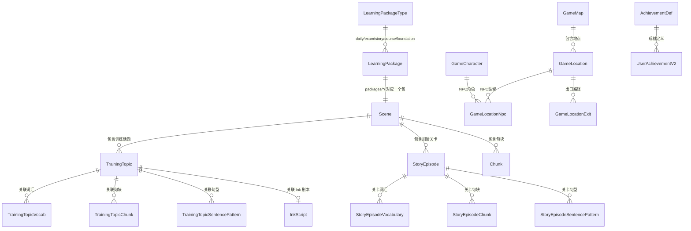

# 种子数据 CSV 文件参考文档

> **最后更新：2026-06-18** | 当前 seed 数据已按 `LearningPackageType` 重构为 **包结构**。
>
> **目录位置**：`apps/backend/prisma/data/`
> - `init/` — 初始化数据（场景分类、地图、NPC、成就等全局数据）
> - `packages/` — 按类型分组的独立学习包（每个包视为一个 Scene）
>   - `daily-*` / `exam-*` / `course-*` / `story-*` / `foundation-*`
>
> 由 `seed-init.ts`（全局数据）和 `seed-learning-packages.ts`（学习包）分别导入。

---

## 目录结构

```
prisma/data/
├── init/                              # 全局初始化数据
│   ├── scene_categories.csv           # 场景分类（6 类）
│   ├── game_maps.csv                  # 探索地图
│   ├── game_locations.csv             # 地图地点
│   ├── location_npcs.csv              # 地点↔NPC 关联
│   ├── location_exits.csv             # 地点出口路径
│   ├── game_characters.csv            # NPC 角色
│   ├── achievement_defs.csv           # 成就定义
│   └── general_chunks.csv             # 通用句块（跨包共享）
│
└── packages/                          # 按包类型组织的学习内容
    ├── daily-study-abroad/            # 🌍 落地生根（日常练习）
    ├── daily-campus/                  # 🏠 日常闯关
    ├── daily-social/                  # 💬 人来人往
    ├── daily-workplace/               # 💼 学业职场
    ├── daily-healthcare/              # 🏥 搞定麻烦
    ├── daily-travel/                  # 🎭 出门玩乐
    ├── exam-ielts-6/ ...              # 雅思口语各分段
    ├── exam-cet-4/ exam-cet-6/        # 四六级
    ├── exam-academic/ exam-toefl/     # 学术/托福
    ├── course-tenses/ ...             # 语法课程系列
    ├── story-tech/ ...                # 故事剧情系列
    └── foundation-beginner/ ...       # 零基础系列
```

---

## 数据关系总览



---

## 一、初始化数据（`init/`）

以下 CSV 文件位于 `prisma/data/init/`，由 `seed-init.ts` 导入。

### 1. `scene_categories.csv` — 场景分类

| 列 | 说明 |
|---|---|
| `name` | 分类名称 |
| `icon` | Lucide 图标名 |
| `sort_order` | 排序序号 |

**对应 Prisma 模型：** `SceneCategory`

**用途：** 全局场景分类。当前与 `内容架构设计.md` §3 对齐，共 6 个分类（已从旧版 8 个合并）：

| 分类 | 图标 | 说明 |
|---|---|---|
| 落地生根 | `map-pin` | 初到英语环境，搞定落脚和手续 |
| 日常闯关 | `home` | 吃住行购，把日子过明白 |
| 人来人往 | `users` | 交朋友、处关系、应对社交场合 |
| 学业职场 | `briefcase` | 课堂、面试、开会、写邮件 |
| 搞定麻烦 | `shield-alert` | 看病、紧急情况、投诉维权 |
| 出门玩乐 | `compass` | 旅行、美食、演出、运动 |

---

### 2. `game_maps.csv` — 探索地图

| 列 | 说明 |
|---|---|
| `name` | 地图标识 |
| `display_name` | 显示名称 |
| `required_output_level` | 解锁需要输出等级 |
| `is_preview` | 是否预览 |
| `sort_order` | 排序 |

**对应 Prisma 模型：** `GameMap`

**用途：** 探索模式的地图定义。目前仅有 `campus`（大学校园）一张地图。

---

### 3. `game_locations.csv` — 地图地点

| 列 | 说明 |
|---|---|
| `map_name` | 所属地图 |
| `name` | 地点标识 |
| `display_name` | 显示名称（含 emoji） |
| `description` | 地点描述 |
| `pos_x` / `pos_y` | 地图上的坐标（百分比） |
| `location_type` | 类型（目前全部为 `vn_scene`） |
| `is_preview` | 是否预览 |
| `required_output_level` | 解锁要求 |
| `background_url` | 背景图 URL |

**对应 Prisma 模型：** `GameLocation`

**用途：** 地图上的具体地点。目前 5 个地点：宿舍大厅、校园咖啡店、图书馆、校医室、银行。

---

### 4. `game_characters.csv` — NPC 角色

| 列 | 说明 |
|---|---|
| `name` | 角色标识（如 `alex`、`sarah_front_desk`） |
| `display_name` | 显示名称（如 `Alex`、`Sarah`） |
| `role` | 角色描述 |
| `personality` | 性格描述 |
| `default_position` | 默认位置（left/right/center） |
| `avatar_url` | 头像 URL |
| `sprite_base_url` | 精灵图基础 URL |

**对应 Prisma 模型：** `GameCharacter`

**用途：** 探索模式中的 NPC 角色。目前 6 个角色，包括室友 Alex、前台 Sarah、咖啡师 Tom、校医 Dr. Emily 等。

---

### 5. `location_npcs.csv` — 地点 NPC 关联

| 列 | 说明 |
|---|---|
| `location_name` | 地点名称 |
| `character_name` | NPC 标识 |
| `default_greeting` | 默认问候语 |
| `sort_order` | 排序 |

**对应 Prisma 模型：** `GameLocationNpc`

---

### 6. `location_exits.csv` — 地点出口（路径）

| 列 | 说明 |
|---|---|
| `from_location` | 起点地点 |
| `to_location` | 终点地点 |
| `label` | 路径标签（如 `去校园咖啡店 →`） |

**对应 Prisma 模型：** `GameLocationExit`

---

### 7. `achievement_defs.csv` — 成就定义

| 列 | 说明 |
|---|---|
| `key` | 成就唯一标识 |
| `title` | 成就名称（如 `初次开口`） |
| `description` | 成就描述 |
| `category` | 分类（first_time/milestone/streak/mastery/challenge/hidden） |
| `rarity` | 稀有度（common/rare/epic） |
| `sort_order` | 排序 |
| `is_hidden` | 是否隐藏 |
| `hint_text` | 隐藏成就的提示 |
| `condition_json` | 解锁条件 JSON |
| `reward_xp` | 奖励经验值 |

**对应 Prisma 模型：** `AchievementDef`

---

### 8. `general_chunks.csv` — 通用句块

| 列 | 说明 |
|---|---|
| `text` | 英文表达（如 `"Nice to meet you."`） |
| `meaning` | 中文释义 |
| `difficulty` | 难度等级 |
| `category` | 分类（如 `greeting`、`politeness`） |

**对应 Prisma 模型：** `Chunk`

**用途：** 跨学习包通用的高频句块。每个学习包还可以有自己的 `chunks.csv` 提供场景专属句块。

---

## 二、学习包数据（`packages/`）

每个包目录对应一个独立 Scene，包含以下文件（由 `seed-learning-packages.ts` 批量导入）：

### 通用文件清单

| 文件 | 对应模型 | 说明 |
|------|---------|------|
| `scenes.csv` | `Scene` | 场景定义 |
| `scene_vocabulary.csv` | `SceneVocabulary` → `Vocabulary` | 场景词汇表 |
| `chunks.csv` | `Chunk` | 场景表达块 |
| `training_topics.csv` | `TrainingTopic` | 训练话题 |
| `sentence_patterns.csv` | `SentencePattern` | 句型 |
| `script_episodes.csv` | `StoryEpisode` | 剧情关卡 |
| `episode_chunks.csv` | `StoryEpisodeChunk` | 关卡↔句块关联 |
| `ink-scripts/*.ink` | `InkScript` | Ink 对话剧本 |

---

### 2.1 `scenes.csv` — 场景定义

| 列 | 说明 |
|---|---|
| `category_name` | 所属分类（对应 `scene_categories.name`） |
| `title` | 场景标题（如 `宿舍入住`、`机场入境`） |
| `location` | 场景地点描述 |
| `required_output_level` | 推荐英语输出等级（L1/L2/L3） |
| `description` | 场景描述 |

**对应 Prisma 模型：** `Scene`

**注意：** `packageType` 由包目录名自动推断（`daily-*` → `daily`，`exam-*` → `exam`，依此类推）。

---

### 2.2 `scene_vocabulary.csv` — 场景词汇表

| 列 | 说明 |
|---|---|
| `scene_title` | 所属场景标题 |
| `word` | 英文单词/短语 |
| `meaning` | 中文释义 |
| `part_of_speech` | 词性（noun/verb/phrase 等） |
| `phonetic_us` | 美式音标 |
| `phonetic_uk` | 英式音标 |
| `difficulty` | 难度等级（L1/L2/L3） |
| `description` | 词汇说明 |
| `examples_json` | 例句 JSON 数组 `[{en, zh, level}]` |
| `sort_order` | 排序序号 |

**对应 Prisma 模型：** `SceneVocabulary`（导入后映射到 `Vocabulary` 表）

**用途：** seed 脚本通过 `dictionaryapi.dev` 自动补全音标和发音音频（需开启 `ENABLE_DICT_ENRICHMENT`）。

---

### 2.3 `chunks.csv` — 表达块（Chunk）

| 列 | 说明 |
|---|---|
| `scene_title` | 所属场景标题 |
| `category` | 表达块分类（同场景标题，用于分组） |
| `text` | 英文表达（如 `"I'm here to check in."`） |
| `meaning` | 中文释义 |
| `difficulty` | 难度等级 |
| `description` | 说明 |
| `examples_json` | 例句 JSON `[{en, zh, level}]` |
| `applicable_scenes_json` | 适用场景列表（可选，缺省则仅所属场景） |

**对应 Prisma 模型：** `Chunk`

**用途：** 核心教学内容——场景下的"表达块"。seed 同时自动建立 Chunk ↔ TrainingTopic 的多对多关联。

---

### 2.4 `training_topics.csv` — 训练话题

| 列 | 说明 |
|---|---|
| `scene_title` | 所属场景 |
| `type` | 类型（`daily` / `ielts`，对应 `TrainingTopicType` 枚举） |
| `title` | 话题标题（如 `办理入住`、`点咖啡`） |
| `prompt_en` | 英文提示 |
| `prompt_zh` | 中文提示 |
| `duration_sec` | 建议时长（秒） |
| `difficulty` | 难度 |
| `skeleton` | 句子骨架（填空模板） |
| `description` | 描述 |
| `knowledge_points` | 知识点说明 |
| `ink_script_key` | 关联的 Ink 对话脚本 key（可选） |

**对应 Prisma 模型：** `TrainingTopic`

**注意：** 新增了 `type` 列（`daily` / `ielts`），用于区分普通话题和考试话题。`metadata` 字段可在 seed 逻辑中写入 `outputTraining` 配置。

---

### 2.5 `script_episodes.csv` — 剧情关卡（StoryEpisode）

| 列 | 说明 |
|---|---|
| `chapter_id` | 所属章节 ID（如 `chapter_0`、`chapter_1`） |
| `chapter_title` | 章节标题 |
| `episode_order` | 关卡序号 |
| `title` | 关卡标题 |
| `scene_title` | 关联场景 |
| `required_output_level` | 要求输出等级 |
| `required_user_level` | 要求用户等级 |
| `vocab_required_count` | 需要掌握词汇数 |
| `vocab_total_count` | 词汇总数 |
| `chunk_required_count` | 需要掌握 Chunk 数 |
| `chunk_total_count` | Chunk 总数 |
| `objectives_json` | 关卡目标列表 |
| `pass_objective_count` | 通关需要完成目标数 |
| `pass_chunk_count` | 通关需使用 Chunk 数 |
| `pass_min_dialogues` | 最少对话轮次 |
| `npc_name` | NPC 名称 |
| `npc_role` | NPC 角色描述 |
| `is_preview` | 是否预览关卡（true=免费可见） |
| `ink_script_key` | Ink 对话脚本 key |
| `rewards_json` | 奖励配置 JSON |

**对应 Prisma 模型：** `StoryEpisode`（物理表 `script_episode`）

**用途：** 定义"故事模式"的关卡结构。按 Chapter 组织，`is_preview=true` 的关卡免费用户可见。

---

### 2.6 `episode_chunks.csv` — 关卡↔Chunk 关联

| 列 | 说明 |
|---|---|
| `episode_chapter` | 章节 ID |
| `episode_order` | 关卡序号 |
| `chunk_text_match` | 用于匹配 Chunk 的文本片段 |
| `sort_order` | 排序 |

**对应 Prisma 模型：** `StoryEpisodeChunk`（物理表 `script_episode_chunk`）

---

### 2.7 `sentence_patterns.csv` — 句型

| 列 | 说明 |
|---|---|
| `pattern` | 句型模板（如 `I'd like to [verb]...`） |
| `meaning` | 中文含义 |
| `category` | 分类 |
| `difficulty` | 难度 |
| `slots_json` | 槽位定义 JSON |
| `examples_json` | 例句 JSON |

**对应 Prisma 模型：** `SentencePattern`

---

### 2.8 `ink-scripts/` — Ink 对话剧本

每个包目录下可包含 `ink-scripts/` 子目录，存放 Ink 格式（`.ink` 或 `.json`）的对话剧本文件。

**对应 Prisma 模型：** `InkScript`

通过 `ink_script_key` 与 `training_topics.csv` 和 `script_episodes.csv` 中的 `ink_script_key` 列关联。

---

## 三、整体数据流

```
init/
├── scene_categories.csv  ──→ SceneCategory（全局分类）
├── game_maps.csv         ──→ GameMap
├── game_locations.csv    ──→ GameLocation
├── game_characters.csv   ──→ GameCharacter
├── location_npcs.csv     ──→ GameLocationNpc
├── location_exits.csv    ──→ GameLocationExit
├── achievement_defs.csv  ──→ AchievementDef
└── general_chunks.csv    ──→ Chunk（通用句块）

packages/{type}-{name}/
├── scenes.csv              ──→ Scene（自动关联 packageType）
├── scene_vocabulary.csv    ──→ SceneVocabulary → Vocabulary
├── chunks.csv              ──→ Chunk（场景专属句块）
├── training_topics.csv     ──→ TrainingTopic（含 type 列）
├── sentence_patterns.csv   ──→ SentencePattern
├── script_episodes.csv     ──→ StoryEpisode（剧情关卡）
├── episode_chunks.csv      ──→ StoryEpisodeChunk
└── ink-scripts/*.ink       ──→ InkScript
```
