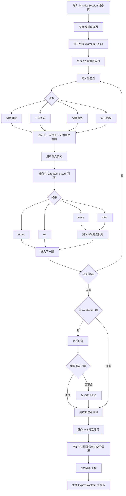
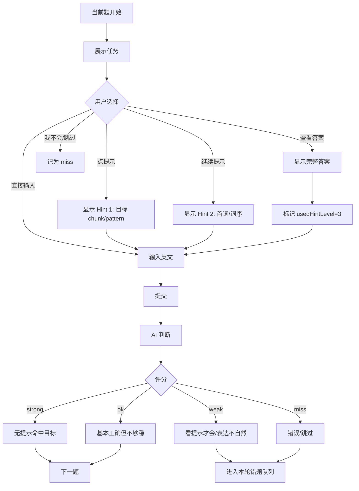

# 移动端知识点练习交互与复练方案

> 定位：补充《输出练习链路设计方案》和《知识点练习（Warmup Pipeline）题型说明》。  
> 关注点：移动端 knowledge warmup dialog 中，句块替换、一词多句、句子拆解、句型操练这四类单句输出练习，如何从“小练一下”升级成“高频、可复练、能脱口而出”的训练系统。

---

## 1. 结论先说

你现在的担心是对的：**题型已经有了，但训练强度和复练闭环还不够。**

当前设计更像“做几道题验证会不会”，适合 MVP；但如果目标是让用户把单词、句块、句型练到能在 VN 对话里自然用出来，需要把 warmup 从“题目列表”改成“移动端短回合训练器”。

**V1 边界**：第一版先不做听力训练、跟读、语音识别和发音反馈。现有 TTS 可以只作为参考音频/播放答案，不作为通关条件。V1 的核心是文字输入、中文意图转英文、句块替换、句型操练和复练闭环。听力/口语输入放到 V2。

```
看懂 → 提示输出 → 无提示输出 → 混合召回 → VN 使用 → 隔天复练
```

四个题型不应该只是并列卡片，而应该共同服务三件事：

1. **把单词放进句子里**：不是背 `check in`，而是能输出 `I'd like to check in.`
2. **把句块练到熟**：同一个 chunk 在 6-12 个变体里反复出现，形成快速检索能力。
3. **把练习沉淀到复习**：答错、慢、跳过、VN 中没用出来，都进入 ExpressionItem / warmup review。

---

## 2. 参考产品给我们的启发

这里不是照抄某个 app，而是抽象它们的训练机制。

| 产品 | 可借鉴点 | 对我们的启发 |
|------|----------|--------------|
| Duolingo | 短回合、频繁切题型，翻译/填空/选择等任务快速切换 | warmup 不要做成长表单；每步 15-30 秒，快速反馈，连续推进 |
| Glossika | 以句子为核心，依靠大量重复和间隔复习建立自动化输出 | 核心单位应该是“可复用句子/句块”，不是孤立单词 |
| Anki / FSRS | 错题、遗忘风险、短学习步和复习调度 | warmup 结束不是结束，必须生成次日复练队列 |

参考链接：

- Duolingo Blog：https://blog.duolingo.com/covering-all-the-bases-duolingos-approach-to-speaking-skills/
- Glossika：https://ai.glossika.com/
- Anki Deck Options：https://docs.ankiweb.net/deck-options.html

---

## 3. 现有问题

### 3.1 题型存在，但剂量不够

目前 `GuidedWarmupPhase` 已支持：

- `chunk_substitution`
- `vocab_sentence_building`
- `sentence_decomposition`
- `pattern_drill`

但单个 step 往往是“一题一过”，用户容易看答案、输入一次、通过，然后进入 VN。这个强度不足以形成“脱口而出”。

### 3.2 反馈更像判题，不像训练

现在的卡片主要是：

```
中文提示 → 输入英文 → AI 判断 → 通过/再试
```

它缺少更细的训练阶梯：

```
看例句 → 半遮挡 → 中文提示输出 → 换词输出 → 无提示召回
```

### 3.3 复习闭环不完整

用户在 warmup 中：

- 答错了
- 看了答案才会
- 跳过了
- 在 VN 中没有用到目标词/句块

这些都应该变成“待复练资产”。否则 warmup 只是在当前 session 里消失，无法形成长期熟练度。

### 3.4 中英互译应该保留，但权重不同

中英互译很重要，但它不是一个独立目标，而是输出链路的一部分：

| 方向 | 价值 | 权重 |
|------|------|------|
| 英→中 | 确认理解、降低焦虑、建立语义映射 | 辅助 |
| 中→英 | 真正训练输出、检索和组句能力 | 核心 |
| 场景→英 | 最接近 VN 对话前的表达准备 | 最高 |
| 听→说 | 建立声音和口腔动作 | V2 |

所以建议：**每个核心表达先英→中确认理解，但 V1 主训练必须落到中→英和场景→英文输出。**

---

## 4. 新交互模式：一句话训练回合

移动端不要让用户感觉是在填表，应该像一个连续训练回合。

### 4.1 回合结构

每个练习 step 改成 4 层：

```
1. Prime    看例句/看结构
2. Build    有提示输出
3. Recall   无答案输出
4. Speed    快速再来一次
```

对应 UI：

```
[进度 3/12] [句块 · I'd like to...]

我想办理入住。

          [输入英文]

[提示] [看结构] [我不会]
```

提交后：

```
✓ 自然
I'd like to check in.

[再写一次] [下一题]
```

如果不自然：

```
意思对，但英文不自然

你输入：I want check in.
建议：I'd like to check in.

[套用建议句] [再试一次]
```

### 4.2 输入优先级

V1 移动端建议默认：

1. **键盘输入**：主入口，最稳定，便于第一版快速上线。
2. **选择/排序/填空辅助**：用于降低难度，不替代最终输出。
3. **查看答案**：降低挫败，但会标记为“需要复练”。
4. **TTS 播放参考答案**：可选，不作为练习完成条件。

V2 再把主入口升级为“按住说话”，把 TTS、ASR、发音反馈接入同一套训练队列。

### 4.3 通过标准

不要只有 passed / failed。建议改成四档：

| 状态 | 含义 | 后续 |
|------|------|------|
| `strong` | 无提示、自然、命中目标 | 当前 session 不再出现 |
| `ok` | 基本正确，但慢/不够自然 | 本轮稍后再出现 1 次 |
| `weak` | 看提示后才对，或需要 correction | 加入今日复练 |
| `miss` | 错误/跳过/没输出出来 | 加入今日复练 + 次日复练 |

---

## 5. 四个题型重新设计

### 5.1 句块替换：从“造一句”升级为“句块连击”

**目标**：把 chunk 练成自动化表达。

当前：

```
I'd like to...
我想办理入住。 → 用户输入
```

建议：

```
Round A: 结构提示
I'd like to...

Round B: 中文转英文
我想办理入住。

Round C: 换槽位
我想预约。
我想借这本书。
我想换房间。

Round D: 微场景回答
NPC: How can I help you?
User: I'd like to...

Round E: 闪卡复现
只显示：办理入住
用户 5 秒内输入完整句
```

#### 推荐剂量

每个核心 chunk 至少：

- 3-5 次替换
- 1 次微场景
- 1 次无提示召回

也就是一个 chunk 不是 1 题，而是 5-7 个短动作。V2 可以再追加听音和跟读。

#### UI 重点

- 顶部固定显示目标 chunk，但在最后一轮隐藏。
- 题目连续切换，不回到列表。
- 用户连续答对 2 次才算“熟练”。

---

### 5.2 一词多句：从“词汇造句”升级为“词汇用法地图”

**目标**：让用户知道一个词在不同句型、搭配、语境里怎么用。

以 `appointment` 为例：

```
make an appointment
cancel an appointment
reschedule an appointment
I have an appointment with...
I'd like to make an appointment.
```

#### 训练结构

```
词 → 搭配 → 句块 → 场景句 → 自由句
```

#### 一个 step 的 UI

```
[appointment]
预约；约定

常用搭配：
make an appointment

中文：
我想预约。

[输入英文]
```

通过后立即换框架：

```
中文：
我今天下午有个预约。

目标：
have an appointment
```

#### 推荐交互

一词多句不要做成多个独立 pattern 卡，而要做成一张“词汇训练栈”：

```
appointment
  1/6 make an appointment
  2/6 have an appointment
  3/6 cancel an appointment
  4/6 reschedule an appointment
  5/6 appointment with Dr. Lee
  6/6 微场景：clinic front desk
```

#### 复练规则

一个词只要某个搭配失败，就不要标记整个词掌握。复练粒度应该是：

```
word + collocation + example sentence
```

而不是只复习 `appointment` 这个单词。

---

### 5.3 句子拆解：从“看层级”升级为“渐进复述”

**目标**：训练用户从简单句扩展成完整句，而不是只理解长句结构。

当前 `SentenceDecompositionCard` 的输入区域被注释掉了，用户可以直接点下一步，这会让“句子拆解”变成展示型学习。

建议改成 5 步输出：

```
Level 1  核心句
She speaks well.

Level 2  加对象
She speaks English well.

Level 3  加程度
She speaks English very well.

Level 4  加频率
She always speaks English very well.

Level 5  加原因
She always speaks English very well because she practices every day.
```

每一级必须做一次：

```
看上一级 → 看中文新增意图 → 输入完整新句
```

#### UI 重点

不要直接显示当前级英文答案。应该显示：

```
上一句：
She speaks English well.

新增：
非常

请输入完整句：
[输入英文]
```

提交后再展示：

```
She speaks English very well.
新增：very
```

#### 最后一轮

完成 Level 5 后加一个“合上答案再写一遍”：

```
她总是英语说得非常好，因为她每天练习。
[输入英文]
```

这一步才是 Recall。

---

### 5.4 句型操练：从“句型填空”升级为“槽位变速训练”

**目标**：掌握结构，让用户能把不同内容套进同一句型。

以 `Could you tell me where [place] is?` 为例：

```
Could you tell me where the library is?
Could you tell me where the front desk is?
Could you tell me where the nearest ATM is?
```

#### 训练结构

```
识别结构 → 替换槽位 → 打乱槽位 → 微场景使用 → 无提示召回
```

#### UI 重点

句型卡应该突出“固定骨架”和“可变槽位”：

```
Could you tell me where [ place ] is?

中文：
你能告诉我前台在哪里吗？

槽位：
front desk

[输入英文]
```

答对后快速换槽位：

```
[ place ] = library
[ place ] = restroom
[ place ] = nearest ATM
```

#### 关键点

`pattern_drill` 的 AI 判断不应该要求完全等于参考答案，而应该判断：

- 固定结构是否成立
- 槽位语义是否正确
- 语序是否自然

比如 `Could you tell me where is the library?` 应该判为 `weak`，因为语义对但语序错，需要重写。

---

## 6. 推荐的移动端 Dialog 总体形态

### 6.1 不做列表，做训练队列

现在如果用户看到一堆题型，会觉得负担重。建议进入 warmup 后直接进入队列：

```
今日输出热身 · 12 题

1-3   句块替换
4-6   一词多句
7-9   句型操练
10-12 句子拆解/复述
```

用户不需要先理解题型，只需要一题题完成输出。

### 6.2 底部操作区固定

移动端核心操作固定在底部：

```
[提示]     [输入英文]     [看结构]
```

提交后底部变成：

```
[再来一次] [下一题]
```

### 6.3 提示分三层

提示不要一次给答案：

| 层级 | 内容 | 影响评分 |
|------|------|----------|
| Hint 1 | 给目标 chunk / pattern | 仍可 strong |
| Hint 2 | 给首词 / 词序 | 最多 ok |
| Hint 3 | 显示完整答案 | 标记 weak，需要复练 |

---

## 7. 复习机制

### 7.1 warmup 内部复现

同一 session 内做一个“小间隔”：

```
第 1 题：I'd like to check in.
第 5 题：再次出现 check in，但换语境
第 10 题：无提示召回 I'd like to...
VN 中：要求自然使用一次
```

这比连续刷同一个表达更接近真实记忆。

### 7.2 今日复练

如果某题是 `weak` 或 `miss`，在 warmup 结束前出现：

```
刚才这句再来一次
```

用户通过后才能进入 VN，或者允许“稍后复习”。

### 7.3 次日复练

生成 `ExpressionItem`，类型建议扩展：

| type | 内容 |
|------|------|
| `chunk_sentence` | 某个 chunk 的完整句 |
| `word_collocation` | 单词 + 搭配 + 例句 |
| `pattern_slot` | 句型 + 槽位 |
| `decomposed_sentence` | 拆解后的完整句 |
| `error_sentence` | 用户错句 + correction |

复练卡不只保存答案，还要保存 prompt：

```json
{
  "type": "word_collocation",
  "promptZh": "我想预约。",
  "target": "make an appointment",
  "answer": "I'd like to make an appointment.",
  "sourceWarmupType": "vocab_sentence_building",
  "weakReason": "used_hint"
}
```

### 7.4 复练调度建议

MVP 可以不用复杂算法，先做固定节奏：

```
miss  → 10 分钟后 / 今天结束前 / 明天
weak  → 今天结束前 / 明天
ok    → 3 天后
strong→ 7 天后，或不生成卡
```

后续再接现有 SM-2 / FSRS 风格调度。

---

## 8. 数据结构补充建议

当前 pipeline item 可以继续保留，但建议在每个 item 上增加训练元数据。

### 8.1 通用字段

```ts
type WarmupTrainingMeta = {
  minReps?: number
  masteryTarget?: 'recognize' | 'produce' | 'automatic'
  inputMode?: 'typing_first' | 'speech_first'
  reviewPolicy?: 'none' | 'on_fail' | 'on_weak' | 'always'
  timeLimitSec?: number
}
```

### 8.2 item 级别保存表现

```ts
type WarmupAttempt = {
  stepId: string
  itemType: string
  userAnswer: string
  normalizedAnswer?: string
  score: 'strong' | 'ok' | 'weak' | 'miss'
  usedHintLevel: 0 | 1 | 2 | 3
  latencyMs?: number
  retryCount: number
  targetUsed: boolean
  correction?: string
  createdAt: string
}
```

这些数据可以先存在 `useWarmupSessionStore`，session 完成后批量提交，生成 warmup record 和复练卡。

---

## 9. 实施优先级

### P0：立刻值得改

1. **句子拆解恢复输出输入区**：不能只看和点下一步。
2. **warmup 结束前增加“错题再来一次”**：至少完成 session 内复现。
3. **查看答案标记 weak**：看答案后通过，不应等同 strong。
4. **每题记录 hintLevel / retryCount / score**：为复练做准备。

### P1：强化移动端训练感

1. 键盘输入优先，TTS 仅作为参考音频。
2. 四档评分：strong / ok / weak / miss。
3. 句块替换改成“连击模式”，一个 chunk 至少 6 个短动作。
4. 一词多句改成“词汇训练栈”，按 collocation 复练。

### P2：长期熟练度

1. `ExpressionItem` 自动生成 warmup 复练卡。
2. `TodayTaskPage` 增加“今日输出复练”。
3. VN 中未使用目标 chunk / word 时，自动加入复练。
4. 根据错误类型生成专门复练：语序、搭配、句型、词汇。
5. V2 再接入语音输入、跟读、听力题和发音反馈。

---

## 10. 和原方案的关系

原方案里的链路仍然成立：

```
Learn → Activate → Recall → Perform → Repair → Transfer → Review
```

这份文档建议把 `Activate` 和 `Recall` 做厚：

```
Activate
  句块连击
  一词多句
  句型槽位操练

Recall
  无提示复现
  句子拆解最终复述
  错题再来一次

Review
  warmup 错题
  VN 未使用目标表达
  次日复练
```

也就是说：**不是增加更多题型，而是让已有四个题型变成可重复、可召回、可复练的训练系统。**

---

## 11. 建议的 MVP 版本定义

第一版不要做太大。建议只改成：

```
12 题训练队列
  4 题句块替换
  3 题一词多句
  3 题句型操练
  2 题句子拆解/复述

每题：
  中文提示 → 用户输出 → AI 判断 → strong/ok/weak/miss

结束前：
  weak/miss 再练一次

结束后：
  weak/miss 生成复练卡
```

这个 MVP 就能明显从“小打小闹”变成真正的单句输出训练。

---

## 12. 用户交互流程图

下面是 V1 用户在移动端实际使用“知识点练习”的完整路径。第一版默认键盘输入，不依赖听力、跟读或语音识别。

### 12.1 总流程



### 12.2 单题交互流程



### 12.3 移动端页面形态

```text
┌──────────────────────────────┐
│ 宿舍入住 · 知识点练习      3/12 │
│ ▓▓▓▓▓░░░░░░░                 │
├──────────────────────────────┤
│ 题型：句块替换                  │
│ 目标句块：I'd like to...        │
│                                │
│ 中文提示：                      │
│ 我想办理入住。                  │
│                                │
│ [ 输入英文 textarea ]           │
│                                │
│ 提示区：                        │
│ Hint 1: 使用 I'd like to...     │
├──────────────────────────────┤
│ [提示] [看结构] [我不会]        │
│ [提交]                         │
└──────────────────────────────┘
```

提交后：

```text
┌──────────────────────────────┐
│ 结果：weak                     │
│                                │
│ 你输入：I want check in.        │
│ 建议：I'd like to check in.     │
│                                │
│ 原因：缺少自然的请求句块。       │
├──────────────────────────────┤
│ [再试一次] [先下一题]           │
└──────────────────────────────┘
```

### 12.4 关键体验规则

1. 用户进入后看到的是“下一题”，不是题型配置列表。
2. 每题只要求一个明确动作：看中文，输入英文。
3. 提示可以用，但会影响评分；看完整答案后通过也算 `weak`。
4. `weak/miss` 不立即打断流程，先进入错题队列，最后集中再练。
5. 知识点练习完成后才进入 VN；VN 中没用出来的目标表达也会进入复练。
6. 复练卡来自真实表现，不是固定生成：错、慢、跳过、看答案、VN 未使用，才进入复练。
